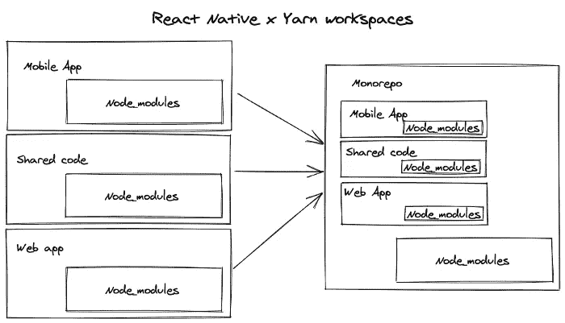

# Monorepos 的利弊，解释说

> 原文：<https://betterprogramming.pub/the-pros-and-cons-monorepos-explained-f86c998392e1>

## 您应该将所有代码保存在一个目录中吗？

图片来自 [Brigad 工程博客](https://engineering.brigad.co/react-native-monorepos-code-sharing-f6c08172b417)。

# 什么是 Monorepo？

顾名思义，Monorepo (mono repository)是一种架构模式，其中单个存储库将包含给定项目的所有代码。

换句话说，一个回购中可以有几个应用。你可以有一个网站代码库，手机 app 代码库等。在一次回购中。或者，您也可以有一个包含复杂应用程序的几个不同模块的单个 repo，其中每个模块都是一个独立的应用程序。

# 单回购与多回购

正如我之前所说，Monorepo 将所有内容保存在一个回购中。另一方面，Multirepo(又名 Polyrepo)每个项目有一个存储库。如果有四个项目，就会有四个存储库。

# 使用 Monorepo 的优势

使用 Monorepo 架构模式有几个优点。让我们来研究一下:

*   **一个事实来源**——我们可以用一个单一的配置来管理所有的项目，而不是让许多存储库拥有自己的配置，这使得管理变得更加容易。
*   **代码重用**——如果有一个公共代码或依赖项必须在不同的项目中使用，我们实际上可以很容易地共享它们。
*   透明性——它让我们可以看到每个项目中使用的代码。我们将能够在一个地方检查所有的代码。
*   **原子变化**——我们可以做一个单独的变化，并在所有的包中反映这些变化，从而使开发更快。

# 使用单一回购的缺点

有优点的时候，也应该有一些缺点。让我们来看看几个缺点:

*   **无法限制访问** —有权访问回购的每个成员都有权查看所有代码。没有办法限制应用程序的某些部分，这与用户无关。
*   **构建时间长**——由于在一个地方有大量代码，与独立构建单独的项目相比，构建时间要长得多。
*   **Git 性能**——由于整个代码都在一个地方，而且由于许多开发人员提交并一起工作于同一个 repo，所以 Git 会跟踪许多提交。由于提交数量巨大，随着历史的深入，Git 的性能会变得很慢。

# 使用单一回购的公司

很多顶级公司都使用单向回购。其中一些包括:

*   谷歌
*   脸谱网
*   微软
*   优步
*   爱彼迎（美国短租平台）
*   推特

# Monorepo 工具

Monorepo 工具提供了多种功能，例如引导和链接本地包，构建代码，验证它们，将它们发布到包注册中心，等等。一些最受欢迎的工具有:

*   Lerna — [Lerna](https://lerna.js.org) 是一个用于管理带有多个包的 JS 项目的工具。它建立在纱线上。
*   **Bazel** — [Bazel](https://bazel.build) 是谷歌打造的 monorepo 构建系统。
*   **Yarn** — Yarn 是一个 JS 依赖管理工具，也支持通过[工作区](https://classic.yarnpkg.com/en/docs/workspaces/)进行 monorepos。
*   **NX** — [NX](https://nx.dev) 是一套用于 monorepos 的可扩展开发工具。
*   **rush js**—[rush js](https://rushjs.io)是另一个应该支持 monorepos 完整生命周期的工具。它是由微软开发的。

# 我应该选择这种方法吗？

Monorepos 只是一个工具，它有自己的优点和缺点。事实上，与 Multirepo 相比，这种方法无疑让开发人员的生活变得更加轻松。然而，它仍然有一些问题，我希望这些问题能在将来得到解决。

我相信我已经解释了一些关于 Monorepo 的内容，现在，您已经很好地理解了它的工作原理。根据我的观点，你是否应该使用它取决于你正在构建的应用程序。如果有许多共同的依赖项，并且您需要共享代码，这将是一个很好的方法。无论如何，我将把这个答案留给你，因为它完全取决于你的应用程序的需求。

我希望这篇文章是有帮助的。感谢阅读！