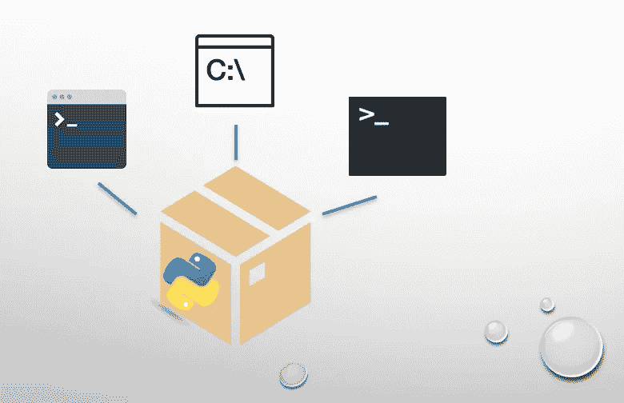

# Python 版—2022 年 6 月

> 原文：<https://betterprogramming.pub/the-python-edition-june-2022-532f5d4493af>

## 我们给开发者的 13 个最喜欢的 Python 故事

嘿大家好，

欢迎来到《咖啡字节》第 34 版，这是一份由 Better Programming 出版的时事通讯。

这一期重点介绍了一些 Python 指南和教程，我们非常喜欢在六月份阅读和发布。从在 Python 中保留状态的不同方法到保护您的 API 以有效地可视化数据——我们有广泛的主题。我们开始吧！

## [重构 PyPDF2 的转换接口](/refactoring-pypdf2s-transformation-interface-34db1c1c2fae)

[Martin Thoma](https://medium.com/u/287aa3cfe747?source=post_page-----532f5d4493af--------------------------------) 强调了对更小的可维护接口的需求，并展示了如何用构建器模式实现来做到这一点。结果呢？他设法将核心对象的公共方法从八个减少到两个。

## [这就是为什么你应该在你的 Python 项目中使用乌龟 ORM](/this-is-why-you-should-use-tortoise-orm-in-your-python-projects-a3897dc5309e)

[Eldad Uzman](https://medium.com/u/27af5b90f53f?source=post_page-----532f5d4493af--------------------------------) 向我们展示了使用名为 tortoise ORM 的先进 Python ORM 包的好处，并提供了用例的实际操作演示。

## [将位置历史地点从 Google Timeline 加载到 Pandas 和 CSV 中](/loading-location-history-places-from-google-timeline-into-pandas-and-csv-c26cb0ac5e89)

想列出你的谷歌时间表数据来进一步分析吗？Maksym Kozlenko 展示了如何做到这一点。

## [如何保护您的微服务](/how-to-protect-your-microservices-8d74045061c1)

[亚历山德罗·曼戈内](https://medium.com/u/b3625c16001b?source=post_page-----532f5d4493af--------------------------------)使用 Django 构建了一个认证微服务，它用一个装饰器来保护它的路由，以验证用户是否被授权与视图交互。

## [将 Python 脚本转换成命令行工具](/build-your-python-script-into-a-command-line-tool-f0817e7cebda)

厌倦了每次都从目录中调用脚本吗？刘正构建了一个方便的实用程序，将脚本打包成内置的命令行工具。

刘图片

## [如何在 Django 中使用 GraphQL】](/graphql-the-future-eb83ec4c7ab5)

[Badji N'Wuitcha](https://medium.com/u/5b8de518fab0?source=post_page-----532f5d4493af--------------------------------) 的探索性指南展示了如何基于 GraphQL 构建一个简单的 Django 应用程序。

## [用 Kepler.gl 实现 Python 地理数据可视化](/geo-data-visualization-with-kepler-gl-fbc15debbca4)

为了在地图上快速可视化数据集， [Ivelina Yordanova](https://medium.com/u/97cfe701f78?source=post_page-----532f5d4493af--------------------------------) 带我们体验了一个利用优步开源库的实际实现。

## [使用 Decorators 为 Python 代码植入 OpenTelemetry Traces](/using-decorators-to-instrument-python-code-with-opentelemetry-traces-d7f1c7d6f632)

Python 装饰者可以通过 [Roni Dover](https://medium.com/u/ed84765d6ac3?source=post_page-----532f5d4493af--------------------------------) 帮助保持 open telemetry tracing instrumentation 干燥

## [Python 中记忆过去(模型状态)的五种方式](https://towardsdatascience.com/five-ways-to-remember-the-past-model-state-in-python-2c8430d29679)

通过一个在虚拟酒店管理客人的用例， [Theophano Mitsa](https://medium.com/u/7709c007f0ca?source=post_page-----532f5d4493af--------------------------------) 探索了用 Python 处理和保留状态的不同方法。

## [用 Python 和 Geopandas 制作出色的地图](/make-awesome-maps-in-python-and-geopandas-c8b3c887b284)

地图是可视化数据的便捷工具。通过他的快速指南， [Nik Piepenbreier](https://medium.com/u/634ffd0ea2aa?source=post_page-----532f5d4493af--------------------------------) 展示了如何使用 Python 中的 GeoPandas 创建漂亮的 choropleth 地图。

## [保护 API 的 Python 最佳实践](/secure-your-python-api-7e52c475665e)

[高](https://medium.com/u/2adc5a07e772?source=post_page-----532f5d4493af--------------------------------)的最新作品指导我们通过策略和 Python 实践来保护您的 API。无疑激起了我的兴趣。

## [如何在 Python 中旋转代理](/how-to-rotate-proxies-in-python-650bcea20db5)

为了避免在抓取网站时被阻止， [Ander Rodriguez](https://medium.com/u/763b931bbd0e?source=post_page-----532f5d4493af--------------------------------) 的指南着重于构建一个定制的代理旋转器 Python 工具。

## [我分叉了“Asyncpg”——它将数据库记录解析到 Numpy 快了 20 倍](/i-forked-asyncpg-and-it-parses-database-records-to-numpy-20x-faster-e71024a84bff)

[Vadim Markovtsev](https://medium.com/u/9114102f2482?source=post_page-----532f5d4493af--------------------------------) 黑掉了`asyncpg`——一个 asyncio PostgreSQL 客户端库——将来自底层 PostgreSQL 协议的`SELECT`ed 记录直接解析到 NumPy 结构化数组，而不物化 Python 对象，避免了大部分开销。

暂时就这样了。直到你下次喝咖啡，

[Anupam](https://anupamchugh.medium.com/) 以及更好的编程团队。