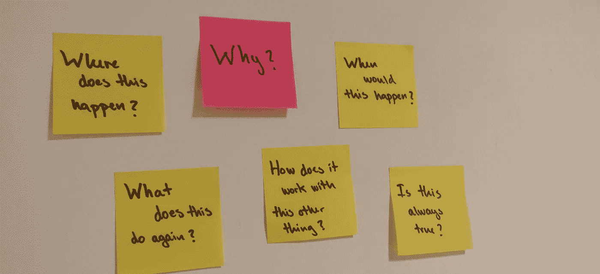

# 软件开发中很少被提及的方面

> 原文：<https://betterprogramming.pub/the-rarely-mentioned-side-of-software-development-52ea5b37e15d>

## 编程是容易的部分

图片来源:我

我最近有一次经历，我花了半天时间实现了某个特性，并改变了代码库中的一堆东西。有一个测试案例让我很纠结，我向我的同事寻求澄清。

这时，我发现大部分逻辑是完全不必要的，因为我根据对特性的理解做出了错误的假设。

*提示悲伤的音乐*。

如果我事先花时间测试我的理解，我就可以节省几个小时的工作时间。

# 这是开发人员走向生产的假设

在 Alberto Brandolini 在 2020 领域驱动的欧洲设计大会上的演讲中，我想起了这件事，他说:

> *“这是开发人员的设想，然后投入生产。”*

这真的打击了我。

作为软件开发人员，我们不仅要知道如何编程，还要有足够的领域知识来编写正确的程序。最终，我们的理解反映在我们编写的代码中。

我将第一个承认，有时，我只阅读了我正在执行的任务的标题，进行了更改，并提出了拉动请求。这对于小特性和 bug 票来说*有时*有效，但是当要实现更大的特性时，这根本不起作用。

如果幸运的话，错误的假设会在拉请求时被发现。如果你运气不好，它会在 QA 阶段被发现，甚至更糟，在申请审核阶段被发现。

现在，这不仅仅是返回并纠正您的假设的问题，而是创建一个新的票证和一个新的拉动请求。浪费每个人的时间，并可能不得不重写整个功能。

这一切都是因为一个基于门票标题的假设和一个月前在改进期间的讨论。

虽然实际上阅读验收标准对避免上述情况有很大帮助，但是产品所有者和涉众也是人。我们都会犯错，或者认为有些事情很明显。验收标准可能不完整。

因此，作为软件开发人员，我们应该记住这一点，无论何时我们冒险进入未知领域，即使感觉不到未知。

# 避免跳过栅栏最低的地方

专注于技术解决方案是非常容易的，因为这是我们作为开发人员所知道和理解的。

建立一个拥有各种功能的微服务架构是很酷的。调用所有微服务来完成任何事情——这并不酷。

因此，即使一个解决方案是一项技术壮举，一件最新最伟大技术的艺术品，它也可能完全达不到目标。

我曾经帮助监督一门 Python 课程的考试。这是第一次数字化考试，申请非常酷。这个应用程序有一个内置的 shell，自动分级，并部署在 Kubernetes 集群中。

太美了。直到 400 名学生不得不立刻登录使用。

三十分钟过去了，所有的学生才登录。答案未保存，会话存在问题。那是一场噩梦。本该节省我们评分时间的系统最终导致评分延迟了数周。

应用程序的复杂性使得它在高负载下完全不可预测，并最终导致它无法满足主要需求—保存考试并对其评分。

提前花时间确保你确实满足了用户的需求，这可能意味着一个成功的应用程序和一个失败的应用程序之间的差别。

# 结论

了解领域听起来像是产品所有者或任何提出需求的人的工作。

但是，你不是代码猴。你不消费需求和返回代码。你有责任确保你写的代码尽可能的正确。

虽然您可能永远没有领域专家的知识水平，但是您可以知道足够多的信息来发现拉请求中的错误假设，或者能够做出可持续的基础设施决策。

所以，当你偶然发现一些对你来说毫无意义的东西时，就和你的领域专家谈谈。问问为什么要达到这样的验收标准。谁知道你会发现什么。

记住，软件开发不仅仅是写代码。

感谢您的阅读！