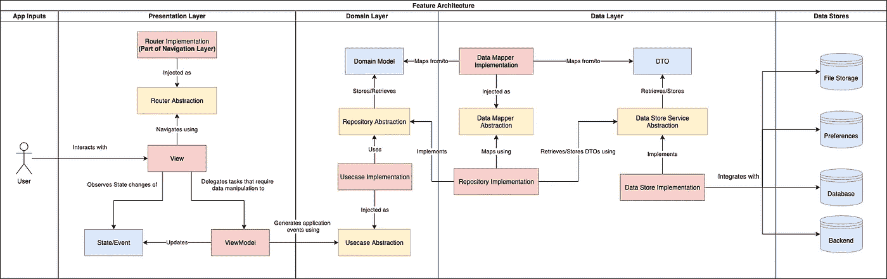
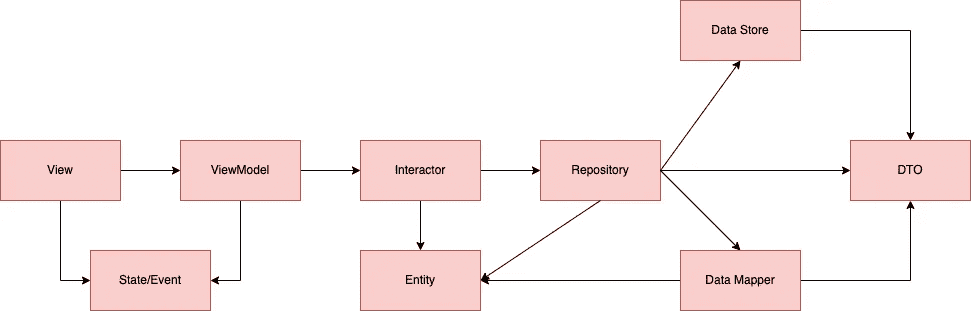
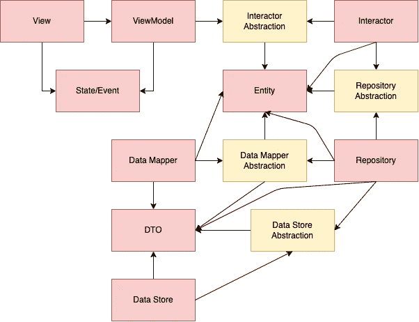

# Android 中“真正”干净的架构:S.O.L.I.D。

> 原文：<https://betterprogramming.pub/the-real-clean-architecture-in-android-part-1-s-o-l-i-d-6a661b103451>

## 如果你认为好的建筑很贵，那就去试试坏的建筑。布莱恩·福特和约瑟夫·约德



干净的架构图

在过去的几年中，干净的架构可能是 Android 社区中最热门的话题，这种趋势似乎不会消失(谢天谢地)。

本系列基于以下书籍和文档:

1.  [罗伯特·c·马丁的干净代码](https://www.amazon.com/Clean-Code-Handbook-Software-Craftsmanship/dp/0132350882/ref=sr_1_1?crid=9GR6QM8XY4T9&keywords=the+clean+code&qid=1657047914&sprefix=the+clean+code%2Caps%2C186&sr=8-1)
2.  [罗伯特·马丁的清洁建筑](https://www.amazon.com/Clean-Architecture-Craftsmans-Software-Structure/dp/0134494164/ref=sr_1_1?keywords=clean+architecture&qid=1657047966&sprefix=clean+ar%2Caps%2C180&sr=8-1)
3.  Martin Fowler 的《企业应用架构模式》
4.  [Eric Evans 的领域驱动设计](https://www.amazon.com/Domain-Driven-Design-Tackling-Complexity-Software/dp/0321125215/ref=sr_1_1?keywords=domain+driven+design&qid=1657048072&sprefix=Domain+dri%2Caps%2C182&sr=8-1)
5.  阿利斯泰尔·考克伯恩的六角形建筑
6.  [杰弗里·巴勒莫的洋葱建筑](https://jeffreypalermo.com/2008/07/the-onion-architecture-part-1/)

所有这些作者都同意大多数事情，但有时他们倾向于采取不同的路线，我也是！
因此，这一系列不会是原始材料的总结，而是基于该领域和我的大多数专家的偏好的一种自以为是的清洁建筑方法。

PS:在这篇文章里，我不会说**你想听到的**而是**你需要听到的。**

# 什么是干净的建筑？

首先，我们假设 CA 不是什么:

1.  要遵循的模板
2.  一个不必要的样板文件会让你慢下来(除非你做错了)
3.  一个新的流行架构，只在 Android 上工作(看看你的 iOS、Web 和后端家伙)

> *那么什么是清洁建筑呢？*

简短的回答是:

> 清洁建筑是 S.O.L.I.D .原则的产物。

*因此，如果你不遵循它们，你就不是在做 CA，你只是在遵循一个永远没有意义的模板。*

我对其他文章的不满是，它们很少提到 S.O.L.I.D 原则，它们只关注关注点分离部分(SRP)，正因为如此，它们给读者留下了比阅读本文之前更多的疑问:*为什么那个用例只有一个方法？为什么我需要那个接口呢？为什么我需要不同的对象和映射器？*

所有这些问题的答案都在 S.O.L.I.D .原则中，所以在第 1 部分中，我将集中讨论这个理论，我将展示每个原则如何塑造干净的架构，然后我将在下面的文章中深入探讨每个组件。

# 神盾局。

你需要意识到的是，神盾局的原则不仅仅是一个神话或者是你需要放在简历上的一个要点。

它们是确定你的代码有多干净的基准。

你不知道你的设计对不对？*检查您的代码是否符合 S.O.L.I.D.* 就像医生会检查您的血液测试一样，如果有问题，您的血液测试会告诉您，这同样适用于 S.O.L.I.D .和您的代码。

现在，仅仅因为一个原则被违反了，并不意味着你会有问题，但是如果你有问题，错误或者效率低，你很可能违反了一个或多个 S.O.L.I.D 原则。

*将 S.O.L.I.D .原则视为可以帮助你远离麻烦的常识性原则，你可能不需要总是使用它们，但是你最好了解它们！*

# 利斯科夫替代原理

> 派生类必须可以替换它们的基类。

继承是你能拥有的最紧密的耦合，*不好的使用它会导致高度耦合和低内聚的代码*。

大多数没有经验的工程师使用继承作为实现可重用性的主要方式，但是这通常使得维护几乎不可能实现(正如你所知道的，重复代码比耦合代码好得多，维护>可重用性)。

因为这在面向对象编程的早期非常普遍，甚至在高级开发人员中也是如此，**LSP 是用来规范继承的主要原则**。

让我们来看看这个过于简单的例子(这不是你将在周围看到的常见的正方形/矩形例子),其中 LSP 被违反了:

在你怀疑之前，不 LSP 没有被违反，因为 Android 开发人员的工资太低(尽管这是一个很好的论据😈).

在这种情况下，开发人员决定让 CTO 成为 Employee 的子类，以重用`getSalary`方法，因此，如果在 CTO 对象上调用`getLineManager`方法，应用程序可能会崩溃。

我确信你们中 99%的人不会犯这个错误，因为你们知道 CTO 是一个*主管*而不是一个*员工*，但是代码库中的关系并不总是清晰的。事实上，我敢打赌，你已经看过很多大型的`BaseActivity`、`BaseFragment`、`BaseViewModel` …类，这是违反 LSP 的另一个明显的例子。

> 所以只要我不破坏 LSP，使用继承是没问题的？

不要使用继承，然后在违反 LSP 时切换到另一种方法， ***你应该改变你的思维方式，默认为 composition*** 。

99%你想用继承做的事情都可以用合成来完成，所以你应该总是 ***偏爱* *合成胜过继承*** 。
如果碰巧不能使用组合，即使有任何 **G.o.F .设计模式的帮助，**那么你可以使用继承(通过确保你遵守 LSP！).

> 使用继承最常见的场景是什么？

在一些情况下，可以使用继承(IS-A relationship)而不是组合(HAS-A relationship)，或者可能不是，但您必须使用它，例如:

1.  当您正在使用的框架需要您使用它时(扩展活动、片段、视图模型…)
2.  做数据建模时(动物->哺乳动物…)

除了模型和框架，*通常是*，架构组件不应该依赖于继承，因此任何依赖于继承的架构都不是好的和干净的。

## 测试

测试继承总是痛苦的，比测试合成需要更多的努力。

当实现一个新的子类时，你不仅要测试新添加的公共方法和你从父类中覆盖的方法，而且你还要测试父类中你没有覆盖的所有其他方法！

毕竟，你不希望父类的改变破坏你的子类行为，不是吗？

测试作文反而是小菜一碟，因为你的测试不会关心合作者是如何工作的，他们只会关心你的合作者的合同，如果需要的话，它很容易被嘲笑/破坏/伪造。

*参考文献:* ********洁净架构，第九章*(**LSP**) ***[*LSP*](https://www.youtube.com/watch?v=-Z-17h3jG0A&ab_channel=TuringAwardeeClips)由来

# **单一责任原则**

> 一个类应该做一件事，而且只能做一件事。

嗯……你的意思是*“一个* ***函数*** *应该做一件，而且只能做一件事？”。* **错误原理**，再试一次。

> 一个类应该有且只有一个改变的理由。

更好，但也许可以换一种方式来解释什么是*“改变的理由”*…

> *一个类应该只对一个参与者(用户组或利益相关者)负责。*

现在我们正在谈话！
我使用术语*“类”*是因为我们在 Java-Kotlin 领域工作，更通用的描述是“*模块(不是 Java 模块)或包含一组内聚的函数和数据结构的源文件*”。

“内聚”是 SRP 中的关键词:类的方法必须是内聚的，如果不是，你应该把那些方法移到另一个类中。

演员是谁？实际上有很多，因此会有很多类。*【登录】**【购买】*最有可能引起不同参与者的兴趣，例如*入职团队*和*销售团队*。所以把他们放在同一个班级就是违规了。

最重要的是，*“登录”*特性不仅会引起 PO 的兴趣，还会引起定义如何执行用户交互的 UI/UX 设计者以及为您提供 REST API 的 BE 团队(以及其他可能涉及的参与者)的兴趣。

这些参与者，即使都参与到同一个特性中，也会希望尽可能地相互独立，不希望受到其他参与者的影响(UI 更改不应该破坏你的 API 代码，API 更改不应该破坏你的 UI 代码，UI 更改和 API 更改都不应该破坏你的业务逻辑代码)。

> 康威定律:软件系统的最佳结构受到使用它的组织的社会结构的严重影响，因此每个软件模块都有一个，而且只有一个，改变的理由。

这就带来了纵横切片的概念:**特性**(登录、搜索、购买…)****层**(表示层、域、数据…..).**

***每个跨职能团队的功能集。*
*一层为跨职能团队的每个演员。***

**我将在接下来的文章中详细阐述垂直和水平切片。**

## **从 SRP 到 CCP**

**在**组件级，****SRP**成为**通用关闭原则(CCP)** ，其表述如下:**

> ***将那些因相同原因在相同时间改变的类聚集成组件。***
> 
> ***将那些在不同时间因不同原因而改变的类分成不同的组件*。**

****CCP** 是拥有坚如磐石的**模块化**要遵循的最重要的原则之一(另一个主题我将在下面的文章中涉及)。**

**通过仅应用 SRP，系统的架构看起来是这样的:**

****

**战略成果计划的成果**

**同样，我将在下面的文章中解释每个组件。**

***参考文献:* ********清洁架构，第七章(****SRP****)* ********清洁架构，第十三章(****【CCP****)
*企业应用架构模式，第一章***

# **从属倒置原则**

> **最灵活的系统是那些源代码依赖仅指抽象而非具体化的系统。**

**这是最容易遵循的原则，但却是被开发人员粗暴违反的原则。**

**不知何故，开发者认为你应该有一个接口*“只有在多重实现的情况下”*。
**这再错不过了。****

**任何名副其实的现代软件架构(六角形、洋葱形、干净)都严重依赖于 DIP。我们不希望我们的高级业务规则依赖于低级细节。我们希望将高层次的抽象与低层次的细节隔离开来。**

**许多开发人员很难理解隔离的问题，因为他们不知道编译器是如何工作的，不知道可传递的依赖关系，也不知道他们从错误的类开始编写代码(下一篇文章将详细介绍)。**

**让我们以上一章(SRP)的图表为例，其中所有的箭头都指向同一个方向:**

```
View -> ViewModel -> Interactor -> Repository -> Data Store...
```

**类`ViewModel`将有一个对`Interactor`的导入。
类`Interactor`将有一个`Repository`的导入。诸如此类。**

**很多开发者不知道的是，`ViewModel`还导入了`Repository`和`DataStore`*。
对`Data Store`的任何改变都将触发`Repository`的重新编译，这将导致`Interactor`和`ViewModel`的重新编译，以此类推..直到**控制流的第一级**。***

***一个好的架构应该隔离变化，而不是将它们传播到每一个地方。***

***最重要的是，箭头的方向不仅决定了编译，还决定了开发人员将要编写的第一个类，在这种情况下是`Data Source`，我们将在下一篇文章中看到，这是开始实现的错误类。***

***如果我们将倾角原理应用于上一章的图表，它看起来会是这样的:***

******

***SRP + DIP 的结果***

## ***测试***

******可测性*** 也深受这个原理的影响。一旦你有了一个接口，创建一个测试替身就成了一项主流工作。***

> ***但是我用的是 Mockito，测试用的不需要接口…***

***是的，我知道，你仍然可以通过使用一个使用*反射*的模仿框架来“模仿”合作者的行为。但是我也知道嘲弄框架会使测试变慢。事实上，在我的机器上，每次我运行一个测试类，Mockito 都会额外增加 5-10 秒的执行时间，这对于 TDDer 来说意味着每个 TDD 周期要额外等待 5-10 秒(这仍然比完全不进行 TDD 要快)。***

****PS:当您在您的 CI 上运行测试时，额外的 5-10 秒成为一个小问题，因为这是 Mockito 为每个模块启动所花费的时间(* [*如果您认为通过切换框架可以解决问题，mock*](https://github.com/mockk/mockk/issues/13)*也会发生同样的事情)。****

***创建您自己的测试替身而不是使用嘲讽框架的最后一个优点是，您永远不必引用合作者的方法。***

***例如，当使用 Mockito 进行嘲讽时，您会这样做:***

```
*@Test
fun test1() {
    whenever(collaborator.method()).thenReturn(...)
    //...
}@Test
fun test2() {
    whenever(collaborator.method()).thenReturn(...)
    //...
}@Test
fun test3() {
    whenever(collaborator.method()).thenReturn(...)
    //...
}//... you got the point*
```

***而当您创建自己的测试替身时:***

```
*class CollaboratorTestDouble: Collaborator {
    fun mockMethod(...) { ... } override fun method() {
        // stub, mock, spy...
    }
}*
```

***您的测试将不再引用`method`:***

```
*@Test
fun test1() {
    collaborator.mockMethod(...)
    //...
}@Test
fun test2() {
    collaborator.mockMethod(...)
    //...
}@Test
fun test3() {
    collaborator.mockMethod(...)
    //...
}//...* 
```

***并且，通过不引用合作者的方法，您的测试可以更好地避免方法签名的改变，从而减少需要更新的代码和需要评审的代码。测试看起来也更具可读性。***

***有时你甚至不需要创建一个测试替身，因为你可以**使用一个真实的实现。** 当这样的实现**需要最少的设置**(它没有合作者)并且它是在当前被测试的类之前创建的时候，这通常是更可取的。***

***其他时候，模拟根本就不能很好地工作。
想想`SharedPreferences.Editor`接口，每个方法都返回对象实例，直到`apply`或`commit`被调用，事务才被执行。
这里的许多人放弃了嘲笑，只是将测试转移到`androidTest`文件夹，这样他们就可以使用真正的首选项，但在我看来这是一个彻底的失败。
最快最干净的解决方案是创建一个**假的**，如下所示:***

***对于使用内存中实现的 SharedPreferences 为 Fake***

***这个伪代码使用 SharedPreferences 接口的内存实现。
通过在你的测试类中使用它，不需要任何设置，你只需要做
`fakePreferences.putString("key", "value").apply()`
就可以预先设置你的偏好，就像你在`androidTest`中使用真正的 SharedPreferences 一样，不同的是，使用这种方法，你的测试将在 **JVM** 上运行，并且会快得多(显然比使用 mocks 更快)。***

## ***有趣的故事***

***几年前，Mockito 不支持 final 类，当开发人员将他们的代码库从 Java 迁移到 Kotlin(默认情况下类是 final)时，他们的测试会失败。***

***这是他们糟糕的架构的明显标志，在这一点上，只有干净的解决方案(添加抽象)和肮脏的解决方案(使类开放)。***

***你认为大多数开发人员采用了哪种解决方案？😈***

***这么说吧，我知道有很多公司在 Mockito 发布了他们的`mock-maker-inline`解决方案后，做了一次大规模的重构公关，在所有地方都删除了`open`关键词(这仍然不适用于`spy`，也不能用于`androidTest` btw)。***

****参考文献:* ********洁净建筑，第十一章* ( **倾角** ) *** [*六角形建筑*](https://alistair.cockburn.us/hexagonal-architecture/) ***[*洋葱式建筑，第一部*](https://jeffreypalermo.com/2008/07/the-onion-architecture-part-1/) ***[*马丁·福勒，莫克*](https://martinfowler.com/articles/mocksArentStubs.html)***

# ***界面分离原理***

> ***保持小界面，这样用户就不会依赖他们不需要的东西。***

***这主要是针对我们静态类型语言用户的，事实上，在动态类型语言中，开发人员甚至可以只使用 **S.O.L.D.** 而不是 **S.O.L.I.D.** (在动态类型语言中遵守 ISP 仍然有好处，但我不会涉及它们，因为 Android 是基于 Java/Kotlin 的)。***

***ISP 可以被视为 DIP 的延伸，因为如果你根本没有接口，就不可能有小接口😉。***

***使用 DIP 的目的是保护你的代码不受控制流和传递依赖的影响，而使用 ISP *我们确保我们的合作者不仅是接口(或任何其他类型的抽象),而且它们也很小，所以我们不依赖于我们不使用的东西，当改变时，会导致额外的重新编译*。***

***让我们来看看这个例子:***

```
*interface UserService {
    fun login(...)
    fun logout(...)
    fun createAccount(...)
    //...
}class LoginViewModel(
    private val userService: UserService
): ViewModel() {
    fun doSomething() {
        //...
        userService.login(...)
        //...
    }
}*
```

***`LoginViewModel`只使用了`UserService`的一种方法，然而它依赖于所有的方法+它们需要的所有对象参数。
这意味着`logout`中的变化将会重新编译`LoginViewModel`。
此外，向`UserService`添加/移除方法将导致重新编译。***

***这个怎么解决？很简单，你可以创建更多更小的接口，而不是一个大的接口:***

```
*interface LoginInteractor {
    fun execute(...)
}
interface LogoutInteractor {
    fun execute()
}
interface CreateAccountInteractor {
    fun execute()
}
//...*
```

## ***ISP 和 SRP***

***如果还不清楚的话，神盾局的原则并不是相互独立的，所以遵循一个原则，你很可能也会遵循其他一些原则，而违反一个原则，你很可能也会违反其他一些原则(这就是为什么大多数开发人员会违反大多数原则)。***

***类可以实现接口，所以如果接口很小，那么类很可能遵循 SRP。***

****说到底，你觉得哪个职业更容易打破 SRP？
单一方法的类还是 100 个方法的类？****

***有时候，你需要小的接口，但是稍微大一点的类。接口最好是小的，因为它们是为使用它们的类而优化的。
类应该负责一件事，这通常会使它们变得更小，但是正如 SRP 所说，你不应该将一项职责分成多个类，因为你应该将内聚方法聚集在一个类中。***

***这种情况下该怎么办？
简单，*你让你的类实现多个接口*！***

## ***从 ISP 到 CRP***

***在**组件级，****ISP**变成了**通用重用原则(CRP)** ，可以用以下方式表述:***

> ***不要强迫一个组件的用户依赖他们不需要的东西。***

***这是模块化的另一个重要原则。
*一起重用的类应该是同一个组件的一部分。* 像 CCP 一样，它告诉我们如何对类进行分组，但也告诉我们哪些类不能放在同一个组件下。***

***就像一个类在一个未使用的合作者的方法改变时重新编译一样，一个*组件*在一个*导入组件*的未使用的类改变时重新编译。***

## ***测试***

***当创建一个 test double 时，必须处理大的接口是很烦人的，因为你必须 stub/mock 接口的所有方法。***

***为了避免这个问题，你可以**使用嘲讽框架**或者**坚持 ISP。*****

***就我个人而言，我并不反对嘲讽框架，我实际上在我所有的项目中都使用了它们，但我不喜欢的是，通过使用它们，开发人员可能会违反 1 条或更多的原则:***

*   ***因为您可以模仿类，所以您可能会试图避免接口(DIP💔)***
*   ***因为您不必模仿所有的方法，所以您可能想保留大的接口/类(SRP 和 ISP💔)***

***遵循 S.O.L.I.D .原则使测试更容易，并且*消除了使用模仿框架的需要。* 不知何故，Android 开发人员认为，如果他们不使用嘲讽框架，就无法测试他们的代码，不像 iOS 开发人员倾向于尽可能保持香草(古典主义者)风格。
*这是因为 Java/Kotlin 库开发人员在过去的几年里做了非常好的营销* ***并不是因为单元测试天生就带着嘲讽的心态*** 。***

***我的观点是，在模仿框架和测试替身之间做出选择取决于你的团队的偏好(*如果这是你的团队编写测试的唯一方式，那么它就是正确的方式*)但是**不管你使用什么样的模仿策略，你的代码都应该是可测试的！*****

***参考资料:
*清洁架构，第 10 章( **ISP** )
*清洁架构，第 13 章( **CRP** )***

# ***开闭原理***

> ***软件工件应该对扩展开放，但对修改关闭。***

***软件架构的最终目标是添加新的特性，而不必重写或重新编译任何现有的代码。这是因为每次你修改现有的代码时，你都可能引入回归错误并破坏先前构建的功能，更不用说合并冲突和非常大的拉请求了！***

***OCP 是最不独立的神盾局原则，也是你最应该监控的原则，事实上，违反任何其他原则都很可能违反 OCP 原则:***

1.  *****当 LSP 被违反**时，继承被错误地使用，为了不破坏其他子类，添加子类可能需要对父类进行**修改。*****
2.  *****当 SRP 被违反**时，因此一个类属于不止一个 actor，无论何时 actor 需要新的集成，那么新的集成将**修改现有的方法**，这也将影响其他 actor。***
3.  *****当 DIP 被违反**，时，具体的类依赖于具体的类(也创建了可传递的依赖关系)，在某处添加一个新方法将需要对所有的类进行**重新编译**直到流程开始(是的，如果您想知道，重新编译也算作修改)。***
4.  *****当 ISP 被违反**时，合作者的抽象拥有比所需更多的方法，向合作者添加新方法将**重新编译**不使用该方法的类。***

> ***那么，如果我遵循其他 4 个原则，我能免费得到这个吗？***

***不，很不幸。***

***在不违反其他原则的情况下，还有其他方法可以打破 OCP，但幸运的是，检测这些额外的场景非常容易。***

## ***标志参数又名“魔法布尔”***

***有多少次你想过*“我就在这里加一个布尔，如果真我做 A，如果假我做 B”？****

***这是对现有代码的修改，通过添加一个布尔值来支持 B 的集成。***

***添加一个新函数，而不是添加一个布尔值和修改一个现有的函数。***

***例如，代替:***

```
*fun pay(isDebitCard: Boolean) { ... }*
```

***做:***

```
*fun payWithDebitCard() { ... }fun payWithCreditCard() { ... }*
```

## ***枚举***

***它们存在相同的标志参数问题，但破坏现有特性的可能性更高，因为您可以有很多值，不像布尔型最多有 2 个值(除非您传递多个布尔型😈).***

***所以再一次，不是:***

```
*enum class PaymentType {
    DEBIT_CARD, CREDIT_CARD, BANK_TRANSFER, GOOGLE_PAY
}fun pay(paymentType: PaymentType)*
```

***做:***

```
*fun payWithDebitCard() { ... }fun payWithCreditCard() { ... }fun payWithBankTransfer() { ... }fun payWithGooglePay() { ... }*
```

***通过这种方式添加支付方法不会破坏以前实现的支付方法，也不需要重新编译所有导入枚举的类。***

> ***这是否意味着我不能使用标志和枚举？***

***不使用标志和枚举编写软件几乎是不可能的，因此，显然，不是所有的类和函数都严格遵守 OCP。重要的是，当你必须使用标志参数或枚举时，你的函数只做那条`if/else`或`when`语句，不做任何其他事情。***

***参考资料:
*干净的架构，第 8 章
*干净的代码，第 3 章***

# ***摘要***

***我们可以用以下方式总结这些原则:***

1.  ***SRP:类应该属于一个参与者***
2.  ***OCP:新的集成不应该触及现有的代码***
3.  ***LSP:正确使用继承，支持合成***
4.  ***ISP:抽象应该尽可能的小***
5.  ***DIP:合作者应该是抽象的***

# ***最后的笔记***

***我知道 S.O.L.I.D .原则不是最有趣的话题，这篇文章很长，但是希望现在你对干净建筑背后的理论有了更好的理解。***

***如果您仍然难以理解它们，不要担心，我们将在下一篇文章中看到它们在实践中是如何工作的。***