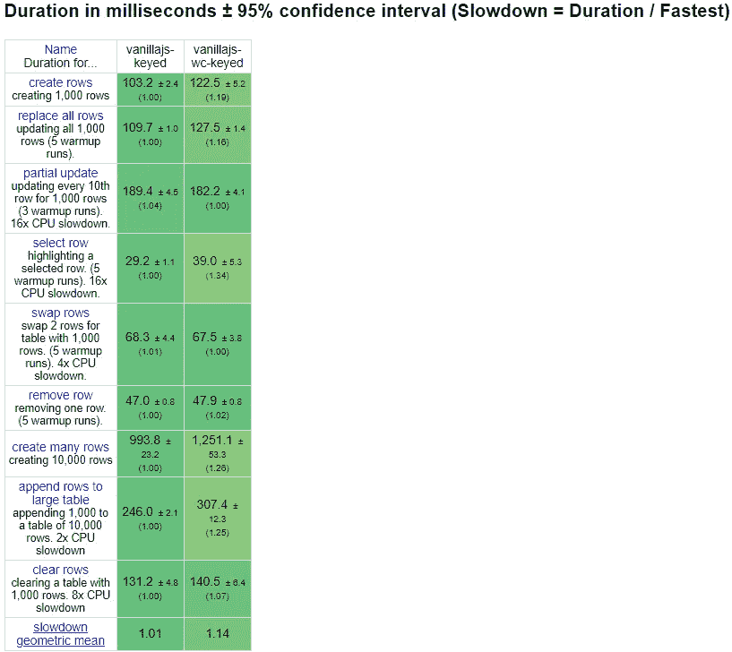
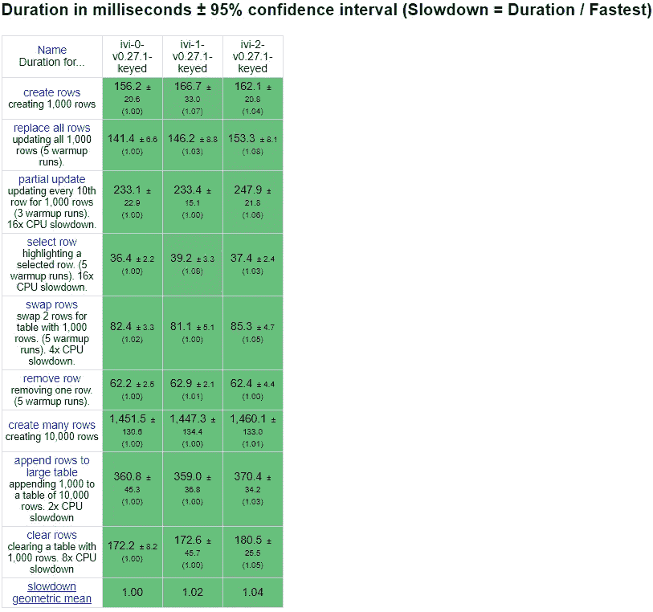
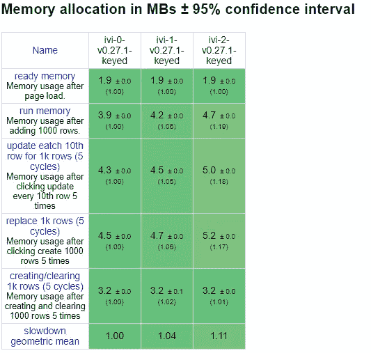
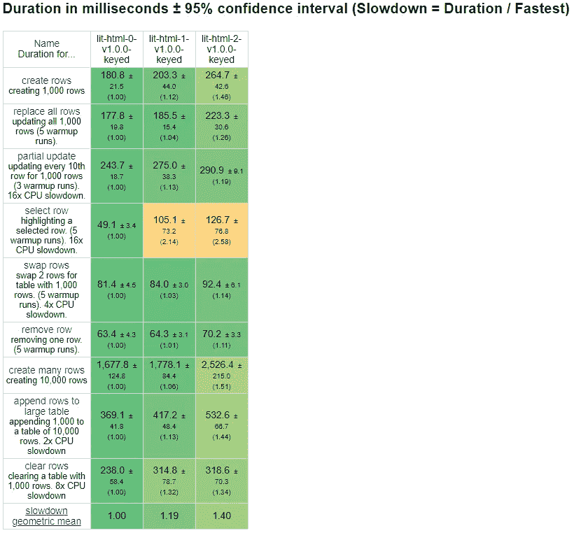
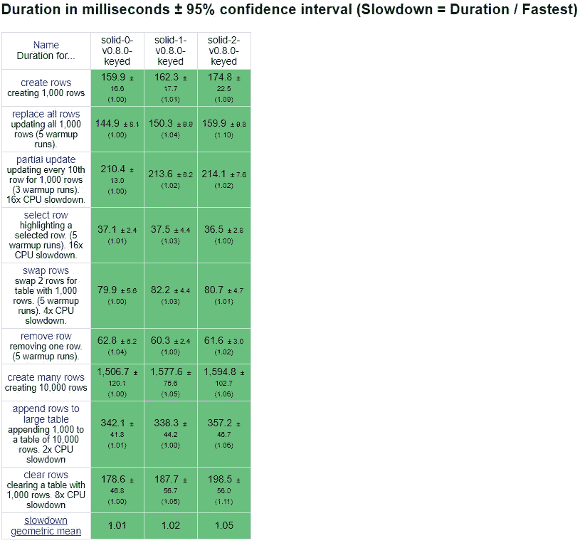
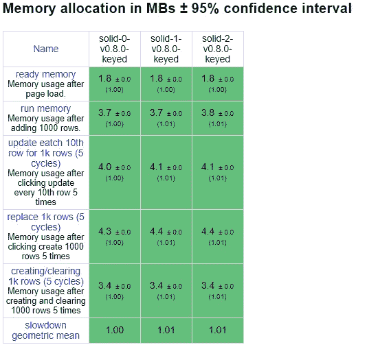
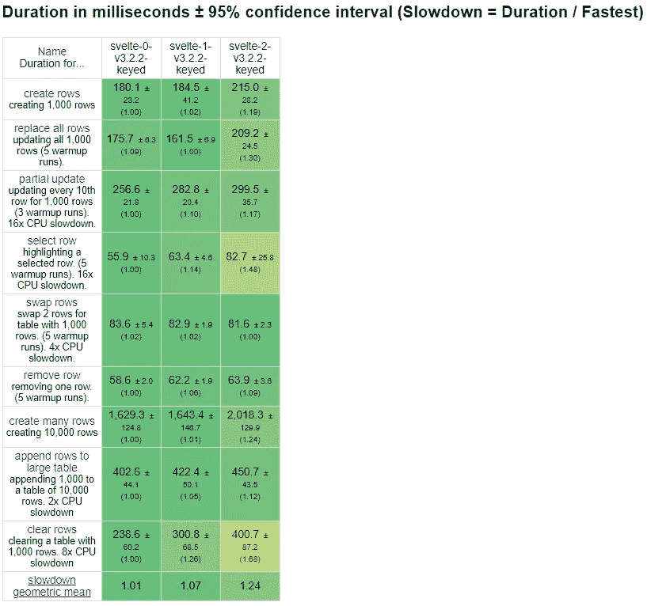
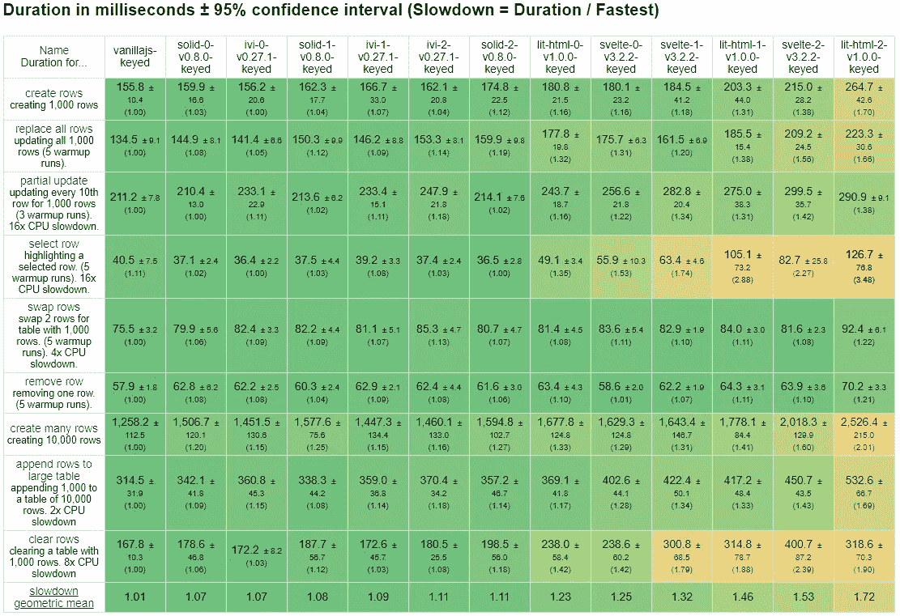
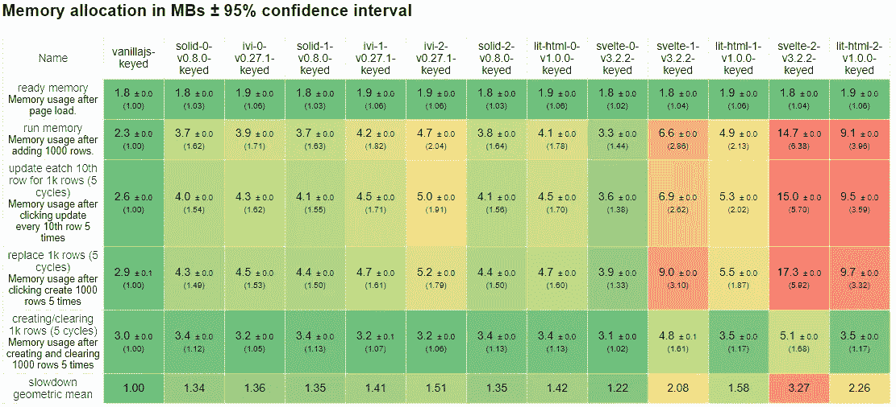

# UI 组件的真实成本

> 原文：<https://betterprogramming.pub/the-real-cost-of-ui-components-6d2da4aba205>

## 现代 UI 框架中普及的组件模型是纯开销吗？

瑞安·卡尼亚托的《蚱蜢》

零部件无处不在。他们怎么可能不是呢？持续构建任何大型系统的关键在于将它分解成更小的部分。它们降低了风险和工作量，同时通过提取不必要的细节简化了“大画面”。从建筑到工程，组件是一切事物的基础部分。他们哪儿也不去。

不，我们今天说的是 React 普及的组件 UI 模型。这绝不是由 React 引起的，但它预示了我们当前的组件 UI 时代。在这个信封下，大部分前端库和技术都是拉过来的。甚至像 Web 组件这种只是简单的 DOM 原语的东西，也有人游说对它们的特性进行标准化，以从本质上使它们对等。无论在前端生态系统的哪个位置，您都会发现组件。

所以我想知道的是，它们能扩展吗？我们是否在没有检查结果的情况下，就接受了当前的模型进入我们的项目和头脑？可能最重要的是，所有组件都是平等的吗？

# Web 组件

对我来说，这个问题始于 Web 组件。这些应该是任何图书馆都可以使用的通用容器。它们是 DOM 规范的一部分，有可能成为您最不需要的组件。就我个人而言，它们是我开始尝试构建 UI 库的地方，也是我的退路。

幸运的是，通过导航到 [JS 框架基准](https://github.com/krausest/js-framework-benchmark)，您可以看到一个相当不错的比较。在这里，您可以将每行使用一个 Web 组件的普通 JS(无库)实现与不使用 Web 组件的实现进行比较。

JS 框架基准

正如所料，当执行大型多行操作时，Web 组件会变慢。总的来说，当你考虑到流行的库在 1.80 的范围内时，它们并没有慢很多。普通 JS 是我们潜力的上限，任何使用 Web 组件的库都会受到冲击。

# 设置

单单这些结果并不那么有趣。根据 ivi 的作者 Boris Kaul 使用 [JS 框架基准](https://github.com/krausest/js-framework-benchmark)进行的实验[，我将采用每个库的三个不同版本(级别)来查看每个解决方案如何随着更多组件的添加而扩展。每一种都代表了处理组件的不同方法。这个场景仍然有点做作，但我喜欢下面描述的方法，因为它不只是在屏幕上放 10k 个组件。它们是部分嵌套的传递道具，更好地体现了通信的成本。](https://medium.com/u/5e15f2bfd273?source=post_page-----6d2da4aba205--------------------------------)

## 这些场景

*   **0 级:**无额外组件。这通常是提交给基准的官方实现。
*   **第 1 级:**每行和每个按钮都有一个组件。
*   **Level 2** :每行进一步细分为四个表格列中每一列的单元格组件。

## 竞争者

1.  [**IVI**](https://github.com/localvoid/ivi)**:**身边最快的虚拟 DOM 库。它支持有状态和无状态组件。*来源*[*0*](https://github.com/ryansolid/js-framework-benchmark/blob/components/frameworks/keyed/ivi-0/src/main.js)*[*1*](https://github.com/ryansolid/js-framework-benchmark/blob/components/frameworks/keyed/ivi-1/src/main.js)*[*2*](https://github.com/ryansolid/js-framework-benchmark/blob/components/frameworks/keyed/ivi-2/src/main.js)*****
2.  ***[**lit-html**](https://github.com/Polymer/lit-html)**:**Google 支持的标记模板渲染库。虽然这个库本身没有组件，但是将模板划分成多个模板可能会有开销。*来源* [*0*](https://github.com/ryansolid/js-framework-benchmark/blob/components/frameworks/keyed/lit-html-0/src/index.js) *，* [*1*](https://github.com/ryansolid/js-framework-benchmark/blob/components/frameworks/keyed/lit-html-1/src/index.js) *，*[*2*](https://github.com/ryansolid/js-framework-benchmark/blob/components/frameworks/keyed/lit-html-2/src/index.js)*】****
3.  **[**固**](https://github.com/ryansolid/solid) :最快细粒度反应库。它的组件只不过是工厂功能。看看它们有多贵会很有趣。*来源* [*0*](https://github.com/ryansolid/js-framework-benchmark/blob/components/frameworks/keyed/solid-0/src/main.jsx) *，* [*1*](https://github.com/ryansolid/js-framework-benchmark/blob/components/frameworks/keyed/solid-1/src/main.jsx) *，*[*2*](https://github.com/ryansolid/js-framework-benchmark/blob/components/frameworks/keyed/solid-2/src/main.jsx)**
4.  ***[**苗条的**](https://github.com/sveltejs/svelte) **:** 巧妙利用其编译器生成最小束。它有自己的组件系统以及编译成 web 组件的能力。*来源* [*0*](https://github.com/ryansolid/js-framework-benchmark/tree/components/frameworks/keyed/svelte-0/src) *，* [*1*](https://github.com/ryansolid/js-framework-benchmark/tree/components/frameworks/keyed/svelte-1/src) *，*[*2*](https://github.com/ryansolid/js-framework-benchmark/tree/components/frameworks/keyed/svelte-2/src)*】****

**如果你不在乎比较，在文章的最后可以找到完整的结果。**

****注:ivi 的实现被修改为尽可能接近 Solid 的实现，以减少可能的差异。这意味着代码比典型的要混乱一些，但是它也和你将要看到的虚拟 DOM 库一样快。***

# **标杆管理**

## **重要值指数**

****

**ivi 是这次比较中唯一的虚拟 DOM 库，而且速度很快。与其他不同，ivi 在其 0 级实施中包含组件。这是因为虚拟 DOM 库使用组件进行变更管理。这意味着最佳实现将包含组件。这也意味着无论有多少组件，ivi 都可以很好地扩展。只有迁移到每列组件时，性能才会显著下降。尽管如此，这种差距还是令人印象深刻。**

****

**记忆也是如此。直到第二级，内存使用才变得更加显著。我们将很难找到另一个组件扩展得如此之好的库。**

## **lit-html**

****

**这种性能无法很好地扩展。我有点惊讶，因为 lit-html 没有任何组件。诚然,“选择行”上的差异是有问题的。我本想得到更一致的结果，但在无数次重新运行后，lit-html 总是在某些运行中出现峰值。可能是运行基准测试的计算机(移动 Core i5)的限制，但是对所有库都有相同的约束。尽管如此，当您添加组件时，性能差异是显著的。“创建多行”和“追加行”直线下降，就像“部分更新”一样。或许记忆会给出更多线索。**

****

**是的。这意义重大。第二级使用的内存是初始实现的两倍多。我不确定在 lit-html 中拆分多个模板会怎么样，但当我们在 1000 行中每行制作 5 个组件时，它肯定会增加。**

## **固体**

****

**组件绝对是 Solid 的补充。人们总是认为它将与 Web 组件一起使用。然而，最后两个版本对 Solid 的组件进行了重大更新，使它们与其他流行库的特性保持一致。固体在这里做得令人钦佩；没有 ivi 平，但是还过得去。这里似乎只有大型数据创建会受到影响，大多数小的更改不会受到影响。这是因为固体的反应系统独立于部件。稍后会详细介绍。**

****

**当我第一次看到这些结果时，我不得不仔细看了看。额外的组件几乎不会影响 Solid 的内存消耗。七分还是 5000，基本都一样。**

## **苗条的**

****

**苗条的标签在包的中间。它不像 ivi 或 Solid 那样平坦，但它的比例相当可观。“选择行”仍然是一个相当大的下降。出于某种原因,“替换行”倾向于第一级。这不是一种异常现象。对于该基准测试，将行分割成单独的组件始终具有更好的性能。我的猜测是由于其反应系统的本质是基于组件的，分离组件意味着只切换一行减少了工作量。“清除行”是性能下降最明显的地方。内存可能是一个问题，让我们检查一下。**

****

**没错。说到记忆，Svelte 的成分很重。它从这些测试中占用空间最小的库变成了最大的库。这绝对是未来值得关注的事情。**

# **反光**

**所以，组件不一定是免费的。它们并不总是只是扩展。虚拟 DOM 库，同样引入了组件模型，看起来确实很好地处理了它们。在使用组件扩展性能方面，Ivi 是赢家。另一方面，lit-html 和 Svelte 等真正的 DOM 库似乎不能很好地处理这种情况。Solid 也是一个非虚拟的 DOM 库，但似乎能更好地处理这种情况。让我们看一下这个。**

**虚拟 DOM 库将所有东西都呈现为虚拟节点，所以无状态组件不重也就不足为奇了。差不多就是这样。事实上，组件是防止虚拟 DOM 库中不必要的更新的手段。您实际上需要以某种方式设置组件，以充分利用您的代码。你总是可以选择制造更多的组件，而且它们相当便宜，但是如果你想要高性能的代码，你需要有一定的组件边界。**

**作为预编译的反应库，Solid 和 Svelte 在这里没有什么不同。关键的区别是 Svelte(和 Vue)仍然把它们的反应系统输入到一个组件系统中。虽然 Svelte 生成的代码仍然将创建和更新分开，但它自上而下地运行变更进程，因此组件越多，传播变更的工作就越多。它的所有优化都是本地化的。相反，Solid 的组件是短暂的，它们一运行就消失了。这仍然有一些开销，但这就是为什么内存在很大程度上不受影响。控制变更传播的是反应性上下文。这更复杂，需要更多的代码，但它很大程度上不受模块化决策的影响。**

**Lit-html，我真的不确定该考虑什么。它没有真正的组件，但是每个模板都被转换成静态和动态部分的仔细分离。我不清楚这里的开销是多少，可能我做错了什么，但这可能是将来要注意的事情。**

# **组件的未来**

**《苗条》的作者 Rich Harris 声称“框架不是用来组织你的代码的，而是用来组织你的思维的”。我对组件有这种感觉。总会有边界和模块需要打包，以保持代码的封装性和可重用性。这些界限总是要付出代价的，所以我认为我们最好是针对这些界限进行优化，而不是引入我们自己的界限。**

**组件可伸缩的库之间的一个共同点是它们并不重。它们要么不是特殊的，要么是一次性的。对于需要额外开销来优化更新性能的库(大多数非虚拟 DOM 库都是这样)，我们需要做得更好，不要给自己带来不必要的成本。**

**所以我要在这里为非虚拟 DOM 人群做一个大胆的声明。我认为组件应该像框架一样消失。如果新世界是编译器，我们可以做得更好。我们可以沿着 bundle chunk 行优化，而不是 es 模块。如果组件被丢弃，想想在正确的场景中通过内联它们我们可以减少多少开销。如果组件不像虚拟 DOM 库那样是改变的必要机制，那么怎样才能阻止上面的二级实现被编译成零级的对等物呢？**

**作为 Web 组件的支持者，这是一个具有挑战性的声明。我确信 Web 组件的性能将会继续提高，它们之所以吸引人，是因为它们为我们提供了一个通用的接口。有点像前端的微服务。但我想知道它们是否能超越出口格式。专用库总是有优势的，没有理由无目的地承担那些开销。**

**如果你已经坚持到了最后，我希望你和我一样觉得这次探索发人深省。或者至少下一次你不会在不看它如何扩展的情况下就这么快地判断一个库的性能。**

** [## localvoid/ivi

### fire:用于构建 web 用户界面的 Javascript (TypeScript)库

github.com](https://github.com/localvoid/ivi)  [## 聚合物/lit-html

### 一个高效的、富于表现力的、可扩展的 HTML 模板库。-聚合物/lit-html

github.com](https://github.com/Polymer/lit-html)  [## 瑞安固体/固体

### 一个用于构建用户界面的声明式、高效且灵活的 JavaScript 库。-瑞安固体/固体

github.com](https://github.com/ryansolid/solid)  [## 苗条/苗条

### 控制论增强的网络应用。在 GitHub 上创建一个帐户，为 sveltejs/svelte 开发做贡献。

github.com](https://github.com/sveltejs/svelte) **