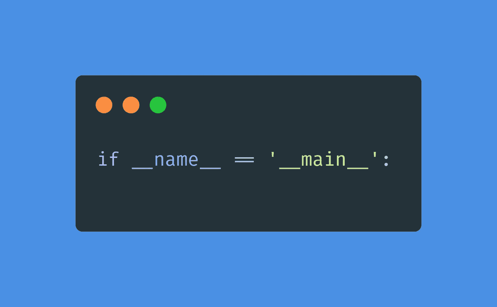
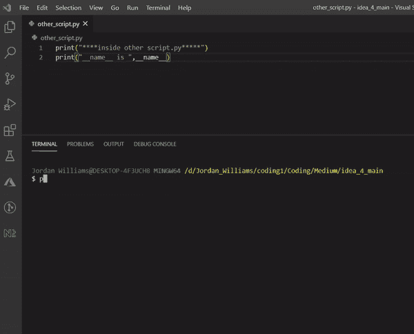
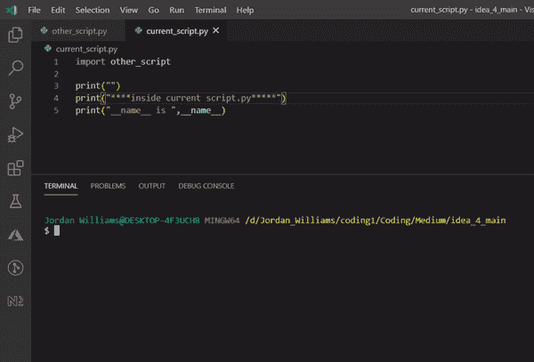

# Python 中 if __name__ == '__main__ '背后的原因

> 原文：<https://betterprogramming.pub/the-reason-behind-if-name-main-in-python-e633634f0dd0>

## 为什么有必要？



作者照片由[碳](https://carbon.now.sh/)生成

你可能以前见过这个:这个语法经常被忽略，因为它似乎不会妨碍代码的执行。这可能看起来没有必要，但只有在处理单个 Python 文件时才是这样。

# 让我们开始吧！

让我们从从左到右解构这个陈述开始。我们已经知道什么是 if 语句了；然而，陈述中最重要的部分是被比较的两个事物。

先说`__name__`。这是用来表示当前正在运行的文件的名称，但是有一个技巧。当前正在运行的文件将始终具有值`__main__`。

起初这听起来令人困惑，但让我们澄清一下。

让我们创建两个 Python 文件:

*   `current_script.py`
*   `other_script.py`

请确保这些文件在同一目录/文件夹中。

在`other_script.py` 文件中，我们将添加一个双打印的语句，如下所示。

```
print("****inside other script.py*****")print("__name__ is ",__name__)
```

运行这个`other_script.py` 文件。

**注意:**我将在终端中使用 Python 运行这个文件，如下图所示。还要注意，我是在 Windows 操作系统上工作的。

```
python other_script.py
```



输出:

```
****inside other script.py*****
__name__ is  __main__
```

现在你意识到这正如我之前所说的。正在执行的文件将始终具有值`__main__`。这代表了我们应用程序的入口点。

在 Python 和几乎所有编程语言中，我们可以将其他文件导入到我们的应用程序中。我们现在进入`current_script.py` 并输入以下代码:

```
import other_scriptprint("")print("****inside current script.py*****")print("__name__ is ",__name__)
```

上面的代码导入了`other_script.py` ，顶部是`import`语句，后面是`print(“****inside current script.py*****”)`来验证我们在`current_script.py`文件中。

请注意，因为我们在文件顶部导入了`other_script`，这意味着`other_script.py`的全部内容将被注入到`import other_script`所在的位置。

在我们继续之前，请仔细记下我们运行`other_script.py`时的输入。现在观察当我们执行`current_script.py`时会发生什么。

```
python current_script.py
```



输出:

```
****inside other script.py*****
__name__ is  other_script****inside current script.py*****
__name__ is  __main__
```

你现在会意识到，以前当我们运行`other_script.py`时，它给我们的`__name__`值是`__main__`。但是现在，因为我们在`current_script.py`中将其作为导入运行，所以`__name__`的值突然变成了导入脚本的名称`other_script`。

此外，`current_script.py`的`__name__`值为`__main__`。这又回到了我之前强调的:当前正在运行的文件将总是有值`__main__`。

让我们现在把这一切放在一起。

您当前正在运行的文件将始终是`__main__`，而任何其他导入的文件都不是。它们将具有各自文件的名称。

# 用例

当您的程序有多个 Python 文件时，这个语法就很方便了。

让我们创建一个有两个类的程序。一个`Name`级和一个`Person`级。这两个类将被放在两个独立的文件中，`name.py`和`person.py`。`Person`类在该系统中使用`Name`类。

我们将从在`name.py`文件中构建`Name`类开始。这是一个简单的类，只有两个属性，`fname`(名字)和`lname`(姓氏)，以及它们对应的 getters 和 setters。

`__repr__`是打印对象时的默认输出。

我们添加了我们的语法`if__name__ == “__main__:”`。根据我们的理解，我们可以说，只有在主文件被执行的情况下，if 语句的主体才会被执行——这意味着它不是导入。

但是我们为什么要这样做呢？

我们这样做是因为当我们希望只对当前运行的文件执行某些操作时，这是最重要的步骤之一。在这个场景中，我们编写了一个`Name`类，并且正在测试它的功能。

输出:

```
fname=Jordan;lname=Williams
```

从上面的输出可以看出，我们能够测试`Name`类的功能。然而，在我们构建另一个类之前，这个概念不会被完全理解。

让我们创建我们的`person.py`文件。

注意`from name import Name`，我在文件中导入了`Name` 类，它在第 7 行`self.name = **Name**(fname, lname)`中使用。

输出:

```
201107
John Brown
Male
```

这是测试我们的`Person`类的输出。请注意，`Name`类没有输出，因为它被包含在条件`__name__ == “__main__”`中，并且它当前不是主文件。

现在让我们将`__name__ == “__main__”`从`name.py`中移除，看看有什么不同:

注意`__name__ == “__main__”`没有被移除。我们现在将运行我们的`person.py`文件。

输出:

```
**fname=Jordan;lname=Williams**
201107
John Brown
Male
```

看，这里我们只想测试`Person`类的功能。然而，我们也从`Name`类获得输出。

如果您已经创建了一些 Python 库，并希望将该功能扩展到另一个类，但不希望该库在当前脚本中自动运行，这也可能是一个问题。

# 其他语言

有些涉足其他编程语言的人可能已经注意到，这与其他语言中的 main 方法或函数是一样的。编程语言，如带有`public static void main(String[] args)`的 Java、带有类似`public static void Main (string[] args)`的 C#和带有`int main(void)`的 C #都有某种主函数或方法来执行多个文件/代码脚本。

让我们看看另一种语言中的等价代码。

让我们以 Java 为例。

# 摘要

有时，您希望只在当前正在执行的文件中运行一些逻辑。这在测试单个代码单元时很方便，不会妨碍其他文件的执行。这在构建依赖于其他库的库时会很方便。您不希望在您所在的代码中恶意执行另一个库。