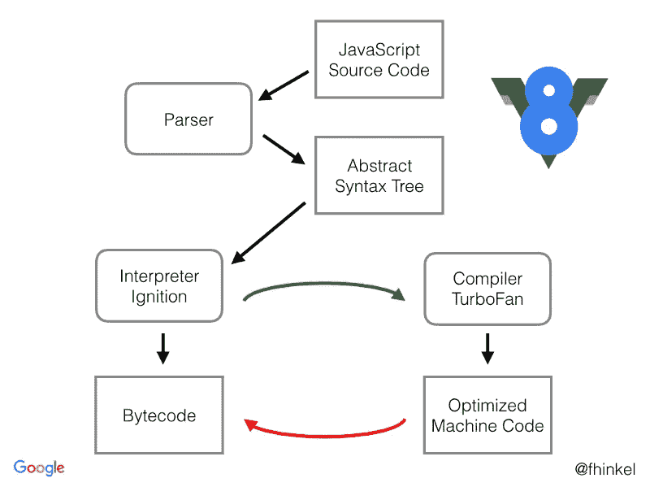
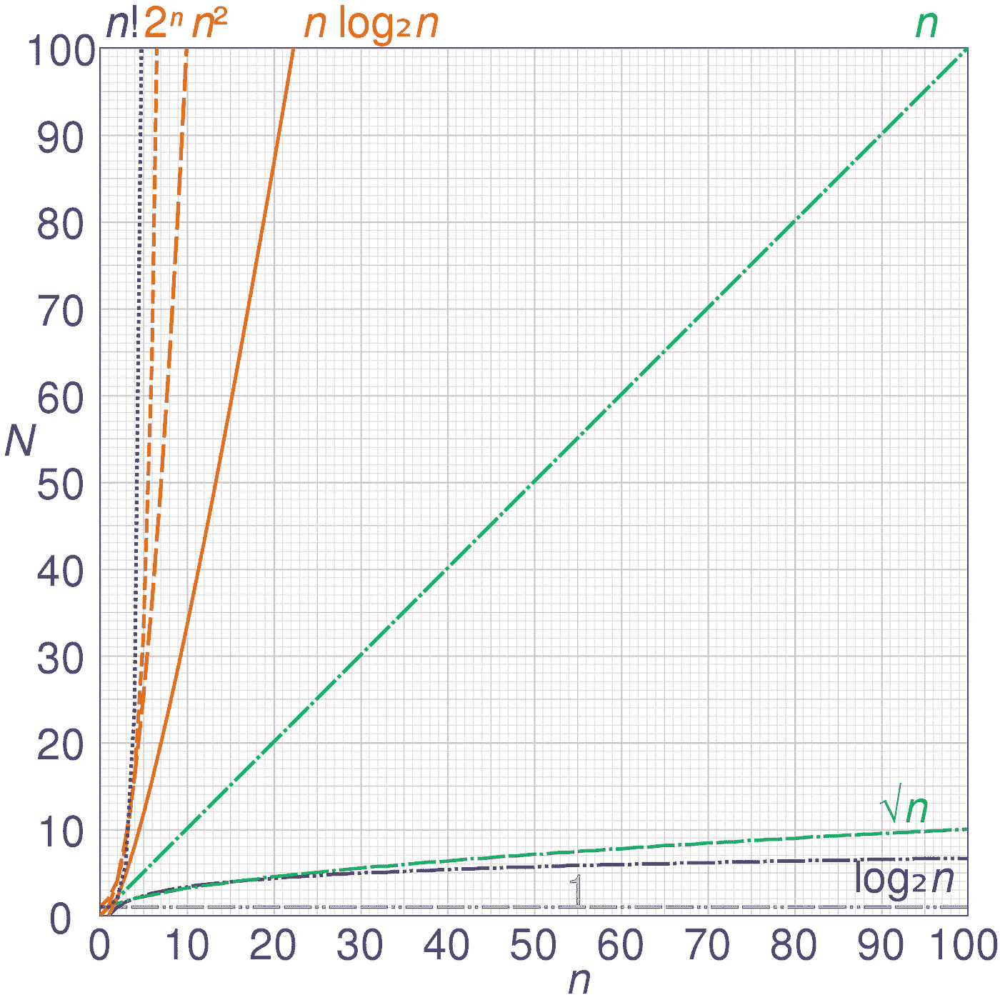
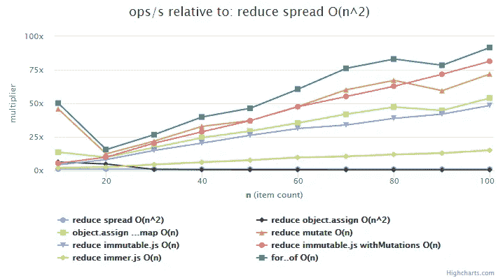
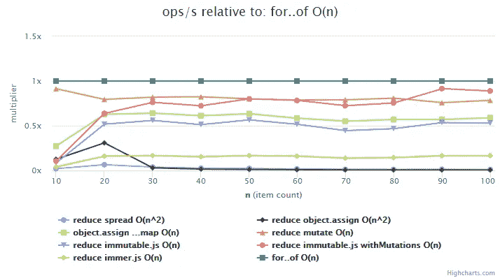

# Reduce ({…Spread})反模式

> 原文：<https://betterprogramming.pub/the-reduce-spread-anti-pattern-fc0c1c0b23f6>

## 快速了解发动机内部


由[迪安·普](https://unsplash.com/@wezlar11)在 [Unsplash](https://unsplash.com/photos/C8NDn4xk9zs) 上拍摄的照片

性能是计算中的一个常见话题，但在前端领域尤其常见，因为最新的 Javascript 技术正在争夺前端的宝座。有些人可能会说 [React](https://reactjs.org/) 已经赢了，使用数字似乎也是如此。因此，在这篇文章中，我想谈谈我在前端世界中更频繁看到的一段有问题的代码，因为 Javascript 语法正在发展，组件正在取而代之。

您可能遇到过这样的情况，您想要将一组对象贴图合并成一个单独的对象。以下是该问题的两种常见解决方案:

虽然后一个`for loop`可能更容易阅读，但前一个`reduce` 很好。随着 React 社区越来越多地采用更加函数化的编程风格，T2 变得越来越常见，通常避免迭代语句，而支持函数表达式，函数表达式可以很容易地内联到组件中。我个人两个都喜欢。

我不太喜欢这种最新出现的风格:

对于那些不熟悉对象文字中[展开语法(](https://developer.mozilla.org/en-US/docs/Web/JavaScript/Reference/Operators/Spread_syntax#Spread_in_object_literals) `[...](https://developer.mozilla.org/en-US/docs/Web/JavaScript/Reference/Operators/Spread_syntax#Spread_in_object_literals)` [)的人来说，它的行为与](https://developer.mozilla.org/en-US/docs/Web/JavaScript/Reference/Operators/Spread_syntax#Spread_in_object_literals) [Object.assign](https://developer.mozilla.org/en-US/docs/Web/JavaScript/Reference/Global_Objects/Object/assign) 非常相似。您可以使用它来迭代源对象的属性，以将它们复制到目标对象中。在这种情况下，我们复制到一个新创建的对象。你能看出问题吗？我指的不是对象初始化，这只是一个小问题。

隐藏迭代！当`Array#Map`和工作人员更新时，经常看到编码人员过度使用它们，经常是连续地，多次地使用相同的数据集。现在，随着 spread operator 进入蜜月期，开发人员开始尝试新的、令人兴奋的编程模式；一些好的(`...`对于配置对象来说很棒)，一些不好的。

不幸的是，当审查包含`reduce...spread`的代码时，spread 操作符的神奇性质有些麻烦。当试图说服人们因为嵌套循环而避免这种模式时，我经常会遇到“*什么循环？”*、*过早优化！"*，或者*“那就是突变！”*因此，下面，我们将快速深入引擎内部，找出缺失的循环，讨论优化和计算复杂性，最后讨论函数式编程。

## 快速了解 Javascript 引擎

当 Javascript 代码在类似浏览器的东西中遇到时，该代码的执行由 Javascript 引擎处理。有好几个引擎存在，但是我们要具体说一下 Chrome 和 Node 的默认引擎: [v8](https://v8.dev/) 。v8 发动机如何工作是一个复杂的话题，但这个[精彩的演示](https://www.youtube.com/watch?time_continue=3&v=p-iiEDtpy6I)涵盖了基本知识。



*V8 的编译器管道—归功于*[*@ fhinkel*](https://twitter.com/fhinkel)

目前，有三个组件构成 v8 引擎执行的编译层:解析器，它生成一个[抽象语法树(AST)](https://en.wikipedia.org/wiki/Abstract_syntax_tree)；一个解释器，它生成[字节码](https://en.wikipedia.org/wiki/Bytecode)；以及一个优化的编译器，生成[机器码](https://en.wikipedia.org/wiki/Machine_code)。

所有这些都是在运行时(而不是在一个单独的编译步骤中)在一个称为[实时(JIT)](https://en.wikipedia.org/wiki/Just-in-time_compilation) 编译的过程中执行的。

通过查看 v8 的解释器生成的字节码， [Ignition](https://v8.dev/docs/ignition) ，我们可以更准确地了解我们的 Javascript 代码实际上在做什么。

下面的字节码是从`reduce ...spread`生成的，重要的位用粗体表示。

```
// bytecode
StackCheck
**CreateObjectLiteral [0], [0], #41, r0**
Mov r0, r1
Mov a0, r2
**CallRuntime [CopyDataProperties], r1-r2**
LdaNamedProperty a1, [1], [1]
ToName r1
LdaNamedProperty a1, [2], [3]
StaDataPropertyInLiteral r0, r1, #0, [5]
Ldar r0
Return// builtin code generation
SetOrCopyDataProperties( /* … */ ) {
 // …
 **ForEachEnumerableOwnProperty(**
 context, source_map, CAST(source), kEnumerationOrder,
 [=](TNode<Name> key, TNode<Object> value) {
 **CallBuiltin(Builtins::kSetPropertyInLiteral**, context, target, key, value);
 },
 if_runtime);
 // …
}
```

字节码将生成进行运行时调用的代码，该代码映射到用我们正在寻找的循环生成的内联内建。我想我们毕竟是在执行嵌套迭代…

## 决定我们的计算复杂度

讨论一段代码的复杂性需要了解该代码在运行时将使用的资源量。具体来说，当比较我们的`reduce mutate`解决方案和`reduce ...spread`时，我们将讨论它们各自的[时间复杂度](https://en.wikipedia.org/wiki/Time_complexity)；换句话说，在给定输入大小的情况下，每个解决方案需要运行多长时间。这些时间近似值通常用[大𝑂符号](https://en.wikipedia.org/wiki/Big_O_notation)表示，例如:𝑂(1 表示[常数时间](https://en.wikipedia.org/wiki/Time_complexity#Constant_time)，或者𝑂(n 表示[线性时间](https://en.wikipedia.org/wiki/Time_complexity#Linear_time)。

计算迭代一组大小为`n`的数据(在我们的例子中为`reduce`)的代码的时间复杂度，需要找到我们在解决方案中关心的常数时间操作，并确定该操作将执行多少次。

对我们来说，我们感兴趣的基本操作是将数据插入到我们的对象中，[，这通常是一个恒定时间的操作](https://en.wikipedia.org/wiki/Associative_array#Comparison)。我们可以看到这在一个解决方案中用 Javascript 和`acc[item.name] = item.value;`表示，在另一个解决方案中用`Builtins::kSetPropertyInLiteral`生成的机器码表示。这些代码路径可能有不同的实现这一事实并不重要。重要的是它们都是常数时间。

我们可以在`reduce mutate`中看到，对于 reduce 的每次迭代，我们的基本操作只发生一次。换句话说，对于大小为`n`的输入数组，它发生了`n`次，因此我们可以将其归类为线性时间:𝑂(n).

然而，使用`reduce...spread`，它实际上执行一些其他操作。具体来说，它执行一个新对象文字的创建，然后再次迭代(在本例中是嵌套迭代，因为它在我们之前的迭代中)现有的属性键，然后为每个*嵌套*迭代执行我们的基本操作。

我们的基地行动进行了多少次了？嗯，这很复杂。它不会精确地执行内部循环`n`次，因为内部循环受到它需要复制的密钥数量的限制。然而，就我们的目的而言，说它在执行`n * n`的同一个[类](https://en.wikipedia.org/wiki/Computational_complexity_theory)解决方案中就足够了，或者 n^2 时报，称之为𝑂(n^2)，因为随着`n`趋向于无穷大，它无论如何都会向那个方向发展。但是，为了更准确的描述，我们可以记为[𝜃(𝑛^2)≡𝑂(𝑛^2)](https://cs.stackexchange.com/a/4608)。

***注意:*** *以上假设在你的目标对象中没有生成重复的键。对于我见过的大多数将对象数组映射到对象 key- >值的例子来说，这是正确的，我认为这是一个合理的假设。然而，在有些情况下，这显然是不正确的，比如专门用于计算重复项的解决方案(想想字数)。在那些情况下，使用* `*reduce...spread*` *模式仍然会被归类为𝑂(𝑛^2(因为大 o 符号是上界的近似值)。但是通过考虑最佳情况(所有副本)和一般情况的复杂性，实际运行时间可能会得到更准确的反映。*



*功劳归于* [*Cmglee —自己的工作，抄送 BY-SA 4.0*](https://commons.wikimedia.org/w/index.php?curid=50321072)

我们可以在提供的图表中看到不同的算法分类对于不同的输入大小是如何执行的。类分组代表不同算法的可比较的运行时特征。例如，两个不同的𝑂(n 算法可能具有不同的执行时间，但是随着它们所操作的输入大小的增长，它们的运行时间将彼此相当地增长。理解代码通常如何执行有助于为我们试图解决的问题编写适当的解决方案。它还可以帮助我们了解代码的某些性能特征，甚至不用运行它！

好的，我们的一个解决方案是𝑂(n 的，另一个是𝑂(n2)…的。这真的很糟糕吗？担心这个不就是优化过早的一个案例吗？优化编译器不会拯救我们吗？嗯，看我们的信息图表似乎表明，𝑂(n)和𝑂(n2)有非常不同的性能特征。让我们看看它们在实际的基准测试中表现如何。


我在这些测试中包含了我们讨论的两个解决方案，`reduce mutate`和`reduce...spread`。我还加入了一些额外的基准，包括上面提到的`for..of`，以及一些使用不可变数据结构的解决方案，这些都是我们后面讨论函数式编程时用到的。您可以在这里[看到用于运行这些基准测试的代码](https://gist.github.com/snapwich/7604b2d827f320e470a07e088e0293f3)。

有一点可以立即注意到，当涉及少量物品时，`reduce mutate`和`for..of`比竞争对手快得多。为什么会这样，我不太清楚。我认为这可能与优化器有关，但我无法通过基准预热(以确保我们所有结果中的 JIT 优化)或限制测试周期来使峰值正常化。



不过，这并不是非常重要，因为我们在这里是为了看看不同的时间复杂度对我们的代码意味着什么。当我们查看上图中的`ops/s relative to: reduce spread O(n^2)`并观察它与其他解决方案的长期对比时，就能发现真正的问题。然后我们再看`ops/s relative to: for..of 𝑂(n)`，看看对比如何。

你看出区别了吗？如果我们将任何一个𝑂(n)解决方案与其他解决方案进行比较，我们会发现它们的性能基本上是其他𝑂(n)解决方案的几倍。例子:点击`for..of 𝑂(n)`会显示`reduce mutate 𝑂(n)`是四分之三的速度，但是不管我们的数据集有多大，它几乎总是四分之三的速度。然而，如果我们点击`reduce...spread 𝑂(n^2)`并将其与`reduce mutate 𝑂(n)`进行比较，首先它慢了 20 倍，然后是 40 倍，然后是 80 倍。增长速度越来越慢了！这是个坏消息。

**我之所以认为`reduce...spread`是一种反模式，是因为它越来越受欢迎，同时还有不明显的性能问题。不明显，因为大多数人认为将一个对象数组直接映射到相似数量的对象属性需要线性工作量:10 个项目需要大约 10 分钟，20 个项目需要大约 20 分钟，等等。然而，事实并非如此。如果你遵循这样一个合理的假设，这个东西会很快杀死你的应用程序的性能。**

***我们应该忘记小的效率，比如说 97%的时候:过早的优化是万恶之源。然而，我们不应该错过这关键的 3%的机会。***

***—唐纳德·克努特***

**我们大多数人都听说过这句话的一部分，但通常不是全部。有*有*这种过早优化的东西，然而这不是。如果有的话，我认为`reduce...spread`是一个过早的去优化。**

**过早优化是指选择使用我的基准测试中提供的最快的𝑂(n)解决方案，而不是其他𝑂(n)解决方案*，因为它是最快的*。从性能角度来看，您选择哪个𝑂(n)解决方案可能无关紧要；您完全有可能在不同的 Javascript 引擎中看到不同的结果，v8 优化编译器的进步可能会在明天改变这些结果。**

**对于`reduce...spread`和它的𝑂(n2 时间来说也是如此吗？大概不会。这里有一个关于[优化编译器](https://en.wikipedia.org/wiki/Optimizing_compiler)的相关点(重点后加):**

> **优化编译器关注相对较浅的常数因子性能改善，通常不会改善解决方案的算法复杂度。例如，编译器不会将冒泡排序的实现改为使用合并排序。**

**这并不是说它不能被优化。显然可以，因为我们利用突变做到了。但是，看看我们的基准测试，很明显，它目前没有优化，也不太可能会优化。*如果你感兴趣的话，你可以在* [*这条推文*](https://twitter.com/bmeurer/status/1137025197557669888) *上看到一些关于这个确切模式的讨论，要求对对象文字内部的传播进行潜在的优化。***

## **功能纯度**

**最后，让我们谈一谈函数式编程。我听到的支持`reduce...spread`的最后一个论点是出于[函数纯度](https://en.wikipedia.org/wiki/Pure_function)的原因，因为我们的 reduce 函数改变了它的一个参数(累加器)，这是不好的。但是在这种情况下，我们通过避免突变来防止什么潜在的错误呢？**

**让我们再来看一下代码，这次关注的是一个重要的部分。**

```
let result = items.reduce((acc, item) => ({
  ...acc, [item.name]: item.value
}), **{}**) // see this initial value?
```

**我们避免变异的对象是我们创建的引用*。*换句话说，改变这个参数并不危险，担心改变它实际上是一种过早去优化的情况。**

**你的棉绒在抱怨吗？如果是这样的话，这就是为什么棉绒赋予我们忽略某些线条的能力。棉绒有助于提醒我们潜在的权衡，但在这种情况下(用我们新发现的智慧)，我们可以[决定忽略它，避免潜在的陷阱](https://twitter.com/dan_abramov/status/1136897691441553409)。您也可以使用 for 循环来代替，并完全避免 reduce(和林挺错误)。**

**如果您想将`reduce mutate`代码一般化，以便在您可能正在处理不属于您的数据的情况下工作，我建议要么在迭代之前制作该数据*的副本，要么使用不可变的数据结构，因为这是它们被创建的目的。***

**[在基准](https://gist.github.com/snapwich/7604b2d827f320e470a07e088e0293f3)中，我已经包括了一些使用`[immutable.js](https://github.com/immutable-js/immutable-js)`和不使用突变的例子(没错，一个不可变的库为数据突变提供了帮助)，以及`[immer.js](https://github.com/immerjs/immer)`。不可变数据结构提供了允许破坏性操作的好处，而无需修改您正在操作的原始源对象。他们这样做还有一个额外的好处，就是共享底层数据以防止浪费，就像在`reduce...spread`一样。如果你想用不变性来编码，那么我建议使用合适的工具。你可能也会对这个常量值类型的提议感兴趣。**

## **最后**

**请在您的代码中避免这种模式！如果您正在审查包含该模式的代码，请随意参考本文。**