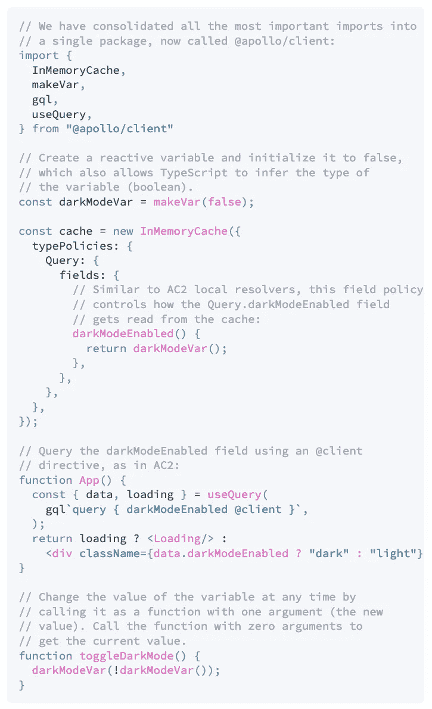
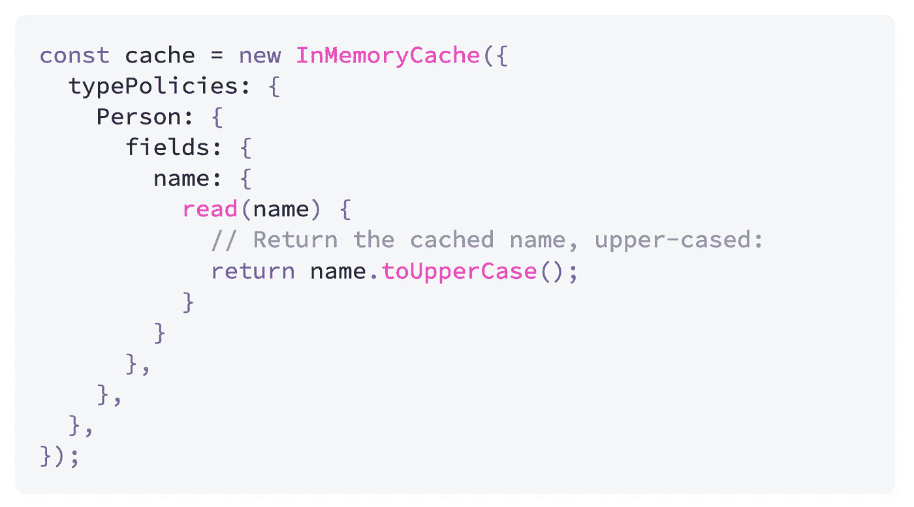

# 阿波罗客户端 3 的发布

> 原文：<https://betterprogramming.pub/the-release-of-apollo-client-3-f2703d55de44>

## 了解此版本中的新功能

布莱恩·麦高恩在 [Unsplash](https://unsplash.com/s/photos/apollo?utm_source=unsplash&utm_medium=referral&utm_content=creditCopyText) 上的照片

Apollo Client 是一个 JavaScript 状态管理库，使您能够使用 GraphQL 管理本地和远程数据。它提供了与 React 以及 Angular、Vue、Amber、Meteor 等其他框架的内置集成。

经过 11 个月的工作和多次测试和发布，Apollo Client 在几天前发布了 v3。让我们来看看这个版本包含了什么。

# **无功变量**

反应变量允许您存储任何类型和结构的数据，而无需使用 GraphQL 语法。这个变量的强大之处在于,*每当变量被修改时，它都会触发依赖于该变量的每个活动查询的更新。*

反应变量的概念并不新鲜，它出现在 2014 年的 [Meteor 的 ReactiveVar API](https://docs.meteor.com/api/reactive-var.html) 中，现在在 Apollo 客户端中实现，以支持灵活的方式存储本地状态。

makeVar 中使用反应变量的一个例子

# **缓存字段策略**

您可以为缓存中的每个字段定义特定的字段策略。
通过各自的`read`和`merge`功能，字段策略允许您自定义从缓存中读取字段时发生的情况，或在缓存中写入字段时发生的情况。

场政策的一个例子。当字段名被读取时，它是大写的

这个特性可以为你节省很多重复代码，处理很多用例，比如写值的时候缺省值，读的时候规格化值，排序，分页等等。

# **分页助手**

正如我们所看到的，字段策略使您能够正确处理分页的数据列表，但这可能很困难，这取决于具体情况和细节。这就是为什么 Apollo 通过`@apollo/client/utilities`包提供了一些有趣的助手，你可以很容易地使用它们来实现分页。您可以直接使用它们，也可以根据自己的需要进行调整。

# **还有更多！**

出于好奇，你可以在他们的[发布页面上找到很多变化！](https://github.com/apollographql/apollo-client/releases)

如果你还不了解 Apollo 客户端，我邀请你看一下它的[介绍](https://www.apollographql.com/docs/react/)。

本文是阿波罗博客上[宣布发布阿波罗客户端 3.0](https://www.apollographql.com/blog/announcing-the-release-of-apollo-client-3-0/) 的原文摘要