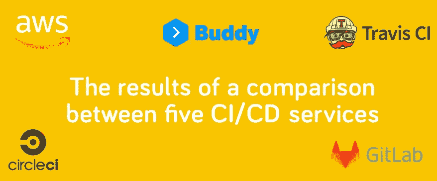
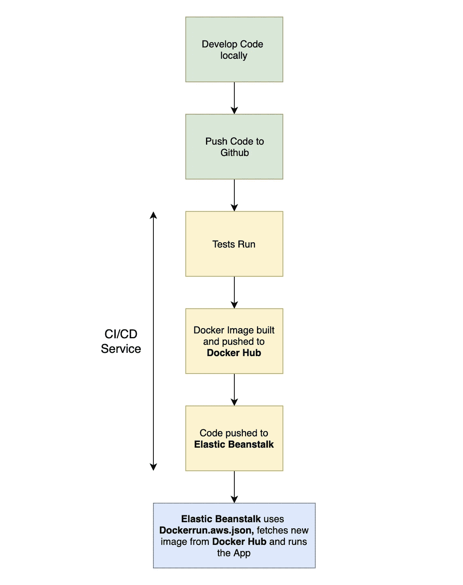
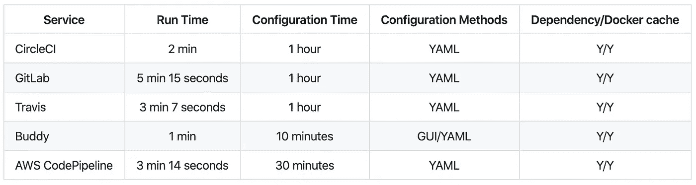

# 5 项 CI/CD 服务的比较结果

> 原文：<https://betterprogramming.pub/the-results-of-a-comparison-between-5-ci-cd-services-8d1a5c4d185a>

## AWS、Buddy、TravisCI、CircleCI 和 GitLab

上周，我写了五篇关于 CI/CD 服务的文章。在每篇文章中，我都将这个[节点应用程序](https://github.com/AndrewBestbier/ci-comparison-blog)部署到具有不同 CI/CD 服务的 [AWS](https://aws.amazon.com/) 中。参见下面的单个帖子:

 [## 如何与 Buddy 一起建立您的第一个 CI/CD 渠道

### 与 Buddy 一起将 Dockerised Node.js 应用程序持续集成和部署到 AWS Elastic Beanstalk 的指南

medium.com](https://medium.com/better-programming/how-to-build-your-first-ci-cd-pipeline-with-buddy-b12a01bbc90a)  [## 如何建立您的第一个 Travis CI/CD 渠道

### 使用 Travis 将 Dockerised Node 应用程序持续集成和部署到 AWS Elastic Beanstalk 的指南

medium.com](https://medium.com/better-programming/how-to-build-your-first-travis-ci-cd-pipeline-4ee180222819)  [## 如何构建您的第一个 AWS 代码管道 CI/CD 管道

### 将 Dockerised Node.js 应用程序持续集成和部署到 AWS Elastic Beanstalk 和 AWS 的指南…

medium.com](https://medium.com/better-programming/how-to-build-your-first-aws-codepipeline-ci-cd-pipeline-c4127dab6394)  [## 如何构建您的第一个 GitLab CI/CD 管道

### 使用 GitLab 将 Dockerised Node.js 应用程序持续集成和部署到 AWS Elastic Beanstalk 的指南

medium.com](https://medium.com/better-programming/how-to-build-your-first-gitlab-ci-cd-pipeline-5416d7e3b602)  [## 如何为 Dockerised Node 应用程序构建第一个 CircleCI CI/CD 管道

### 将 Dockerised 节点应用程序持续集成和部署到 AWS elastic beanstalk with circle ci 的指南

medium.com](https://medium.com/better-programming/how-to-build-your-first-circleci-ci-cd-pipeline-for-a-dockerised-node-app-3e935f351103) 

# 方法

每个 CI/CD 管道遵循的步骤如下所示。请注意 [Docker Hub](https://hub.docker.com/) 如何用于存储构建的 Docker 图像，以及[弹性豆茎](https://aws.amazon.com/elasticbeanstalk/)如何用于拉取和运行这些图像:

# 结果

结果可以在下表中看到。我鼓励你按照指南自己复制这些结果。一些注意事项:

*   配置时间是主观的，因为它取决于您对每个工具的熟悉程度。为了透明，我之前已经和[好友](https://buddy.works/docs/pipelines/introduction)建立了管道，你可以在我在 Medium 上的其他博客帖子中看到。也就是说，可视化配置管道的能力大大减少了配置时间。
*   运行时间可以在我的指南截图中看到。我欢迎关于如何提高我的运行时间的建议，我将相应地更新这些结果。运行时间都来自使用这些服务提供的默认机器。

# 结论

从我的使用案例来看，[好友](https://buddy.works/?utm_source=medium&utm_medium=referral&utm_content=toolcomparison&utm_campaign=andrewbestbier_bz)是明显的赢家。由于我不是 DevOps 专家，设置 CI/CD 管道在视觉上确实吸引了我，我发现它非常容易配置。

Buddy 也获得了最快的运行时间，但我怀疑人们很快会对我如何改进现有管道提出建议。然而， [Buddy](https://buddy.works/?utm_source=medium&utm_medium=referral&utm_content=toolcomparison&utm_campaign=andrewbestbier_bz) 并不像其他服务那样广为人知，因此，在使用他们的服务胜过竞争对手之前，你应该仔细检查他们提供的服务。

其次，我会推荐 [AWS CodePipeline](https://aws.amazon.com/codepipeline/) ，因为它出奇地容易配置，这并不是我使用 AWS 的一贯经验。

CodePipeline 与其他 AWS 服务深度集成，这使得它非常强大。如果你已经在大量使用 AWS，我会全力推荐这项服务。

我个人发现 [GitLab](https://gitlab.com/) 是所有服务中最难使用的，因为它没有得到很好的记录。 [Travis](https://travis-ci.org/) 和 [CircleCI](https://circleci.com/) 都有很好的文档记录，如果我不使用 AWS 或者不能使用像 [Buddy](https://buddy.works/?utm_source=medium&utm_medium=referral&utm_content=toolcomparison&utm_campaign=andrewbestbier_bz) 这样的小公司，我肯定会考虑这些服务。

如果您有任何建议，请发表评论——我很乐意定期更新这一系列文章，进行进一步的优化。

如果你不同意我的发现，请告诉我。最后，请尝试自己复制这些结果，并分享您在自己公司使用这些工具的经验。