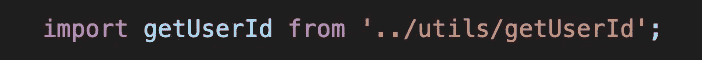
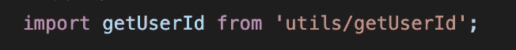
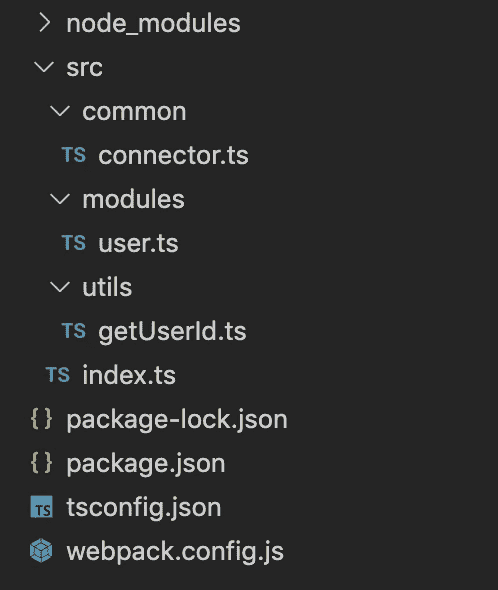
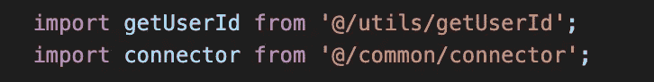
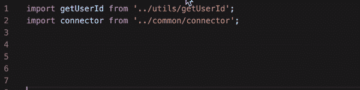

# Webpack 和 TypeScript 中别名的正确使用

> 原文：<https://betterprogramming.pub/the-right-usage-of-aliases-in-webpack-typescript-4418327f47fa>

## 在项目中使用绝对路径，而不是相对路径


由 [Florian Olivo](https://unsplash.com/@rxspawn?utm_source=medium&utm_medium=referral) 在 [Unsplash](https://unsplash.com?utm_source=medium&utm_medium=referral) 上拍摄的照片

你好，世界！

今天我想和你分享一些技巧来改进你的项目，使它更容易维护。我说的是化名。

# 说明

如果你从未听说过别名，你会发现这一节很有用。

根据字典的解释，别名是一个人为了特定目的而取的名字。我们可以给项目中的文件甚至文件夹起别名。通常，更多信息可在文档中找到。

# Webpack 中的别名

假设我们有这样一个文件夹结构:


从上面的结构中我们可以看到，如果我们需要来自`getUserId.ts`文件的内容，正如我们从上面的结构中可以看到的。

对于`index.ts`,它看起来像这样:


对于`user.ts`看起来是这样的:



好吧，这没什么大不了的——我们可以在我们的`webpack.config.js`中用 webpack 别名解决它:

但是，由于我们使用 TypeScript，我们必须将它复制到我们的`tsconfig.json`(使用`src`文件夹作为`baseUrl`):

让我们试一试。

对于`index.ts`和`user.ts`，现在看起来是一样的:



还不错！

看起来我们已经解决了这个问题，但是一旦我们得到另一个常用的文件或文件夹，我们必须重复所有这些操作。假设我们有一个新文件夹`common`，里面有`connector.ts`:



所以，`webpack.config.js`:

[https://gist . github . com/better programming/e 2 ce 4 E6 c 873 b 88 A8 DEA 2625 e 45006955 . js](https://gist.github.com/BetterProgramming/e2ce4e6c873b88a8dea2625e45006955.js)

`tsconfig.json`:

我同意你的观点…它看起来并没有使维护变得更容易。

# 通用别名

一些解决方案会导致新的问题。希望我们知道如何处理它们。让我们更新我们的配置，我们将创建一个通用别名，而不是为每种情况使用别名。

在`webpack.config.js`中:

```
//...
alias: {
  '@': path.resolve(__dirname, 'src'),
}
//...
```

在`tsconfig.json`中:

```
//...
"baseUrl": "src",
"paths": { 
  "@/*": ["*"]
}
//...
```

现在我们可以这样更新我们的文件:



到目前为止做得很好！

# 重构

这一切似乎都很好，看起来很好，除了一件事。因为我们不得不在`webpack.config.ts`和`tsconfig.json`中复制我们的别名，这违反了 DRY 原则。同样，我们有一个解决方案！

我们需要一个额外的包裹:

```
npm i tsconfig-paths-webpack-plugin -D
```

这将有助于我们建立一个关于我们化名的单一的真实来源。

在`webpack.config.js`:

仅此而已，最终代码:

网络包.配置. js

tsconfig.json

以下是我们正在进行的工作(来自`user.ts`文件):



# 摘要

从我的角度来看，这种方法将有助于您编写更干净的代码。此外，这将有助于维护项目。例如，将文件从当前目录移动到另一个目录会导致较少的问题，因为每个文件都使用绝对路径而不是相对路径。最后但同样重要的是，它在开发过程中帮助你。

我希望这篇文章对你有帮助，下次再见！