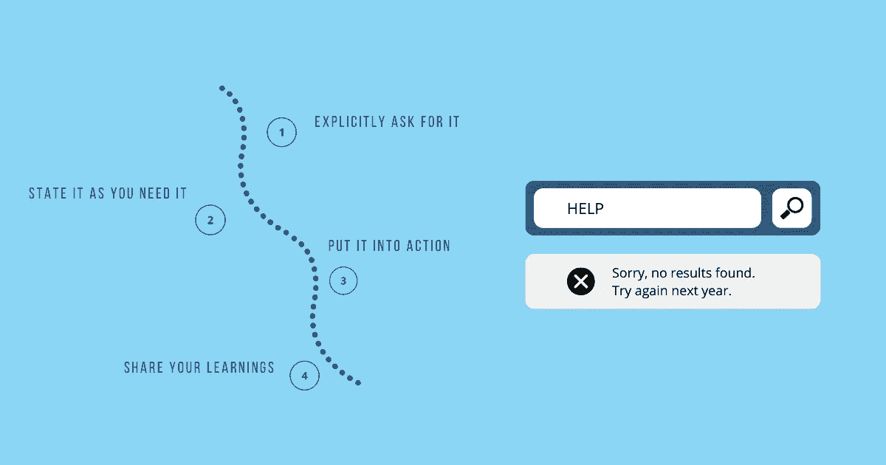

# 在工作中寻求帮助的正确方式

> 原文：<https://betterprogramming.pub/the-right-way-to-ask-for-help-at-work-968a83100fec>

## 寻求帮助不是弱点。这是一种力量

鸣谢:作者

当我们小的时候，我们总是寻求帮助。尽管我们依赖父母、朋友、老师和兄弟姐妹来帮助我们驾驭复杂的生活，但寻求帮助似乎是最自然的事情。作为一个孩子，我不记得在寻求帮助时处理过任何痛苦的情绪，或者担心这会对我的自尊造成什么影响，或者会对我为自己建立的形象产生破坏性影响。我很乐意向身边的每个人学习，因为我知道当我需要的时候，我可以依靠别人给我有用的建议。的确，这是世界上最好的感觉。

然而，在这个过程中，帮助的意义发生了变化。我染上了独立和个人主义的毛病。寻求帮助变得不那么关乎学习，而更关乎我的身份。这让我质疑自己的能力。会不会让我显得软弱或者无能？别人发现我有依赖性会不会看不起我？人们会质疑我的智力和聪明吗？我宁愿努力完成一项任务，浪费无数个小时却一事无成，也不愿去接近某个人。我渴望获得信息，但也准备好保持愚蠢。

结果的不确定性、被拒绝的风险、害怕看起来脆弱或显得贫困是一种非常真实的感觉。正如布琳·布朗在她的书 [Rising Strong](https://www.penguinrandomhouse.com/books/234211/rising-strong-by-brene-brown-phd-lmsw/) 中所说，“成功的人是那些帮助而不是需要的人，失败的人需要而不是帮助。”

我被困在这种思维模式中，以至于我没有意识到寻求帮助的真正风险不是受到批评，面临拒绝，或者在表达我不知道的东西时感到羞愧，而是没有找到前进所需的建议，或者因为拒绝打破对我不利的模式而停留在原地。我让我的自我驱动了我很长一段时间，同时让许多机会溜走。

那是几年前的事了。我内心的孩子要求回到那些无忧无虑的日子，那时寻求帮助只是“请求”而已。我已经和我的固定思维纠缠太久了，是时候让它休息了。我学会了超越恐惧，寻找寻求建议的价值，当我没有进步时伸出援手，向别人询问我不知道的信息。少了对自己感觉的执着，多了对自己想要实现的目标的执着，决定就简单了——我无法独自完成。没人能。

每一个重大的成就都需要跨越思想、人员和过程的协作。有时你需要信息，有时需要别人的专业知识，有时需要对一个想法或项目的认同。获得成功不是靠我们自己的努力。它需要与他人合作。其他人可以帮助我们看到我们看不到的东西。世界上一些最受尊敬和最成功的人是这样做的:他们不断地寻求帮助。

坐在你的舒适区内，不要寻求帮助，呆在原地，或者打破你自我强加的限制，体验与他人合作的快乐，向前迈进。你可以因为害怕寻求帮助而瘫痪，或者在你面前的许多障碍面前呆坐不动，或者你可以采取行动。选择。

# 寻求帮助是一种力量

在对学生的演讲中，巴拉克·奥巴马说:“不要害怕提问。当你需要帮助时，不要害怕寻求帮助。我每天都这么做。寻求帮助不是软弱的表现，而是力量的表现。这表明你有勇气承认自己不懂的东西，并学习新的东西。”

绝对的。寻求帮助标志着我们对自身局限性的自我认识，对未知事物的谦逊接受，以及寻求帮助的勇气。这是一个信号，表明我们对自己的能力充满信心，能够克服任何阻碍我们前进的障碍。几乎没有任何东西说我们软弱、无能、愚蠢或愚蠢。

换个角度看。当你寻求帮助时，你传达了什么信息？*这就是我所在的地方。这是我要去的地方。这对我很重要。我相信你可能拥有我前进所需的知识。”*

*寻求帮助更多的是针对别人，而不是你自己。而是他们的能力和专业知识可能对别人有用。对他们来说，这是一个运用知识、建立信任和加强关系的机会，一个对自己的贡献感觉良好、对自己所做的改变感觉积极并在这个过程中自我感觉良好的机会。是的，[研究](https://scholar.harvard.edu/jsinger/scientists-find-evidence-that-human-beings-are-born-with-an-innate-desire-to-help-others)表明，人类从帮助他人中获得巨大的乐趣。这是活得更有成效、更有意义的秘密。*

*将你的注意力从你需要什么转移到其他人如何能提供帮助，这可能是寻求正确帮助的强大动力:我在其他人身上寻找的品质是什么，他们如何能有助于解决这个问题，他们可能需要什么数据或信息，他们可以问什么问题，在接近他们之前我是否已经尝试了一切？*

*不再反复思考是否寻求帮助，你现在进入了行动模式。你正在做你需要做的事情来推进你的目标。你已经转变了你的视角，把你曾经认为的弱点变成了优势。你不再因为不愿意寻求帮助而搁置项目数周。完成工作后，你知道什么时候该换个新的视角了。你不害怕探索新的想法或尝试不同的策略。*

*获得自信的谦逊之后，你现在就处于自信的甜蜜点，或者如亚当·格兰特所说，*

> *“你对自己的能力有信心，同时意识到自己可能没有正确的解决方案，甚至没有解决正确的问题。它给你足够的怀疑来重新审视你的旧知识，给你足够的信心去追求新的见解。”*

*现在让我们进入真正的部分:真正寻求帮助。一个有效而谨慎的方法需要回答这样的问题:谁能提供帮助，如何说，如何行动，以及以后做什么。*

# *寻求帮助的正确和错误方式*

*我们将涵盖寻求帮助过程中的四个步骤，以每个步骤中的错误为例，说明如何以正确的方式寻求帮助。*

## *1.明确提出要求*

*我们大多数人都生活在透明的幻觉中，认为我们的想法、需求和感受对别人和对我们一样明显。对我们来说是显而易见的，对别人来说就没那么明显了。人们不能读懂我们的思想，预测我们需要什么。等待别人注意到我们的需求，然后提供帮助，只会导致失望。除非我们让人们知道我们需要帮助，否则我们不会得到任何帮助。除非我们明确要求。*

*我们也善于为自己不付出努力却得不到需要的帮助找借口:“我身边的人真的帮不上忙！他们不知道我需要什么！”不要上当。在尝试之前不要放弃。不要为没有提出要求找借口。利用你投入大量时间建立的人际网络。激活你微弱的联系，接触你休眠的纽带。不要对谁能有用，谁不能有用做错误的假设。你会惊讶地在你最意想不到的地方找到帮助。*

*斯坦福 GSB 大学组织行为学副教授弗兰克·弗林说:研究还表明，我们通常会低估别人帮助我们的可能性，高估别人向我们寻求帮助的可能性。他补充道，“这意味着人们不仅在事实上可以得到帮助的时候不去寻求帮助，而且在事实上他们愿意提供帮助的时候，他们也不会鼓励其他人来寻求帮助。这告诉我们，‘门户开放’政策基本上是无效的，除非积极鼓励人们使用它。”*

*站起来，环顾四周，努力联系并获得你需要的帮助。如果你什么都不做，你将一无所获。*

## *2.你需要的时候就说出来*

*即使议程在我们头脑中非常清楚，我们还是带着一种隐秘感接近他人:“我很想聚一聚，叙叙旧！我们聊聊吧！我们边喝边联系吧！想抠你的脑子！”*

*我们喜欢含糊而不是直接，好像我们拥有的信息不应该马上分享。我们认为拐弯抹角比直接寻求帮助更好。*

*社会心理学家海蒂·格兰特(Heidi Grant)说，“这种模糊的要求太可怕了。”在她的书《增强力量》中，她建议要具体而直接。陈述你想要什么以及为什么想要:“我需要你的帮助”或者“我想联系你以获得你的建议”或者“我想我们一起做这个项目。”*

*Heidi Grant 说，我们犯的另一个错误是使用使对话没有成效的短语。不要轻视这个请求，或者说“我很抱歉要求你这么做”或“我通常不寻求帮助”，让它变得不必要。当你对寻求帮助的想法感到如此糟糕时，为什么对方要给你他们的时间呢？她说，使用让对方感到被困的语句是最糟糕的:“这只是一件小事！我可以请你帮个忙吗？”你想让他们在不真正了解自己将面临什么的情况下做出承诺。*

*让其他人容易决定他们是否可以提供帮助。当他们不能真正有效地帮助你解决问题时，骗他们答应有什么意义呢？告诉他们细节，让他们决定:“我有这个人需要的信息吗？”“我会有效吗？”“我有时间吗？”"有没有更适合帮忙的人？"思考这些问题将使他们能够做正确的事情，而不是提供帮助，即使他们没有能力帮助。*

*保持太模糊或太开放会阻止他们做出正确的决定。三心二意的承诺有什么意义？他们不会有动力去解决你的问题。把它当作一个负担，他们会设法逃脱——任何能达成协议并开始行动的事情。*

*当人们觉得自己能控制决策时，他们会主动提供帮助，并会尽最大努力提供帮助——不是因为你需要帮助，而是因为他们想要帮助。如果他们拒绝帮助，不要把它当成个人的事。要积极和理解。转移到其他人身上。*

> *“无畏的付出已经够难了，无畏的接受更难。但在这种交流中，最难的是:提问。毫无羞耻。接受人们提供的帮助。不要强迫他们。就是为了让他们。”―阿曼达·帕尔默*

## *3.付诸行动*

*你的工作还没完成。这才刚刚开始。你寻求帮助，得到了前进所需的建议。但是你同意吗？你不必出于义务而服从。大多数人发现，当别人不同意他们的观点时，这是有益的。相反，他们不期望你做他们建议的每件事。与他们交谈，提出你的观点，讨论为什么这个想法与你无关，或者有什么其他可能的选择。不要让事情停滞不前。要么决定实施这个想法，要么探索其他可能性。*

*一旦你有了一个想法，努力把它付诸行动。拖延战术从未真正奏效。“总有一天我会做的”变成了“永远不会发生的”你可能对结果感到不确定，害怕这个决定会变成什么样，或者担心付出了这么多努力，但除非你付诸行动，否则你不会知道。*

*制定一个计划——何时、何地以及如何具体实施。把它放在你的日历上，这样你就不用每天都做决定了。当它出现时，知道是时候行动了。*

> *“当我们分心时，当我们开始关心除了我们自己的进步和努力之外的事情时，这个过程就是我们脑海中有用的声音，尽管偶尔有些专横。这是明智的、年长的领导人的叫声，他清楚地知道自己是谁，知道自己该做什么:闭嘴。回到你们的岗位，试着想想我们自己要做什么，而不是担心外面发生了什么。你知道你的工作是什么。别唠叨了，开始工作吧。流程是要求我们承担责任和所有权的声音。这促使我们采取行动，即使只是以很小的方式。”—瑞安·霍利迪*

## *4.分享你的知识*

*一旦你有了你需要的信息，你会费心让他们知道这一切是如何进行的吗？你可能得不到你想要的结果。或者也许你做了，也许结果比你预期的好得多。但是你会花时间与最初帮助过你的人分享这些经验吗？我们假设人们太忙了，并不真的关心它。我们绝对错了。*

*人们喜欢知道他们创造的影响。这是促使他们伸出援手的原因。知道什么有用，什么没用不仅能帮助你学习和成长，也能帮助他们。他们并不完美，他们说的每件事也不能保证一定会成功。从接受他们的建议并执行建议的人那里得到的反馈是他们了解建议有效性的有力来源。这表明你不仅致力于解决你的问题，而且你也关心他们。*

*当你保持关系时，他们更有可能第二次帮助你，而不是一旦你有了你需要的信息就切断联系。你可以通过帮助他们来帮助自己。*

*你看到了寻求帮助的整个过程是如何塑造你这个人的吗？你不仅学到了新的策略，还对自己的实验能力建立了更多的信心，尝试并尽一切可能朝着你的目标前进。你不是不愿意寻求帮助，更多的帮助，更好的帮助。*

# *摘要*

*寻求帮助并不反映你的能力，也不表明你是愚蠢的。这表明你对自己的能力充满信心，并且有足够的自我意识在你需要帮助的地方寻求帮助。寻求帮助的正确方式包括:*

1.  *明确地提出要求:不要假设人们会读心术。除非你明确提出要求，否则你不会得到任何帮助。少假设，多努力。*
2.  *如实陈述:要具体。明确一点。别神秘兮兮的。让其他人容易决定他们是否可以提供帮助。你需要的是承诺，而不是施舍。*
3.  *付诸行动:除非你采取行动，否则你面临的问题不会自行解决。不同意不同意。不同意，承认。致力于将他们的建议付诸行动的过程。*
4.  *分享你的经验:保持关系。一旦你有了你需要的信息，不要结束它。通过帮助他们了解结果来帮助自己。*

**原载于 2021 年 3 月 18 日*[*【https://www.techtello.com】*](https://www.techtello.com/how-to-ask-for-help/)*。**