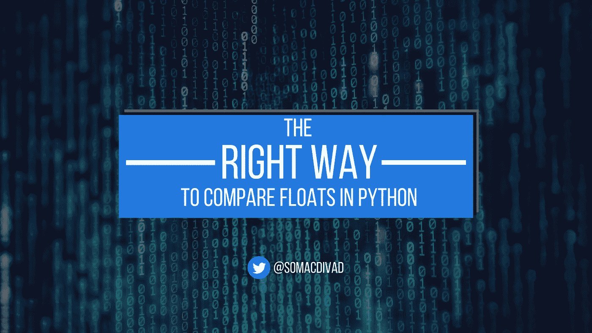

# 在 Python 中比较浮点数的正确方法

> 原文：<https://betterprogramming.pub/the-right-way-to-compare-floats-in-python-ee18042abcc>

## 了解浮点错误为什么常见，为什么有意义，以及如何在 Python 中处理它们



浮点数是一种快速有效的存储和处理数字的方法，但是它们有一系列的缺陷，这些缺陷肯定难倒了许多新手程序员——可能也难倒了一些有经验的程序员！演示浮动缺陷的经典例子是这样的:

第一次看到这个可能会迷失方向。但是不要把你的电脑扔进垃圾桶。这种行为是正确的！

本文将向您展示为什么像上面这样的浮点错误是常见的，为什么它们是有意义的，以及您可以在 Python 中做些什么来处理它们。

# 你的电脑(在某种程度上)是个骗子

你已经看到`0.1 + 0.2`不等于`0.3`,但是疯狂还不止于此。以下是一些更令人困惑的例子:

这个问题也不仅限于平等比较:

这是怎么回事？你的电脑在骗你吗？看起来的确如此，但在表面之下还有更多。

当您在 Python 解释器中键入数字`0.1`时，它会作为浮点数存储在内存中。当这种情况发生时，会发生一种转变。`0.1`是以 10 为基数的十进制，但浮点数是以二进制存储的。换句话说，`0.1`从基数 10 转换成基数 2。

得到的二进制数可能无法准确表示原始的十进制数。`0.1`就是一个例子。二进制表示是`0.000110011…`。也就是说，`0.1`在以 2 为基数书写时是一个无限重复的小数。当你把分数⅓写成十进制的小数时，也会发生同样的事情。你最终得到无限重复的小数`0.3333…`。

计算机内存是有限的，所以`0.1`的无限重复二进制分数表示被四舍五入为有限分数。这个数字的值取决于计算机的体系结构(32 位与 64 位)。查看为`0.1`存储的浮点值的一种方法是使用`.as_integer_ratio()`方法来获取浮点表示的分子和分母:

现在使用`format()`显示精确到小数点后 55 位的分数:

所以`0.1`被舍入到一个比它的真实值稍大的数字。这个错误被称为**浮点表示错误**，比你可能意识到的更经常发生。

# 表示错误真的很常见

当用浮点数表示时，数字被舍入有三个原因:

1.  该数字的有效位数超过了浮点允许的位数。
2.  这个数是无理数。
3.  该数是有理数，但有一个非终止的二进制表示。

64 位浮点数适用于大约 16 或 17 位有效数字。任何具有更高有效位数的数字都会被四舍五入。无理数，像π和 *e* ，不能用任何整数底数的任何终止分数来表示。所以，不管怎样，无理数在存储为浮点数时都会被四舍五入。

这两种情况产生了一组无法精确表示为浮点数的无限数字。但是除非你是一个处理微小数字的化学家，或者是一个处理天文数字的物理学家，否则你不太可能遇到这些问题。

非终止有理数呢，比如基数为 2 的`0.1`？这是您将会遇到大多数浮点问题的地方，并且感谢决定一个分数是否终止的数学，您将会比您想象的更经常地遇到表示错误。

在基数为 10 的情况下，如果一个分数的分母是 10 的质因数的幂的乘积，则该分数可以表示为终止分数。10 的两个质因数是 2 和 5，所以像、、⅕、⅛和⅒这样的分数都会终止，但⅓、⅐和⅑不会。然而，在基数 2 中，只有一个质因数:2。所以只有分母是 2 的幂的分数才会终止。因此，像⅓、⅕、⅙、⅐、⅑和⅒这样的分数在用二进制表示时都是非终止的。

您现在可以理解本文中的原始示例了。`0.1`、`0.2`和`0.3`在转换为浮点数时都取整:

当`0.1`和`0.2`相加时，结果是一个比`0.3`稍大的数:

由于`0.1 + 0.2`比`0.3`稍大，并且`0.3`由一个比其自身稍小的数表示，所以表达式`0.1 + 0.2 == 0.3`的计算结果为`False`。

> ⚠️浮点表示错误是每种语言的每个程序员都需要知道并知道如何处理的事情。**不是针对 Python** 的。你可以在埃里克·威芬的网站[0.30000000000000004.com](https://0.30000000000000004.com/)上看到许多不同语言的印刷结果。

# 如何在 Python 中比较浮点数

那么，在 Python 中比较浮点时，如何处理浮点表示错误呢？诀窍是避免检查相等性。切勿将`==`、`>=`或`<=`与浮动一起使用。请使用`[math.isclose()](https://docs.python.org/3/library/math.html#math.isclose)`功能:

`math.isclose()`检查第一个参数是否可接受地接近第二个参数。但是这到底是什么意思呢？诀窍是检查第一个参数和第二个参数之间的距离，它相当于两个值之差的绝对值:

如果`abs(a - b)`小于`a`或`b`中较大者的某个百分比，那么`a`被认为与`b`足够接近，从而“等于”`b`。这个百分比称为**相对公差。**可以用`math.isclose()`的`rel_tol`关键字参数指定，默认为`1e-9`。换句话说，如果`abs(a - b)`小于`0.00000001 * max(abs(a), abs(b))`，那么`a`和`b`被认为彼此“接近”。这保证了`a`和`b`大约等于 9 位小数。

如果需要，可以更改相对公差:

当然，相对容差取决于您正在解决的问题所设置的约束。然而，对于大多数日常应用，默认的相对容差应该足够了。

然而，如果`a`或`b`中的一个是零，而`rel_tol`小于 1，就会出现问题。在这种情况下，无论非零值与零有多接近，相对容差保证了对接近性的检查总是会失败。在这种情况下，使用绝对公差作为后备:

`math.isclose()`这些会自动为您检查。`abs_tol`关键字参数决定了绝对公差。然而，`abs_tol`默认为`0.0`，所以如果你需要检查一个值有多接近零，你需要手动设置它。

总而言之，`math.isclose()`返回以下比较的结果，该比较将相对和绝对测试合并到一个表达式中:

`math.isclose()`是在 [PEP 485](https://peps.python.org/pep-0485/) 中引入的，从 Python 3.5 开始就有了。

# 什么时候应该用`math.isclose()`？

一般来说，只要需要比较浮点值，就应该使用`math.isclose()`。用`math.isclose()`替换`==`:

您还需要小心`>=`和`<=`的比较。使用`math.isclose()`分别处理等式，然后检查严格比较:

存在各种替代`math.isclose()`的方案。如果您使用 NumPy，您可以利用`[numpy.allclose()](https://numpy.org/doc/stable/reference/generated/numpy.allclose.html)`和`[numpy.isclose()](https://numpy.org/doc/stable/reference/generated/numpy.isclose.html)`:

请记住，默认的相对和绝对公差与`math.isclose()`不同。`numpy.allclose()`和`numpy.isclose()`的默认相对公差为`1e-05`，默认绝对公差为`1e-08`。

`math.isclose()`对单元测试特别有用，尽管有一些替代方法。Python 的内置`unittest`模块有一个`[unittest.TestCase.assertAlmostEqual()](https://docs.python.org/3/library/unittest.html#unittest.TestCase.assertAlmostEqual)`方法。然而，该方法仅使用绝对差异检验。这也是一个断言，意味着失败会引发一个`AssertionError`，使其不适合在您的业务逻辑中进行比较。

对于单元测试来说，`math.isclose()`的另一个很好的选择是`[pytest](https://docs.pytest.org/en/7.1.x/)` [包](https://docs.pytest.org/en/7.1.x/)中的`[pytest.approx()](https://docs.pytest.org/en/latest/reference/reference.html?highlight=approx#pytest-approx)`函数。与`math.isclose()`不同，`pytest.approx()`只接受一个参数——即您期望的值:

`pytest.approx()`有`rel_tol`和`abs_tol`关键字参数，用于设置相对和绝对公差。然而，默认值与`math.isclose()`不同。`rel_tol`的默认值为`1e-6`，而`abs_tol`的默认值为`1e-12`。

如果传递给`pytest.approx()`的前两个参数是类数组的，这意味着它们是 Python 可迭代的，如列表或元组，甚至是 NumPy 数组，那么`pytest.approx()`的行为类似于`numpy.allclose()`并返回两个数组在容差范围内是否相等:

`pytest.approx()`甚至可以使用字典值:

当不需要绝对精度时，浮点数非常适合处理数字。它们速度快，内存效率高。但是如果您确实需要精度，那么您应该考虑一些浮点的替代方法。

# 精确的浮点替代

Python 中有两个内置的数值类型，在浮点不够用的情况下可以提供完全的精度:`Decimal`和`Fraction`。

## `Decimal`型

`[Decimal](https://docs.python.org/3/library/decimal.html#decimal-objects)` [型](https://docs.python.org/3/library/decimal.html#decimal-objects)可以精确存储十进制数值，精度可根据您的需要而定。默认情况下，`Decimal`保留了 28 个有效数字，但是您可以根据自己的需要修改它，以适应您正在解决的特定问题:

你可以在 [Python 文档](https://docs.python.org/3/library/decimal.html)中阅读更多关于`Decimal`类型的内容。

## `Fraction`式

浮点数的另一种替代方式是`[Fraction](https://docs.python.org/3/library/fractions.html#fractions.Fraction)` [类型](https://docs.python.org/3/library/fractions.html#fractions.Fraction)。`Fraction`能准确存储有理数，克服浮点数遇到的表示错误问题；

与标准浮点值相比，`Fraction`和`Decimal`提供了许多好处。然而，这些好处是有代价的:速度降低和内存消耗增加。如果你不需要绝对精确，你最好坚持使用浮动。但是对于像金融和关键任务应用这样的事情来说，`Fraction`和`Decimal`之间的权衡可能是值得的。

# 结论

浮点值既是福也是祸。它们提供了快速的算术运算和高效的内存使用，但代价是表示不准确。在本文中，您了解了:

*   为什么浮点数不精确
*   为什么浮点表示错误很常见
*   如何在 Python 中正确比较浮点值
*   如何使用 Python 的`Fraction`和`Decimal`类型精确地表示数字

现在你知道在 Python 中比较浮点数的正确方法了！

# 额外资源

*   [浮点运算:问题与局限](https://docs.python.org/3/tutorial/floatingpoint.html)
*   [浮点运算指南](https://floating-point-gui.de/)
*   [浮动点的危险](https://www.lahey.com/float.htm)
*   [浮点数学](https://0.30000000000000004.com/)
*   [关于浮点运算，每个计算机科学家都应该知道的事情](https://docs.oracle.com/cd/E19957-01/806-3568/ncg_goldberg.html)
*   [如何在 Python 中舍入数字](https://realpython.com/python-rounding/)

```
***Want to take your Python skills to the next level?****I offer private one-on-one coaching for Python programming and technical writing.* [*Click here*](https://davidamos.dev/coaching) *to learn more.*
```