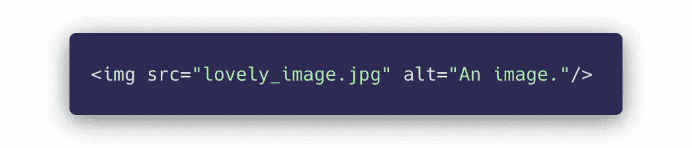
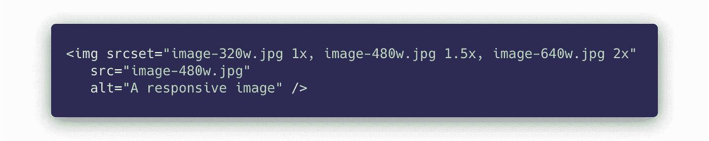
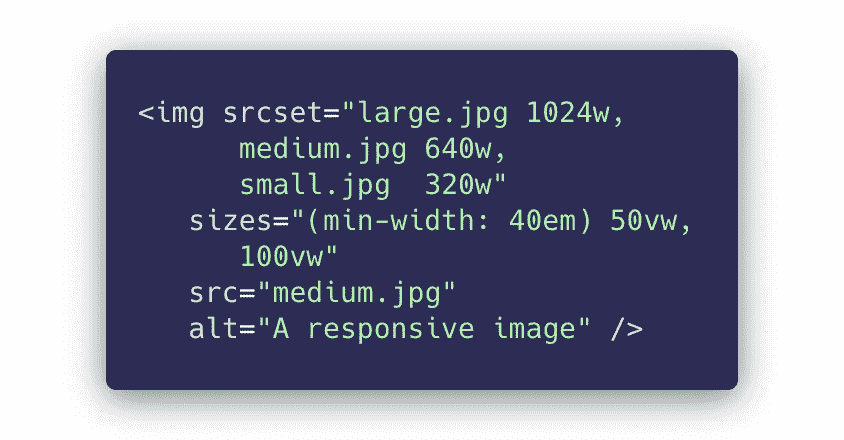
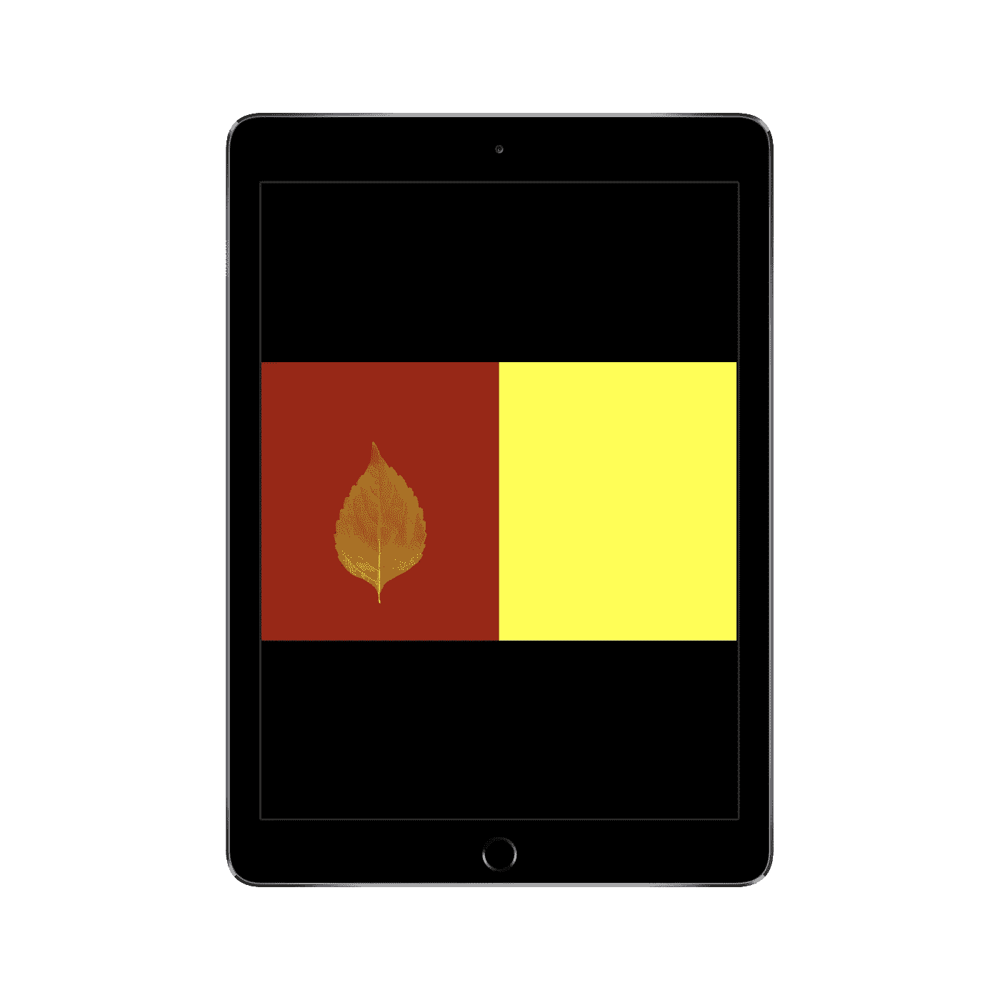
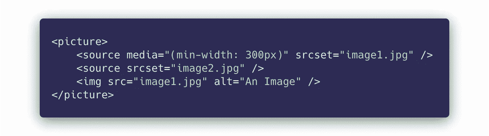
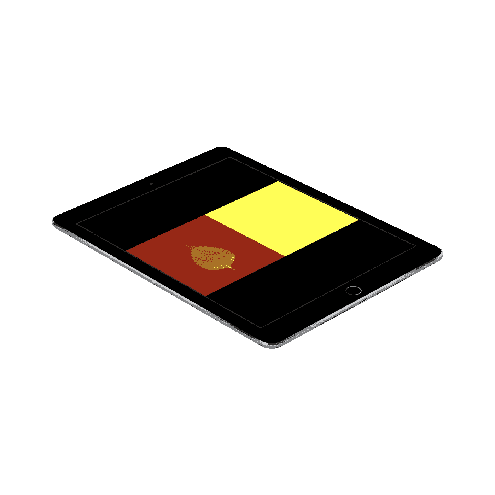

# Web 开发中处理响应图像的正确方法

> 原文：<https://betterprogramming.pub/the-right-way-to-deal-with-responsive-images-in-web-development-3ed5b2f426e2>

## 提升您的图像处理水平

[Raychan](https://unsplash.com/@wx1993?utm_source=medium&utm_medium=referral) 在 [Unsplash](https://unsplash.com?utm_source=medium&utm_medium=referral) 上拍摄的照片

# 心爱的标签

在网页中嵌入图像最简单的方法是使用经典的`` HTML 标签:

这个管用。然而，它有一个重要的问题:无论屏幕大小如何，它都加载相同的图像。这可能会有问题，因为你不会想在一个小手机和 8K 屏幕上使用同一个巨大的 4000 x 5120 的图片。

# 源设置到救援

元素有一个超级有用的属性:`srcset`。

`srcset`属性让我们为图像定义多个来源。它可以基于固定宽度图像的设备像素密度(接下来的第一个示例)或通过媒体查询(如果您的布局是动态的，接下来的第二个示例)来工作。

在这里，`src`是在浏览器不支持`srcset`的情况下的后备，T5 只是 Internet Explorer。

## 例 1。

如果我们知道一个图像的宽度总是 320 CSS 像素，可能通过`width: 320px`在 CSS 中设置，那么我们可以使用下面的简单语法:

这是如何工作的？如果一个屏幕的物理像素值等于一个 CSS 像素值，那么`image-320w.jpg`就会被加载。简单。

然而，现在的显示器往往分辨率很高，所以很多像素被塞进了一英寸(每英寸像素)。在这种情况下，一切都会放大(即，显示得比它们应该占据的实际物理像素更大)。根据缩放比例，CSS 像素可能不等于物理像素。

从上面看我们的`srcset`就知道了。对于物理像素和 CSS 像素之间的 2x 差异，我们采用更大的图像，为最终用户提供更多细节，因此图像将显示得更好、更清晰。

## 例 2。

如果图像的尺寸不是静态的，您还可以通过使用`srcset`和`sizes`属性的组合来明确地告诉浏览器以何种视窗尺寸加载哪些图像。

小型设备:100%的视口

这是如何工作的？浏览器检查来自`sizes`属性的每一个条件。第一个匹配的将作为参考宽度，最接近该宽度的图像将从`srcset`中获取。

基于上面的例子，直到视窗宽度的`40em`(例如，在移动电话上)，浏览器将选择`100vw`作为参考宽度，并将基于该值从`srcset`中选择图像。

在`40em`以上，浏览器将只占用 50%的视窗宽度(`50vw`，并以此为基础选择图像。你可能会问，“这为什么有用？”

较大的设备:50%的视口

嗯，想想不同设备上的不同布局。也许在手机上，你想显示覆盖整个视窗的图像，但在平板电脑和大显示器上，你想让它只覆盖 50%。

我认为这是一个非常典型的用例。

# <picture>标签</picture>

HTML 标签可以用来提供不同的图片来源，根据一些条件选择最好的。

<picture>HTML 标签</picture>

如果视口至少是`300px`，上面的例子将显示`image1.jpg`；否则，它会显示`image2.jpg`。

值得注意的是，`<picture>`标签用于艺术指导，不应仅用于根据屏幕分辨率/像素密度切换图像。为此，我们有带有`srcset`属性的标准``标签，如上所示。

iPad 的正常拍摄

## 艺术指导

术语*艺术指导*是指完全切换画面，从而不再显示相同的图像。

苹果在 iPad 发布会上使用了这一技术。在较大的屏幕上，他们会显示 iPad 的标准照片，但在较小的屏幕上，他们会显示从不同角度拍摄的 iPad 照片。因此，它会显示旋转，占用更少的垂直屏幕空间。聪明！

旋转的 iPad。这比另一张图的高度要小！

# WebP 和图像格式的未来

使用 JPG、JPEG 或 PNG 图像是很常见的。目前，大多数图像都是以这些格式存储的。然而，在文件大小方面，我们可以做得更好，从而隐式地改善页面加载时间。

我们以 WebP 格式为例。它由谷歌开发，提供有损和无损压缩，因此是 JPG(有损)和 PNG(无损)图像的绝佳替代品。

优势？速度。将 JPG 或 PNG 转换为 WebP 可以节省大量文件大小(在少数情况下高达 50%，但通常是 20%到 30%)，而图像质量不会受到影响。

这意味着网站可以加载得更快，从而带来更快的用户体验。

问题可能是浏览器支持。在写这篇文章的时候，几乎所有的浏览器都支持 WebP 格式，除了 IE(反正我们也不是很在意)和 Safari。

通过使用`picture`标签和`type`属性来支持 WebP 和 PNG/JPG，我们可以很容易地解决这个问题。

让我们看看代码:

上面的代码展示了一个具体的例子，涵盖了我们到目前为止讨论的所有内容。

基于浏览器对 WebP 的支持(或缺乏支持)，它在更大的设备上根据视窗的 100%宽度或 50%宽度呈现不同大小的图像(正如我们在`50em`上面进入两列布局)。

响应和 WebP 支持演示

你可以在 GitHub 上找到这个演示的[源代码，这里是](https://github.com/adamkss/responsive-images)[托管的网站](https://responsive-images.vercel.app/)，所以你可以看到它的运行。

# 关键要点

1.  为你的图像使用一个`srcset`总是很重要的，这样你就可以在不需要获取大图像的时候节省重要的加载时间。
2.  HTML 标签``是最常被使用的，因为它支持开箱即用的`srcset`。
3.  小心使用`<picture>` HTML 标签。它主要用于艺术指导。然而，如果你想同时支持新旧文件格式(比如 WebP ),你可以使用`<picture>`标签的`type`功能。
4.  Web 性能优化很重要！减少资产大小(如图像)是一个完美的低挂水果，可以大大提高速度。
5.  有一些很棒的 SaaS(或者我应该称之为 PaaS——图片即服务)产品可以动态地提供图像大小调整和格式转换，比如 Cloudinary。不再需要手动调整大小和存储所有图像。这是 2021 年的方式！

感谢您从头到尾阅读这篇文章。

请记住，如果你的网站不能在三秒钟内加载，人们(从统计上来说)会放弃你的网站。优化图像尺寸是一个很好的开始。