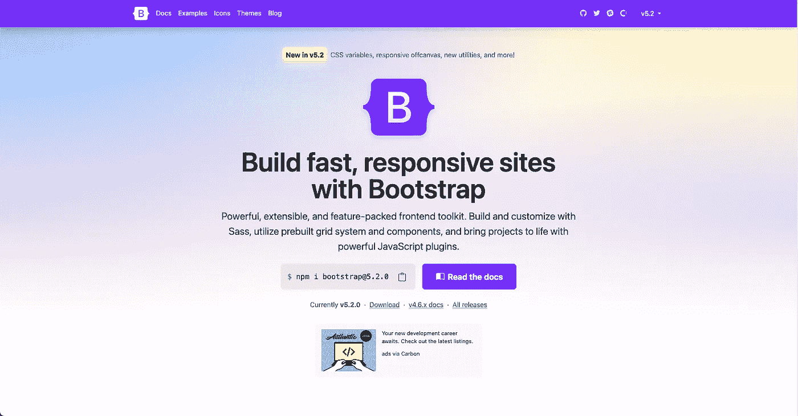
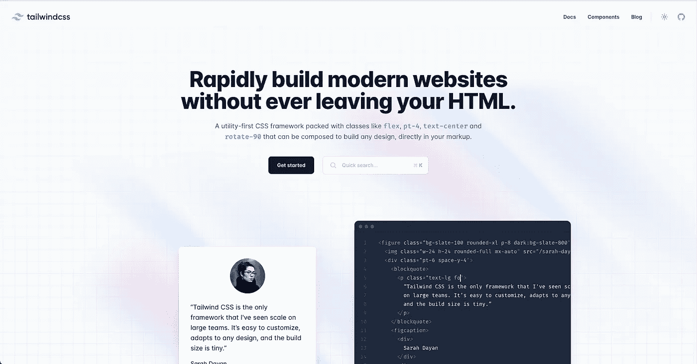
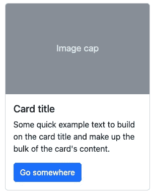
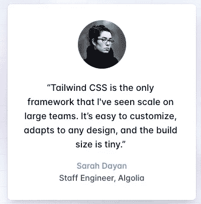

# Bootstrap 的兴衰

> 原文：<https://betterprogramming.pub/the-rise-and-fall-of-bootstrap-68d4cd703666>

## Tailwind 是如何成为 CSS 框架的

资料来源:pixabay.com

# 我最近用了 Bootstrap 5，和顺风相比简直是噩梦

我最近开始[为开发者](https://github.com/brocode-tuts)制作小教程。目标是向初级开发人员展示高级开发人员在编码时是如何思考的。例如，高级开发人员如何理解他们不知道的文档或新框架，以及他们如何发现什么时候出错。[著名的“代码气味”](https://pragmaticways.com/31-code-smells-you-must-know/)

我在[前端导师](https://www.frontendmentor.io/)上找到了样本项目，我用各种技术对它们进行了编码。例如，第一个项目是一个[产品卡组件](https://www.frontendmentor.io/challenges/product-preview-card-component-GO7UmttRfa)的集成。我决定用普通 CSS(换句话说，没有框架)编码解决方案，但是用 Tailwind 和 Bootstrap。

这不仅对观众来说很有趣，对我来说也很有趣。我想看看 Tailwind 和 Bootstrap 在过去几年中是如何发展的。公平地说，我知道使用 Tailwind 的开发者体验会很棒，但我不知道使用 Bootstrap 5 会如此痛苦。太可怕了，促使我写了这篇文章。

在本文中，您将找到历史(主要是关于 Bootstrap)、想法(关于我的开发经验)和代码片段！先从史实说起吧！

# 大家都在用 Bootstrap 的时代

来源:作者

几年前，Bootstrap 随处可见。2016 年，你打不开不运行 Bootstrap 的网站。CSS Flexbox 已经存在，但是 CSS Grid 并不为人所知，也没有得到很好的支持。我记得在 2016 年中期和一个开发者谈 CSS 网格，我告诉他网格的力量。他的回答令人震惊:他认为我说的是 HTML 表格元素，而他对 CSS 网格一无所知。那时候大家都依赖 Bootstrap 3，大家还在用 jQuery。

除了 Bootstrap，还有其他 CSS 框架。第二个最著名的是[基金会](https://get.foundation/)。除了邮件模板，我没有用很多基础。也许它比 Bootstrap 更好或更差或不同或相同。事实是，我不知道。

他们声称(根据他们的 GitHub 页面，他们仍然是)“世界上最先进的响应前端框架。”当看官方文档和他们的 GitHub 库时，在我看来它已经死了。我不想在历史方面花太多时间，但我只想在继续之前补充一些东西。

bonneguule . fr:2016 年使用 Bootstrap 的法国网站(来源:waybackmachine.com)

首先，Bootstrap 是由 Twitter 工程师开发的，他们做得非常好。Twitter 仍然使用 Bootstrap 运行，许多网站也是如此。大多数时候，即使你不是一个经验丰富的开发人员，你也可以很容易地判断一个网站是否在运行 Bootstrap。在我看来，这并不总是好消息！因为在使用的时候，网站往往看起来都一样。

对于一些网站来说，这可能是一个优势，因为用户不需要重新学习模式和如何浏览网站。例如，他们知道链接或提交按钮看起来像什么。但是，在某些时候，你的网站失去了它的身份，依赖它就成了一个弱点。第二个优势是核心团队决定用 Bootstrap 5 移除 jQuery。我不知道这是一个好的还是坏的决定。如今，jQuery 没有其他前端框架流行，开发者也越来越少使用，所以在某种程度上，它是有意义的。

然而，删除它增加了核心团队必须处理的工作量，并且他们失去了一些与旧浏览器的兼容性。如果你想了解更多，这里有一篇很棒的文章来探讨这个主题。

第三部分是“感谢”便条。使用 Bootstrap，尤其是 Bootstrap 4，核心团队在 web 可访问性方面做了出色的工作。他们引入了许多与 aria 属性相关的概念，并提供了人们可以使用的具体示例和代码样本。在我看来，Bootstrap 4 非常棒！可悲的是，Bootstrap 5 不是。

# 顺风:它如何重塑我们编码 CSS 的方式

来源:作者

像许多人一样，我在 Tailwind 中发现了“实用优先的 CSS”这个术语。在此之前，我试图依靠 [BEM](http://getbem.com/) 。我不知道你怎么样，但是我和 BEM 一直是一种迷失。我理解修饰语的概念，但是当我需要使用一个块或者一个元素的时候，我有时会很纠结。如果您不熟悉 BEM，我建议您看看这个资源。总而言之，BEM 是一种结构化你的 CSS 代码的方法。

理论上，以这种方式构建 CSS 似乎是一个合理的想法。然而，它往往会污染你的 HTML 的可读性，违反责任。[这里有一个关于这些概念的资源](https://medium.com/@jescalan/bem-is-terrible-f421495d093a)。

让我们回到顺风。为什么 Tailwind 在开发一个“实用优先”的 CSS 框架时会有大动作？如果你已经看过我分享的上一个资源，你应该已经知道答案了。你可以添加只做一件事的类，而不是像 Bootstrap 那样依赖组件，一次应用许多样式。换句话说，你编写可以构建任何设计的类:一个类用于填充，另一个类用于字体大小，等等。

我们举个例子。

这就是如何用 Bootstrap 编写卡组件:

这是结果:

来源:Bootstrap 官方文档

这是你如何用 Tailwind 编写一个卡组件:

这是结果:

来源:顺风官方文档

好吧，两张卡看起来不一样，但我想让你看看代码。使用 Bootstrap，卡组件在大小和颜色方面可能不同，但最终，它们看起来或多或少是一样的。还记得我在本文开头告诉你的吗？当一个网站正在使用 Bootstrap 时，你可以很容易地检测到。

然而，使用 Tailwind，你几乎可以在任何东西上添加你的自定义风格。你会问，这为什么如此重要？第一，因为它允许你按照你想要的方式设计网站，这很棒，尤其是对设计师来说！第二个原因是，作为一名开发人员，这有助于你尽可能接近你的模型，而且这样做不会破坏你的 HTML 标记和你的 CSS 之间的任何责任。

有了顺风，你再也不需要依赖 BEM 了。对我来说，那真是个好消息！

# 开发者经验和文档

资料来源:pixabay.com

## 顺风:易于设置和使用

这是我第一次乘顺风。我的意思是，我以前知道这个项目，并且已经阅读了文档，但是我没有机会真正使用它。对于这个项目，我决定不使用 CLI 或 PostCSS。

而是决定和 CDN 玩顺风。当阅读文档时，我知道这对于制作网站来说不是最好的，但是对于游戏来说，还可以。但是，即使有了 CDN，我还是惊讶地发现，通过简单地添加自定义颜色和字体来定制 Tailwind 是多么简单。

相比之下，Bootstrap utilities API 就一塌糊涂了。无论是文档还是示例代码都不容易理解，尤其是当您不了解版本 5 时。

下面是我如何在我的项目中定制顺风:

在上面的代码示例中，我在 object literal `tailwind.config`中添加了新的颜色和字体系列。

然后，这是我在代码中使用它的方式:

看起来很简单！我不需要编写定制的 CSS 或 Sass 代码。我只需要调用正确的类就可以使用它。它真的，真的很简单，但功能强大！

## 顺风:多么棒的文档！

这让我们想到了 Tailwind 优势的第二个方面:文档。我是一名开发人员(我想你也是)。大多数时候，当我们在赶一个项目时，我们没有时间阅读整个文档。我们希望简单但具体的例子，我们可以使用和重用。

我们想看看这是不是正确的工具，我们想很快看到它。在过去的几年里，我对开发者体验越来越感兴趣，简称 DX。下面是我在网上找到的一个定义:

> 开发者体验是与你的 API 或开发工具相关的每一个交互。——
> 来源:【https://everydeveloper.com/developer-experience/ 

当考虑交互时，不要只考虑代码注释、优秀的变量名或遵循惯例。

想想文档以及使用一个库或框架有多容易。

例如，我认为 Symfony 和 Angular 的开发者体验非常好。他们提供了教程、优秀的文档和代码示例。但是还有更多！当你开始使用它们时，你也学习了其他概念。例如，Symfony 文档解释了实体和存储库模式的概念。Angular 教授承诺和可观察性。

相反，React 文档并不好。他们很长时间都没有解释如何编写高效的测试。即使有钩子，我认为它们也没有给出足够的信息。大多数时候，当我和开发人员谈论 React 钩子时，他们不明白它们是如何工作的。总之，DX 很重要。比你想象的更重要。它可以让一个项目成功，也可以让它失败。借助顺风，我可以在一个下午就完成这个项目。文档易于阅读和使用，框架也是如此。那么，Bootstrap 5 怎么样呢？

## Bootstrap:组件和实用程序的混合体

当我写这篇文章的时候，我不确定我是想先讨论实用程序 API 还是组件和实用程序的混合。

退一步讲，我觉得这两个问题是有关联的，但是从组件和实用工具入手更有意义。

自启动以来，Bootstrap 一直围绕组件展开。有表单、转盘(尽管你不应该使用转盘)、面包屑、模态等组件。现在是(或者曾经是？)Bootstrap 最大的强项。

如果我想要一个头衔呢？我将查看内容部分中的[排版页面](https://getbootstrap.com/docs/5.2/content/typography/)，我将找到关于`heading`、`display`和`lead`类的信息。

太好了！但是实用程序部分的[文本页面](https://getbootstrap.com/docs/5.2/utilities/text/)呢，尤其是字体大小部分？哦，这是另一种改变字体大小的方法。但是我应该使用哪些呢？我能把两者结合起来吗？框架想让我做什么？这些是我在编码时问自己的问题。

我的印象是，Bootstrap 此刻在两把椅子之间，他们不知道该坐哪一把。一方面，他们希望您坚持使用 Bootstrap 及其组件库。

这就是核心团队投入这么多时间和精力的地方。另一方面，他们介绍了实用程序及其 API。但是同样，文档没有给出很多例子。

## Bootstrap utilities API:理解它花了一些时间

几天前，我正在为产品组件挑战编写引导解决方案，并创建不使用引导实用程序的新类。

我想给一个元素增加 90%的宽度。我查看了文档，并在实用程序部分找到了[调整页面](https://getbootstrap.com/docs/5.2/utilities/sizing/)。默认宽度为 25、50、75 和 100%。我首先创建了一个我称之为`w-90`的自定义，它代表 90%,但是我知道有些地方出错了。

著名的代码又发出臭味了！我查看了[实用程序 API 页面](https://getbootstrap.com/docs/5.2/utilities/api/)，快速阅读了一遍(像我的开发人员一样)，认为我明白了。我必须在我的项目上安装 Sass 和 Bootstrap，以便在 npm 中使用这个 API。

很公平！我安装了它们。然后我转到定制部分的 [Sass 页面](https://getbootstrap.com/docs/5.2/customize/sass/)，在这里我有一个选择:要么导入所有内容并且不能修改实用程序，要么手动导入所有内容。

然后，我修改了实用程序(我将在下面向您展示如何做)，并将我的 Sass 编译成 CSS。乍一看，它似乎很有效，但我很快发现我的按钮不再有风格。为什么这么问？因为我忘了导入一些 Bootstrap 部件。请看第 19 到 26 行。

它说，“根据需要有选择地包括任何其他部分”，但我是从 Bootstrap 5 开始的。我不知道哪些部分需要，哪些不需要。还记得我跟你说的关于 DX 的事吗？对我来说，这是坏 DX！因为即使是复制粘贴的时候，你也没有一个管用的例子。这很令人沮丧，也不会给人留下好印象。

下面是我想做的一些事情:

我添加了所有的部分，甚至是我不需要的部分(还没有！)，然后我放了一个 commit，让自己(未来的自己)知道我不需要他们。

我希望我有一个具体的例子。然后，我终于能够添加新的实用程序。是的，有点乏味。在下面的最后两节中，你将会看到如何导入和使用 Bootstrap 和 Tailwind 自定义字体的例子，以及如何添加新的宽度。我想有人会很乐意有具体的例子！

# 如何导入自定义字体

## 顺风

首先，导入你的字体。我用谷歌字体。

然后，用 CDN 导入 Tailwind 并更新 tailwind 配置对象。我添加备用字体，也添加新的颜色。

最后，使用它！

很简单，对吧？

## 带自举

使用 Npm 安装 Sass:

通过 Sass 添加引导程序，并导入所有引导程序部分。

然后你就可以去掉你不想要的部分了。

在第 9 行和第 10 行之间，我定义了我的 Sass 变量。我在第 102 行和第 113 行之间更新了我的字体系列实用程序。

然后，我在我的 HTML 文件中使用它，如下所示:

# 如何添加字母间距属性

## 顺风

使用以下代码导入顺风:

使用自定义的 tailwind 类。看`tracking-[.5em]`。

是的，很容易吗！

## 带自举

同上。我通过 Npm 安装引导程序和 Sass。

然后我通过添加一个新的工具来更新我的工具。看第 34 行。我创建了一个新的工具。它使用类`lt`并有三个值。

最后，我用它:

唷，这是一篇很长的文章！比我开始写的时候预想的要长。在离开你之前，我想告诉你一些关于 Bootstrap 的事情。Bootstrap 5 并不伟大。自举 3 和 4 更好。尤其是在文档和开发人员体验方面。

我的印象是 Bootstrap 正在衰落。还没死，但好像核心团队失去了视野，不知道自己要去哪里。也许我错了，但引导是在反应和全面温泉区之前。

它过去和现在都很适合全栈框架，但不适用于 React。或者至少从我的角度来看。我们不知道。也许几年后，我们会回到它，但今天，我似乎很难向初级或高级开发人员推荐 Bootstrap。

下面是用 Bootstrap 和 Tailwind 挑战的完整代码:[https://github . com/brocode-tuts/product-preview-card-component](https://github.com/brocode-tuts/product-preview-card-component)