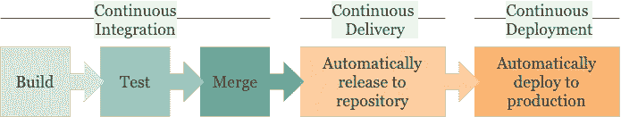

# CI/CD 之路

> 原文：<https://betterprogramming.pub/the-road-to-ci-cd-a6939addd42d>

## 持续集成现在是必要的。这是到达那里的方法

Reza Namdari 在 [Unsplash](https://unsplash.com?utm_source=medium&utm_medium=referral) 上拍摄的照片。

还记得 CI/CD 是开发人员做的事情，因为他们讨厌手工的、重复的工作吗？快进到现在，CI/CD 是行业范围内的最佳实践，是每个 IT 经理的首要任务。

这不是没有原因的，因为 CI/CD 是一个强大的概念，可以帮助团队更快地交付价值，并提高他们产出的质量。但是到底什么是 CI/CD，开始使用它需要什么？

首先我们来看定义:CI 代表持续集成，CD 指持续交付或持续部署。

*   持续集成是以自动化的方式验证软件代码及其相互依赖性的过程。这个过程包括构建、测试和将代码合并到一个中央存储库中，无需任何人工干预。
*   持续交付是将持续集成过程的输出交付到下一个阶段(例如，包存储库或发布平台)的过程。这个过程是自动触发的，但是仍然需要手动批准步骤来执行验证检查或为发布窗口累积一批变更。
*   连续部署通过消除手动批准和自动化发布到生产环境的过程，进一步推进了这一步。

CI/CD 工作流程的不同阶段。作者照片。

尽管目标似乎是达到持续部署的状态，但这并不适合所有的组织、产品和环境。应用程序的复杂性、对外部集成的依赖性，或者组织过程的成熟度可能会有所不同。

让我们更仔细地看一下实施 CI/CD 工作流所需的步骤以及成功实施的先决条件，从管道的配置开始。

# **创建构建管道**

拥有一个构建管道是实现 CI/CD 的第一步。最佳实践是用代码编写这个构建管道，并将其存储在您的存储库中。不要通过用户界面进行配置，因为这很容易出错，并且会阻止以一种隔离和受控的方式在您的构建管道中推出变更。

构建管道应该自动构建功能分支到主分支的每个 pull 请求。基于主干的开发工作流是我最喜欢的工作流之一，它非常适合这个过程，而且没有增加很多复杂性。

根据您的软件应用程序，管道通常从您的代码签出开始，然后是安装依赖项、构建、测试和发布构建工件。根据您的情况，您可以添加不同的步骤，如代码格式检查、静态代码分析或代码覆盖率分析。关键是，这个过程中的所有步骤都必须完全自动化，因为这些步骤每天都要执行多次。

每个步骤的持续时间也需要优化，因为没有人喜欢在合并拉请求之前等待管道完成。为了保持管道执行的时间限制，一些团队决定每晚执行长期运行的集成测试，并且只执行管道中最相关的集成测试。

构建管道的输出是一个构建工件。这个工件应该在 CI/CD 设置的后续步骤中使用，因为这个工件已经过测试和验证。只构建一次，并通过管道提升结果。

# **合并到主**

拉请求是软件开发工作流中最常见的方法之一，用于确保代码质量和验证已实现的更改。当您处理一个特性并准备对其进行检查时，您可以创建一个拉取请求。这将触发构建管道并运行所有必要的自动检查。

接下来，一个或多个开发人员应该手动检查您的代码，验证更改是否符合预期，并在需要时提供反馈。这创建了对变更的共同理解，也促进了团队内部的知识共享。在执行了所有自动和手动检查之后，拉请求可以与主分支合并。

为了防止你的工作偏离主要分支太多，建议限制你在单独的分支上工作的时间，并尽可能与主要分支保持同步。

当使用基于主干的开发时，主分支应该总是准备好被部署到生产中。然而，当您正在处理一个技术上已经准备好的特性，而不是从业务的角度来看，这可能是一个问题。或者可能特性的一部分已经准备好了，但是它们应该同时发布。要解决这个问题，您可以使用[功能切换](https://en.wikipedia.org/wiki/Feature_toggle)(也称为功能标志)，这是一种通过将代码封装在条件语句中来隐藏、禁用或启用功能的技术。

# **建造并交付**

在合并您的 pull 请求之后，构建管道将再次触发，但是现在还包括打包软件和存储工件的步骤(例如，在包 feed、Docker 注册表中，或者在管道内，准备用于下一阶段)。

您的代码的版本号应该自动增加并在您的代码中注册，这样当您的应用程序在生产中运行时，监控软件就可以准确地知道所使用的构建版本。

# **展开**

部署步骤区分连续交付和连续部署。在连续交付的情况下，软件的发布是封闭的，因为手动批准步骤是必要的。这可能是因为由于使用自动化测试的限制，手工验证是必要的。使用自动化测试来获得足够的代码覆盖率有时会涉及大量的投资，而执行手工测试的人可能很容易找到。这看起来是一个简单的选择，但是我的建议是尽可能争取自动化。从长远来看，这是值得的，因为风险被最小化了(脚本在执行可重复的任务方面比人类好得多)，它创造了增加发布频率的机会，并且减少了发布过程中的交付时间。

当您使用自动化测试获得足够的代码覆盖率时，您可以考虑实现连续部署。然后，您的软件将自动发布到生产环境中，无需人工干预。[金丝雀释放](https://martinfowler.com/bliki/CanaryRelease.html)(指矿工用来向矿井发出有毒气体警告的金丝雀)可以帮助你发现释放的问题。您可以将有限数量的流量(例如 5%)定向到新版本，监控日志，当异常率没有增加时，逐渐将所有其他流量定向到新版本，直到所有用户都到达。至此，老版本可以下线了。

如前所述，[特性切换](https://en.wikipedia.org/wiki/Feature_toggle)在使用持续部署时是必不可少的。CI/CD 工具集的另一个很好的补充是暗启动，这是一个向用户子集发布功能的过程。这为您提供了真实的用户反馈，让您可以在功能发布给所有用户之前测试错误并监控性能。诸如[launch darky](https://launchdarkly.com/)、 [ConfigCat](https://configcat.com/) 和 [Bullet Train](https://bullet-train.io/) 等工具可以帮助您管理和集成这种模式。

# **CI/CD 成功的先决条件**

拥有 CI/CD 工作流并不能保证成功，但它确实有助于提高质量和效率，并缩短产生业务价值的准备时间。作为帮助您开始 CI/CD 之旅的总结，您可以使用以下清单:

*   使用在代码中创建的生成管道。
*   使用适合 CI/CD 的 git 模型(例如[基于主干的开发](https://trunkbaseddevelopment.com))。使用寿命短的分支，并经常与主分支一起更新。
*   通过严格的拉式请求和发放工作流来加强质量。至少有一名外部审查者。自动化代码质量检查，例如测试覆盖率、复杂性、可靠性、技术债务等。自动化代码格式检查，自动化依赖关系、 [OWASP 漏洞](https://en.wikipedia.org/wiki/OWASP)等安全检查。
*   优化构建流水线时间。为工作选择正确的测试，比如单元测试、集成测试、可视化回归测试或者性能测试。当集成测试花费太长时间时，研究在夜间运行它们的选项。此外，尽可能使用并行执行。
*   使用功能切换和可选的黑暗发射。
*   专注于监控和日志记录。

让你入门的 CI/CD 工具的一些例子有 [Azure DevOps](https://azure.microsoft.com/en-us/services/devops) 、 [Jenkins](https://www.jenkins.io/) 、 [Travis CI](https://travis-ci.org/) 、 [CircleCI](https://circleci.com/) 、 [AppVeyor](https://www.appveyor.com/) 和 [GitHub Actions](https://github.com/features/actions) 。

记住:

*   自动化一切(但只是尽可能合理)。
*   持续部署并不适用于所有团队。持续交付可能是下一个最好的事情，取决于你的团队、产品、组织和环境。