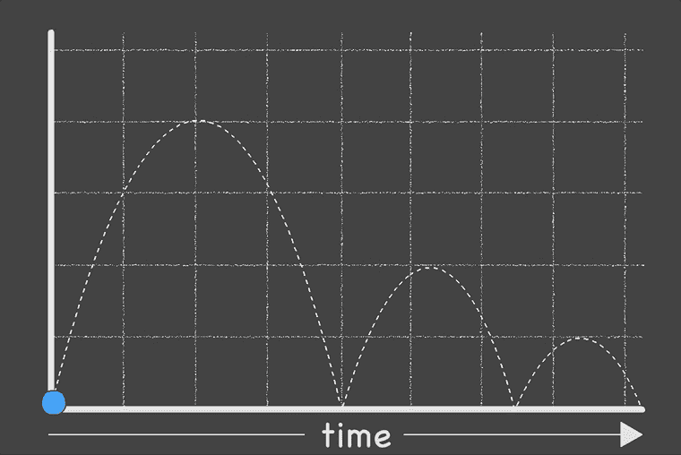
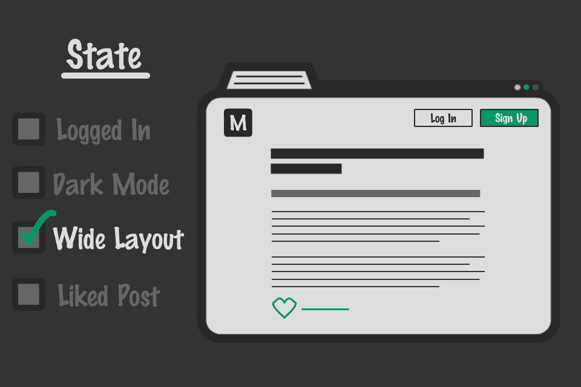

# JavaScript 在现代网络中的角色

> 原文：<https://betterprogramming.pub/the-role-of-javascript-in-the-modern-web-ff0f6961829a>

## JavaScript 如何使网站有状态并支持动态 web 开发

即使你对 web 开发几乎一无所知，你也可能听说过它在某种程度上与一种叫做 JavaScript 的编程语言有关。

你不需要用 T2 的 JavaScript 来制作一个网站，但是没有它，互联网将只是静态的信息页面；没有用户交互，没有动画，并且需要大量页面重载来获取新信息。

这是因为一个网站仅仅由 HTML(超文本标记语言)和 CSS(层叠样式表)组成。HTML 是页面上的内容——文字、按钮、图像等等。—而 CSS 是决定颜色和字体大小的因素。

是的，你没看错。一个网站是 HTML、CSS、**T5 而不是** JavaScript。

那么 JavaScript 从何而来，为什么它对 web 开发如此重要？

JavaScript 用于编写控制 HTML 和 CSS 的程序。HTML 和 CSS 本身是静态不变的——JavaScript 可以让它们变得生动起来！它可以使某些内容块出现或消失，或者它可以使现有的内容块看起来完全不同——在几乎无限数量的其他功能中。

换句话说，JavaScript 支持网站上的交互性，并给网站一种状态感。网站或 web 应用程序的状态决定了它的显示方式以及显示和不显示的内容。

*状态*的概念是构建动态网站最重要的一个方面，所以我们将从这里开始…

# 定义状态

为了介绍**状态**的概念，请允许我从一个思维实验开始…

闭上你的眼睛，想象一个球被抛向空中，落下，然后弹跳两次。你知道它的发射角度和速度，现在你想计算它的当前高度。

随着时间的推移，球在空中飞行的轨迹|动画制作[吉姆·罗廷格](https://medium.com/u/4d76f5fc17a8?source=post_page-----ff0f6961829a--------------------------------)

这是一个简单的物理问题，但是您遗漏了一条重要信息——当前时间戳。不知道过了多少时间能确定高度吗？

不，这是不可能的。时间戳对于确定球飞行的**状态**至关重要。这个决定球的高度的时间概念叫做**有状态。**

正如时间被用来计算球沿其轨迹的高度一样，网站也有状态。这就是网站从静态到拥有与用户互动的动态内容的过程。

> 用户登录了吗？
> 
> 他们是否启用了夜间模式？
> 
> 他们使用的是哪种布局偏好？

这些都是 web 应用程序用来更改其页面内容和外观的常见状态示例。即使是简单的设置也能彻底改变网站的外观。

例如，如果用户已经登录，我们将向他们显示配置文件菜单，而不是登录按钮。如果他们选择了夜间模式，背景将是暗的而不是亮的。

现代网站或应用程序可能有成百上千个这样的小条件，每个条件控制页面上自己的部分内容。

一个网站的状态可以极大地改变它的外观|动画由[吉姆·罗丁格](https://medium.com/u/4d76f5fc17a8?source=post_page-----ff0f6961829a--------------------------------)

上面的动画描述了状态如何改变页面。首先，用户注销并启用了宽布局。他们登录，启用黑暗模式，关闭宽布局，喜欢帖子。最终的结果是相同的网站有着完全不同的外观。

**从状态的角度考虑我们的网站是有用的，因为这使它们变得可预测。如果我们知道所有的状态属性，那么我们就知道了站点在无限数量的状态排列中的当前外观。**

花点时间看看你现在所在的媒体页面——你能在哪里看到状态的例子？作为用户交互如何改变状态的一个例子，试着为这篇文章鼓掌，并观察鼓掌图标如何改变颜色以及鼓掌总数如何增加。这是整个页面的一个小组件中状态的两个例子！

你可能想当然地认为页面不需要重新加载来显示关于你的掌声的新信息。这就是 JavaScript 发挥作用的地方。

# JavaScript 的作用:管理状态和更新用户界面

在这一点上，我们已经了解到现代网站的外观是由其状态决定的，这可能会导致无限的排列。剩下的问题是:什么是管理国家本身？

有一个程序在幕后监听你在网站上的所有动作，并相应地更新状态。这个程序是用网络的通用语言——JavaScript 编写的。

运行在现代网站或 web 应用程序上的 JavaScript 有两个主要职责:

1.  保持用户界面(UI)与状态同步
2.  执行后台工作以从服务器获取信息。

让我们详细看看这些任务。

## 1.保持用户界面与状态同步

网页可能发生的最糟糕的事情之一是 UI 与 JavaScript 程序的状态或服务器上的信息不同步(稍后将详细介绍)。

例如，想象一个网站的设置页面，它有许多用于各种设置的复选框。如果你仔细检查并选择了你所有的设置，却发现它们并没有全部保存下来，这是多么令人沮丧啊。如果 UI 的状态领先于 JavaScript 的状态，这样的事情很容易发生。

web 开发人员有责任设计一个好的程序来防止任何不同步问题的发生。一个现代化的网站必须能够响应和处理用户的所有操作，并保持用户界面的速度。

## 2.执行后台任务以从服务器获取信息

最后一个问题是:*媒体世界的其他人如何知道你为这个职位鼓掌？*

当你输入一个网址并收到一个网页时，你看到的是你所在网站的服务器发送给你的一份文件。您可以查看文档并与之进行交互，但是您对文档所做的任何更改只会反映在您自己的浏览器中，不会保留到服务器上的资源中。

为了更新服务器上的信息，必须向服务器发出额外的请求或消息。这都是由管理 UI 状态的同一个 JavaScript 程序促成的。通常，这些请求与 UI 上的交互联系在一起。例如，当您单击此页面上的“鼓掌”按钮时，可能会发生以下步骤:

1.  JavaScript 监听鼓掌按钮上的点击。
2.  单击按钮时，会向服务器发送一条消息来更新页面上的图标。
3.  服务器用新的总鼓掌次数和你自己鼓掌的次数来响应。
4.  用户界面更新了新的总鼓掌次数，并突出显示了手按钮，表明您已经亲自为帖子鼓掌。

可能还会发生更多的事情，但是这个概述会让您对 JavaScript 如何与服务器交互有所了解。

**底线是 JavaScript 可以与网站的服务器交互，发送和接收信息以实时更新 UI。它不需要像早期网络那样重新加载页面来获取新信息。这可能是导致现代网络的最重要的演变，在你的浏览器上运行成熟的应用程序。**

# 包扎

这篇文章是对 JavaScript 如何在浏览器中工作的一个非常高层次的概述。我在解释它是如何工作的时候做了一些改动，但是我相信我已经准确地表达了所有的信息。从这篇文章中得到的最重要的信息是如何看待网站的状态。这样做会让你成为一个更好的网络开发者！

# 脚注

1.  是的，我意识到人们只用 CSS 做了一些疯狂的事情，比如[构建一个全功能的聊天应用](https://github.com/kkuchta/css-only-chat)，但这不是它的预期用途。
2.  现代的 JavaScript 框架如 [React](https://reactjs.org/) 首先被用来生成 HTML，但这并不能改变最终结果只是由 JS 控制的 HMTL+CSS 的事实。