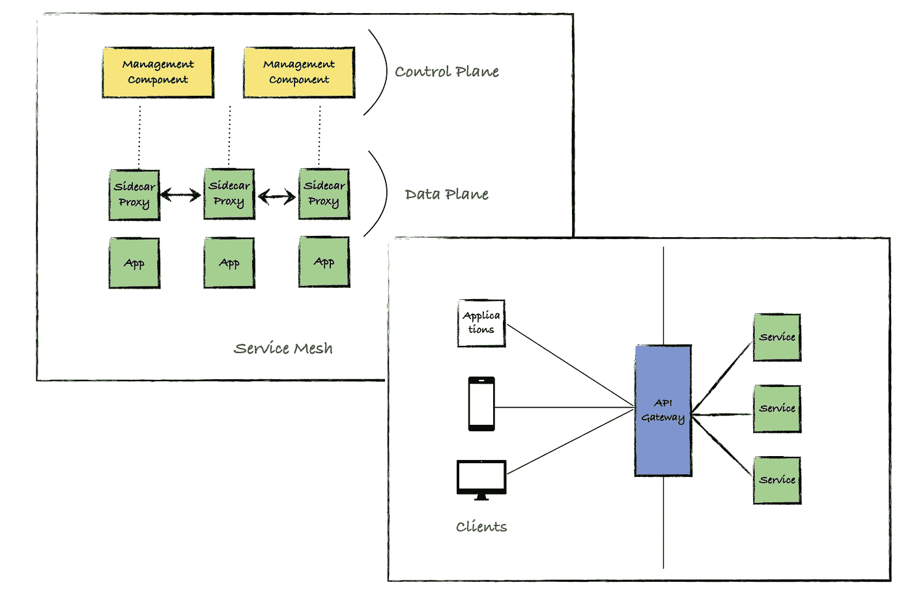
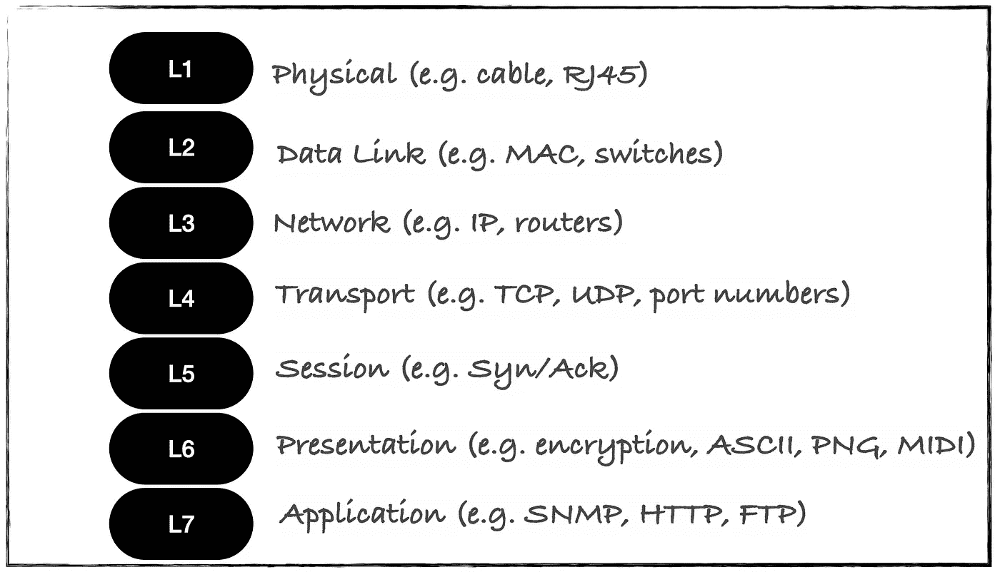
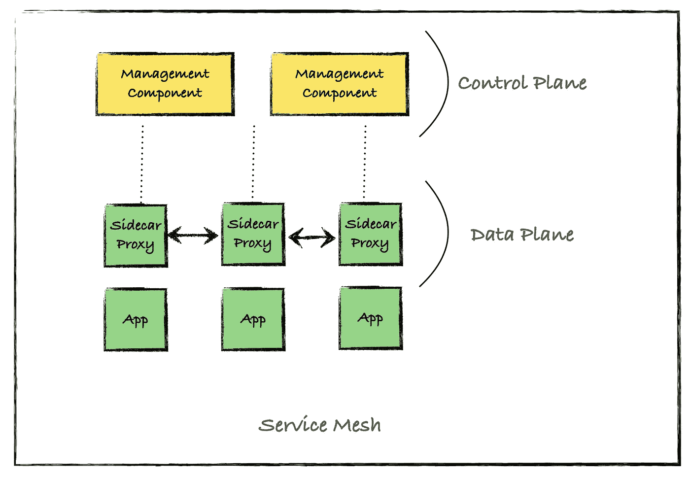
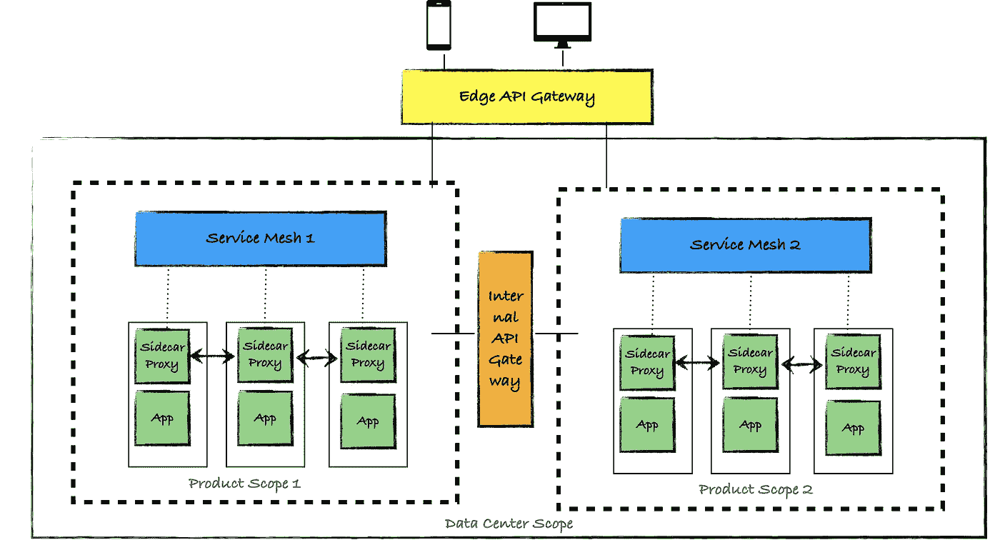

# 服务网格和 API 网关在微服务架构中的作用

> 原文：<https://betterprogramming.pub/the-roles-of-service-mesh-and-api-gateways-in-microservice-architecture-f6e7dfd61043>

## 以及如何充分利用这两者



图片来源:作者

如果您对微服务感兴趣，那么您可能会多次听说这两个术语。人们经常混淆这两者。在本文中，我将详细讨论*服务网格*和 *API 网关*，并讨论何时使用什么。

# 网络层刷新程序

在深入研究服务网格和 API 网关之前，让我们回顾一下网络层。以下是 OSI 网络层模型:



图片来源:作者

复习的原因是我们将在接下来的章节中讨论其中的一些层。

# 服务网格

一个*服务网格*是一种在分布式软件系统中管理服务到服务通信的技术。服务网格管理东西类型的网络通信。 [*东西向流量*](https://en.wikipedia.org/wiki/East-west_traffic) 表示数据中心、Kubernetes 集群或分布式系统内部的流量。

服务网格由两个重要组件组成:

*   制导机
*   数据平面

驻留在应用旁边的代理被称为*数据平面*，而协调代理行为的管理组件被称为*控制平面。*



服务网-图片来源:作者

服务网格允许您将应用程序的业务逻辑从网络、可靠性、安全性和可观察性中分离出来。

## 网络和流量管理

服务网格允许您执行动态服务发现。sidecar 代理可以帮助您进行负载平衡和速率限制。它可以帮助您进行流量分割，以执行 A/B 类型的测试，这对于 canary 版本很有帮助。

## 可观察性和可靠性

服务网格支持分布式跟踪，这有助于您进行高级监控(请求数量、成功率和响应延迟)和调试。它甚至能够利用服务对服务的通信来更好地理解通信。

因为服务网格提供健康检查、重试、超时和电路中断，所以它提高了应用程序的基线可靠性。

## 安全性

服务网格允许服务之间的相互 TLS，这有助于提高服务到服务通信的安全性。您还可以实现访问控制列表(ACL)作为安全策略。

一个真正的服务网格/边车代理支持广泛的服务并实现 L4/L7 流量策略。

市场上有许多可用的服务网格。以下是其中的一些:

*   [Istio](https://istio.io/)
*   [Linkerd](https://linkerd.io/)
*   [库马](https://kuma.io/)
*   [领事](https://www.consul.io/)

您可以在互联网上找到许多文章，比较上面列出的服务网格。

# API 网关

API 网关充当集群、数据中心或一组分布式服务的单一入口点。在网络拓扑中，它通常被称为 [*南北交通*](https://en.wikipedia.org/wiki/North-south_traffic) *。*通常，移动客户端属于这种类型的网络流量。

人们也很有可能最终使用 API 网关在部署在同一个数据中心的两个产品之间进行通信。在这种情况下，流量类型可以是东西向。

API 网关接收来自客户端的调用，并将这些调用路由到适当的服务。在这样做的同时，它还可以翻译协议。


图片来源:作者

使用 API 网关有很多好处:

*   **抽象:**API 网关可以抽象底层微服务的复杂性，并为客户端创建统一的体验
*   **认证:**API 网关可以负责认证，并将令牌信息传递给服务
*   **流量控制:**API 网关可以限制入站和出站 API 流量
*   **API 监控/货币化:**如果您计划将 API 货币化，API 网关可以通过提供监控客户端 API 请求/响应的功能来帮助您实现这一点
*   **转换:**API 网关可以帮助翻译/转换 API 请求/响应。它还可以帮助协议翻译。

API 网关通常只关注 L7 策略。

## API 网关的类型

从部署的角度来看，API 网关有两种使用方式:

*   内部 API 网关:充当一组服务或产品范围的网关
*   **Edge API 网关:**充当外部组织的消费者或移动客户端的网关

市场上有许多可用的 API 网关。以下是其中的一些:

*   [顶点](https://cloud.google.com/apigee)
*   [孔关口](https://konghq.com/kong/)
*   [NGINX 的 API 网关](https://www.nginx.com/solutions/api-management-gateway/)
*   [软件公司的 API 网关](https://www.softwareag.com/en_corporate/platform/integration-apis/api-management.html)

# 什么时候用什么

既然你知道什么是服务网格和 API 网关，让我们试着理解什么时候使用什么。

## 何时使用服务网格

*   当您需要在同一产品范围内实现具有安全性和监控的 L4/L7 服务通信时
*   当您可以为每个服务实例及其副本部署 sidecar 代理时
*   当服务可以共享同一个 CA 证书以建立安全通信时(这可能无法跨各种产品实现)

## 何时使用 API 网关

*   当您需要跨各种产品实现具有安全性和监控的 L7 服务通信时
*   当你想把 API 作为一个产品公开，无论有没有货币化
*   当您想为开发人员提供 API 全生命周期管理时
*   当您需要翻译服务通信协议时

# 服务网格和 API 网关一起

服务网格和 API 网关很有可能共存。下图展示了共存的服务网格和 API 网关场景:



服务网格和 API 网关—图片来源:作者

上图展示了对于一个产品范围，您可以实现一个服务网格(东西向流量)。当需要跨产品通信时，可以使用内部 API 网关(东西向流量)。当边缘的客户端需要与服务通信时，可以使用边缘 API 网关(南北流量)。

```
Hey, if you enjoyed this story, check out [Medium Membership](https://deshpandetanmay.medium.com/membership)! Just $5/month!*Your membership fee directly supports me and other writers you read. You’ll also get full access to every story on Medium.*
```