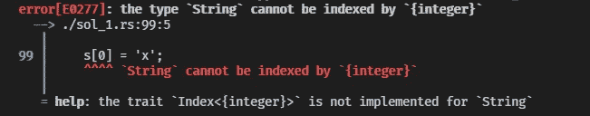
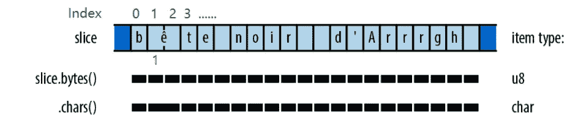
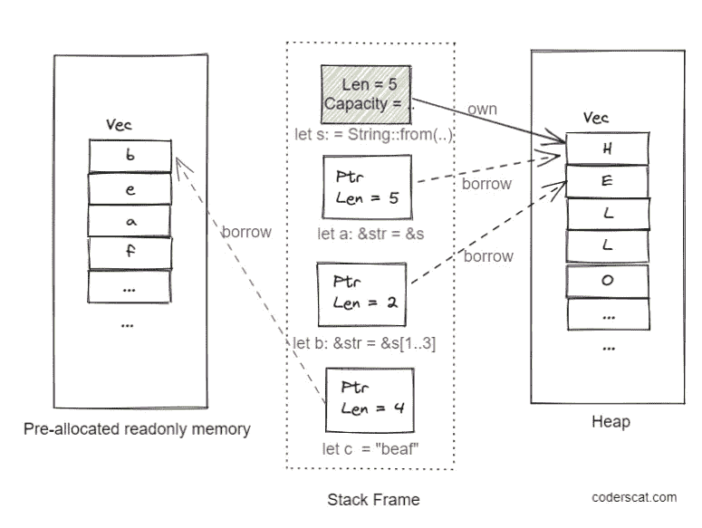
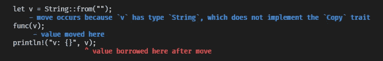

# 安全防锈字符串类型

> 原文：<https://betterprogramming.pub/the-safe-rust-string-types-688fcc8d5df1>

## 知道 String 和&str 如何工作

mit 耶尔德勒姆@ Unsplash

当你开始学习用 Rust 编程时，可能你的第一个挫折是来自不同类型字符串的编译错误。

Rust 的字符串设计不同于大多数只有单一字符串类型的编程语言。Unicode 安全的字符串设计和独特的所有权机制使得 Rust 中的`String`对初学者来说是违反直觉的。

但是不要害怕！

实际上，字符串数据结构比大多数程序员认为的更复杂。而 Rust 关注的是安全性，所以编译器会在你编码的时候告诉你潜在的字符串问题。最好在开发阶段保持安全，否则您可能会在调试之夜迷失方向。

所以，让我们来深入了解一下《铁锈》中的`String`。

# 什么是字符串

在 Rust 中，`String`仅仅是`**u8**`的一个向量。我们可以在[源代码](https://github.com/rust-lang/rust/blob/master/library/alloc/src/string.rs)中找到它的定义。

`String`类型由 Rust 的标准库提供，它的大小是可增长的，是一个堆分配的可变字符串类型。当`String`变量超出范围时，缓冲区将自动释放。

我们可以用几种方法创建一个`String`:

Rust 的字符和字符串类型是围绕 Unicode 设计的。`String`不是 ASCII 字符序列，而是 Unicode 字符序列。Rust `char`类型是保存 Unicode 代码的 32 位值。`String`使用 [UTF-8](https://en.wikipedia.org/wiki/UTF-8) 将 Unicode 字符编码成 vec:

而`.len()`方法将返回以字节计量的长度，而不是以字符计量的长度。

最不自然的字符串是与`indexing`相关的操作。例如，你不能仅仅使用`s[i]`从一个字符串中获取`i-th`单独的字符。Rust 字符串不支持索引。

为什么？

因为 UTF-8 是一种可变宽度的编码格式，所以字符串中的每个 ASCII 字符都存储在一个字节中，而其他字符可能会占用多个字节。因此，在这种格式中，对字符串字节的索引并不总是与有效的 Unicode 标量值相关联。

对于包含 ASCII 字符和非 ASCII 字符的字符串，`**s[1]**`表示无效值。

来源:编程 Rust

相反，我们需要用迭代器访问字符。

但是，如果您知道您的字符串全部是 ASCII 字符，您可以使用非恐慌版本的`get`和`get_mut`在 O(1)时间内访问或修改字符串的一部分。`get_mut`将返回一个`&mut str`，但是它仍然非常严格——`&mut str`上唯一可用的操作是`make_ascii_uppercase`和`make_ascii_lowercase`，它们就地修改文本，并且只影响单字节字符。

如果您想更自由地修改一个`String`中的特定字节，您需要将它转换成一个`mut vec<u8>`:

好了，关于`String`我们已经说了很多了。请记住，Rust 中的字符串保证是有效的 UTF-8——如果您感到困惑，请更加熟悉`String` API。 [UTF-8 无处不在](https://utf8everywhere.org/)是你了解 Rust 为什么选择 UTF-8 作为编码格式的最佳资源。

# 什么是`&str`

另一方面，`str`也称为`string slice`，是编译器的基本类型。我们通常以借用的形式使用:`&str`。

本质上，编译器把它当作一个`fat pointer`，这意味着:`&str`由两部分组成:一个指向某些字节的指针和一个长度。
我们可以用`as_ptr()`的方法得到指针，用`len()`的方法得到长度。

# 字符串和&str

`String`和`&str`的关系就像 C++里的`std::string`和`char*`:

*   一个 Rust `String`就像一个`std::string`——它拥有内存并做着管理内存的脏活。
*   Rust `&str`就像一个`char*`(但是有长度)——它用`std::string`的内容向我们指出一个块的开始。

为什么`&str`需要存储长度，这是因为我们可以用使用`&str`来指向`String`的特定部分的指针。让我们看一个例子:

对应的示意图是这样的:

按作者

# 弦还是`&str`？

我们如何根据场景选择使用哪种类型？

有两条规则要遵循:

*   当你需要拥有内存时，使用`String`。例如，你在一个函数中创建了一个字符串，需要返回它。
*   当您想要对一个`String`变量(或者代码中的一个字符串)的不可变引用时，请使用`&str`。

记住，当你把它作为参数传递给一个函数时，Rust 将跟随`String`的`move`:

该程序将报告以下错误消息:

这是因为`v`被移到了函数`func`中，我们不能再在 main 的范围内读取它了。检查者遵循 Rust 所有权的规则。Rust 有一个超级强大的功能，叫做*解除强制*，允许它将任何`&String`变成`&str`。

所以，当你在设计一个只需要以只读方式访问字符串的 API 时，`&str`是最好的选择。

但是当你需要修改一个`String`的内容时，你却无法通过一个`&mut str`，你可能认为这是合理的。`&mut str`确实存在，但是用处不大，因为*一个切片不能重新分配它的引用对象*。当你需要修改一个字符串的内容时，你需要把`&mut String`作为参数传递，就像上面的`set_char_inplace`例子。

在`struct`的场景中，大多数情况下，你需要拥有字符串，所以`String`几乎总是比`&str`更好的选择。如果你想在`struct`中使用`&str`作为属性，你需要处理寿命问题。

# 其他类似绳子的东西

除了以上两种字符串，Rust 还提供了其他类字符串类型用于特殊场景。请查阅参考资料，以下是我们可以遵循的一些通用规则:

*   对于 Unicode 文本，坚持使用`String`和`&str`。
*   当处理文件名时，使用`std::path::PathBuf`和`&Path`代替。
*   当处理非 UTF-8 编码的二进制数据时，使用`Vec<u8>`和`&[u8]`代替。
*   当使用操作系统提供的本机形式的环境变量名和命令行参数时，使用`OsString`和`&OsStr`。
*   当与使用空终止字符串的 C 库交互时，使用`std::ffi::CString`和`&CStr`。

**加入我的** [**邮件列表**](http://codercat.substack.com/) **获取更多有用的见解，这是免费的！**