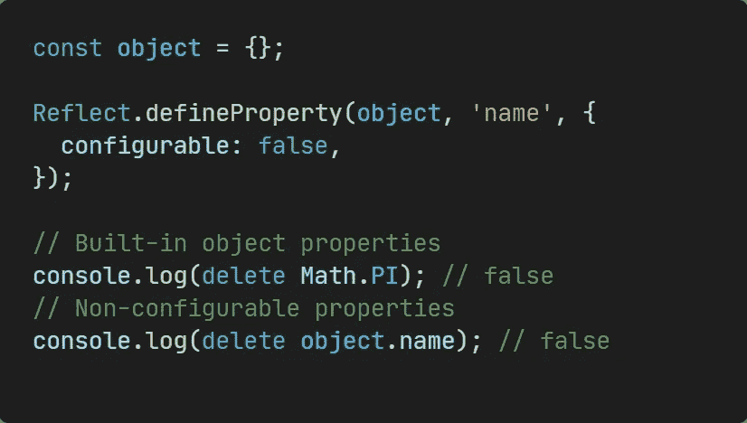
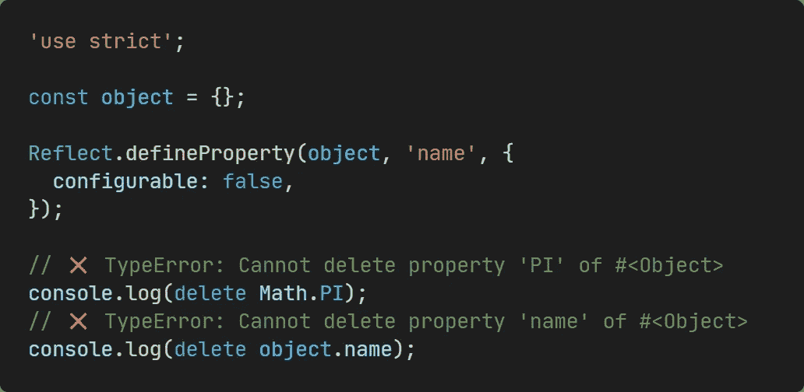
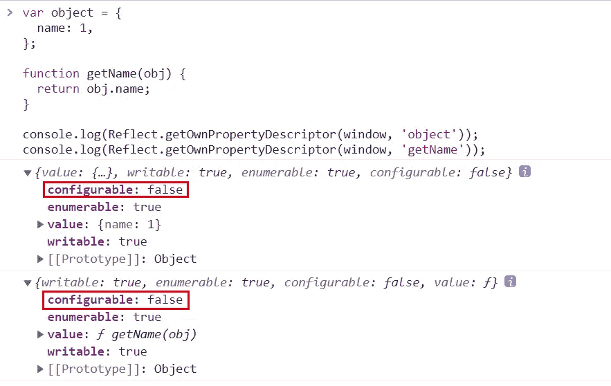
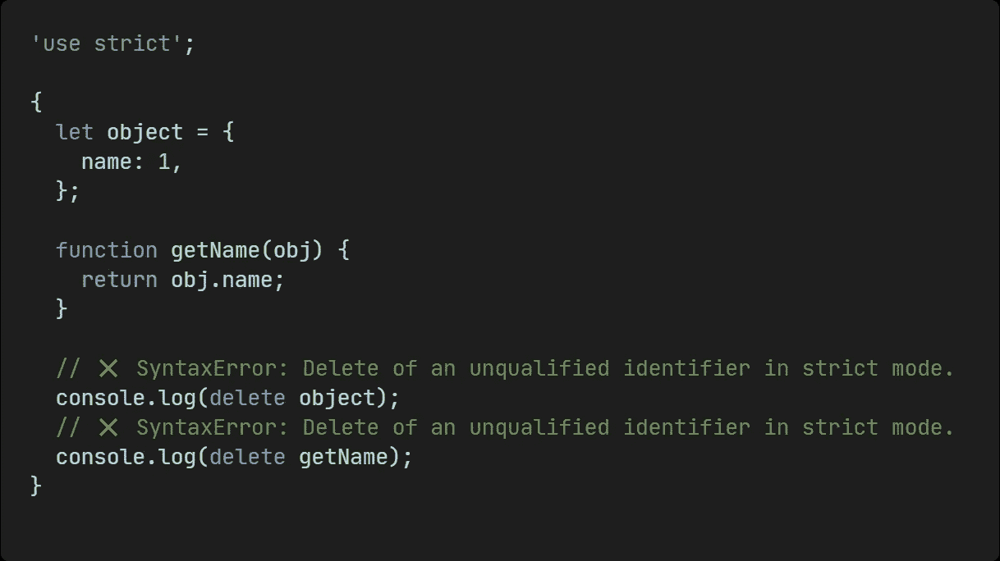
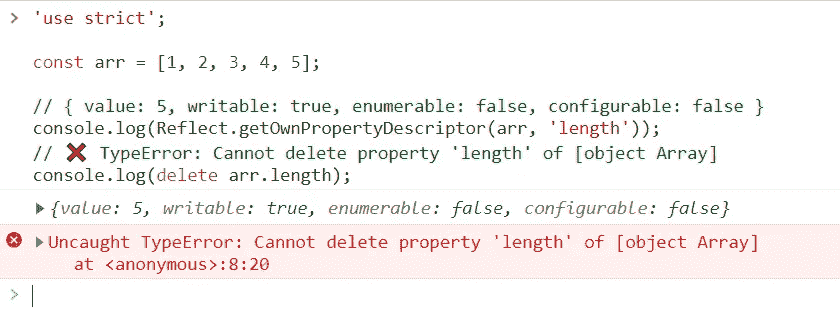
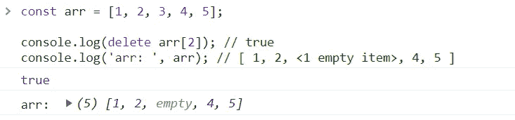

# “删除操作符”的秘密

> 原文：<https://betterprogramming.pub/the-secret-of-the-delete-operator-ab793997d89f>

## JavaScript 中到底什么是可析构的？


删除操作符可以说是 JavaScript 的一个古老的语言特性。顾名思义，它想摧毁什么东西，但究竟能摧毁什么呢？来和我一起探索吧！

# 删除 0

执行 delete 0 时，是否会从 0 开始从执行系统中销毁？

> 显然不是，**它的真正目的是删除一个对象的属性引用。**

```
**delete object.property
delete object['property']**
```

一般删除成功会返回 true，失败会返回 false，但也有一些例外。

# 拥有财产

删除操作符只作用于它自己的属性。如果原型链上有一个同名的属性，这个属性将被跳过。


```
Object.prototype.name = 1;const object = {
  name: 2,
};**// Only valid for its own properties.
console.log(delete object.name); // true
console.log(object.name); // 1****// But we can directly manipulate the prototype object.
console.log(delete Object.getPrototypeOf(object).name); // true
console.log(object.name); // undefined**
```

# 不存在的财产

如果删除的属性不存在，delete 将不起作用，但仍将返回 true。

```
const object = {};delete object.name; // true
```

# 不可配置的属性

无法删除不可配置的属性。



```
const object = {};Reflect.defineProperty(object, 'name', {
  configurable: false,
});**// Built-in object properties
console.log(delete Math.PI); // false
// Non-configurable properties
console.log(delete object.name); // false**
```

在非严格模式下，移除自身的不可配置属性将返回 false，但在严格模式下，将引发 TypeError。



```
'use strict';const object = {};Reflect.defineProperty(object, 'name', {
  configurable: false,
});// ❌ TypeError: Cannot delete property 'PI' of #<Object>
console.log(delete Math.PI);
// ❌ TypeError: Cannot delete property 'name' of #<Object>
console.log(delete object.name);
```

# 由 var，let，const 声明的属性

在全局范围内，既不能删除用 var 声明的属性，也不能删除用函数声明(非函数表达式)声明的函数。这是因为两个声明的属性都安装在窗口上并且是不可配置的，所以删除时将遵循前一项的逻辑。



此外，不能删除用 var、let、const 和这些函数声明的属性，无论是在全局范围内还是在函数范围内。

```
**{**
  let object = {
    name: 1,
  }; function getName(obj) {
    return obj.name;
  } console.log(delete object); // false
  console.log(delete getName); // false
**}**
```

在非严格模式下，返回 false，**但在严格模式下，抛出的是 SyntaxError 而不是 TypeError。**



```
'use strict';**{**
  let object = {
    name: 1,
  }; function getName(obj) {
    return obj.name;
  } // ❌ SyntaxError: Delete of an unqualified identifier in strict mode.
  console.log(delete object);
  // ❌ SyntaxError: Delete of an unqualified identifier in strict mode.
  console.log(delete getName);
**}**
```

# 数组属性

首先，数组的 length 属性是不可配置的，所以在严格模式下删除它会抛出一个 **TypeError** 。



```
'use strict';const arr = [1, 2, 3, 4, 5];console.log(Reflect.getOwnPropertyDescriptor(arr, 'length'));
// ❌ TypeError: Cannot delete property 'length' of [object Array]
console.log(delete arr.length);
```

另外，当删除一个数组元素时，被删除的项将是空的。



如果要修改原数组，可以使用`Array.prototype.splice()`，[详见我之前的文章。](https://javascript.plainenglish.io/interviewer-please-tell-me-the-difference-between-slice-splice-and-split-5a6617692395)

# 结论

JavaScript 中“删除操作符”的真正目的是删除对象的属性引用。在某些特殊情况下，它会表现得很奇怪，所以最好只使用它来删除对象本身存在的可配置属性。

除此之外，请注意‘删除操作符’与直接释放内存无关(与 C++ 中的 [delete 相比)，这是因为 JavaScript 的运行时环境自动管理内存。有关编程语言内存管理的更多信息，请查看我以前的文章:](https://docs.microsoft.com/en-us/cpp/cpp/delete-operator-cpp?view=msvc-170&viewFallbackFrom=vs-2019)

[](https://towardsdatascience.com/memory-management-every-developer-should-know-4f4911d8268b) [## 每个开发人员都应该知道的内存管理

### 这可能是你最不能错过的编程知识

towardsdatascience.com](https://towardsdatascience.com/memory-management-every-developer-should-know-4f4911d8268b) 

今天到此为止。我是 Zachary，我将继续输出与 web 开发相关的故事，如果你喜欢这样的故事，别忘了关注我。