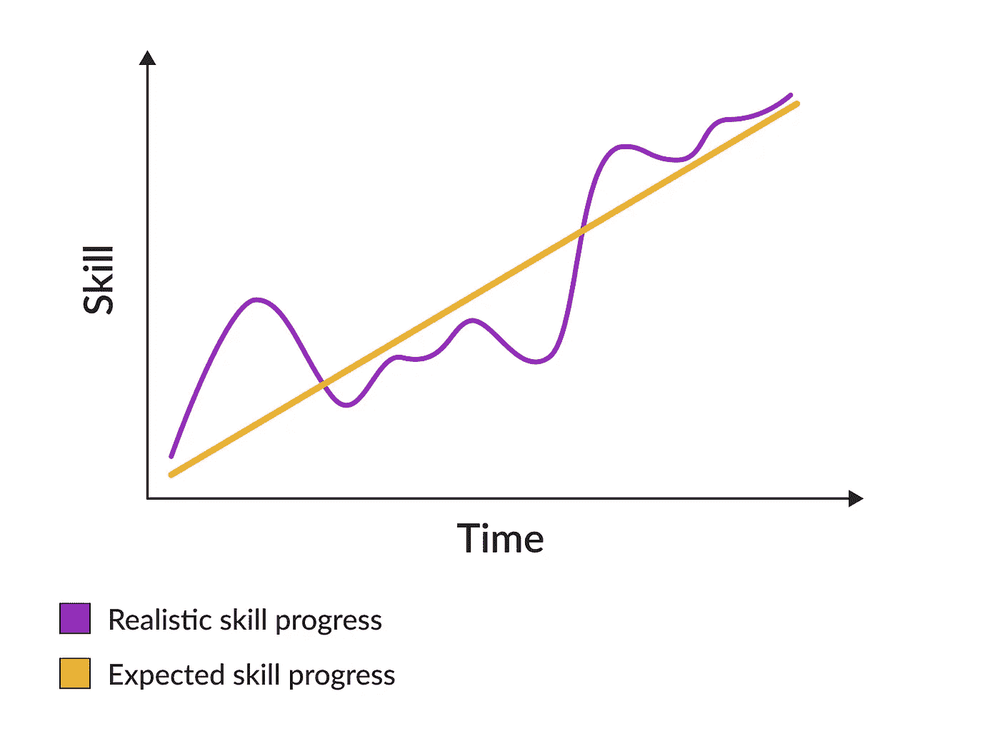

# 学习全职编程的秘方

> 原文：<https://betterprogramming.pub/the-secret-sauce-for-learning-to-code-full-time-60294a7eb0ac>

## 自学编码很难，这里有一些小技巧可以让它变得容易一些

希瑟·福特在 [Unsplash](https://unsplash.com/s/photos/sauce?utm_source=unsplash&utm_medium=referral&utm_content=creditCopyText) 上拍摄的照片

学习全职编程是许多人的梦想。我们中只有少数人能花得起几个月的时间进行长期的新兵训练营或独自学习。

我是幸运者之一。当我辞职的时候，除了学习编码，我没有别的事可做。我成了全职学习者。

太令人激动了。但我很快意识到，看似理想的环境带来了许多我没有预料到的挑战和挫折。幸运的是，我设法克服了它们。现在我会帮你避免我犯的同样的错误。

这是我学习全职编程的秘方。

# 建立一个常规

当你什么都不用做的时候，你会惊讶于时间过得有多快。刚开始学的时候，我经常发现，早上 8 点到下午 2 点之间，我学的刚好一两个小时。太多的事情在争夺我的注意力，所以我无法集中注意力。

另一个障碍是我经常拖延。我以为第二天或者周末可以补上。毕竟，如果我花四天时间学习五个小时，或者花两天时间学习十个小时，应该不会有什么不同。但确实如此。进步不在乎平均水平。要看规律性。

就像你想掌握一项运动一样，想一想学习编码。你不可能一周刻苦训练一次就成为职业运动员。而且你不可能一周学一次就成为专业的软件开发人员。

战胜拖延症和明智地利用时间的最有效的方法是建立一个常规，养成一个编程习惯。制定精确的学习计划。决定你要花多少时间学习，什么时候学习。准备好你的设置，这样你就不会分心——关掉你的手机，有一个干净的工作空间。尽你所能只专注于学习。

合理对待你的计划。不是每个人都能每天学习 6-8 小时。当我试图了解这么多时，我感到精疲力竭。对我来说，学习 4-5 个小时是一个甜蜜点——我可以进步很快，并有一些时间休息和放松。

你也应该这样做——根据你的喜好定制你的计划，记住学习编码是一场马拉松，而不是短跑。

# 抱有现实的期望

当我开始的时候，我期望在 6 个月内找到一份工作。我最坏的情况是 12 个月。过了这段时间，我就会没钱了，不得不回到以前的工作岗位。

最后，我在 11 个月后找到了 q 工作，当时我已经在放弃并考虑以前行业的工作机会。

事后看来，在 11 个月内改变整个职业生涯听起来很合理，甚至很快。但是当我在学习的时候，它看起来像是一个永恒。我在 Twitter 和 LinkedIn 上看到了很多成功的故事，人们在 3 个月内成功改变生活的故事。一年后，他们已经被提升了一两次。

现在我知道我的期望是愚蠢的。问题是人们是不同的。我们学习的方式不同，拥有不同的技能、习惯和环境。有人可能会在三个月后找到第一份工作，但这并不意味着你会去做。事实上，一个人学了两年却没有转行，并不意味着你会和他一样的命运。网络上充满了伟大的成功故事。但真正的学习经历要复杂得多，也不可预测。

现实的学习期望有另一个方面。当你开始学习的时候，你希望自己能逐渐提高。你开始什么都不知道，然后一步一步地积累知识，这似乎是合理的。不幸的是，这不是真的。我们的学习过程不是线性的；你经常会发现，一周前事情还很简单，但现在你却在苦苦挣扎。

玛格达·瓦克斯伯格拍摄的图片

你必须为小的(有时是大的)挫折做好准备，以避免气馁。重要的不是你目前的技能水平，而是长期的上升轨迹。

# 慢慢来

学习编码时，最糟糕的事情之一就是过于雄心勃勃。您对应用程序有一个很好的想法，并且您想现在就实现它。几周之后，复杂性让你不知所措，你开始怀疑自己是否足够聪明，能够成为一名程序员。

你就是，你只是想贪多嚼不烂。

为了进步，你需要理解编程是困难的。不要指望一夜之间就能成就大事。你需要在学习中一步一步来，只有当你采取了许多这些步骤，才能解决更具挑战性的问题。

比如想学 web 前端开发，尽量从简单开始。只用 HTML 元素创建一个网站——完全不用 CSS。有一个图像的简单页面或有一些输入的页面。查看页面在不同浏览器中的外观，以及 HTML 元素的语义含义。

当你对 HTML 感到满意时，开始尝试 CSS。重新创建一些简单的网站，谷歌主页就是一个很好的例子。以后你可以转向更复杂但仍然可以处理的事情。博客很适合实践，因为它们有相对简单的布局。

使用 CSS 几个星期后，你可能会感到无聊，并寻找一些挑战。这就是用 JavaScript 为你的网站添加交互性的时候了。

总是一次只走一步。忽略除了你将要采取的步骤之外的一切。随着时间的推移，尝试建立越来越复杂的网站。

# 一次做一件事

如果我要找出成功的学习者和失败的学习者之间的区别，我会选择一个焦点。每当我集中注意力，知道该走哪条路时，我的效率就会提高，我的心情也会改善。当我失去注意力时，进程停止了，焦虑袭来。

编程是一个广阔的领域。你可以向太空发射火箭，建立神经网络，创建网站，或者编写软件来运行冰箱。可能性是无穷的。但是你的时间不是，你得挑一个你感兴趣的，找工作几率最高的。

刚开始做代码的时候，我尝试学习 C++、Python、Django、Flask。我在这些上花了差不多半年的时间，因为我不知道我想学什么；我只是想找一份软件开发的工作。

这不是一个好方法；你需要换一种方式来思考——决定你想做什么，并学习它。

我挑了前端，再也不回头。我专注于 HTML、CSS 和 jQuery(这在当时是件大事)。四个月后，我收到了两份工作邀请。

专注于一件事拯救了我的编程生涯。