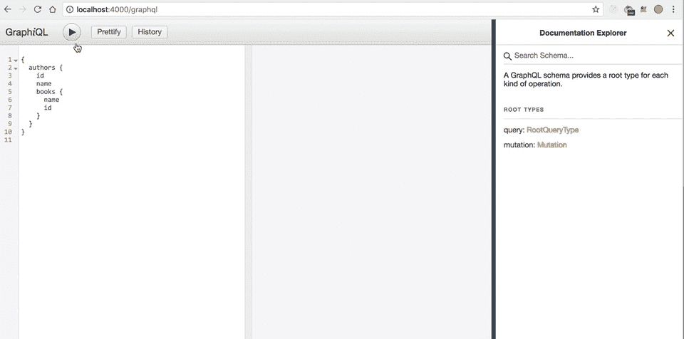
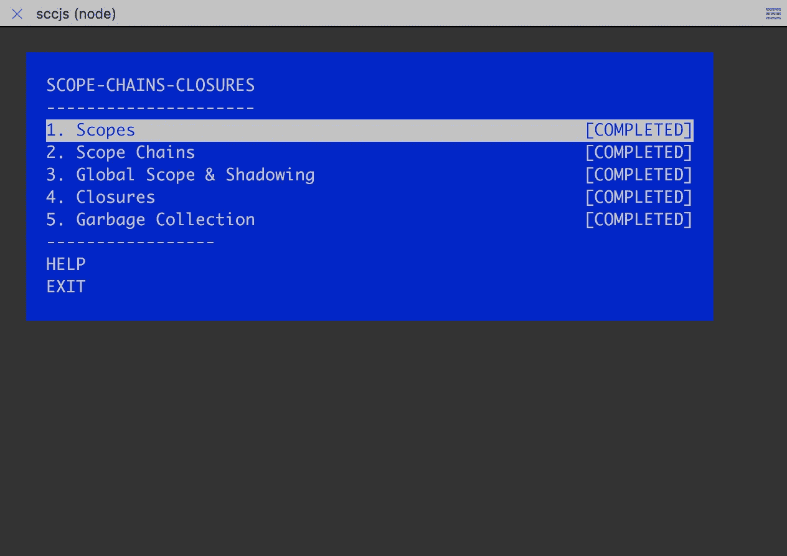
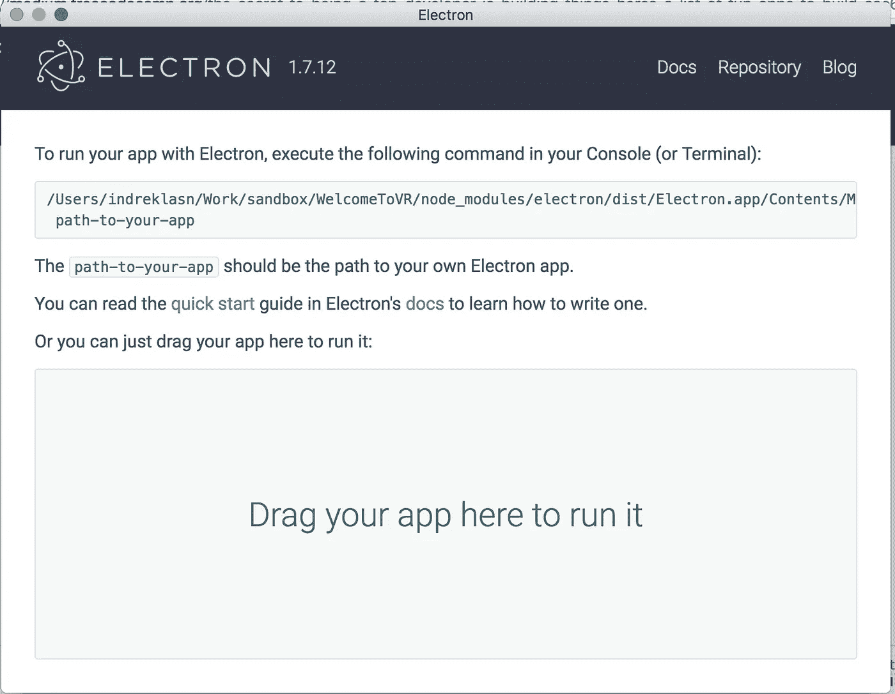
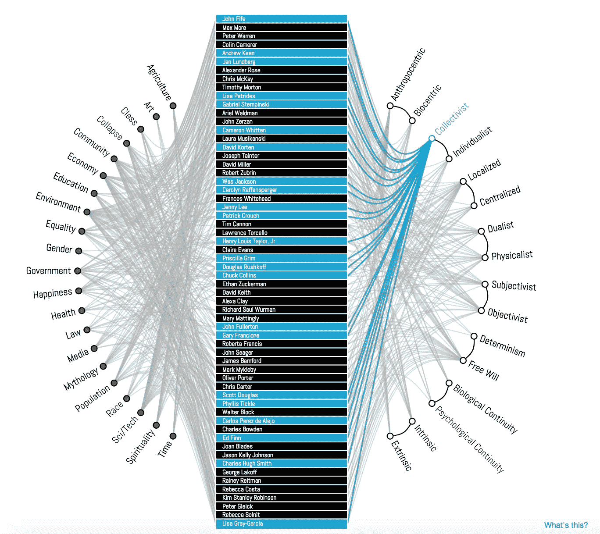
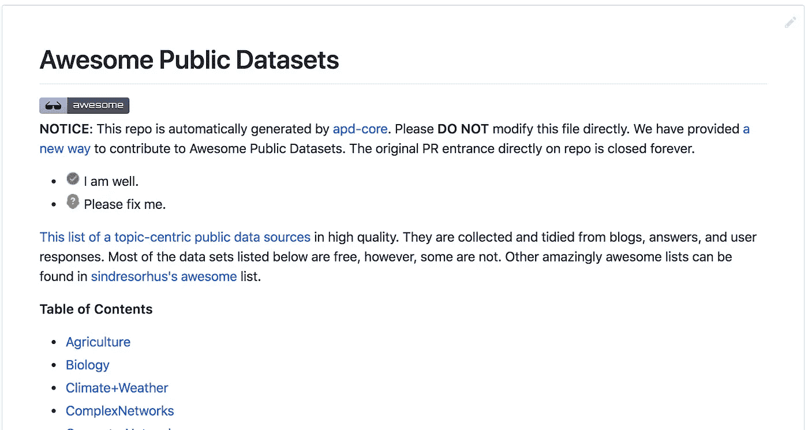

# 想成为顶级开发者？你应该建造东西。这是另一个让你开始的列表

> 原文：<https://betterprogramming.pub/the-secret-to-being-a-top-developer-is-building-things-d3d058e4e472>

## 一些具有挑战性但有趣的想法

墙上一个明亮的蓝色霓虹灯写着“更加努力地工作”，作者是[乔丹·怀特菲尔德](https://unsplash.com/@whitfieldjordan?utm_source=medium&utm_medium=referral)在 [Unsplash](https://unsplash.com?utm_source=medium&utm_medium=referral)

*由于高需求，我正在扩展有趣应用的列表。*

[**下面是最初的帖子**](https://medium.freecodecamp.org/the-secret-to-being-a-top-developer-is-building-things-heres-a-list-of-fun-apps-to-build-aac61ac0736c) **。欢迎在评论或 Twitter 上发布你的申请。**

每个人都知道，技能是通过努力加上激情获得的。为了擅长某事，一个人必须付出努力。

好事不容易。如果很难，那就值得去做。我们大多数人都对编码感兴趣，但经常缺乏想法。请允许我提出一些具有挑战性但有趣的想法。

[成为媒介会员直接支持我的工作](https://trevorlasn.medium.com/membership)。你也可以在媒体上看到所有的故事。提前感谢！

事不宜迟，让我们开始吧！

# 项目# 1:[graph QL](https://graphql.org/)powered node . js 后端

GraphQL 和 graph QL 前端

GraphQL 彻底改变了我们发送和接收数据的方式。绝对值得你花时间去看看。

## 规格:

*   用 MongoDB 和 graphQL 设置一个 Node.js express 服务器。
*   能够创建、读取、更新、删除 ***(CRUD)*** 数据。
*   从简单的前端获取数据。

下面是我写的关于这个主题的详细教程，请欣赏:

 [## 如何用 Nodejs、GraphQL、MongoDB、哈比神和 Swagger 建立一个强大的 API

### 将前端和后端分开有很多好处:

medium.freecodecamp.org](https://medium.freecodecamp.org/how-to-setup-a-powerful-api-with-nodejs-graphql-mongodb-hapi-and-swagger-e251ac189649) 

## Node，React 和 GraphQL 从零到英雄教程。

# 项目#2:终端应用

[范围-链-闭合终端应用](https://github.com/workshopper/scope-chains-closures)

终端应用程序就是运行在终端内部的应用程序。

尝试从小处着手，创建一个在终端上运行的简单应用程序。终端应用程序背后的机制非常简单:你给出一些输入，然后得到输出 *(I/O)*

## 一些非常简单的开始想法:

*   询问用户的姓名并输出结果。
*   显示一些简单的数学方程，让用户输入方程的值。

这里有一个很棒的学习 JavaScript 终端应用的汇总列表。

# 项目#3: [电子](https://electronjs.org/)桌面应用

[Electron](https://electronjs.org/) 让你用 HTML、CSS 和 JavaScript 等 web 技术构建本地桌面应用程序。

一些最知名的电子应用有: [**Visual studio code**](https://code.visualstudio.com/) ，**[**Atom**](https://atom.io/)， [**Slack**](https://slack.com/) 和[**webtorrent . io**](https://webtorrent.io/)**

**再说一次，从小处着手，然后在此基础上进行构建。例如，启动您的电子应用程序，创建一个输入，并将输出显示到您的终端。如果你熟悉网络开发，电子将是非常传统的。**

# **项目 4: Instagram 克隆**

****

**Instagram 是一个令人费解的应用程序，重新构建它会教会你很多东西。通过构建 Instagram，您将学到的一些亮点是:**

*   **复杂的网格管理(尝试使用新的 CSS 网格来获得额外的效果)**
*   **调用多个 API 端点/数据流管理(尝试使用 GraphQL)**
*   **交付可扩展的真实应用程序的能力。**

**你可以随意使用任何你认为合适的技术。**

**[Instagram 很好心的给我们提供了他们的 API。](https://www.instagram.com/developer/)**

# **项目#5:用 [D3.js](https://d3js.org/) 进行数据可视化**

****

**复杂数据可视化示例— [来源](http://www.findtheconversation.com/concept-map/)**

**[D3](https://d3js.org/) 代表数据驱动文档。D3 是迄今为止使用最多的图表库。不过，这不是唯一的选择——还有几个，比如 [ChartJS](https://www.chartjs.org/) 和 [plotly。JS](https://plot.ly/javascript/) 。**

**这个真的让我很兴奋。让我们用 [D3.js](https://d3js.org/) 可视化一个数据集—从下面的链接中选择任意一个数据集:**

**由免费使用的公共数据集组成的令人敬畏的 GitHub 知识库。**

** [## awesome data/awesome-公共数据集

### HQ 开放数据集的主题列表。公关☛☛☛.通过以下方式为 awesomedata/awesome 公共数据集开发做出贡献…

github.com](https://github.com/awesomedata/awesome-public-datasets) **

**了解我最新内容的最好方式是通过我的[时事通讯](https://wholesomedev.substack.com/welcome)。成为第一个得到通知的人。**

****

**我的[简讯](https://wholesomedev.substack.com/welcome)。成为第一个得到通知的人。**