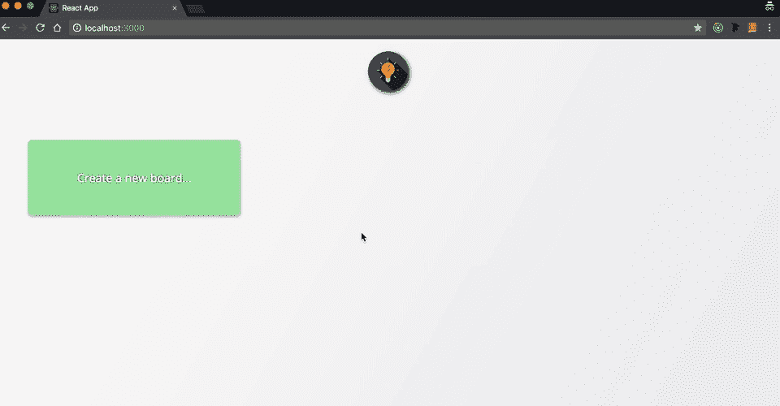
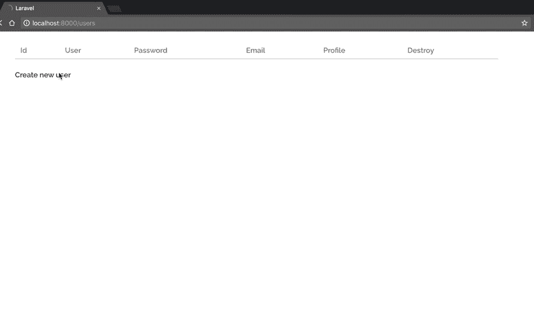
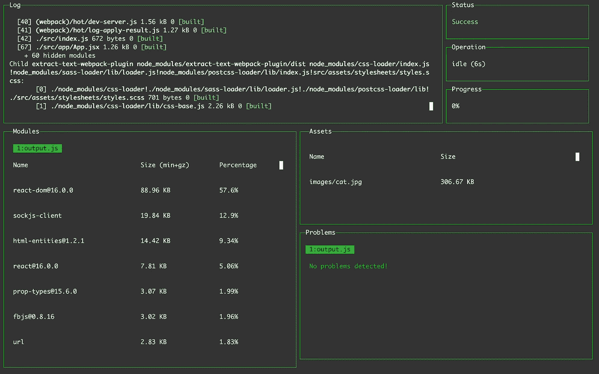
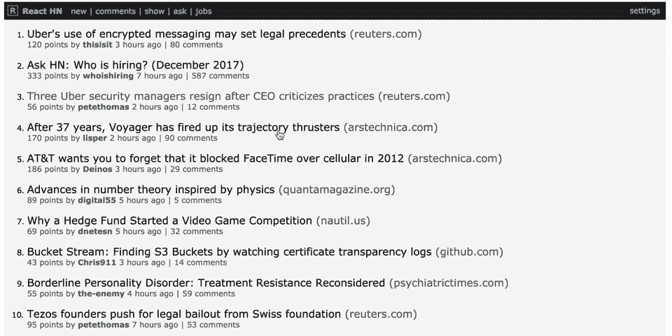
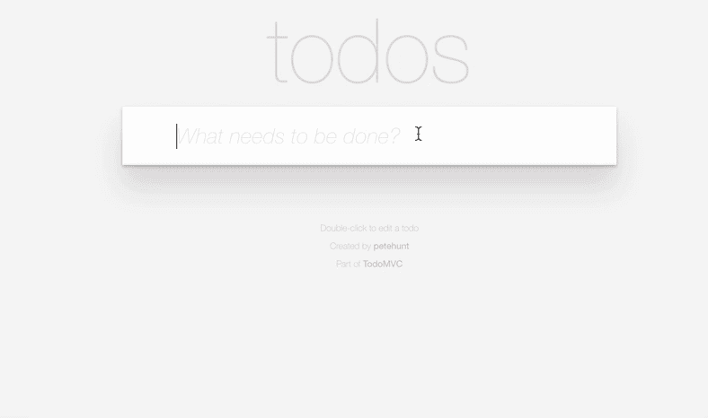
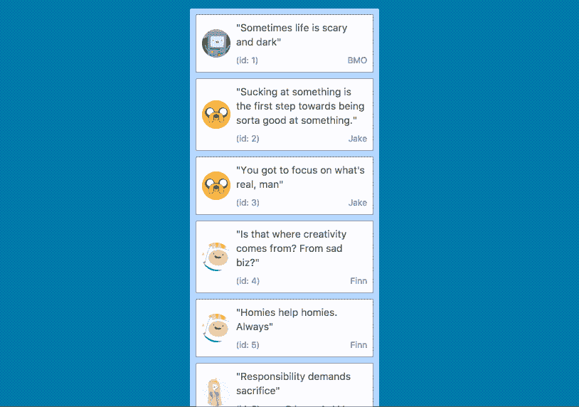
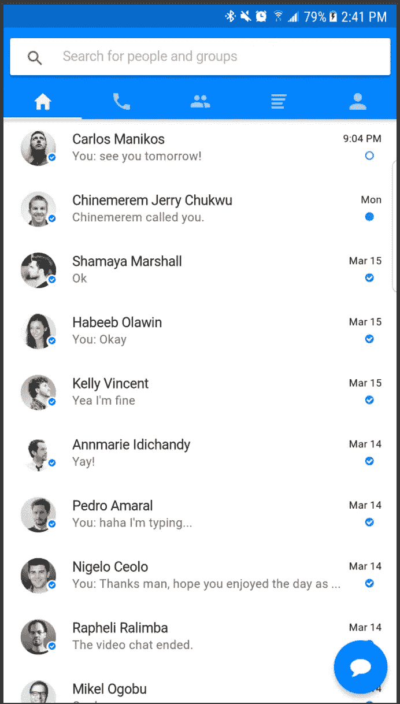

# 成为顶级开发人员的秘诀是构建东西！这里有一个有趣的应用程序列表！

> 原文：<https://betterprogramming.pub/the-secret-to-being-a-top-developer-is-building-things-heres-a-list-of-fun-apps-to-build-aac61ac0736c>

只有你愿意付出努力，你才能成为一名伟大的开发人员。想象一下。你不可能通过阅读大量关于健身的文章来变得身体健康。你真的需要去健身房，投入时间和汗水！同样的概念也适用于代码。

这里有八个神奇的项目来训练你的编码肌肉。我们的目标是用您喜欢的任何技术堆栈来构建每个应用程序。保持无冲突，想用什么就用什么！

[成为媒介会员直接支持我的工作](https://trevorlasn.medium.com/membership)。提前感谢！

# 项目 1。特雷罗克隆

*特雷罗克隆由因德雷克·拉斯恩—* [*试玩链接*](https://simple-trello.vercel.app)

你将从建造一个[特雷罗](https://trello.com/en)克隆体中学到什么:

*   路由。
*   拖放。
*   创建新对象(公告板、列表、卡片)。
*   处理输入和验证。
*   客户端路径:如何使用本地存储，将数据保存到本地存储，以及从本地存储读取数据。
*   服务器端路径:如何使用数据库，将数据保存到数据库，以及从数据库中读取数据。

[这里是示例存储库](https://github.com/wesharehoodies/simple-trello)——使用 [React](https://reactjs.org/) 和 [Redux](https://redux.js.org/) 创建。

 [## indreklasn/simple-trello

### 📋。在 GitHub 上创建一个帐户，为 indreklasn/simple-trello 开发做贡献。

github.com](https://github.com/indreklasn/simple-trello) 

# 项目 2。用户管理仪表板

[Github 库](https://github.com/wesharehoodies/laravel-5.4-crud-example)

简单的 CRUD 应用程序，非常适合基础。您将学到的内容:

*   创建用户和管理用户。
*   与数据库交互—创建、读取、编辑和删除用户。
*   输入验证以及如何使用表单。

# 项目 3。加密货币追踪器(原生移动应用)

[Github 知识库](https://github.com/wesharehoodies/react-native-redux-crypto-tracker)

*有*要做原生 app——[Swift](https://developer.apple.com/swift/)、 [Objective-C](https://developer.apple.com/library/archive/documentation/Cocoa/Conceptual/ProgrammingWithObjectiveC/Introduction/Introduction.html) 、 [React Native](https://facebook.github.io/react-native/) 、 [Java](https://www.java.com/) 、 [Kotlin](https://kotlinlang.org/) 都可以。

您将学到的内容:

*   本机应用程序如何工作。
*   从 API 获取数据。
*   本机布局如何工作。
*   如何使用移动模拟器？

[使用这个 API](https://coinmarketcap.com/api/) 。如果你找到更好的，请在评论中发表。

如果你对这是如何建立的感兴趣，我为它写了一个教程。

# 项目 4。从头开始设置您自己的 Webpack 配置

嗯，从技术上来说，这不是一个应用程序，但它仍然非常有助于理解 [webpack](https://webpack.js.org/) 如何在引擎盖下工作。它将不再是一个“黑匣子”，而是你腰带下的强大工具。

要求 **:**

*   将 es7 编译成 es5(基础)。
*   编译。jsx 到。js，或者，。vue to。js(您将了解装载机)。
*   webpack 开发服务器的设置和热模块重装。(vue-cli 和 create-react-app 两者都用。)
*   制作一个生产就绪的构建，并使用 [Heroku](https://www.heroku.com/) 、 [now.sh](https://now.sh/) 或 [GitHub](https://github.com/) 页面进行部署。(您将学习如何部署 webpack 项目。)
*   设置你最喜欢的预处理器编译成普通 CSS——SCSS、 [Less](http://lesscss.org/) 、 [Stylus](http://stylus-lang.com/) 。
*   了解如何在 webpack 中使用图像和 SVG。

这里有一个[非常好的资源，可以帮助绝对的初学者开始](https://codeburst.io/easy-guide-for-webpack-2-0-from-scratch-fe508a3ce44e)。

# 项目 5。黑客新闻克隆

每个人都有自己的黑客新闻版本——我们也不例外。

您将学到以下内容:

*   与黑客新闻 API 交互。
*   创建单页应用程序。
*   如何实现功能，例如查看评论、单个评论和个人资料。
*   路由。

这里是黑客新闻 [API 文档](https://github.com/HackerNews/API)。

# 项目 6。待办事项应用

[TodoMVC](http://todomvc.com/examples/react/#/)

真的吗？一个待办 app？已经有多少了？是的——我知道。但是请听我说完——它们如此受欢迎是有原因的。

待办事项应用程序是确保你学习基础知识的好方法。尝试用普通的 JavaScript 构建它，然后用您最喜欢的框架/库构建它。

你将学到什么

*   创建新任务。
*   验证字段。
*   过滤任务(已完成、活动、全部)。使用`filter`和`reduce`功能。
*   理解 JavaScript 的基础知识。

# 项目 7。可排序的拖放列表

[Github 库](https://github.com/atlassian/react-beautiful-dnd)

了解[拖拽 API](https://developer.mozilla.org/en-US/docs/Web/API/HTML_Drag_and_Drop_API) 非常有用。如果你能够创建复杂的应用程序，它会让你真正脱颖而出。

您将学到的内容:

*   拖放 API。
*   创建丰富的用户界面。

# 项目 8。Messenger 克隆(本机应用程序)

了解原生应用和 web 应用的工作原理会让你脱颖而出。

您将学到的内容:

*   Web 套接字(即时消息)。
*   本机应用程序如何工作。
*   布局如何在本机中工作。
*   本机应用程序的路由。

# 结论

[**P.S:寻找更多编码思路？永远不要耗尽编码的想法，永远不要。在这里访问我提出的一系列前端挑战。**](https://gumroad.com/l/IuqKc)

这些应该能让你忙上一两个月，挑个东西，然后直接建起来！如果你需要一点动力来开始，这里有一个关于“[如何作为一名开发人员保持动力](https://medium.com/@indreklasn/how-to-stay-motivated-as-a-developer-810ca49ae287?source=post_page---------------------------)”的指南。

 [## 2020 年编程趋势预测

### 预测 2020 年将出现哪些编程技术

medium.com](https://medium.com/better-programming/2020-programming-trend-predictions-a5d6b70bec26) 

哦，如果你想了解最新消息，我的 [**时事通讯**](https://wholesomedev.substack.com/welcome) 是一个极好的资源。

感谢阅读！❤