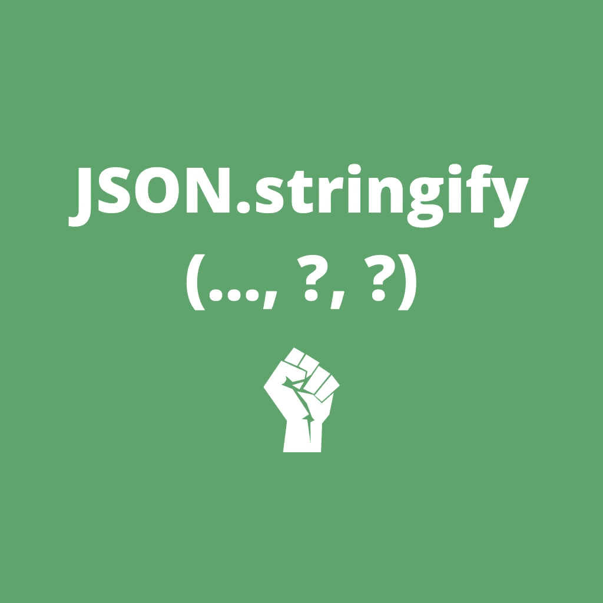

# JSON.stringify()的秘密

> 原文：<https://betterprogramming.pub/the-secrets-of-json-stringify-cf592f53b0f0>

## 知道何时使用第二个和第三个参数

如果你是一个 Javascript 开发者，你可能每天都在使用`JSON.stringify()`。通常，您会将一个对象作为第一个参数放入`JSON.stringify()`中，瞧，您得到了想要的 JSON 字符串。但是生活并不总是那么容易。有时你需要转换一个对象，这就是这个函数的下一个参数派上用场的地方。

在这篇文章中，你将得到你需要知道的关于如何以及何时应该使用`JSON.stringify()`的第二个和第三个论点的一切，这样你可以在某些情况下让你的生活变得更容易。

# 基本用法

`JSON.stringify()`用于将 Javascript 对象转换为 JSON 字符串。

但是，有时有些属性不容易解析为 JSON 字符串。我们说的主要是`Map`、`WeakMap`、`Set`、`WeakSet`、`Error`。看看这个例子:

我们的集合在 JSON 中产生一个空对象！

另一件事是，有时您可能想省略对象的一些属性，或者在转换成 JSON 之前转换它们。

这就是第二个论点发挥作用的地方。

# 第二个参数

`JSON.stingify()`的第二个参数叫做 replacer。它用于省略一些属性或转换它们(替换)。你可以在那里提供一个**数组**或者一个**函数**。

## 排列

当您只想将属性子集转换成 JSON 时，数组是您最好的朋友。用法非常简单:

在 JSON 中，您将只看到数组中列出的属性(`name` 和`age`)。其他的就省略了(`password`)。

## 功能

当您想要将特定转换应用到对象属性或根据自定义规则对其进行过滤时，function 参数非常有用。最好在例子上解释一下:

在给定的 transformer 函数中，我们做了两件事:

1.  将`Set`转换为一个值数组，因此`uniqueSnacksEatenToday`在结果 JSON 中不再为空。
2.  根据 if 语句中的规则，用文本替换`age`。

> 为什么使用第二个参数来转换对象，当你可以用转换创建一个新的对象，然后把它发送给`JSON.stringify()`？
> 答案很简单——这完全是出于表演的原因。使用 transformer 函数时，您不需要创建一个新对象，也不需要多次迭代旧对象。处理哪些小对象并不重要，但是当对象很大时，性能提升可能是值得的。

# 第三个论点

第三个参数用于定义 JSON 内部的间距。参数可以是一个**数字**或一个**字符串**。

> 我没有看到它的很多用例，但是你永远不知道在你的生活中你需要解决什么问题，也许这些信息会拯救你！或者你可以在书呆子聚会上炫耀。

## 数字

如果第三个参数是数字，则结果字符串的空格数将等于所提供的数字:

当显示带有`console.log()`的对象时，这很有用，因为间距增加了可读性。

**注意:**最高债券是 10 英镑，高于 10 英镑的债券将被削减至 10 英镑。

## 线

String 作为第三个参数用于将空格转换为自定义字符。您提供的字符串将用作 JSON 中的空格:

为什么会有人需要这个？不知道。

# 最终注释

知道一些你可以用像`Json.stringify()`这样众所周知的函数做的小把戏是很有用的。这是让你成为更有知识的 Javascript 开发者的一小步。你拥有的工具越多，解决问题的独特方法就越多。但就我个人而言，我只是喜欢探索 JS 世界的无限可能。