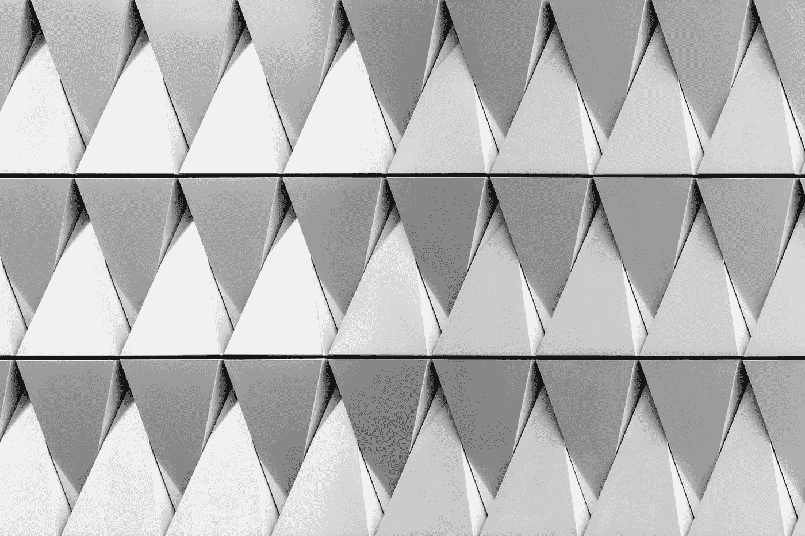
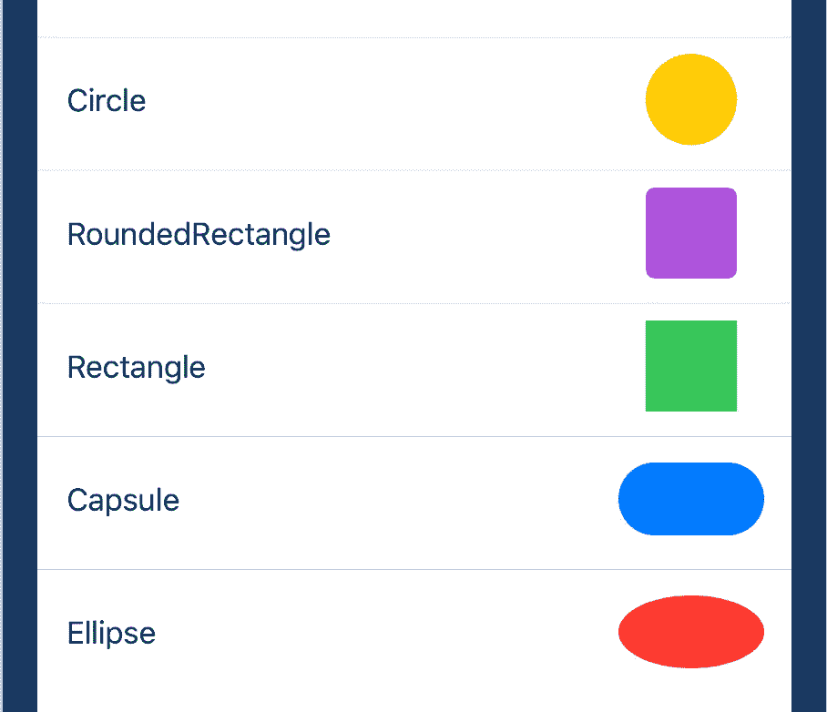
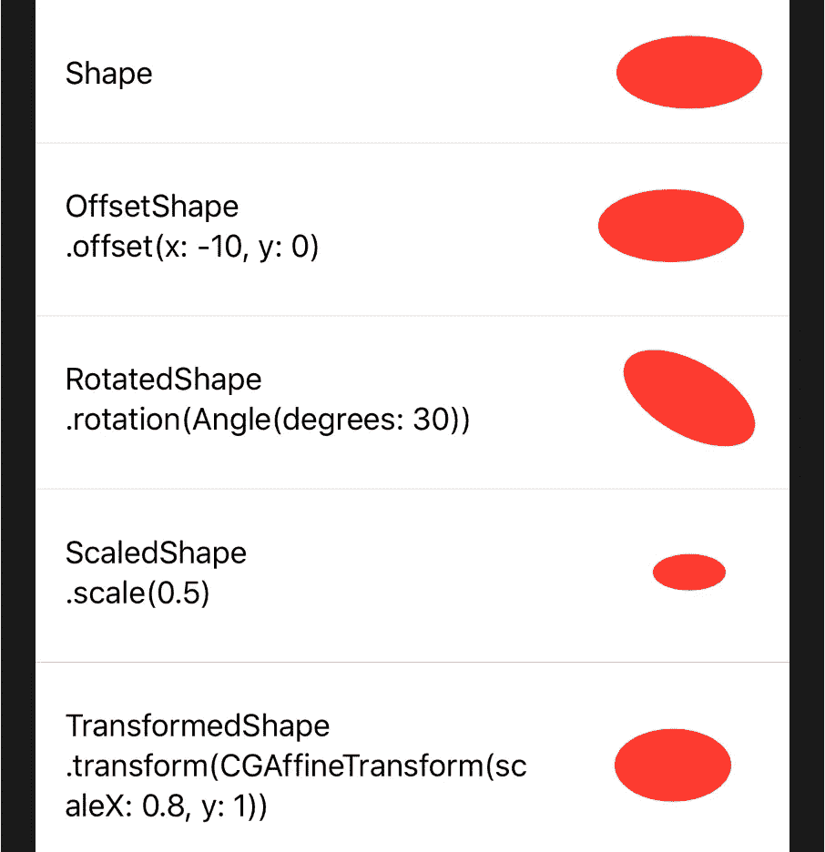
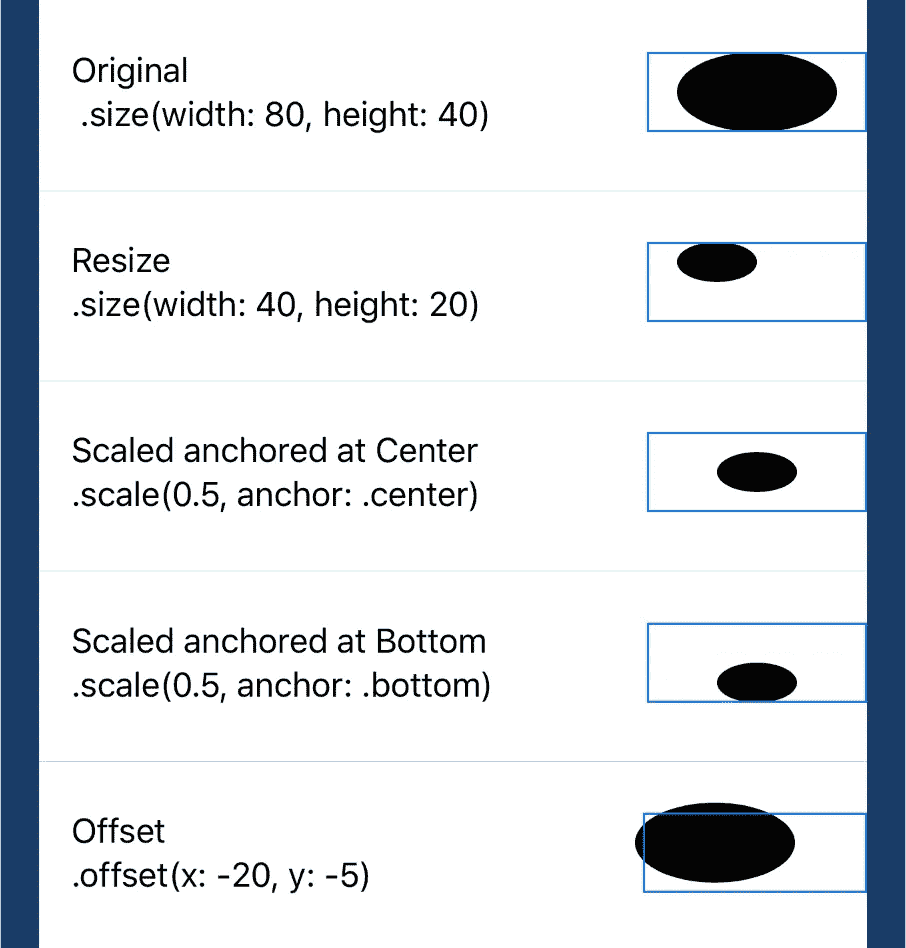
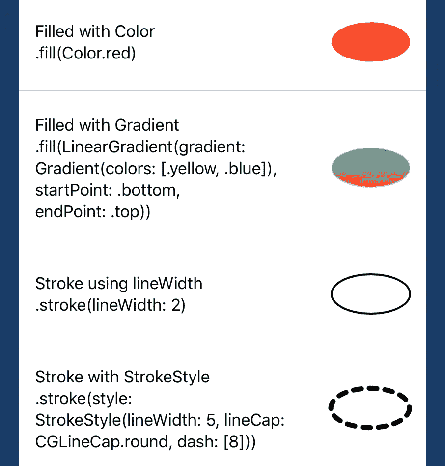
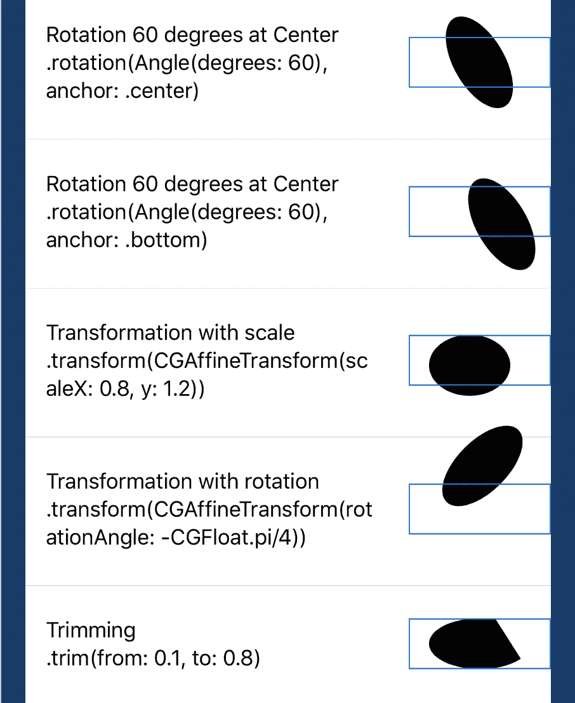
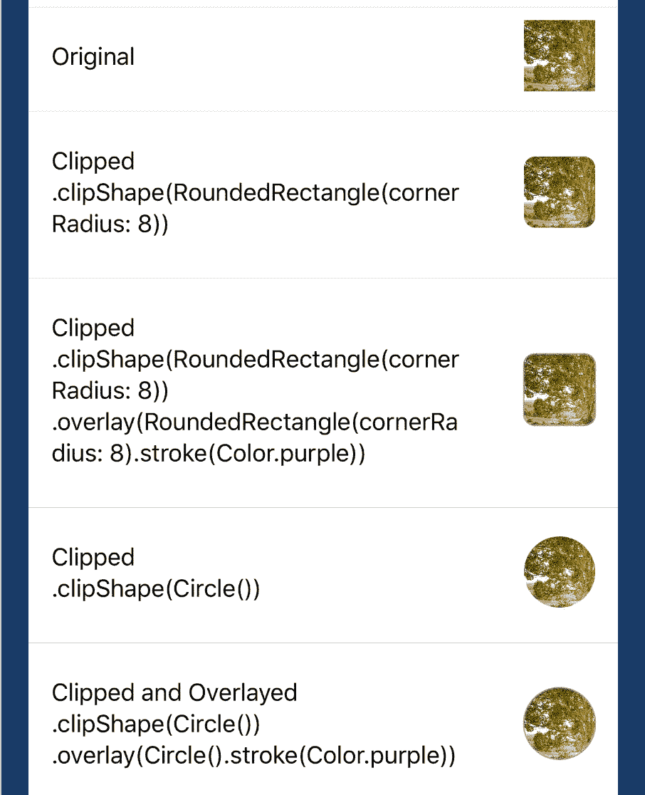
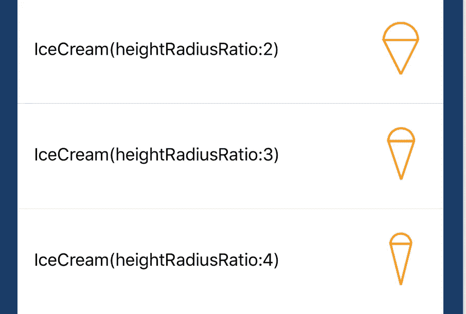

# SwiftUI 中的形状协议和自定义形状

> 原文：<https://betterprogramming.pub/the-shape-protocol-and-custom-shapes-in-swiftui-1e562efd0e79>

## 了解什么是形状协议以及如何在 SwiftUI 中创建自己的形状

由[paweczerwiński](https://unsplash.com/@pawel_czerwinski?utm_source=unsplash&utm_medium=referral&utm_content=creditCopyText)在 [Unsplash](https://unsplash.com/s/photos/shape?utm_source=unsplash&utm_medium=referral&utm_content=creditCopyText) 上拍摄的照片

# 介绍

多年来，在许多应用程序中，用户的缩略图显示为圆形图像或圆角矩形图像是一种趋势。在 UIKit 框架中，当我们使用`UIImageView`时，我们可以设置图像视图底层的`cornerRadius`来产生所需的缩略图。

然而，随着 SwiftUI 框架的流行，我们发现`UIImageView`不是 SwiftUI 框架的一部分。我们可能会想，如果没有`UIImageView`，我们如何能把我们的图像做成想要的形状。

在这篇文章中，我将向您展示如何在 SwiftUI 中创建自定义形状，这些形状可用于设置图像的轮廓形状。在我们深入研究之前，让我们先回顾一下 SwiftUI 的`Shape`协议是什么。

# 形状协议

`Shape`协议是作为 SwiftUI 框架的一部分引入的。在[官方文件](https://developer.apple.com/documentation/swiftui/shape)中是这样定义的:

> "绘制视图时可以使用的 2D 形状."

`Shape`协议提供了创建各种二维图形所需的一系列功能，这些图形可用于配置视图。

上面的定义和简要的解释可能过于概念性，难以理解。不要担心，因为我敢打赌，通过阅读本文的剩余部分，您将对这个协议及其用法有更好的理解。

## 内置形状

我们先来看看 SwiftUI 框架中的内置形状。如下图所示，SwiftUI 框架有`Circle`、`RoundedRectangle`、`Rectangle`、`Capsule`和`Ellipse`形状。这些形状的名称清楚地表明了它们是什么。

SwiftUI 中的基本形状

除了这些形状之外，通过应用各种变换函数(例如，偏移、旋转)，可以生成一些也符合`Shape`协议的变换形状。以一个`Ellipse`形状为起点，下图显示了`OffsetShape`、`RotatedShape`、`ScaledShape`和`TransformedShape`的例子。值得注意的是，这些形状是通用类型，其具体形状类型基于原始形状。比如一个`Ellipse`形状会产生一个`OffsetShape<Ellipse>`，而一个`Rectangle`形状会产生一个`OffsetShape<Rectganle>`。

每行的第二行显示了相应的函数，该函数修改原始椭圆以生成右侧显示的变换后的形状。

SwiftUI 中的变形形状

## 常用功能

对于给定的形状，有几个函数可用于进一步设置形状的外观。本节总结了常用的函数。对于显示的形状，显示边框是为了锚定。

**大小、比例和位置**

大小、比例和位置

**要设置形状**的大小，我们可以使用`size(CGSize) -> Shape`或`size(width: CGFloat, height: CGFloat) -> Shape`功能。这两个函数都非常简单，可以达到相同的效果。

**要设置形状的比例而不改变其边框**，我们可以使用`scale(CGFloat, anchor: UnitPoint) -> ScaledShape<Self>`或`scale(x: CGFloat, y: CGFloat, anchor: UnitPoint) -> ScaledShape<Self>`功能。如上所述，这些函数生成了泛型`ScaledShape`，使得返回的类型是与泛型类型`ScaledShape`形状相同的具体类型，如`Circle`到`ScaledShape<Circle>`和`Rectangle`到`ScaledShape<Rectangle>`。

对于第一个函数，您将`scale`指定为用于调整形状大小的倍增因子。例如，比例 0.5 是水平和垂直尺寸的一半，而比例 2 是两个尺寸的两倍。

对于第二个函数，`x`和`y`参数分别用于设置水平和垂直尺寸的倍增系数，它们的默认值都是 1，表示没有缩放。`anchor`参数是指定缩放的起点，默认值是中心。

**设置形状**的相对位置，可以使用`offset(CGSize) -> OffsetShape<Self>`、`offset(CGPoint) -> OffsetShape<Self>`或`offset(x: CGFloat, y: CGFloat) -> OffsetShape<Self>`功能。这些函数生成通用的`OffsetShape`。

对于第一个函数，我们以磅为单位指定形状的偏移量。就像我们在自动布局中使用坐标一样，正数表示向右下方，负数表示向左上方。

第二个和第三个函数可以通过设置水平和垂直偏移来改变形状的位置，从而执行相同的任务。对于第三个函数，`x`和`y`的默认值都是 0，意味着两个维度都没有偏移。

**填充并勾画轮廓**

填充和轮廓

**用某种颜色或渐变**填充形状，我们可以使用`fill<S>(S, style: FillStyle) -> View`或`fill(style: FillStyle) -> View`函数。前者是一个通用的实例方法，其中`S`符合`[ShapeStyle](https://developer.apple.com/documentation/swiftui/shapestyle)`协议——一种将形状转化为视图的方法。两个函数中的`style`参数都是`FillStyle`的一个实例，它指定了用于栅格化矢量形状的样式(如颜色或渐变)。

**要设置形状的轮廓**，我们可以使用`stroke<S>(S, lineWidth: CGFloat) -> View`、`stroke<S>(S, style: StrokeStyle) -> View`、`stroke(lineWidth: CGFloat) -> Shape`或`stroke(style: StrokeStyle) -> Shape`功能。前两个函数是通用实例方法，其中`S`符合`ShapeStyle`协议。

**旋转、变换和修剪**

**要围绕锚点**旋转形状，我们可以使用`rotation(Angle, anchor: UnitPoint) -> RotatedShape<Self>`功能。如前所述，这个函数将创建一个泛型`RotatedShape`。我们可以为旋转指定`Angle`。正负角度分别是顺时针和逆时针旋转。`anchor`是旋转形状的点，默认值是中心。

**要对形状**应用仿射变换，我们可以使用`tranform(CGAffineTransform) -> TransformedShape<Self>`函数。参数是要应用于形状的仿射变换矩阵。这是一个非常健壮的函数，因为我们可以在这个函数中为形状提供旋转、缩放、平移和倾斜的组合。

**要修剪形状**，我们可以使用`trim(from: CGFloat, to: CGFloat) -> Shape`功能。具体来说，我们为`from`参数指定开始分数，为`to`参数指定结束分数。这两个参数的默认值分别为 0 和 1，表示绘图的起点和终点。当使用默认值时，不会发生修剪。

**路径**

**要将形状描述为矩形参照系**内的路径，可以使用`path(in: CGRect) -> Path`功能。**这是符合** `**Shape**` **协议所需的功能。**因此，我们将实现这个函数来创建一个符合`Shape`协议的自定义形状。我们将在下一节看到这个函数是如何实现的。

## 缩略图创建

如前所述，应用程序开发中的一个常见功能是将用户的缩略图绑定到一个圆形或圆角矩形。这可以通过利用 SwiftUI 中的内置形状来实现。

下图向您展示了我们如何使用接受 shape 实例的`clipShape(_:style:)`函数将图像裁剪成所需的形状。要给裁剪后的图像添加边框，我们可以简单地使用`overlay(_:alignment:)`功能用边框集覆盖另一个形状。

缩略图(图片来源:由 [Rob Mulally](https://unsplash.com/@robmulally?utm_source=unsplash&utm_medium=referral&utm_content=creditCopyText) 在 [Unsplash](https://unsplash.com/s/photos/landscape?utm_source=unsplash&utm_medium=referral&utm_content=creditCopyText) 上拍摄)

# 创建自定义形状

在回顾了`Shape`协议之后，我们对这个协议有了一个大概的了解。现在，真正的乐趣开始了，因为我们正在学习如何创建自定义形状！出于这个简单教程的目的，我们将创建一个`IceCream`形状，向您展示一些关于遵守`Shape`协议的一般想法。

符合该协议要求实施`path(in: CGRect) -> Path`功能。此函数将形状描述为矩形参照系内的路径。下面的代码片段向您展示了如何通过在`IceCream`结构中实现`path(in:)`函数来非常容易地绘制`IceCream`形状。

具体来说，`heightRadiusRatio`是圆锥体的高度与其半径之比。为了画出形状，我们只需要确定三个定位点:圆锥体的底部、左侧和右侧。使用了以下三个函数。请注意，所有这些函数都是`mutating`，这意味着它们将改变调用它们的路径，这在我们打算操纵路径时是有意义的。

*   `move(to:)`该功能在我们可以继续绘图的指定点开始一个新子路径。
*   `addLine(to:)`该功能从当前点到指定点追加一条直线段。
*   `addArc(center:radius:startAngle:endAngle:clockwise:transform:)`该功能通过指定圆心、半径和角度向路径添加一段圆弧。

这个`IceCream`形状的实现非常简单。这里有几个我们如何使用它们的例子。

定制冰淇淋形状

# 结论

本教程回顾了`Shape`协议，以及我们如何通过简单地实现`path(in:)`来指定形状的路径来定制形状。

对于一些没有做过自定义绘图的开发人员来说，这听起来很难。我希望这个关于`Shape`协议的简单教程可以成为他们的第一个学习工具。最终，除了定制的形状，我们可以学习一起画一些更复杂的东西。