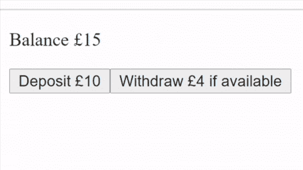
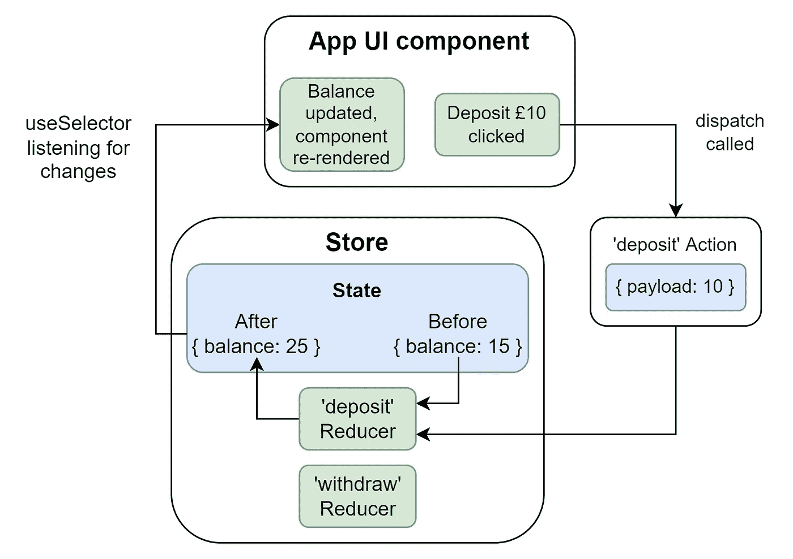

# React 开发人员的简单 Redux 指南

> 原文：<https://betterprogramming.pub/the-simple-redux-guide-i-needed-1306d43b8783>

## 了解 Redux 的构建模块

照片由 [La-Rel Easter](https://unsplash.com/@lastnameeaster?utm_source=medium&utm_medium=referral) 在 [Unsplash](https://unsplash.com?utm_source=medium&utm_medium=referral) 上拍摄

Redux 是一个状态管理工具，最常用于 React 或 React Native。

当我一年前第一次开始使用它时，它看起来有点复杂，但是只需要理解几件事情就可以打开所有的东西:存储、动作、Reducers 以及挂钩`useSelector`和`useDispatch`。

如果您正在使用`[@reduxjs/toolkit](https://redux-toolkit.js.org/)`库来减少样板文件(我强烈推荐)，那么就会为您生成与您的减少器名称相匹配的动作。

困难在于 Redux 的数据是循环流动的，所以知道从哪里开始理解会很困难。我将讨论构建模块，然后通过一个简单的例子来说明如何使用它们。

# 积木

## 商店

先说最简单的概念:商店。Store 保存一个状态，基本上就是一个大的 JavaScript 对象。

它是您的真实来源，包含您放入的任何内容(通常是您的应用程序状态)。

只要你在通常放在层次结构顶端的`Provider`组件中，就可以使用`useSelector`钩子从任何地方读取它。

但是，它不能被直接修改。要修改它，你需要一个减速器。

## 还原剂

减速器是来自[功能编程](https://en.wikipedia.org/wiki/Fold_(higher-order_function))的概念，它执行以下简单工作:`Current State + New Information => New State`。

在 Redux 中，reducers 正是这样做的。它们可以被定义为一个带有两个参数的函数:存储的当前状态和一个动作(通常包含一个有效负载)。

然后它们输出一个新的状态，要么在使用 vanilla redux 时返回它，要么修改由`@reduxjs/toolkit`提供的状态的一个特定的可变副本。输出的新状态由 redux 库本身而不是您的代码放入存储。

## 行动

动作是 Reducers 中的“新信息”。它们为 Reducers 提供了正确修改存储状态所需的信息(如果合适，也可以不修改)。

如果需要的话，动作可以有一个有效载荷来传递新的信息。

行动需要被“分派”到商店，以便它们得到正确处理，这就是挂钩的作用所在。

当使用`@reduxjs/toolkit`时，你将有函数来创建为你生成的动作，其方式与你的 Reducers 相匹配。

## 钩子:使用 Dispatch 和使用 Selector

钩子可以在组件或其他钩子上使用，但是网上有很多解释钩子的资源，所以我将把重点放在与 Redux 相关的资源上。

为了分派一个动作，你需要调用由`useDispatch`钩子提供的`dispatch`函数。这通常是通过您的 UI 组件来完成的。

UI 组件也可以使用`useSelector`钩子从存储中读取状态。这允许组件监听存储状态的特定区域中的任何变化，并在发生变化时重新呈现。

# 示例流程

现在我们知道了构造块，让我们看一个简单的例子:

Redux 的简单银行 web 应用示例。由作者创作。

## 密码

在这个例子中，我们有一个简单的银行 web 应用程序，您可以在其中向银行账户存钱和取钱。

在下面的`BankAccountRedux.tsx`第 7 行，你可以看到我们商店的初始状态是余额 15。

我们还有 2 个 Reducers，允许在第 9-16 行存款和取款。触发这些减速器的动作由`@reduxjs/toolkit`(使用减速器的名称)为我们生成，并在第 22 行导出。

在`Store.tsx`中，我们配置商店，然后在`ReduxEnabledApp.tsx`的第 7 行，我们使用该商店。

这里，在 UI 组件中，我们利用第 14 行上的`useSelector`钩子来监听存储中的`balance`变量的值，这样如果它改变了，我们就可以重新呈现`App`组件。

我们还在第 15 行使用了`useDispatch`钩子，使 UI 组件能够向 Reducers 发送动作。我们在第 22 行和第 26 行上为动作提供了正确的有效负载，以存放 10 和提取 4，它们被传递给适当的 Reducers。

## 事件顺序示例

使用事件顺序示例的 Redux 数据流图。由作者在 draw.io 上创建。

1.  点击了“存款 10”按钮
2.  `deposit`动作被`dispatch`执行，有效载荷为 10
3.  `deposit`当前状态为`{ balance: 15 }`且第 2 步动作时调用的减速器
4.  减速器更新状态为`{ balance: 25 }`状态
5.  `useSelector`被通知存储状态中的`balance`的改变
6.  `App`组件以 25 的平衡重新渲染

当然，这只是一个介绍，Redux 领域还有很多东西需要了解，比如中间件、异步操作、副作用等等。但是他们都需要理解本文中的核心概念。有了这些工具，我希望您能立即更有效地管理您的应用程序状态。