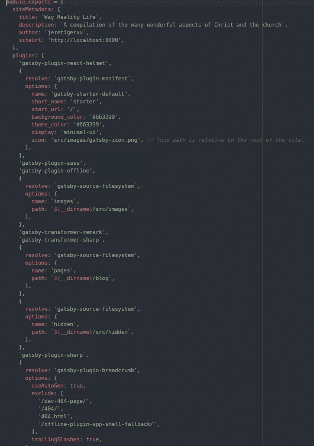
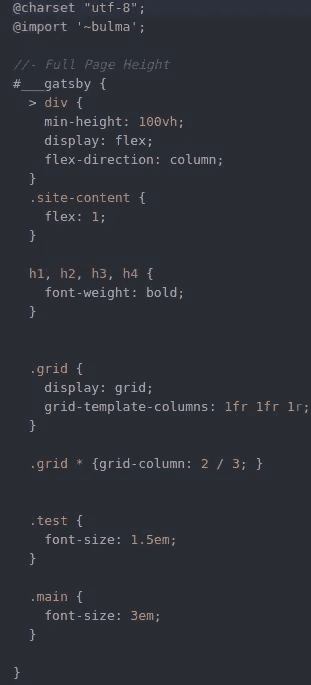
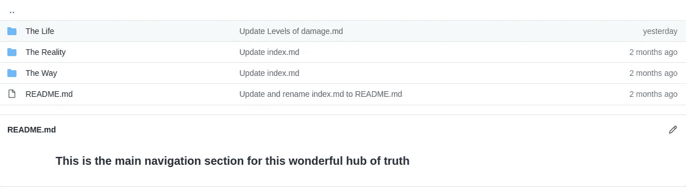
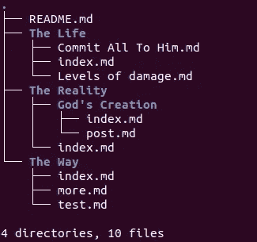
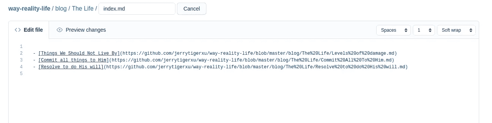
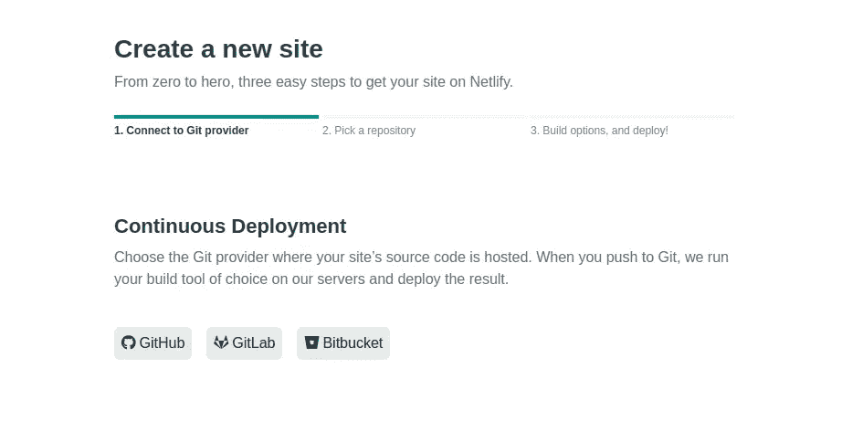

# 用 Gatsby.js 和 GitHub 创建无限可扩展博客的最简单方法

> 原文：<https://betterprogramming.pub/the-simplest-way-to-create-an-infinitely-scalable-blog-with-gatsby-js-and-github-a29a0d414bf9>

## 建立你自己的博客比你想象的要容易


照片由[弗雷迪婚姻](https://unsplash.com/@fredmarriage)在 Unsplash

我非常喜欢组织，尤其是在知识和信息方面。把所有东西都整齐地存放起来，并按正确的顺序组织起来，总是让我感觉很好。不幸的是，创建一个既有组织又有层次的网站，特别是博客，并不容易。

我发现大多数网站建设者只提供一个层次的博客文章。这意味着我不能有任何文件夹或子文件夹——只有一大堆只能通过标签或关键词组织的帖子。我心想，“当我可以自己完成整个过程时，我为什么要依赖其他网站建设者呢？”

使用我将在这里展示的过程，我创建了一个可无限扩展的博客，速度极快，而且在重新配置结构和添加内容方面非常直观。我称之为[方式的现实生活](https://way-reality-life.netlify.app/)，这是圣经约翰福音 14:6 的一个片段。在这个博客中，我列出并整理了圣经中揭示的关于三件事的许多不同的真理:1。基督徒如何在地球上实践上帝的旨意，2。无数的例子说明耶稣基督是旧约中所有图画的现实，甚至是所有积极事物的现实，第三，基督徒如何发展和成长他们灵魂中的生命。

*只是提醒一下，该网站仍在全面优化的过程中，所以它可能看起来有点不完整。*

# 议程

1.  [建立盖茨比](#4ac1)
2.  [配置盖茨比站点](#f0ca)
3.  [布局](#c70f)
4.  [GitHub 设置](#11a8)
5.  [程序化页面生成](#0beb)
6.  [部署](#0b20)
7.  [需要改进的地方](#ea19)
8.  [资源](#42d3)

# 设置盖茨比

为了让我们构建一个可以无限扩展和极快加载的博客，我们需要一个框架来构建和呈现可以轻松部署在 web 上的静态资产。Gatsby.js 可以说是最好的开源静态站点生成器，所以让我们开始吧。

## 盖茨比是什么？

Gatsby.js 是一个基于 React.js 的开源框架，用于生成静态网站。盖茨比的专业术语是一个渐进式网络应用生成器。该框架获取 web 资产，如 HTML、CSS 和 JavaScript，通过各种 API 加载数据，然后将所有这些资产加载到具有预取资源的站点中。最终的结果是一个非常快速、易于扩展和修改且安全的集合。

## 安装盖茨比

如何在本地机器上设置 Gatsby 取决于您使用的操作系统。关于这方面更深入的教程，请访问他们的[站点](https://www.gatsbyjs.org/tutorial/part-zero/)。

简而言之，您需要首先安装 Node.js，这是一个开源的 JavaScript 运行时环境，用于在浏览器之外执行 JavaScript 代码。对于 Node，您还可以获得 npm，它代表“节点包管理器”。使用 npm，您可以将 Gatsby 安装到本地机器上。

接下来最好安装 git，一个非常强大和流行的版本控制系统。您也可以通过 npm 设置 git。Gatsby 在使用 Gatsby 站点模板或“启动器”时使用 Git。基本上，它允许你有一个完整网站的框架，供你调整和重新配置，而不是从头开始构建整个网站。你可以在这里找到许多不同的盖茨比第一集。

一旦您完成了所有这些，请进入您的终端或命令提示符并安装 CLI(命令行界面):

`npm install -g gatsby-cli`

Gatsby CLI 中有相当多的命令——您可以通过下面的命令行提示符了解更多信息:

`gatsby --help`

对于这个特殊的项目，你有选择。您可以:

1.  开始完全从`gatsby new [your-site-name]`开始
2.  使用带有`gatsby new [your-site-name] [starter-git-url]`的起始模板
3.  Fork [我的 GitHub 库](https://github.com/jerrytigerxu/way-reality-life)。

一旦您在本地机器上拥有了站点文件和资产，您就可以拥有一个带有`gatsby develop`的本地开发服务器。如果在某个时候你觉得你的站点已经完成了，你可以用`gatsby build`创建一个完全优化的站点。

# 配置 Gatsby 站点

现在我们已经建立了 Gatsby 站点，并预先打包了基本的静态 web 资产，让我们看看站点的基本组件，并在添加内容之前对它们进行适当的配置。

当你建立一个 Gatsby 站点时，你会得到一堆文件。所有这些资产都有助于您更轻松地创建更好的网络体验。让我们一次看一个。

## **盖茨比浏览器. js**

该文件用于实现 Gatsby 浏览器 API。对于这个项目，我们不需要在这个文件中放任何东西。

## **盖茨比-config.js**

该文件用于站点的基本配置。大多数 API 设置都将存储在这里。盖茨比自带的插件有很多。你可以通过运行你的终端`npm install --save [gatsby-plugin-name]`来轻松安装它们。一旦下载了插件，您就可以将它添加到您的`gatsby-config.js`中。

该项目的文件如下所示:



正如你所看到的，这个项目中使用了许多不同的插件来帮助我们节省时间和精力，使网站得到全面优化。一个重要的插件是`gatsby-source-filesystem`，它允许 Gatsby 从存储在本地文件系统中的文件中提取数据。

稍后，我们将使用 Git 从 GitHub 中提取必要的文件，以便本地文件系统上的所有内容都与云相匹配，并且可以自动部署。

`gatsby-transformer-sharp`是另一个重要的插件。它自动化了将 markdown 文件转换成可用于 web 资产的格式的过程。

剩下的插件你不用太担心。

## **盖茨比-node.js**

该文件用于实现节点 API。这些 API 允许您从 GraphQL 数据层控制站点的数据。当我们处理编程页面生成时，我们将更仔细地研究这个文件的内容。

## **盖茨比-ssr.js**

该文件用于实现服务器端 API。我们不会在这个项目中使用任何。

# 布局

布局是你网站的一个非常重要的方面。Gatsby 是基于 React 构建的，React 是一个 JavaScript 库，它使得使用称为组件的构建块来构建用户界面变得更加容易。你可以将你的网站分解成基本的构建模块，然后将它们堆叠在一起，根据需要重复使用不同的组件，而不是将所有的代码都放在一个文件中。

对于样式，我们使用布尔玛，一个开源的 CSS 框架，让我们可以很容易地改变我们的组件的风格。



# GitHub 设置

现在我们可以设置 GitHub 存储库来存放我们的代码和内容。GitHub 的伟大之处在于，因为你可以选择公开你的库，其他人可以看到你的代码，他们可以提出建议和编辑。这就是开源的力量。

在[我的方式-现实-生活库](https://github.com/jerrytigerxu/way-reality-life)中，我将我网站的实际内容存储在`/blog/`文件夹中。这是里面的样子:



在 GitHub 存储库中，您可以创建无限数量的文件夹和子文件夹。对于我的博客帖子，我使用 markdown(或。md)格式，因为格式化我的文本很容易。

确保在文章、文件夹和子文件夹之间轻松导航的诀窍是使用**索引页**，这基本上是每个文件夹或子文件夹的主要枢纽。我会在一个名为 index.md 的文件中列出文件夹或子文件夹的内容。



在 index.md 文件中，我会链接到文件夹中的其他每篇文章。



# 程序化页面生成

当我们在 GitHub 上创建内容后，我们可以用`git pull`将所有的更改拉至我们的本地文件系统，并且所有的目录完全相同。现在我们还没有博客，我们只是在不同的文件夹中有一些 markdown 文件夹，它们彼此之间甚至没有联系。现在，我们需要更多的技术，并做一些严重的自动化。

有两个必要的步骤:

1.  创建 slugs(为每个帖子指定路径)。
2.  使用页面模板为每篇文章创建实际页面。

这是我之前暗示过的 gatsby-node.js。这段代码将通读我们文件系统中的每一个 markdown 文件，并以编程方式为每一个从 markdown 转换而来的帖子创建 slugs。

在前一个代码块的底部是一个指向`file ./src/templates/post.js`的部分。如果没有模板可循，Gatsby 就无法以编程方式创建页面。下面是程序将使用的页面模板。每个帖子的整体布局是相同的，但每个帖子页面中的实际内容是不同的:

在所有这些紧张的代码之后，我们终于有了一个在本地工作的博客！

# 部署

让我们使用 Netlify 将我们的站点部署到 web 上。Netlify 是一个构建和部署网站的平台。它获取您的本地 web 资产，并将其存储在云中进行部署。

我们现在需要做的是更新我们的 GitHub 库。我们需要将文件添加到 Git 上的本地暂存区，提交这些文件，然后将它们推送到 GitHub 上的远程存储库。

```
git add .git commit -m "[whatever changes you made]"git push -u origin master
```

一旦你的 GitHub 库被更新，我们可以建立一个直接从 GitHub 部署的 Netlify 站点。



最终确定网站所需的步骤取决于您的工作流程、环境和个人偏好，因此请参考下面的资源以获得更多帮助。

# 需要改进的地方

感谢您花时间通读这篇文章！请随意查看我的[作品集网站](https://jeretigerxu.me/)或[我的 GitHub](https://github.com/jerrytigerxu?source=post_page---------------------------) 。

1.  更加美化网站
2.  添加更多页面和图层
3.  增加更多的交互性

# 资源

*   [Node.js](https://nodejs.org/)
*   [React.js](https://reactjs.org/)
*   [吉特](https://git-scm.com/)
*   [GitHub](https://guides.github.com/activities/hello-world/)
*   [Gatsby.js](https://www.gatsbyjs.org/)
*   [图表 QL](https://graphql.org/)
*   布尔玛
*   [面包屑](https://www.searchenginejournal.com/breadcrumbs-seo/255007/)
*   [网络寿命](https://www.netlify.com/)