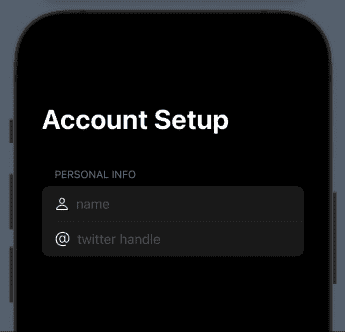
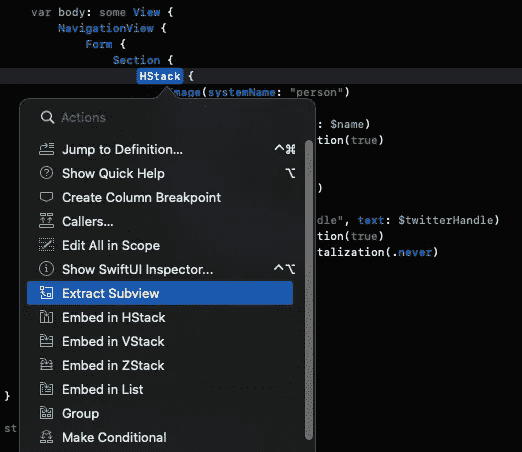
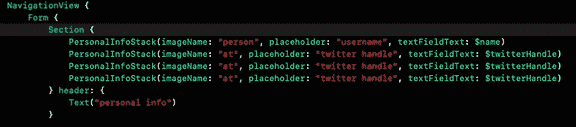
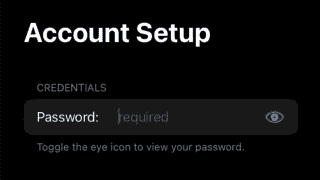

# 通过构建相同的应用程序直接比较 UIKit 和 SwiftUI

> 原文：<https://betterprogramming.pub/the-simplicity-of-swiftui-a-direct-comparison-between-uikit-and-swiftui-by-example-97a417a17898>

## SwiftUI 的简单性

由[麦克斯韦·纳尔逊](https://unsplash.com/@maxcodes?utm_source=medium&utm_medium=referral)在 [Unsplash](https://unsplash.com?utm_source=medium&utm_medium=referral) 上拍摄的照片

我实话实说。我不想喜欢 SwiftUI…但我喜欢。自从 SwiftUI 在 2019 年底推出以来，我一直坚持不打算使用它，我将只坚持使用 UIKit。

虽然有些东西仍然需要依赖于 UIKit 的使用，但 SwiftUI 有一种神奇的方式，可以轻松地创建 UI 元素，这在 UIKit 中可能是一个令人头疼的问题。

Swift 作为一种语言，给了苹果团队思考 iOS 开发者经常做的事情和 UIKit 面临的问题的时间。

你想做一些简单的事情吗，比如给标签或带有文本的自定义按钮中的图像添加填充？当然…！

你可以用某种 UIEdgeInsets 子类化一个`UILabel`和`initialize`，或者你可以为你的子类添加覆盖函数或属性，比如`intrinsicContentSize: CGSize`。

有许多有效的解决方案，但 SwiftUI 的一大亮点是`ViewModifiers`。

 [## 用嵌入的 UIImage 或静态文本创建一个干净的 UITextField

### 如果你和我一样，你会知道那种不想在遇到障碍时翻身的感觉，同时…

medium.com](https://medium.com/@kysodev/create-a-clean-uitextfield-with-an-embedded-uiimage-or-static-text-390c121e384d) 

在过去的几天里，我玩了一会 SwiftUI，真的看到了 Swift 新开发的吸引力。

几周前，我写了一篇文章，提出了解决我在`UITextField`问题中的小“形象”的方法，并决定在 SwiftUI 中尝试一下！

我相信很多读到这里的人会认为这在 SwiftUI 中是微不足道的。

本文不是针对目前正在学习/了解 SwiftUI 的人。相反，这是为了展示我之前在 UIKit 中创建的一些东西的一个例子，以供那些寻求某种直接比较的人使用。

## 第一个结果

一个简单的 TextField，带有一个使用 SwiftUI 包装在 HStack 中的图像

下面的代码是用于上面的 GIF。这是一个非常简单的例子。

我将它包装在一个`NavigationView` ( `UINavigationController`中，仅用于 UIKit 用户),并将其放在一个`Form`中，它看起来相当于一个`UITableView`。

虽然看起来有点重复，对吧？我几乎不敢相信我在打字。我们已经节省了许多行代码来配置我们的`UITableView`、`UINavigationController` / `UICollectionView`、`NSLayoutConstraint`、`UITableViewDelegate`、`UITableViewDataSource` …不要忘记上面的自定义`UITextField`！

## ***稍微重构***

如果我们按下`cmd`键并点击`HStack`，我们可以选择将这段代码提取到它自己的子视图中:

然后，Swift 将友好地为我们命名这个`ExtractedView()`，直到我们为它找到一个合适的名称，并将其放在下面的`ContentView()`之外。

我将重命名这个`PersonalInfoStack`，并为我们的`image`和`textField`添加 3 个新属性。

这将返回“*某种类型的* `*View*`”，在本例中，它将返回一个带有`image`和`textField`的 HStack。然后，当我们调用`PersonalInfoStack()`的实例时，我们通过新的构造函数传递属性:

在这个子视图中使用的修改器将被应用到每个实例，所以要小心使用。您可以为特定视图添加单独的修改器，如下所示。

因为我们在新的子视图上使用了一个`@State`属性，所以我们需要在`textFieldText: String`属性上使用`@Binding`关键字来告诉 Swift，“*嘿，我将在这里使用一个值，但我希望它与我传入的值相同……如果我在这里更新，就在最初声明它的地方更新它*”。

现在来揭晓新重构的`ContentView`:

好的，到了。

这个现在看起来很小。对于我们用户界面上的东西来说，这实在是小得可笑。我们不想走极端，但是让我们想象你在这里有更多的观点和很多的逻辑。

我们不想实现的是代码变得不可读/难以管理的 MVC 问题！

你可以选择重构`Section`，但是要小心；为了理智而抽象和抽象那是 ***所以*** 抽象，你无法理解是怎么回事！

就个人而言，我喜欢保持代码的某些部分不变，以提高可读性，比如决定 ***而不是*** 来重构`Section`。

实际编码的时候，我经常用`alt` + `cmd` + `<`或者`alt` + `cmd` + `>`折叠打开代码。这绝对是一个长期受欢迎的小帮手`ContentView()`:

将光标移到花括号内，使用上面的快捷键。代码将在花括号的范围内折叠，如图所示。

*继续！*

最后一个例子是一个显示和隐藏文本的`TextField`，以匹配[我之前的文章](https://medium.com/@kysodev/create-a-clean-uitextfield-with-an-embedded-uiimage-or-static-text-390c121e384d)。这方面的一个例子是某种类型的密码或安全条目。

在 UIKit 中，我们将把`textField.isSecureTextEntry`属性设置为`= true`。在 SwiftUI 中，我们可以编写以下内容:

正如你在上面看到的，我们添加了一个布尔值来决定密码是否可见。

该布尔值还通过三元运算符确定图像所使用的图像类型:

你发现了吗？填充(。trailing)我们添加到文本中的 ViewModifier？！只有一行，我们现在有一点填充正是我们想要的！

***这不是在 UIKit 上转储！***

实际上，当我试图在 SwiftUI 中改变一个`Form`的背景颜色时遇到了一个有趣的问题，我很快发现我不得不依赖 UIKit。我期望我能在`Form`上添加一个`Color`修改器。

在那不起作用之后，我试着用一个`ZStack`把它包起来，也不起作用。经过一番研究，我发现了以下解决方案，对那些可能觉得有用的人来说:

这不是这里最好的颜色选择，但它是一个需要切换框架并在必要时实现 UIKit 的例子。

我仍然会使用 UIKit，但是从这个小例子和我在 UIKit 和 SwiftUI 中实现相同内容的比较来看，可以肯定地说 SwiftUI 将是我渴望了解更多的东西！

感谢阅读。