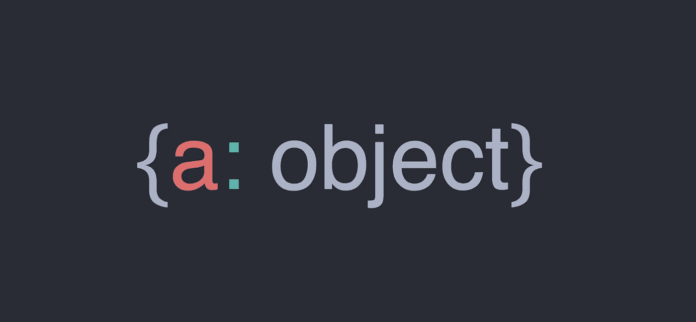

# JavaScript 最重要的一个特性

> 原文：<https://betterprogramming.pub/the-single-most-important-feature-of-javascript-d65ae448eb19>

## *是的，比提升、关闭和范围更重要*



JavaScript 最重要的特性是函数是对象。

就是这样。理解这一点将开启对 JavaScript 语言的全新理解。在 JavaScript 中，函数是对象。在 JavaScript 中，对象具有由键值对组成的属性。如下所示，JavaScript 函数具有由键值对组成的属性。

就像数组(也是 JavaScript 对象)有一个可以附加唯一方法的原型属性(例如，`Array.prototype.filter()`)，函数也有一个原型属性。在`Function.prototype`的属性中有一些独特的属性，它们给出了可以被调用的函数代码(例如，函数的核心)。但是可运行代码并不是函数的唯一属性。

你可能遇到过`.apply`、`.bind`和`.call`方法。如您所料，这些方法是关于`Function.prototype`属性的方法。`Function.prototype`也有自己的属性，比如包含函数名的`.name`和包含函数期望的参数个数的`.length`。

# 为什么这很重要，如何使用？

你可能听说过 JavaScript 被描述为一种函数式语言。这意味着在 JavaScript 中，程序是通过函数构建的。

函数被认为是*一级的，*意味着函数可以做任何事情——作为参数传入其他函数，插入数据结构，赋给变量，以及由其他函数返回。

## 这里有一些例子说明 JavaScript 函数实际上只是对象

假设我们将一个函数赋给一个名为`myFunction`的变量:

```
var myFunction = function (str) { console.log(str) }
```

我们可以像访问任何对象中的属性一样访问函数的`name`属性:

```
myFunction[“name”]
myFunction.name// both return “myFunction”
```

同样，我们可以访问函数的`length`属性，该属性返回函数接受的参数数量:

```
myFunction[“length”]
myFunction.length// both return 1
// because myFunction takes in one argument, str
```

我们还可以给一个函数分配新的属性——就像你给任何其他 JavaScript 对象分配属性一样:

```
myFunction.myNewProperty = "hello"myFunction.myNewProperty
// returns "hello"
```

因为函数是 JavaScript 中的一等公民，所以我们可以对它们做任何事情——包括将其他函数指定为函数的属性。

```
var coolFunc = function() { return 1 }myFunction.coolProperty = coolFuncmyFunction.coolProperty
// returns function() { return 1 }myFunction.coolProperty()
// returns 1
```

尽管在实践中您可能从来不希望将一个函数指定为另一个函数的属性，但是这个简单的例子说明了这个概念。

函数只是 JavaScript 对象，如下所述，在 JavaScript 中你可以用对象做的任何事情，你都可以用函数来做。

函数唯一真正的区别在于，它们和 JavaScript 中的其他对象一样，有自己独特的方法和属性，其中一个是保存函数中可执行代码的方法，另一个是调用可执行代码的方法。

# 结论

所以去试一试吧。

像对待简单的`{key: “value”}`书写对象一样对待对象。

你会对你所能做的感到惊讶，反过来，你会熟悉以这种方式看函数所能创造的强大用途。