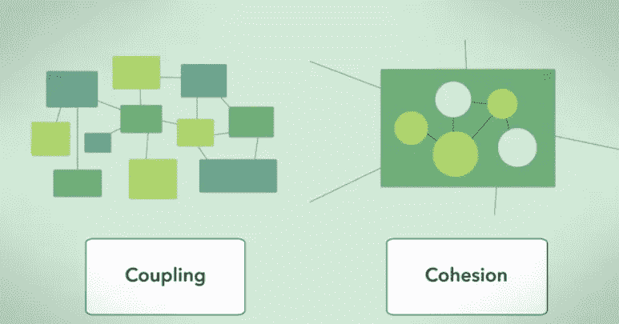

# 用 Python 解释的单一责任原则

> 原文：<https://betterprogramming.pub/the-single-responsibility-principle-explained-in-python-622e2d996d86>

## 高内聚、低耦合和高质量软件的标志。

照片由多雷尔·蒂布斯 / [Unsplash](https://unsplash.com/?utm_source=ghost&utm_medium=referral&utm_campaign=api-credit) 拍摄

在本帖中，我们将着眼于第一个[坚实的](https://en.wikipedia.org/wiki/SOLID)原则。SOLID 是五个软件设计原则的首字母缩写，这五个原则有助于使软件健壮和可维护。理解并应用这五个原则是优秀软件工程的标志。因此，对于任何有抱负的软件工程师来说，熟悉它们是至关重要的。

在我们深入研究这个原则之前，必须解释与软件工程相关的两个概念。即*内聚*和*耦合*。

内聚是指一个类中函数之间的*互连*。而耦合是指类之间的*相互依赖*。来源:[【1】](https://en.wikipedia.org/wiki/Coupling_(computer_programming))

目标是开发高内聚、低耦合的软件。

# 高内聚力:

这意味着我们希望一个类中的函数执行彼此相关的任务。让我们设想一些软件的总体任务是生成一个报告并发送它。将所有函数放在一个类中是低内聚的一个例子，因为设计报告和发送报告是两个不同的子任务。相反，我们希望负责设计报告样式和插入内容的函数是一个类的一部分，而负责发送的函数是另一个类的一部分。

# 低耦合:

另一方面，我们希望低耦合。这意味着类不应该过于依赖彼此。因此，负责发送报告的班级不应该太关心报告的格式、风格或长度。应该是松耦合的。如果我们更改了设计报告样式或设置格式的函数，负责发送报告的函数应该仍然可以正常工作。你可以想象，如果耦合度很高，就会有很多依赖关系，这意味着如果一个类中的某个东西发生了变化，那么这个变化就会传播到依赖它的其他类，它们也必须发生变化。这不仅会引入错误，还会使代码维护和未来的开发成为一场噩梦。

单一责任原则帮助我们实现高内聚和低耦合的目标。这里有一张图片说明了这个概念。

来源: [Coursera](https://www.coursera.org/lecture/object-oriented-design/1-3-1-coupling-and-cohesion-q8wGt) 。内聚与耦合

好吧！既然已经解决了这个问题，让我们来看一个例子😊

# 原则

S 代表单一责任原则:

> "一个类的改变不应该有一个以上的原因."换句话说，每个类应该只有一个责任。
> 来源:[Wikipedia.org](https://en.wikipedia.org/wiki/SOLID)

基本上一个类应该只有一个目的。如果类的功能需要改变，应该有这样做的理由。

# 密码

让我们想象一个汽车经销商销售 3 种类型的汽车。用户可以:

*   请求一辆汽车
*   试驾汽车
*   买辆车

代码如下:

如果请求的汽车不可用，用户会得到一个错误。汽车的价格是从价目表中检索出来的。最后，用户可以试驾汽车，也可以购买汽车。只有提供全款才有可能买车。

如果你注意到了，`Car`类有多重职责——它需要处理汽车信息以及购买汽车的财务信息。因此，它违反了单一责任原则。

另一种看待它的方式是使用上述原理的定义。也就是说，一个类的改变应该只有一个原因。

现在，让我们假设汽车经销商想要做出两项改变:

*   开始向客户提供分期付款，而不是预付全款
*   改变汽车的价格

现在有两个 原因导致`Car`类改变。一个类的改变必定只有一个 ***单一的*** 原因，所以违反了原则。

我们可以通过创建一个名为`Financials`的独立类并实现上面列出的更改来轻松解决这个问题:

**如果你现在注意到，每个类——**`**Car**`**`**Financials**`**只有一个改变的理由。****

**如果预付至少三分之二的金额，现在可以分期付款。这个在`Financials`班更新了。其次，一辆`BMW`的价格从 10 万变成了 20 万。这是在`Car`类中更新的。**

**精彩！**

# **结论**

**很难理解为什么在同一个类中同时拥有汽车交易和金融功能会是一个大问题。然而，这在拥有许多类和依赖项的大中型组织代码库中变得非常明显。**

**此外，您可能已经注意到代码现在比以前更加松散，因为我们已经将它分成了两个类。此外，由于每个单独的类现在都有一个清晰明确的任务，因此有了更多的凝聚力。`Car`类只关心汽车本身，而`Financials`类只处理财务。**

**希望你喜欢这篇文章！**

***原载于*[*https:haseebkamal . com .*](https://haseebkamal.com/the-single-responsibility-principle-in-software-engineering/)**