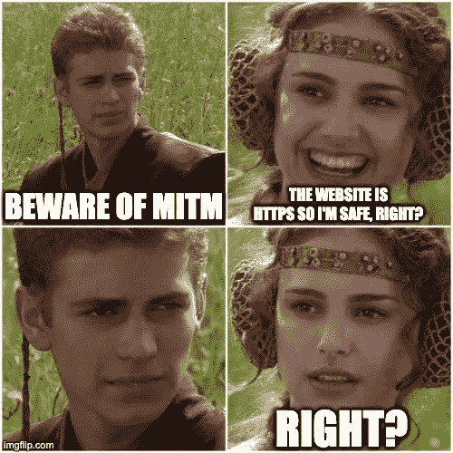
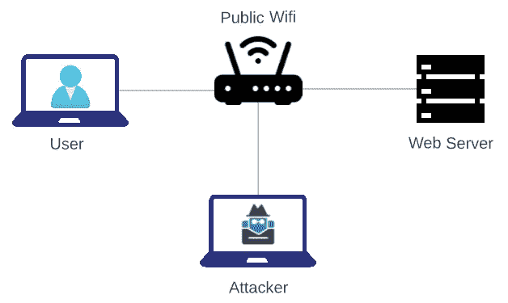
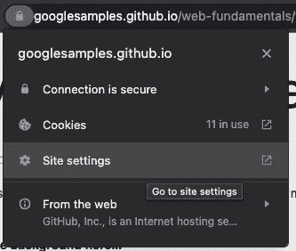
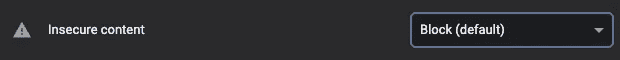
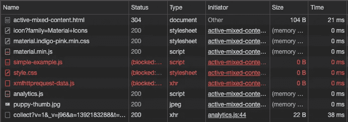
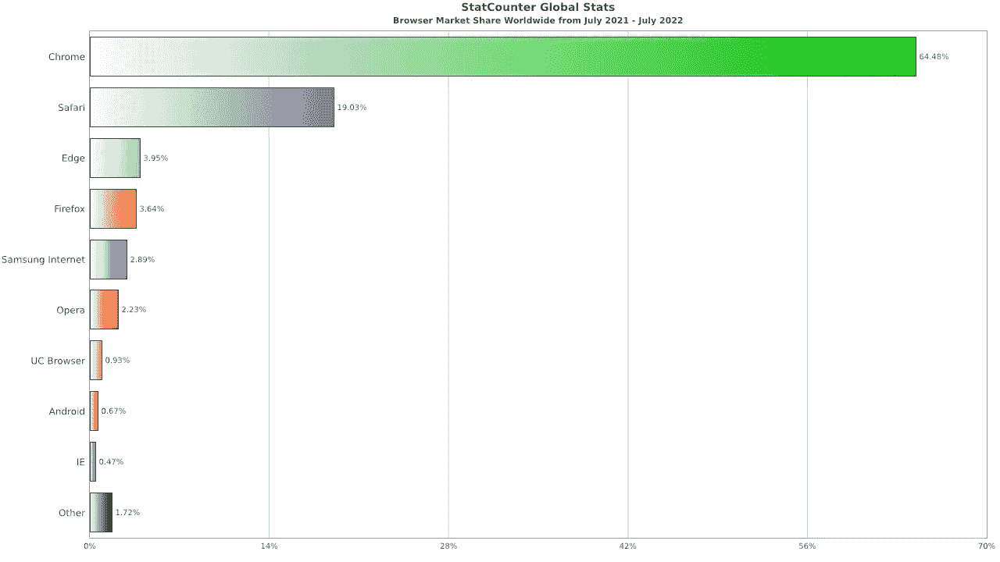
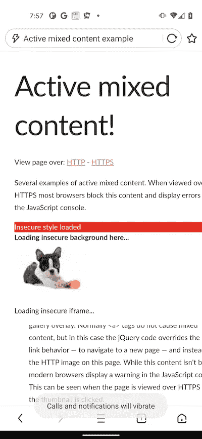
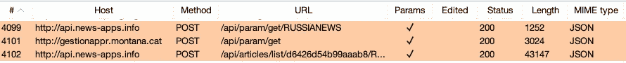

# 地点是 HTTPS，所以我是安全的，对吗？

> 原文：<https://betterprogramming.pub/the-site-is-https-so-im-safe-right-fc452ce79da7>

## 你可能认为你不需要担心中间人(MITM)攻击，但手机应用程序或嵌入式网站呢？

imgflip.com

# 什么是中间人攻击？

由于 MITM 攻击的风险，公共互联网连接本质上是不安全的。我不是说你不应该使用公共 wifi 连接。不过，下次你在星巴克或机场时，你应该格外小心地采取 VPN 等预防措施，并避免访问可能暴露敏感个人信息的网站。如果你经常旅行，考虑投资一个[便携式 wifi 热点](https://www.pcmag.com/picks/the-best-mobile-hotspots)。

本地中间人攻击公共 wifi

MITM 袭击是如何进行的？

1.  攻击者执行 ARP 中毒(例如，ARP 欺骗)攻击，将 wifi 路由器的 IP 地址映射到攻击者机器的 mac 地址。现在，不知情用户的流量将被发送给攻击者。如果攻击者也连接到同一个 wifi 路由器，这种攻击很容易执行。
2.  用户请求 web 服务器，但不知不觉地与攻击者的机器通信。攻击者可以读取请求头和未加密的请求。
3.  攻击者将用户的请求转发给 web 服务器。web 服务器不知道正在发生攻击。
4.  web 服务器处理用户的请求。同样，攻击者可以读取响应报头和未加密的流量。
5.  攻击者将来自 web 服务器的响应转发给用户。该网页将为用户正常加载，就好像攻击者不存在一样。

此时，攻击者已经成功地将自己插入到您和 web 服务器之间。最常推荐的降低 MITM 风险的解决方案是避免不使用 TLS 的网站(例如，不使用 HTTPS 的网站)。但是，当你加载一个 HTTPS 网站时，会发出一系列的 web 请求来加载 HTML、CSS JavaScript、图像和其他资产，但这些并不能保证是 HTTPS。

幸运的是，对于大多数现代浏览器来说，包括谷歌 Chrome，我们不需要担心这个[，因为 81 版](https://security.googleblog.com/2019/10/no-more-mixed-messages-about-https_3.html)。在 2020 年的这一变化后，如果你访问一个 HTTPS 网站，Chrome 将自动升级对 HTTPS 的 HTTP 请求，如果升级失败，就会阻止这些请求。此设置可针对每个网站进行配置，因为有些网站可能不支持自动将流量升级到 HTTPS。

在 Chrome 中导航到站点设置的屏幕截图

如何在 Chrome 中打开/关闭不安全内容设置的屏幕截图

看一下这个示例网站。尝试在启用和不启用不安全内容设置的情况下加载(当然，如果您使用的是安全连接)。网址在这里:

 [## 活动混合内容示例

### 通过 HTTP 查看页面— HTTPS 活动混合内容的几个示例。当在 HTTPS 浏览时，大多数浏览器会屏蔽这个…

googlesamples.github.io](https://googlesamples.github.io/web-fundamentals/fundamentals/security/prevent-mixed-content/active-mixed-content.html) 

如果您打开 Chrome dev tools 并导航到网络面板，您可以在最初的 HTTPS 请求之后看到 9 个额外的内容请求，其中 3 个请求(以红色突出显示)是不安全的。

这些网站被称为混合内容网站，因为加载整个网页需要发出 HTTP 和 HTTPS 请求。幸运的是，大多数浏览器已经阻止加载后台 HTTP 内容。

Chrome 开发工具中的网络面板截屏阻止了三个 HTTP 请求

如果这些请求没有被阻止并保持不加密，您的数据可能会面临严重的风险，因为缺乏加密会使您容易受到 MITM 攻击。我们已经讨论了 MITM 攻击是如何工作的，但是攻击者在恶意地将他们的系统放在“中间”之后会做什么呢？这里有几个漏洞:

1.  数据暴露:攻击者可以查看未加密的内容，其中可能包含私人信息。即使它不包含个人信息，数据的性质也可能使用户的私生活受到不必要的审查，并且在某些制度下，被用来审查或限制公民自由。例如，HTTPS 并不总是要求像图像这样的被动内容。尽管如此，如果攻击者从宗教、约会或色情网站截取图像，那么他们就可以了解到用来伤害用户的个人信息。
2.  代码注入:攻击者用恶意内容替换良性的 web 内容。在上面的例子中，由于`simple-example.js`是未加密的，攻击者可以用任意的 JavaScript 替换代码。注入恶意 JavaScript 可能会被用来利用其他系统漏洞，例如简单地提取数据或危害用户的浏览器，甚至整个系统。

# 前 4 名最受欢迎的浏览器是安全的！

今天，最新版本的 Chrome、Safari、Edge 和 Firefox 在访问由 HTTPS 保护的网站时可以抵御中间人攻击，因为它们防止了上述混合内容 MITM 漏洞。

然而，如果你属于使用三星互联网、Opera 或 UC 浏览器的 8%,那么我很抱歉——你需要自己验证。主要的风险存在于被归类为“其他”的浏览器的长尾中因为他们的投资和审查要少得多，所以我不会认为他们最近采用了这样的安全特性。

[去年 StatCounter 浏览器的市场份额](https://gs.statcounter.com/browser-market-share#monthly-202107-202207-bar)

例如，如果您从上面访问相同的活动混合内容 URL，UC 浏览器会下载 JavaScript 并立即运行它，而不会发出警告。这款应用的全称是 [UC 浏览器——安全、快速、私密](https://play.google.com/store/apps/details?id=com.UCMobile.intl&hl=en_US&gl=US)。如果你的网络中有攻击者，那就不安全，也不私密。UC 浏览器占全球浏览器的近 1%，而[约占中国用户的 12%。](https://gs.statcounter.com/browser-market-share/all/china/#monthly-202107-202207-bar)

Android 上的 [UC 浏览器-安全、快速、私密](https://play.google.com/store/apps/details?id=com.UCMobile.intl&hl=en_US&gl=US)截图

# Android 和 iOS 应用安全吗？

不一定！你可能不像你想象的那么安全，无论你是在打发时间，玩 flappy bird 或 tower defense 游戏，还是浏览令人麻木的社交媒体应用程序。TLS 不保证从 iOS 或 Android 应用程序到其应用程序的 web 服务器的通信是安全的。

苹果和谷歌都强烈鼓励开发者实施安全最佳实践，但他们允许开发者选择退出 HTTPS 安全保证。与上面例子中的 Chrome 浏览器不同，这些设置是由开发者控制的，而不是用户。

苹果和谷歌都允许开发者对应用程序进行配置，以不加密和明文的方式进行通信。iOS 将此称为“例外”，暗示这可能不会被永久允许。

此配置的 [Android 安全文档](https://developer.android.com/guide/topics/manifest/application-element#usesCleartextTraffic):

> 指示应用程序是否打算使用明文网络流量，如明文 HTTP。针对 API 级别 27 或更低的应用程序的默认值是`"true"`。针对 API 级别 28 或更高的应用默认为`"false"`。

这里有一篇类似的[文章，记录了 iOS](https://www.hackingwithswift.com/example-code/system/how-to-handle-the-https-requirements-in-ios-with-app-transport-security) 的流程。

# 我们在 Android 上找个例子吧！

在 Android 上检查网络流量不像桌面客户端上的 Chrome 工具那样简单。我不能仅仅打开 Chrome 开发者工具中的网络标签来检查流量。它需要很大的努力来设置，所以我不会在这里详细介绍。如果你对这个主题的文章感兴趣，请留下你的评论。

首先，我下载并设置了 PortSwigger 的 [Burp Suite 安全测试工具包](https://portswigger.net/burp/communitydownload)，它有一个免费的商业版，功能稍有限制。我用 USB 线将一台 Android 设备连接到我的 MacBookPro 上，并配置了一个 HTTPS 代理。你可以按照[这篇关于代理 Android 应用流量的教程](https://blog.nviso.eu/2020/11/19/proxying-android-app-traffic-common-issues-checklist)来获得详细的设置说明。

本质上，我在我的 android 手机上执行 MITM 攻击，除了使用 USB 电缆，而不是像前面的例子中的 ARP 欺骗。

在没有任何前期研究的情况下，我从谷歌 Play 商店搜索并下载了几个不受欢迎的新闻应用。试了三次后，我成功了。应用程序“[俄罗斯新闻|俄罗斯&世界新闻头条](https://play.google.com/store/apps/details?id=info.newsapps.russianews&hl=en_US&gl=US)”几乎专门通过 HTTP 进行通信。查看以下流量:

截至 2022 年 8 月 21 日，Burp 套件拦截“俄罗斯新闻|俄罗斯和世界新闻头条”android 应用程序流量的截图

请注意，在应用程序中下载或加载内容时没有安全警告。在我的网络上运行 MITM 攻击的攻击者将能够拦截、读取和修改任何这些请求。

# 一个人能做什么？

太好了，应用不一定安全。太好了，不清楚哪些应用程序是安全的，哪些是不安全的。你不应该期望在将一个应用程序放入你的常规滚动循环之前执行深入的安全分析。你应该做两件事:

1.  仅使用受信任的网络。你应该连接到当地潜水酒吧的无线网络吗？也许不是。如果你在旅行时需要用笔记本电脑上网，就用手机做热点，或者买个便携 wifi 热点。
2.  下载一个可信的 VPN，并让它一直开着。ExpressVPN、NordVPN 等。有很多选择。做一些研究，选择一个最适合你的。
3.  避免应用内浏览器。除了安全，如果你重视你的隐私，那么无论如何你都应该避免它们。参见"[该网站揭露了抖音和 Instagram 的应用内浏览器可能追踪的令人毛骨悚然的事情](https://www.theverge.com/2022/8/19/23312725/in-app-browser-tracking-facebook-instagram-privacy-tool)"

# 包裹

我希望这篇文章在某种程度上揭示了 MITM 是一种攻击，攻击面在哪里，以及如何保护自己。您可能会惊讶地发现，android 和 iOS 应用程序不如在您的网络浏览器中浏览安全。我很期待 Android 和 iOS 未来的安全改进。

我怀疑他们正在努力消除这些漏洞，并通过要求所有应用程序流量都是 HTTPS 来保护用户。然而，这可能需要时间，因为应用程序经常调用可能不支持 HTTPS 的第三方服务。在那之前，使用 VPN 并保持安全。

如果我错过了什么，请告诉我。我保证我做到了。