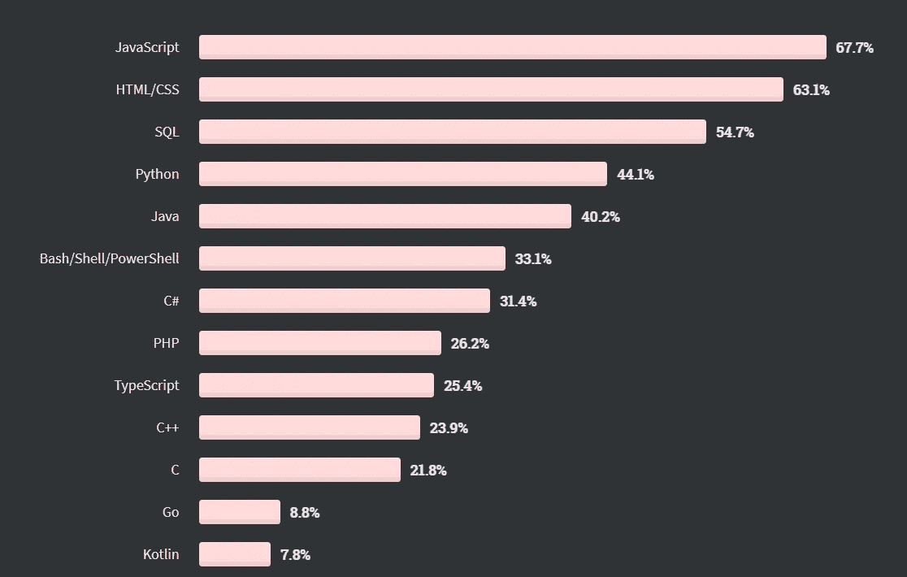

# 最慢的现代编程语言

> 原文：<https://betterprogramming.pub/the-slowest-modern-programming-languages-d29ea2306675>

## 编程；编排

## 以及它们速度慢的原因

卡尔·伊布里在 [Unsplash](https://unsplash.com?utm_source=medium&utm_medium=referral) 上的照片

编程语言已经存在了几十年。每种语言都是为了满足某种需求而构建的。

到今天为止，全世界大约有 700 种著名的编程语言。虽然大约有 250 个设法维持下去，但其余的都被编程社区抛弃了。(来自维基百科的最新数据)

对于程序员来说，性能一直是一个令人担忧的问题。以前，执行时间可以用日历来度量，而现在，它是用秒的分数来度量的。功劳归于电子学的进步。

计算机进化的速度遵循摩尔定律:

摩尔定律。来源:[维基媒体](https://upload.wikimedia.org/wikipedia/commons/8/8b/Moore%27s_Law_Transistor_Count_1971-2018.png)

在电子领域，速度和性能转化为特定芯片可以拥有的晶体管数量。根据摩尔定律，这个数字每两年惊人地翻一番。这就是为什么你的手掌大小的手机比 20 世纪 90 年代的房间大小的超级计算机要快得多。

说到计算机科学，更快的代码和更快的 PC 是有区别的。一个缓慢的程序和一台缓慢的计算机。

我敢打赌，我们在英特尔和 AMD 的朋友在速度方面正在创造强大的计算系统。因此，创建健壮而快速的程序取决于我们。

创建软件时要考虑的一件事是语言预期。每种语言都有不同的实现方式，所以每种语言都有各自的优点。速度可能根本不在这些优点之列。

现在，如果你试图建立一个程序来执行要求苛刻的任务，如游戏和繁重的数学计算，你最好避开缓慢的编程语言。

通常，编程语言有两种类型:

*   静态类型编程语言
*   动态类型编程语言

静态类型语言通常被编译成汇编语言，这意味着一个叫做编译器的程序将你的整个类似英语的代码解析并转换成汇编语言并生成一个新的文件。这个文件又由用户手动执行。

动态类型语言通常是由***解释的*，意思是软件—**解释器—* 以逐行的方式分析并运行代码**。*****

> ***编译器和解释器的细节是非常学术性的，因此超出了本文的范围。***

***我们大多数人喜欢动态类型的语言。不易出错且易于人工解释的语言，如 Python。但这是有代价的。速度。***

***在这篇文章中，我们将介绍相对最慢的常见动态类型编程语言。***

# ***Perl 语言***

***如果您以前使用过 UNIX，那么您很可能没有见过 Perl 脚本。大多数 UNIX 文件都是用 Perl 编写的。***

***Perl 是一种 Unix 脚本语言。它的创建是为了减轻程序员不得不忍受编写冗长的外壳程序的困难。它只是一堆塞进文件中的 Shell 命令。***

***更重要的是，Perl 减轻了在 C 和其他 Unix 语言中被认为是噩梦的任务。当然，C 不会接受不付出代价就被超越。***

***事实上，Perl 被征收了速度税。***

***此外，如今寻找一个伟大的 Perl 程序员就像大海捞针。这是因为，例如，与 Python 不同，Perl 对实现非常敏感，每个操作符都应该处于适当的位置，以拥有相对高效的程序。***

***即使有最有效的实现，Perl 仍然落后于它的高级编程语言对手。然而，它仍在增长，效率问题正在一个接一个地得到解决，特别是在 2019 年 Perl 6 发布之后，它被命名为樱庭落。***

# ***服务器端编程语言（Professional Hypertext Preprocessor 的缩写）***

***PHP 是一种脚本 web 开发编程语言，通常在网站部署中补充 HTML、CSS 和 MySQL。***

***许多人认为 PHP 已经过时了。但事实是:它不是！***

***[w3techs](https://w3techs.com/technologies/details/pl-php) 说:***

> *****“**在我们所知的服务器端编程语言的网站中，79.0%的网站使用 PHP。”***

***最重要的是，最近的 2020 年 StackOverflow 关于编程、脚本和标记语言的调查显示，PHP 是 C++和 Typescript 之上的一种非常活跃的语言:***

******

***来源: [StackOverflow](https://insights.stackoverflow.com/survey/2020#technology-programming-scripting-and-markup-languages-all-respondents) 2020 年调查。***

***然而，因为 PHP 有一个渐进的学习曲线，而且运行起来很便宜，所以在性能方面会有所损失。***

***PHP 慢得令人难以置信，因为它缺乏实时编译(JIT 编译器),而且它是一种动态类型的语言。幸运的是，2020 年 11 月 26 日，PHP 8 推出了一个性能优化特性:内置 JIT 编译器。***

***内置的 JIT 编译器帮助 PHP 在速度和性能上更接近同类的编程语言。***

# ***红宝石***

***Ruby 的官方作者 Yukihiro Matsumoto 在 Ruby 社区中被称为 Matz，他说:***

> ***“Ruby 旨在让程序员开心”***

***Ruby 是一种面向对象的编程语言。一切都被解释为一个对象。这使得它成为一个优雅且易于使用的工具。挥动魔杖，你的任务就完成了。***

***然而，就性能而言，Ruby 是一种典型的解释型语言。因为解释型语言是逐语句运行代码的，所以与使用编译器的语言相比，它们往往要慢一些。***

***Ruby 在速度方面受到了全局解释器锁(GIL)的影响。这意味着该语言一次只允许一个线程使用 GIL。***

***最后，Ruby 还存在高内存消耗和慢垃圾收集的问题。***

# ***计算机编程语言***

***根据多个来源，例如 [statista](https://www.statista.com/chart/21017/most-popular-programming-languages/) 和 [The Economist](https://www.economist.com/graphic-detail/2018/07/26/python-is-becoming-the-worlds-most-popular-coding-language) ，通用的 Python 最近排名第一，成为最受欢迎的编程语言。它大量用于数据科学、web 开发和网络安全。***

***在这种情况下，没有必要吹捧 Python，因为它的好处显然大于它的缺点。但就目前情况来看，大多数蟒蛇对速度过敏。是的，Python，不幸的是，被速度所困扰。***

***Python 和 Ruby 是同一个家族的成员。由于 GIL 和使用翻译的事实，它们都很慢。这两者的主要区别在于前者是面向数据科学的，而后者更倾向于 web 开发。***

***然而，Python 有其强大的库和函数作为后盾。其中一些库和函数，如`Numpy`模块和`Filter()`内置函数，都是用 C++实现的，因此在性能方面有了显著的提升。这就是为什么 Python 现在正在蓬勃发展，超过了它的编程语言伙伴。***

# ***外卖食品***

***虽然速度和性能是软件实现时要考虑的重要因素，但不能只归咎于编程语言。***

***事实上，主要速度和性能问题的根本原因是糟糕的实现和糟糕的代码设计。***

******

***来源:[推特](https://twitter.com/billkarwin/status/487022360373895169)***

***最终，尽管动态类型语言很慢，但它们提供了有前途的语言体验，并提高了生产率。所以，编码永远不会无聊。***