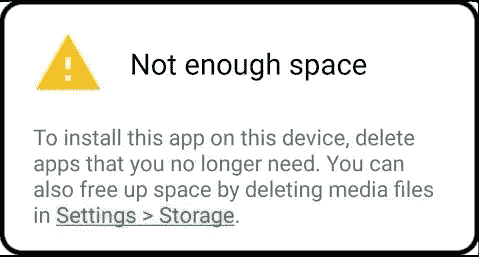
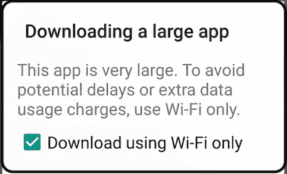
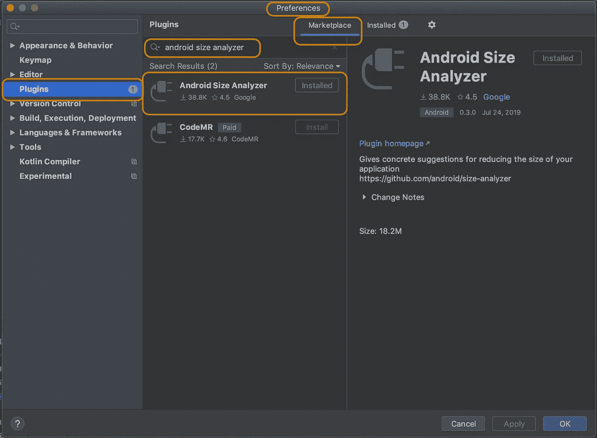

# 越小越好:减少 Android 应用程序的大小

> 原文：<https://betterprogramming.pub/the-smaller-the-better-reducing-android-app-size-3b063a40ded7>

## 较小的 APK 大小可以带来更多的用户和更好的首次用户体验

在 [Unsplash](https://unsplash.com/s/photos/small-size?utm_source=unsplash&utm_medium=referral&utm_content=creditCopyText) 上由 [amirali mirhashemian](https://unsplash.com/@amir_v_ali?utm_source=unsplash&utm_medium=referral&utm_content=creditCopyText) 拍摄的照片

你下载过多少次大型应用程序？很少，对吧？那么，如果你的应用耗费了用户这么多的数据、时间、电池和空间，你怎么能指望他们下载你的应用呢？

当人们去 Play Store 下载应用程序时，应用程序的大小是他们考虑的一个重要因素。应用程序越小越好。

繁重的应用程序在下载时会占用大量的数据、更多的下载时间和大量的设备空间。它减少了你的应用程序达到更合理大小的机会。

这种景象并不好看，如果你的应用程序需要额外的空间，那么很少有用户会去设置和删除媒体文件来下载你的应用程序。在另一种情况下，如果他们想下载其他应用程序并看到这个，他们可能会删除占用大量空间的应用程序，即您的大尺寸应用程序。

你认为人们在看到这个之后会继续前进吗？我不这么认为。不管你的应用程序有多神奇，除非人们下载并使用它，否则它没有多大作用。看到带有大文件警告的弹出窗口会降低应用程序被下载的几率。

Android 设备的存储、电池和互联网都受到限制。人们不希望在一个应用程序上花费太多。如果你想为[下一个十亿用户](https://developer.android.com/distribute/best-practices/develop/build-for-the-next-billion)开发应用，这是第一个最佳实践:为入门级设备优化应用。

还不信服？阅读文章"[缩减 apk，增加安装量](https://medium.com/googleplaydev/shrinking-apks-growing-installs-5d3fcba23ce2)"对于 100MB 以下的应用，APK 大小与安装转化率之间存在负相关关系。

我们总能找到一些方法来减小应用程序的大小。一个应用程序包含的东西比它实际需要或做的要多。作为开发人员，我们肯定可以实现一些步骤，向用户交付一个小型的应用程序，其中只包含所需的资源和文件。

在本文中，我将分享我减小应用程序大小的经验，以及帮助我实现这一目标的资源和工具。

# 应用捆绑包

如果你还没有探索过 Android 应用捆绑包，那么现在就去探索吧。应用捆绑是在 Play Store 上发布应用的另一种格式。

让我们分析一下是什么增加了应用程序的规模:

*   它包含所有语言的资源，甚至当用户只想使用 Odia 中的应用程序时也是如此。为其他语言添加的字符串对用户来说是无用的，并且是对他们设备上的应用程序的不必要的添加。
*   它包含每种屏幕密度的资源，即使用户的设备不需要它们。
*   应用程序中有一些功能不是每个人都要使用的，它们有时会增加很多大小。

使用应用捆绑包，我们可以拥有按需功能。这意味着，如果有一些重负载特性，而它对一些用户没有用，它不会被添加到他们的应用程序下载中。如果有人需要，可以选择按需下载。例如，不会将所有屏幕密度资源下载到设备上，只会下载用户需要的资源。语言也是如此。

# 安卓尺寸分析仪

我们可以使用一个插件来分析这个应用程序:Android Size Analyzer。这可以帮助我们找到减小应用程序大小的方法。

如果没有安装，可以在 Android Studio 本身找到。遵循以下步骤-

1.  Android Studio ->首选项
2.  转到插件，然后转到市场。
3.  搜索“安卓尺寸分析仪”安装它。

要运行 analyzer，请转到分析->分析应用程序大小。它会打开一个窗口，提供减小应用程序大小的建议。

## 对图像使用 WebP 文件格式

正如我们看到的，第一个建议是关于图像的。这个项目中使用了一些 PNG 或 JPEG 文件格式的图像。使用 WebP 格式，我们可以进行有损压缩以及透明压缩，压缩效果比 JPEG 和 PNG 更好。转换到 WebP 是一个简单的步骤。分析者指出问题并提出解决方案。单击分析器中的图像，您可以看到将图像转换为 WebP 文件格式的选项。

## 删除未使用的资源

我们添加到项目中的每一个资源都会增加应用程序的大小，不管项目是否使用它。要识别和移除资源，Android Studio 中有一个选项。

转到折射->删除未使用的资源。这将检查应用程序中没有使用的资源并删除它们。

我发现还有一个工具对代码检查非常有帮助。它在应用程序基本代码 lint 中查找错误和警告。

## 线头

要使用此功能，请进入分析- >检查代码。这指向项目中没有使用的代码。 [Lint](https://developer.android.com/studio/write/lint) 帮助我们识别代码的结构质量，而无需执行代码或编写测试用例。

# R8 收缩

通过使用 lint 并移除未使用的资源，您可以移除已经添加的资源并减小大小。您添加的库附带的文件和资源呢？您总是需要库附带的所有代码吗？不完全是。我们在 Gradle 中添加的库提供了很多功能。有时，我们的应用程序只需要库的一小部分。我们可以通过启用`minifyEnabled`和`shrinkResources`来移除未使用的代码和资源。在运行时，这可以检查对你的应用程序有用的部分，只保留它们并删除其他部分。

# resConfigs

`shrinkResources`只会缩减应用程序不需要的资源。它不会删除本地化中使用的资源。例如，您的应用程序目前支持三种语言。但是我们在项目中添加的库可能支持很多语言。在 app 级别的`build.gradle`中添加以下内容，可以移除其他语言的资源。

除此之外，尽可能重用代码和资源。不要重复编写同一段代码。它有助于更快地进行更改，并有助于减少应用程序的大小。

# 摘要

*   如果您还没有开始使用 App Bundle 发布应用程序，那么现在就开始吧。
*   使用 Android Size Analyzer 获得减少应用程序大小的建议，并使用 lint 进行代码检查。
*   对图像使用 WebP 文件格式，而不是 PNG 或 JPEG。
*   如果某些代码或资源是不需要的，就将其删除。
*   使用 R8 收缩。
*   尽可能重用代码和资源。

还有其他一些很好的资源解释了减少应用程序大小的方法。请查阅参考资料。

# 参考

*   [大小很重要:你的应用大小如何影响你的客户](https://medium.com/pixplicity/size-matters-how-your-app-size-is-costing-you-customers-6121d6db74e)
*   [缩小你的应用尺寸](https://developer.android.com/topic/performance/reduce-apk-size)
*   [如何缩小你的 app 尺寸？](https://dev.to/amitspaceo/how-to-reduce-android-app-size-android-tutorial-578i)
*   [缩小 APK 尺寸](https://blog.mindorks.com/how-to-reduce-apk-size-in-android-2f3713d2d662)
*   [阅读更多关于应用捆绑包的信息](https://developer.android.com/guide/app-bundle)
*   [阅读更多关于 lint 的信息](https://developer.android.com/studio/write/lint)
*   [阅读更多关于 R8 萎缩的信息](https://developer.android.com/studio/build/shrink-code)

感谢阅读！