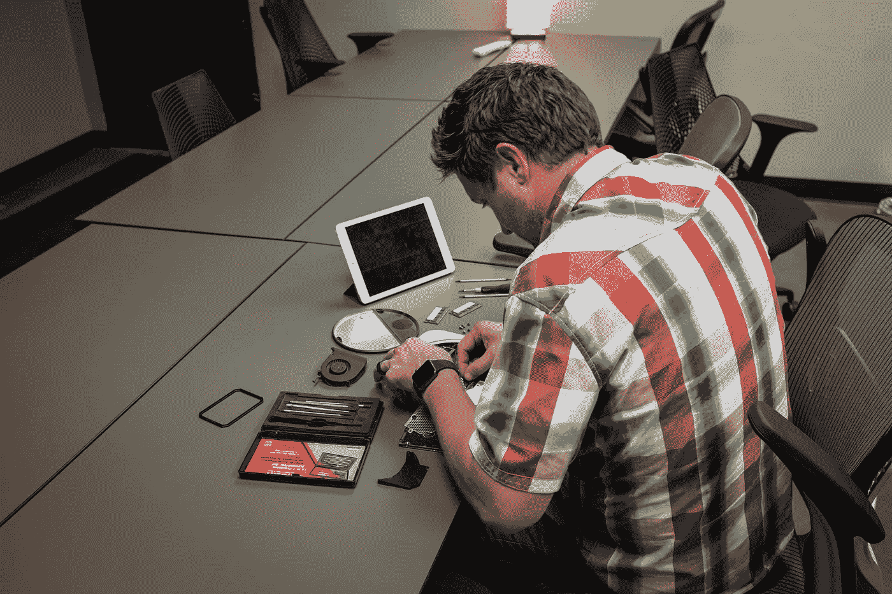
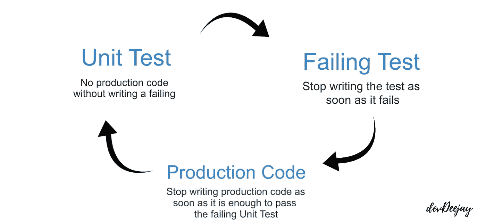

# 软件开发过程中断

> 原文：<https://betterprogramming.pub/the-software-development-process-is-broken-901cde0f98be>

## # 100 日代码的第 30 天

## 测试驱动的开发如何为您解决这个问题

在 [Unsplash](https://unsplash.com/s/photos/fix?utm_source=unsplash&utm_medium=referral&utm_content=creditCopyText) 上 [NeONBRAND](https://unsplash.com/@neonbrand?utm_source=unsplash&utm_medium=referral&utm_content=creditCopyText) 拍摄的照片

外科医生在见病人之前要洗手，这就像一种仪式，他们必须这样做。世卫组织有他们必须遵守的严格的[指导方针](http://whqlibdoc.who.int/hq/2009/WHO_IER_PSP_2009.07_eng.pdf)。这里有一个简短的视频,你可以看到他们遵守了多少手部卫生的规定。

但是在 19 世纪没有这样做，很多病人在手术后死亡，因为在那个时候，他们没有这样的纪律或指导方针来遵守手卫生。

同样，也发生过多起因软件系统不良而导致人员死亡的事件。无论是自动驾驶汽车撞上公共汽车，还是 737 Max 因[有问题的软件](https://fortune.com/2019/10/04/boeing-737-max-culture-muilenburg/)而坠毁，生命损失确实会因为糟糕的软件系统而发生。

不幸的是，我们没有任何专业的，严格的纪律，我们在编写代码时虔诚地坚持，以确保我们的软件系统对失败是健壮的，类似于 19 世纪的外科医生。

测试驱动开发( *TDD* )是最容易被忽视的开发过程之一，这是有原因的，我们在学习了 Robert C. Martin 提供的测试驱动开发的三大法则后就会知道。

# **测试驱动开发的三大法则**

## 1.除非是为了通过失败的单元测试，否则不允许编写任何产品代码。

你会说:“我如何为不存在的东西编写单元测试用例？真是疯了！”而且，你是完全正确的。但是等等，更糟的是…

## 2.不允许编写超过足以失败的单元测试，编译失败就是失败。

所以等一下，一旦你写的代码足够给出一个编译时错误或者一个失败的测试，你就不会再写任何测试代码了？

没错。你答对了！这条规则要求你在产品代码和测试套件之间来回切换，即使是在编写一个测试用例的时候。只是，如果这还没有让你的生活变得艰难…

## 3.除了足以通过单元测试失败的代码之外，不允许编写更多的产品代码。

我们现在该怎么办？

# 理解测试驱动的开发

如果你观察 TDD 的三个法则，你会发现它创造了一个循环，你不断地围绕这个循环发展。

你看，这是从编写单元测试开始的。一旦遇到编译时错误，就继续编写产品代码来解决*只是*编译时错误。

如果你能够完成一个测试用例，那么运行看看它是否失败。如果是的话，继续编写代码**来通过这个测试。你不断重复这个循环。**

**今天，许多有经验的软件开发人员认为这个过程是缓慢的、疯狂的、愚蠢的、无聊的、打断的。但是对于 19 世纪的许多外科医生来说，洗手也是缓慢的、疯狂的、愚蠢的、无聊的，并且会打断他们的工作。**

**假设您有两个开发团队在一个项目上工作。第一个团队遵循 TDD，而第二个团队遵循他们编写产品代码以满足需求的常规方法。**

**在任何时候，你从第一个团队中挑选任何一个开发人员，无论他在代码中取得了什么，都将完美地工作，通过所有的测试用例，因此给他和他的团队信心，他们的项目总是准备好部署到生产中。**

**而另一个团队的开发人员可能仍然在编写模块的代码，如果不手动构建和运行项目模块，就无法进行验证。**

**即使第二个开发人员可能已经编写了一些测试用例(他只需要完成过程的一部分，因为他知道他的模块可以工作)，测试套件也可能会受到损害，因此，不会给你生产就绪的信心，即使它会通过开发人员编写的所有测试用例。**

## **你认为两个开发人员在调试上花了多少时间？**

**第二个开发人员将总是花费更多的时间调试，因为我们总是在那个地方。我们已经看到很多天我们花更多的时间调试代码。我们花更多的时间在调试器上，而不是写代码。**

**我们花在调试和调试器上的时间应该是最少的。你不应该掌握使用调试器的技能，而应该掌握编写无错误代码的技能。**

**我们到底是谁，程序员还是调试器？**

**像第一个开发人员一样，如果我们遵循 TDD，我们需要做的唯一调试就是按 Ctrl+Z 来撤销代码，直到它通过最后一次测试，并从那里重新编写代码。**

****

# **编写测试的重要性**

**假设您正在使用一个第三方库，您将首先探索它的文档查找代码示例，并尝试阅读代码(这可能很难阅读)，理解它在做什么，也许可以复制粘贴到您的机器上运行以尝试一下。**

**如果这个库有一个测试套件，那么一个接一个地阅读和理解一个单独的测试将会非常容易，因为这些测试彼此完全独立地运行。**

**测试中没有耦合，所有的东西都在一个地方，这使得阅读、理解和运行来查看事情是否正常变得容易。**

**这些测试是代码如何工作以及最终结果是什么的文档。除了测试之外，您不需要阅读任何其他内容，就可以自信地理解第三方库的功能。**

**通常，我们首先编写生产代码，我们通过手动运行*来检查它是否正常工作。因为编写代码测试是“*过程的一部分”*我们只是从头开始写一些单元测试，再次验证我们已经工作的代码库。***

*我们想开始解决项目中的下一个很酷的问题，而不是为已经工作的东西编写测试。*

*因此，我们创建的测试套件受到了损害。它有洞。它坏了。即使所有的测试都成功运行，它也不能真正告诉我们任何事情。如果测试失败了，它可能会失败，但是如果它运行了，它不会给你任何信心。*

**

# *TDD 有什么不同？*

*当您首先编写测试时，会发生一些不同的事情。*

*   *写起来很有趣，因为你写代码来修复坏掉的东西。(破碎的测试用例。)*
*   *编写不可测试的代码是不可能的。对于复杂的函数，之后编写测试可能真的很难，因为这些函数可能是高度耦合的，这使得它们更难测试。*
*   *它使你的代码易于阅读和理解。它帮助你编写解耦的函数，使你的函数易于阅读和理解。干净代码 101！*
*   *给你信心。当您的所有测试都通过时，这实际上意味着您已经可以生产了。*
*   *帮助你处理不好的代码。在下面的章节中会有更多的介绍。*

# *TDD 如何帮助您处理现有的坏代码*

*我们知道糟糕的代码会减慢我们的速度，如果系统中有一点点糟糕的代码，随着时间的推移，整个开发团队都会失去生产力。*

*如果你看到一些不好的代码，你不会试图修复它，因为你没有办法验证系统的完整性，即使你做了最小的改变。因此，你害怕做出改变，因为如果你打破它，它就会变成你的。这就像一个所有开发者都害怕的诅咒。*

*因此，如果您不得不编写一些与坏代码交互的代码，您将不会编写干净的代码来确保系统的完整性。您将编写代码来捍卫自己的工作，以确保它不会影响到您。*

*因为那些糟糕的代码，你正在损害你自己的代码。因此，你的整个项目代码会随着时间而腐烂，看看它是如何增长的？*

*测试套件帮助你处理糟糕的代码，因为如果你开始做一些改变，比如重命名一个变量，你就运行了你的测试套件。如果你重构一个语句，你运行你的测试套件。*

*如果你移动一个语句，你再次运行你的测试套件，如果测试失败，你知道是什么破坏了它。如果你有一个可靠的测试套件，作为一个开发人员，你总是有信心的。*

*无论您做什么，测试套件都可以帮助您快速找到错误。*

*今天到此为止！在下一个故事中，我们将通过一些实际的代码示例来学习如何按照 TDD 编写代码。敬请关注！激动人心的时刻即将到来！*

*一如既往…感谢阅读！祝你过得愉快。*