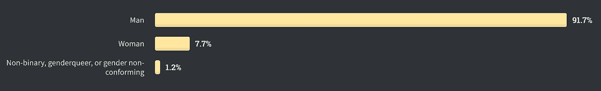

# 软件工程的招聘过程是破碎的和排外的

> 原文：<https://betterprogramming.pub/the-software-engineering-hiring-process-is-broken-and-exclusionary-1632cc5a030c>

## 如果我们真的想吸引多样化的人才，我们需要挑战它

迈克尔·芬顿在 [Unsplash](https://unsplash.com?utm_source=medium&utm_medium=referral) 上的照片

许多公司仍然坚持雇佣那个神话般的 10x 开发人员，所以他们的选择过程更像是《T4》中的《十二项任务》而不是一场现实而诚实的工程面试。

面试过程旨在寻找一个一生只有一次的人，而这个人可能根本不存在。这通常会转化为面试要求不可能的事情，并占用候选人太多的时间。这样一来，我们不仅让每个人都感到讨厌，还把少数民族排除在 STEM 之外。

我们需要在面试过程中有所创新。我们需要重新设计它，这样它就可以在候选人身上找到有价值的信号，而不会在这个过程中毁掉他们的生活。当我们第一次遇到试图在技术领域找到一席之地的少数群体时，我们需要停止成为高中恶霸。

# 面试流程被打破

只需与其他开发人员交谈或开始简单的谷歌搜索，就可以对比这种说法有多流行:

> 软件工程面试坏了。

只有少数局外人认为这不是真的。

所以对我来说，很明显大多数人发现面试完全出了问题。面试系统地不符合候选人的期望。

甚至一些关于面试准备的书也是从这个假设开始，并告诉你按照这个假设去做。我们所有人——有能力负担得起的人——都会配合，因为我们想要这份工作。

## 10x 软件工程师是一种神话动物

[苏丹欧阳](https://unsplash.com/@sdoy1995?utm_source=medium&utm_medium=referral)在 [Unsplash](https://unsplash.com?utm_source=medium&utm_medium=referral) 上的照片

我相信对候选人的期望和大多数候选人想要的之间的这种不匹配来自于所谓的 10x 工程师存在的想法。(你可以没完没了地雇佣他们，然后付给他们很少的钱。)

如果你想知道， [Techopedia](https://www.techopedia.com/definition/31673/10x-developer) 是这样定义 10x 工程师的:

> “10 倍开发者是指在他或她的领域里被认为和其他 10 倍的人一样有生产力的人。在生产、工程或软件设计环境中，10 倍的开发人员将产生 10 倍于其他同事的成果。
> 
> 10x 开发人员也被称为 10x 程序员或 10x 工程师。"

好吧，等一下。这到底是什么意思？这样的人*真的*存在吗？

我从没见过这样的人，也许我见过，但他们是个混蛋。

那么，为什么不把选择过程定位于…你知道，真正的、有天赋的人呢？

## 面试只考虑一种类型的人

上次我面试工作时，我不得不:

*   与招聘人员交谈
*   完成一项家庭作业(对此我从未收到过详细的反馈)
*   进行两个小时的工程面试(其中一个小时，有最疯狂的编码任务)
*   在公司一天八小时考试。免费

有些地方甚至要求你在 GitHub 上有一个好看的、**公开的**，最新的编码组合。我写的大部分代码都是私人的(因为我是在上班时间写的)。如果我想有这样一个投资组合，我必须在我的空闲时间做。

在我描述的所有情况中，共同的因素是**你需要投入大量空闲(无薪)时间**。

如果有人告诉你，你必须付钱才能工作，你可能会抓狂。那么，为什么期望候选人付出如此多的无偿劳动是可以接受的呢(他们甚至可能根本得不到这份工作)？

这只有在生活中已经领先的人才有可能。对于那些没有这样做的人来说，考虑换工作或在技术领域开始职业生涯可能会成为一个不可能的过程。

## 这也增加了对工作的不满

难怪许多乡亲被再次采访吓坏了。有时候，它只是觉得不值得花费精力、时间和金钱。

这可能会迫使人们在他们讨厌的工作上呆太久。感觉上，和让自己经历一个新的面试过程相比，呆在一份糟糕的工作中是较小的罪恶。

# STEM 中的少数族裔克服额外的挑战获得就业

2021 年，每个人都在谈论工作场所的多元化和包容性。我们开始认识到多样性是好的，在科技领域也是如此。

我们一直在抱怨我们在技术方面没有足够的[插入不是白人 cishet dude 的人],而我们从一开始就一直在欺负他们。

我要说这不是应该走的路。

## 92%的职业开发人员是男性

如果只关注性别，根据 [Stack Overflow 的 2020 年开发者调查](https://insights.stackoverflow.com/survey/2020#developer-profile-gender-professional-developers2)，调查了 41809 人，92%是男性。只有 7.7%的人认为自己是女性，只有 1.2%的人认为自己是非二元身份。

与 [Stack Overflow 2020 开发商调查](https://insights.stackoverflow.com/survey/2020#developer-profile-gender-professional-developers2)结果相对应的人口统计数据。贷记[栈溢出](https://insights.stackoverflow.com)。

我们可以说这些数据是有偏见的(它显然只考虑了*回答*调查的人，而不是所有专业开发人员的真实人数)。然而，这是一个很好的指标，表明不认为自己是男性的人在这个行业找到一个舒适的位置是多么困难。

## 少数群体通常不得不处理额外的无偿工作量

他们说我们一天都有同样的 24 小时。嗯，[这并不一定对每个人都适用](https://www.voicesofyouth.org/blog/we-dont-all-have-same-24-hours-day)。

就女性而言，她们承担了家庭中最大的无报酬和无形的工作。这表现在烹饪和组织膳食，打扫卫生和其他家务，或者照顾孩子，等等。

显然，当你必须完成所有这些任务时，你需要从你的 24 小时计数中减去它们所花费的时间。这使得你几乎没有时间拥有一个完美的最新的 GitHub 个人资料，或者承担 4 个多小时的编程作业。

## 缺乏多样性导致了亲缘偏见

缺乏多样性会带来毁灭性的后果。并且[它传播更多缺乏多样性的](https://www.theguardian.com/technology/2018/oct/11/tech-gender-problem-amazon-facebook-bias-women)。

在面试的范围内，这表现为[亲和力偏差](https://theewgroup.com/different-types-unconscious-bias/#Affinity-bias):

> “当我们更友好地对待他人，仅仅因为他们像我们或我们喜欢的其他人时，亲和偏见(也称为相似性偏见)就会发生。相似性可以包括任何共有的共性，包括从喜欢、不喜欢或外表到学校教育或职业经历的一切。”

当招聘小组主要由白人男性组成时，面试过程更有可能有利于白人男性，因为他们通常需要做更少的无形劳动。从参加面试的人来看，更有可能的是，一个白人会得到这份工作。

# 招聘过程需要挑战

对(几乎)业内的每个人来说，有一点是显而易见的:面试过程是有缺陷的。

由于面试通常是获得新职位的第一步，有了这些缺陷，我们就为一些代表性不足的个人进入该行业把关。

> 如果我们一开始就不邀请他们，我们就不能指望他们进来。

这就是为什么我们需要挑战这些过程，使它们变得公平和包容。

## 天赋是双向的

在 [Unsplash](https://unsplash.com?utm_source=medium&utm_medium=referral) 上 [Kaffeebart](https://unsplash.com/@kaffeebart?utm_source=medium&utm_medium=referral) 拍摄的照片

房间里的大象:如果我们面试的方式平庸，我们就不能指望候选人有非凡的才华。

如果我们能够*仅仅*在期望从候选人那里得到无数小时的家庭作业、不可能的测验和几乎无限轮的面试之后得出结论……我们难道没有做错什么吗？

业内人士——尤其是那些试图进入该行业但未被充分代表的人——迫切需要改变。非常有必要重新设计整个面试过程。

我们需要更多有才华的面试。从候选人那里窃取最少时间并仍然能够提取最多信息的过程。包容性的过程，为多样性提供了真正的空间。

## 信号比细节更重要

Gayle Laakmann McDowell [对此有一个很好的方法](https://www.quora.com/profile/Gayle-Laakmann-McDowell)。特定问题的最优解决方案并不总是性能的良好指标。

相反，更重要的是注意应聘者在面试中发出的*信号*。

如果一个过程设计得很好，我们应该已经能够在一到两个小时的采访中看到非常重要的信号。候选人如何处理新信息？他们是怎么想的？他们解决问题的过程是怎样的？他们是如何交流的？他们愿意接受反馈吗？

更多的时间不一定意味着你会获得更多的见解。这意味着你会…嗯，从候选人身上花更多的时间。

这同样适用于那些不可能的测验和白板测试。候选人记住任何算法的能力不一定是他们未来表现的良好指标。然而，这是一个很好的指标，表明他们记住算法的能力。

## 如果你还不能做得更好，考虑给候选人时间

毫无疑问，最好的方法是重新定义我们所知道的整个面试过程。

如果你还做不到，想想候选人在你的过程中花费的所有时间，他们不确定最终会得到这份工作。你能以任何方式补偿他们吗？

最糟糕的情况可能是向候选人支付时间费用。然而，这可能有点挑战性，因为这可能会给他们带来一些意想不到的税务困扰。

所以，我想唯一可行的选择就是改变整个过程。

# 痛苦的面试对人才来说是一种排斥

软件工程面试流程破了，只适合一个不可能的匹配。

其不切实际的设计不仅让所有人感到愤怒，还将科技行业中代表性不足的群体排除在外。

我们需要挑战这一过程，重新定义业内面试的标准。假设候选人可以在我们的流程中加入无偿劳动，这是不公平和排外的，我们需要找到更有才华的方式来解读信号，让他们成为好员工