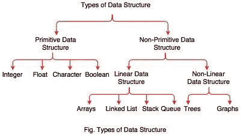

# 软件工程面试学习指南

> 原文：<https://betterprogramming.pub/the-software-engineering-study-guide-for-interviews-53b42d82deb0>

## 实习生版

Artem Sapegin 在 [Unsplash](https://unsplash.com/search/photos/interns-programming?utm_source=unsplash&utm_medium=referral&utm_content=creditCopyText) 上拍摄的照片

最近，我们的团队整理了一份清单，帮助[软件工程师准备未来的面试](https://medium.com/better-programming/the-software-engineering-study-guide-bac25b8b61eb)。这个清单是为有 2-5 年经验的工程师准备的，所以它涵盖了很多主题，包括动态编程和一百多个技术问题和资源。

我们想为实习生准备一份类似的清单。除了提供这份清单，我们的团队还致力于开发超出你应该学习的技巧。这是因为大多数有 2-5 年工作经验的工程师都参加过相当多的面试，并习惯了这个过程。

这篇文章也将提供一些面试的技巧和窍门。

首先，让我们先做一些热身运动。通常，第一次面试会通过电话进行，会涉及一些非常基本的问题。这些问题用来衡量你处理基本编程问题的能力。为了跟踪你的工作，你可以[遵循这个清单](https://docs.google.com/spreadsheets/d/1mfZX6EusVSAkWi1kRFuqVJnVGgpa7drqBlDjlTAY0uE/edit#gid=0)！

# 热身运动

1.  [嘶嘶的嗡嗡声](https://www.hackerrank.com/challenges/fizzbuzz/problem)
2.  [560。子阵列和等于 K](https://leetcode.com/problems/subarray-sum-equals-k/)
3.  [第 n 个斐波那契](https://www.algoexpert.io/questions/Nth%20Fibonacci)

现在，让我们明确一点，如果你没有解决这些问题，那也没关系。你可能在学校没有尝试解决这样的问题(可能在工作中也不会发现)。面试问题往往不会反映你将要做的工作。相反，它更注重解决问题。

我们这样说是因为我们不想让你气馁。我们很多人第一次尝试都没有得到实习机会。这需要时间，面试是一种技巧，如果你的前几个面试很糟糕也没关系。

在你学习的时候，一定要找一个能和你一起模拟面试的人。模拟面试教会你如何交流解决问题的方法。这是编写面试代码的关键，因为如果你的面试官很优秀，他们会一直帮助你。但是如果他们不知道你要去哪里，他们就帮不了你。

年轻的面试官可能会觉得需要自己解决问题。相反，与你的面试官交流。在试图在白板上解决问题之前，讨论你的计划是什么，你将如何解决问题。通过这样做，你做了几件事。第一，你示意你可以传达你的计划。这对任何员工来说都是一项很好的技能。其次，也是更重要的，一个好的面试官会在你将要走错路的时候有所察觉。他们可以帮助你指出正确的方向，因为你可能会发现自己花了十分钟写你的解决方案，而它是完全关闭的。因此，轻松地解释你的计划是非常有帮助的。

好了，现在我们开始吧！大多数科技公司希望你在面试前熟悉数据结构和算法，因为大多数面试问题都集中在这些话题上。所以我们先来搞清楚你在这些题目中哪一个是弱项。

# 算法和数据结构

我们来试几个数据结构和算法问题。当你经历这些问题时，确保你不会被压倒。你可能不知道所有这些问题的答案。没关系，这是过程的一部分。你不会想很快解决这些问题。你需要考虑你的解决方案。所以不要给自己计时，不要过度紧张。

1.  [985。查询后偶数的总和](https://leetcode.com/problems/sum-of-even-numbers-after-queries/)
2.  [657。机器人返回原点](https://leetcode.com/problems/robot-return-to-origin/)
3.  [961。大小为 2N 的数组中的 n 个重复元素](https://leetcode.com/problems/n-repeated-element-in-size-2n-array/)
4.  110。平衡二叉树

以下是我们的推荐。不要只是试图回答这个问题。这并不重要。相反，拿一张纸，试着画出你想做的事情。如果你想颠倒一个列表，画出需要发生的事情。什么东西指向哪里，什么时候，有没有循环等等？形象地画出来。这将帮助您明确您想要编码的内容。

一旦你把它画出来，然后编码你的解决方案。如果你想更上一层楼，那就去找别人，跟他们解释解决办法。这些问题中的每一个都不应该只是五分钟或十分钟的练习。一天解决一两个问题是可以的。这不是要经历大量的问题，而是要理解如何解决问题。你不可能记住每一个问题，所以专注于解决问题。

# 数据结构和算法视频

## 数据结构

1.  [数据结构&算法# 1——什么是数据结构？](https://www.youtube.com/watch?v=bum_19loj9A) —视频
2.  [多维](https://archive.org/details/0102WhatYouShouldKnow/02_05-multidimensionalArrays.mp4) —视频
3.  [动态数组](https://www.coursera.org/learn/data-structures/lecture/EwbnV/dynamic-arrays) —视频
4.  [调整数组大小](https://archive.org/details/0102WhatYouShouldKnow/03_01-resizableArrays.mp4) —视频
5.  [数据结构:链表](https://youtu.be/njTh_OwMljA) —视频
6.  [核心链表 Vs 数组](https://www.coursera.org/learn/data-structures-optimizing-performance/lecture/rjBs9/core-linked-lists-vs-arrays) —视频
7.  [指针对指针](https://www.eskimo.com/~scs/cclass/int/sx8.html) —视频
8.  [数据结构:树木](https://youtu.be/oSWTXtMglKE) —视频
9.  [数据结构:堆](https://youtu.be/t0Cq6tVNRBA) —视频
10.  [数据结构:哈希表](https://youtu.be/shs0KM3wKv8) —视频
11.  [电话簿问题](https://www.coursera.org/learn/data-structures/lecture/NYZZP/phone-book-problem) —视频
12.  [数据结构:堆栈和队列](https://youtu.be/wjI1WNcIntg) —视频
13.  [使用堆栈后进先出](https://archive.org/details/0102WhatYouShouldKnow/05_01-usingStacksForLast-inFirst-out.mp4) —视频
14.  [数据结构:计算机科学速成班#14](https://youtu.be/DuDz6B4cqVc) —视频
15.  [数据结构:尝试](https://www.youtube.com/watch?v=zIjfhVPRZCg) —视频

## 算法

1.  [算法:图搜索、DFS 和 BFS](https://www.youtube.com/watch?v=zaBhtODEL0w&list=PLX6IKgS15Ue02WDPRCmYKuZicQHit9kFt) —视频
2.  [BFS(广度优先搜索)和 DFS(深度优先搜索)](https://www.youtube.com/watch?v=uWL6FJhq5fM) —视频
3.  [算法:二分搜索法](https://youtu.be/P3YID7liBug) —视频
4.  [二叉查找树评论](https://www.youtube.com/watch?v=x6At0nzX92o&index=1&list=PLA5Lqm4uh9Bbq-E0ZnqTIa8LRaL77ica6) —视频
5.  [Python 算法面试](https://www.youtube.com/watch?v=p65AHm9MX80) —视频
6.  [算法:递归](https://youtu.be/KEEKn7Me-ms) —视频
7.  [算法:冒泡排序](https://youtu.be/6Gv8vg0kcHc) —视频
8.  [算法:合并排序](https://youtu.be/KF2j-9iSf4Q) —视频
9.  [算法:快速排序](https://youtu.be/SLauY6PpjW4) —视频

# 大 O 符号

一些学生忘记学习的一个科目是大 O 记数法，也称为时间复杂性。因此，我们想提供几个视频，让您评估自己的技能水平。

1.  [大 O 符号和时间复杂度介绍(数据结构&算法#7)](https://www.youtube.com/watch?v=D6xkbGLQesk) —视频
2.  [哈佛 CS50 —渐近符号](https://www.youtube.com/watch?v=iOq5kSKqeR4) —视频
3.  [算法复杂性分析简介](http://discrete.gr/complexity/) —帖子
4.  [备忘单](http://bigocheatsheet.com/) —张贴

# 更多编程问题

看完所有的视频后，你应该多做几道题。这样你可以看到你做得有多好！

1.  [河流大小](https://www.algoexpert.io/questions/River%20Sizes)
2.  [越大越好](https://www.hackerrank.com/challenges/bigger-is-greater/problem)
3.  [6。锯齿形转换](https://leetcode.com/problems/zigzag-conversion/)
4.  [7。反向整数](https://leetcode.com/problems/reverse-integer/)
5.  [四十。组合和二](https://leetcode.com/problems/combination-sum-ii/)
6.  [43。乘法字符串](https://leetcode.com/problems/multiply-strings/)
7.  [拉里的阵列](https://www.hackerrank.com/challenges/larrys-array/problem)

# 系统设计

不要以为你是实习生就没人会问你系统设计的问题。系统设计是判断一个人经验水平非常关键的部分。如果你想从其他实习生中脱颖而出，那么你就想在任何涉及系统设计的面试中表现出色。

如果有的话，我们至少会建议你看停车场的录像。对于实习生来说，这是一个很好的系统设计面试问题，因为它避免了太多你可能不习惯的复杂组件，并更专注于设计和处理模糊性。

1.  [停车场系统](https://youtu.be/DSGsa0pu8-k) —视频
2.  [WhatsApp](https://www.youtube.com/watch?v=vvhC64hQZMk) —视频
3.  [优步设计](https://youtu.be/umWABit-wbk) —视频
4.  [Instagram](https://www.youtube.com/watch?v=QmX2NPkJTKg) —视频
5.  [火绒服务](https://www.youtube.com/watch?v=xQnIN9bW0og) —视频

# 面向对象的问题

接下来的几个部分不一定会在面试中涉及到，只是以防万一！

掌握一些面向对象/设计原则是很有价值的。这部分都是视频，但是一定要看，要做笔记！

1.  [编程教程— 49 —传承](https://www.youtube.com/watch?v=9JpNY-XAseg) —视频
2.  [Java 编程教程— 55 —多态介绍](https://www.youtube.com/watch?v=0xw06loTm1k) —视频
3.  [Java 编程教程— 58 —抽象和具体类](https://www.youtube.com/watch?v=TyPNvt6Zg8c) —视频
4.  [Java 编程教程— 57 —覆盖规则](https://www.youtube.com/watch?v=zN9pKULyoj4&t=3s) —视频
5.  [Java 编程教程— 59 —保存对象的类](https://www.youtube.com/watch?v=slY5Ag7IjM0)
6.  [面向对象编程](https://www.youtube.com/watch?v=lbXsrHGhBAU) —视频
7.  [工厂设计模式](https://www.youtube.com/watch?v=ub0DXaeV6hA) —视频
8.  [观察者设计模式](https://youtu.be/wiQdrH2YpT4) —视频
9.  [适配器设计模式](https://www.youtube.com/watch?v=qG286LQM6BU&list=PLF206E906175C7E07&index=13) —视频
10.  [立面设计图案](https://www.youtube.com/watch?v=B1Y8fcYrz5o&list=PLF206E906175C7E07&index=14) —视频
11.  [责任链设计模式](https://www.youtube.com/watch?v=jDX6x8qmjbA&list=PLF206E906175C7E07&index=22) —视频
12.  [解释器设计模式](https://www.youtube.com/watch?v=6CVymSJQuJE&list=PLF206E906175C7E07&index=23) —视频
13.  [单例设计模式教程](https://www.youtube.com/watch?v=NZaXM67fxbs&list=PLF206E906175C7E07&index=7) —视频
14.  [第六章(第一部分)—模式(视频)](https://youtu.be/LAP2A80Ajrg?list=PLJ9pm_Rc9HesnkwKlal_buSIHA-jTZMpO&t=3344) —视频
15.  [头先设计图案](https://www.amazon.com/Head-First-Design-Patterns-Freeman/dp/0596007124) —视频

# 结构化查询语言

这是最后一部分。你可能不会被问到太多的 SQL 问题，但是，把它们放在你的口袋里总是好的。

有时面试会附带一些东西，以确保你有广泛的技能。

## SQL —问题

1.  [262。行程和用户](https://leetcode.com/problems/trips-and-users/)
2.  601。体育场的人流量
3.  [185。部门前三名薪资](https://leetcode.com/problems/department-top-three-salaries/)
4.  [626。交换座位](https://leetcode.com/problems/exchange-seats/)
5.  [黑客对报告进行排名](https://www.hackerrank.com/challenges/the-report/problem)
6.  [177。第 n 高工资](https://leetcode.com/problems/nth-highest-salary/)
7.  [对称对](https://www.hackerrank.com/challenges/symmetric-pairs/problem)
8.  [职业](https://www.hackerrank.com/challenges/occupations/problem) [职位安排](https://www.hackerrank.com/challenges/placements/problem)
9.  [奥利凡德的库存](https://www.hackerrank.com/challenges/harry-potter-and-wands/problem)

## SQL —视频

1.  [IQ15: 6 SQL 查询面试问题](https://www.youtube.com/watch?v=uAWWhEA57bE) —视频
2.  [学习行号和解析函数](https://www.youtube.com/watch?v=QFj-hZi8MKk) —视频
3.  [分析功能的高级实现](https://www.youtube.com/watch?v=G3kYPzLWtpo&t=4s) —视频
4.  [分析功能的高级实现第 2 部分](https://www.youtube.com/watch?v=XecU6Ieyu-4&t=54s) —视频
5.  [Wise Owl SQL 视频](https://www.youtube.com/watch?v=2-1XQHAgDsM&list=PL6EDEB03D20332309) —视频

## 发布 SQL 问题

1.  [二叉树节点](https://www.hackerrank.com/challenges/binary-search-tree-1/problem)
2.  [气象观测站 18](https://www.hackerrank.com/challenges/weather-observation-station-18/problem)
3.  [挑战](https://www.hackerrank.com/challenges/challenges/problem) [打印素数](https://www.hackerrank.com/challenges/print-prime-numbers/problem)
4.  [595。大国](https://leetcode.com/problems/big-countries/)
5.  [626。交换座位](https://leetcode.com/problems/exchange-seats/)
6.  [SQL 面试问题:3 个技术筛选练习(针对数据分析师)](https://data36.com/sql-interview-questions-tech-screening-data-analysts/)

# 结论

面试可能会很艰难，因为你会觉得自己毫无进展。拥有这份学习指南将有助于你跟踪你的进步，并让你更好地了解你是如何做的！

还有一些其他概念很少在实习生面试中出现，但却值得熟悉。这包括[动态](https://medium.com/free-code-camp/follow-these-steps-to-solve-any-dynamic-programming-interview-problem-cc98e508cd0e)和[功能](https://itnext.io/what-exactly-is-functional-programming-ea02c86753fd)编程