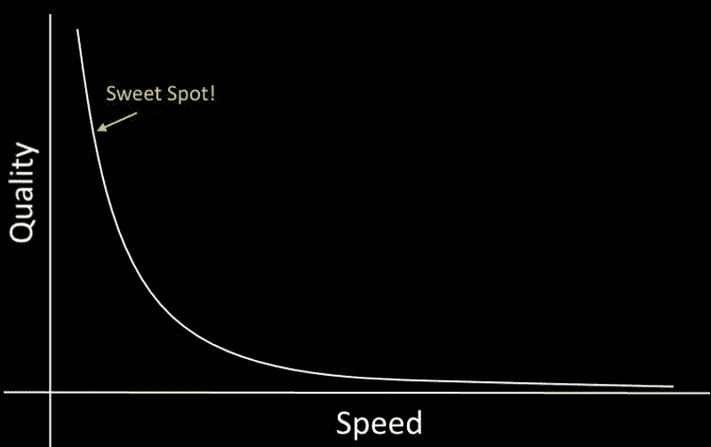

# 软件工程师的两难境地:你可以选择快速或者正确

> 原文：<https://betterprogramming.pub/the-software-engineers-dilemma-you-can-either-have-it-fast-or-right-e0b190b03144>

## 在使用软件时，你经常会听到“更快，更快，更快！”但是速度越快，质量越差。你能做什么？

[Justin Luebke](https://unsplash.com/@jluebke?utm_source=unsplash&utm_medium=referral&utm_content=creditCopyText) 在 [Unsplash](https://unsplash.com/s/photos/crossroads?utm_source=unsplash&utm_medium=referral&utm_content=creditCopyText) 上的照片(作者修改)。

前几天我在接听一个电话。

我们正在检查我的团队正在进行的一个项目的需求列表。我召开会议是为了让利益相关者知道开发将会放缓。

我团队中的高级架构师在项目进行到一半时离开了。所以我，当然，必须通知那些关心这个日期的人。

我得到的回答是“这是一个艰难的期限。我们仍然需要在那个日期之前完成所有的工作。”

所以我仍然需要少一个人完成同样的工作。

太好了。

在某些情况下，这实际上是一件好事。我相信我们都见过这样的说法:

在我的情况下，团队已经有点单薄了，所以我不得不提醒所有的涉众，你可以拥有软件*快*或者你可以拥有软件*正确*，但是你不能两者兼得。

这指的是质量与速度的永恒之战。

你是怎么平衡的？你能做些什么来更快地交付更多的软件？

# 找到平衡

如果你把它留给开发者，软件将永远不会发布。他们总是想在网页上添加“多一个功能”或收紧一些 CSS。

剧透提醒:完美的软件是不存在的。

从任何一个镜头来想。没有没有 bug 的软件。你不会让所有的顾客都 100%满意。开发人员不会不想重构某个东西。

软件是不断发展的。你必须在某个时候把它带给你的顾客。

另一方面，如果由销售部门决定，软件昨天就会完成:

*   “它解决了业务问题吗？”
*   “算是吧，是的。”
*   “出货吧。”

不幸的是，质量和速度的关系图不是线性的。人们会希望你每提前一周截止日期，质量就会变得更差一点。

没有。

当涉及到构建软件时，提前日期意味着走捷径。如果你开始在快捷方式上添加快捷方式，你将会得到更糟糕的结果。

软件会显得不稳定。看起来就没那么好看了。你会有间歇性的行为。

如果你不想让自己陷入困境，那就在质量方面做得更好。

# 保持一致

我在构建新软件时遵循的最大原则之一是[迭代](https://uxdesign.cc/itturat-ituratte-iterat-iterate-iterate-65199c4d5d53)。

通过快乐之路从头到尾完成业务流程。然后再传一次，把每件事都提高一点点。然后再做一次。再一次。

这将为你的应用程序提供一致的感觉，如果你被要求加快速度，也能保持最高的质量。

我经常看到团队在进入下一个部分之前完成了应用程序的一部分。当他们到达终点时，要么花了太多的时间，要么被要求加快一点速度，结果……有些不尽人意。

当你在进入下一个领域之前专注于一个领域时会发生什么。

这种事不一定会发生，但不代表不会发生在你身上。确保你[对你的估计](/the-beginners-guide-to-software-estimation-414c243e76f4)很慷慨，并在时间线上给自己留些余地。

T4 总是比你想象的要难。

# 该做的和不该做的

当谈到软件的速度和质量时，有些事情你应该做，有些事情你绝对不应该做。

## 做:有一个计划

当人们不可避免地问你多快能完成一个项目时，一定要准备好你可靠的开发计划。

参考计划的所有部分，准备好识别哪些地方可以走捷径，哪些地方不可以走捷径。

## 不要:在一个问题上投入更多的资源

有句话叫九个女人一个月生不出孩子*。*有些工作需要利用你已经拥有的资源来完成。

在团队中增加更多的开发人员通常会在开始时减慢团队的速度，因为他们会让新员工加快速度。对你加入项目的人要有意识。

## Do:最低

中间一个大的推动是不是时候开始“镀金”的功能。开始抛弃你计划中不属于需求的特性。

您可以也应该在向客户发布初始版本后再来看这些内容。

## 不要:没有时间表的工作

另一方面，不要在没有确定日期的情况下工作。人们需要最后期限。

当我在大学的时候，我会在学期开始的时候得到一个项目，这个项目要在期末的时候完成。我有一整个学期的时间来研究它。

每次，我都会忽略这个项目，在到期前几天开始。我会在最后一分钟疯狂地抢进它。

不要让这种情况发生在你的软件上。没有截止日期，你会很懒，没有理由去完成它。永远朝着一个目标努力。

## 做:有意为之

你要剪不该剪的东西。质量会因为一个可笑的约会而受损。这些事情我们都知道。

这是无法避免的，但是您可以通过有意识地减少范围和功能集来减轻未来的风险。

在我的工作中，*配置*是一个不好的词。这需要额外的开发，并增加了客户的复杂性。它经常是不需要的。如果你[有意对你的应用程序的](/new-project-just-hardcode-it-bac72e1a231e)区域进行硬编码，你可以加速开发，同时避免配置的复杂性(就目前而言)。

也许根本不需要那部分配置？

带着意向性思考将会打开通向强大捷径的思路，而[也许终究应该是解决方案](/think-unique-build-the-right-software-not-the-easy-software-ad6615ef58c9)。

## 不要:放弃

当你被要求对你的软件做“不可原谅的事情”时，很难保持动力。你对自己开发的软件有一种自豪感和主人翁感，有人要求你偷工减料。

在快速与正确的天平上，有一个点是你无法逾越的。事情就不行了。你的应用根本不会是你的应用。

往后推。

你现在的处境是有原因的。人们信任你的决策和推理。如果你被要求做太多，告诉他们这是行不通的。

和生活中的一切一样，软件是妥协的产物。协商一些互让。人们几乎总是愿意和你一起工作。

# 结论

软件是过多/恰到好处/不够的微妙平衡。

这真的取决于你在产品生命周期的哪个阶段。创业公司应该做尽可能少的事情，尽可能快地把他们的产品推向市场。他们高度迭代，并对客户的反馈做出反应。

其他已经通过瀑布开发取得进展的公司则倾向于相反的方向。他们磨练和建设，直到它被发送出去之前完成。

这一切没有对错之分。但你需要记住的是，你走的捷径越多，质量就越差。

你希望在哪个报告中看到自己？报告说你的公司错过了日期，但交付了可靠的软件，还是报告说你赶上了日期，但交付了不稳定的产品？

选择权在你。