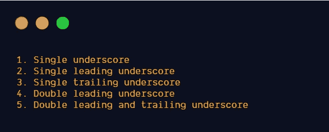
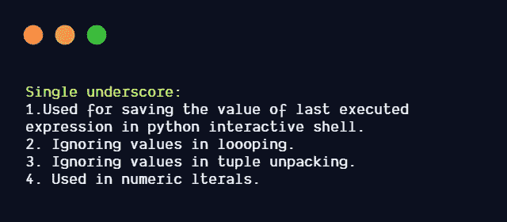

# Python 中下划线的特殊含义

> 原文：<https://betterprogramming.pub/the-special-meaning-of-underscores-in-python-9ceaaeb41007>

## 使用下划线的不同方式


来自 [Pexels](https://www.pexels.com/photo/aerial-photography-of-blue-car-on-road-1552224/?utm_content=attributionCopyText&utm_medium=referral&utm_source=pexels) 的[懒惰艺术家画廊](https://www.pexels.com/@thelazyartist?utm_content=attributionCopyText&utm_medium=referral&utm_source=pexels)的照片

# Python 中的下划线

下划线在 Python 中有特殊的含义。在 Python 中，它们被用在不同的地方。

以下是 Python 中使用的不同类型的下划线:



图片来源:作者

# 1.单下划线



## 保存最后执行的表达式的值

单个下划线用于保存 Python 交互式命令提示符中最后执行的表达式的值。我们也可以将值保存到另一个变量中。


Python 交互式命令提示符中使用的单下划线

## 忽略循环中的值

Python 中的单下划线`_`用于忽略一些值。如果我们不想使用某些值，可以给`_`赋值。

循环中使用的单下划线

## 忽略元组解包中的值

如果我们想在元组解包时忽略一些值，我们可以将这些值赋给`_`。

**元组解包中的单下划线**

## 用于数字文字

在整数、浮点和复数文本中，下划线可以用作数字分组的可视分隔符。下划线没有语义含义，文字被解析为下划线不存在。

# 2.单前导下划线

变量名、方法名和类名中可以使用单个前导下划线。它表明那些带有单个前导下划线的变量、方法和类名被程序员视为“私有”的。如果我们指定`from M import *` ，那些以单个前导下划线开头的名字不会被导入。如果我们想要导入那些变量/方法，我们必须在导入时指定名称。

引用 [PEP-8](https://www.python.org/dev/peps/pep-0008/#descriptive-naming-styles)

> *" _ single _ leading _ 下划线:弱“内部使用”指示符。
> 例如，从 M 导入*不导入名称以下划线开头的对象。"*

将上述 Python 文件`c1.py`导入到`c2.py`

示例:`from c1 import *`

不能访问只有一个前导下划线的变量和函数。

如果我们想导入只有一个前导下划线的变量和函数，我们必须在导入时提到名字。

示例: `from c1 import _a,_sub`

导入具有单个下划线前缀的变量和函数

# 3.单个尾随下划线

单个尾随下划线用于避免与 Python 关键字冲突。

引用 [PEP-8](https://www.python.org/dev/peps/pep-0008/#descriptive-naming-styles) 的话:

> *" single _ trailing _ 下划线 _:按照约定使用，以避免与 Python 关键字冲突"*

```
list=[1,2,3]t=(5,6,7)*#Coverting tuple to list using list() constructor* t1=list(t)
*#Output:TypeError: 'list' object is not callable*
```

在上面的例子中，我们可以使用 `list_`作为变量名，以避免与 Python 关键字`list`的冲突。

```
list_=[1,2,3]t=(5,6,7)*#Coverting tuple to list using list() constructor* t1=list(t)
print (t1)*#Output:[5, 6, 7]*
```

# 4.双前导下划线

双下划线告诉 Python 解释器重写子类的属性名和方法名，以避免命名冲突。解释器用类扩展改变属性名被称为*名称篡改*。

`self._className__methodname()`而不是`self.__methodname()`

`self._classname__attributename`而不是`self.__attributename`

根据 [Python 文档](https://docs.python.org/3.8/tutorial/classes.html#private-variables):

> *“名称混淆有助于让子类覆盖方法而不中断类内方法调用。”*

引用 [PEP-8](https://www.python.org/dev/peps/pep-0008/#descriptive-naming-styles) :

> *" _ _ double _ leading _ 下划线:命名类属性时，调用 name mangling(在类 FooBar 内，__boo 变成 _FooBar__boo)"*

名字叫莽林

具有相同方法名的继承类:

在继承的类中使用了名称篡改

# 5.双前导和双尾随下划线

Python 中的特殊方法用双前导和双尾随下划线命名。它们在 Python 中被称为*魔法方法* / *dunder 方法*。

例子:`__init__,__str__,__repr__,__len__`。这些神奇的方法在 Python 中有特殊的含义。我们可以覆盖这些来改变我们类的行为。

引用 [PEP-8](https://www.python.org/dev/peps/pep-0008/#descriptive-naming-styles)

> *`*__double_leading_and_trailing_underscore__*`*:“神奇”的对象或属性，它们存在于用户控制的名称空间中。如*`*__init__*` *`*__import__*`*或* `*__file__*` *。千万不要发明这样的名字；请仅按照记录使用它们。”***

**按照 Python 惯例，避免使用带有双前导和双尾随下划线的变量名。**

**我们可以使用`dir()`函数来查看该类继承的神奇方法。**

**魔术方法/邓德方法**

# **资源**

*   **[私有变量](https://docs.python.org/3.8/tutorial/classes.html#private-variables)**
*   **[数字文字中的下划线](https://www.python.org/dev/peps/pep-0515/)**

***观看此空间，了解更多关于 Python 和数据科学的文章。如果你喜欢多看我的教程，就关注我的* [***中***](https://medium.com/@IndhumathyChelliah)[***LinkedIn***](https://www.linkedin.com/in/indhumathy-chelliah/)*[***推特***](https://twitter.com/IndhuChelliah) ***。******

***感谢阅读！***