# CSS 2021 成绩状态在这里！

> 原文：<https://betterprogramming.pub/the-state-of-css-result-of-2021-are-here-35dd8e256fa4>

## 对 2021 年成果的总结和意见

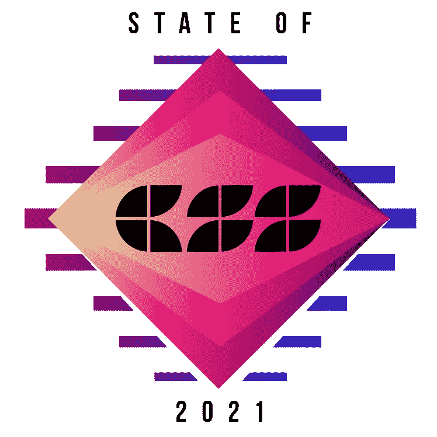

来自 2021.stateofcss.com 的标志

2021 年 CSS 状态的结果出来了！那是什么？这是一项年度调查，被视为 CSS 领域的温度计。我们可以发现:

*   人口统计数据
*   社区的满意度
*   功能的使用
*   结构

它是由 Javascript survey 的同一个团队创建的。它是近两年才出现的。这意味着它仍然是由 JavaScript 社区驱动的。希望随着每年越来越多的人参与进来，这种情况会有所改变。

人口统计和使用方面的结果并不能完全代表 CSS 的使用。这只是一个粗略的近似值。它仅由全球的 **8714** 开发者完成。可悲的是这比去年少了 2778 个开发者。

我们有责任让它成长。怎么会？调查通常在十月左右进行。如果你今年没有投稿，请关注 2022 年。贡献的人越多，结果就越准确。

英语仍然是最主要的语言。约 72.8%的调查是用英语回答的。今年捐款最多的五个国家是:

*   美国:14.1% (1223)
*   联合王国:4.7% (401 人)
*   德国:4.6% (397 人)
*   法国 4.5% (389 人)
*   俄罗斯:4.2% (364 人)

这并不意味着这些国家的 CSS 开发比中国多。这只是意味着他们在回答调查方面更加积极。

在本文中，我们将看到调查的一个小总结。如果你想检查它的全部细节，你可以在这里[做](http://2021.stateofcss.com)。

# 特征

在深入研究之前，让我们快速浏览一下 CSS 中使用的大多数特性。

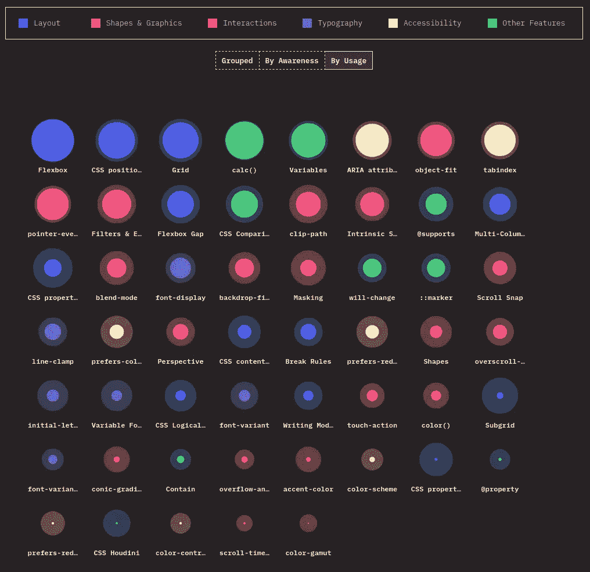

来自 2021.stateofcss.com 的说明

`Flexbox`依然称王并不奇怪。它完全改变了我们在网络上构建布局的方式。几乎所有参与调查的开发人员都知道这件事:**8714 人中的 8076 人**。使用率最高，为 **98.9%** 。这意味着几乎所有的参与者都在使用它。

令人惊讶的是，`CSS position: sticky`是第二个最常用的功能。这再次凸显了移动布局的重要性。

看到像`font-variant: numeric`这样一些很酷的功能如此不为人所知，令人难过。它是做什么的？它让我们配置如何在文本中显示数值。

需要注意的是，并非所有字体都支持它。我们可以在下面看到一个使用 Tailwind CSS 的很酷的例子:

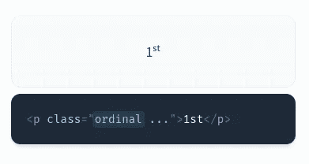

来自 tailwindcss.com 的说明

CSS 类只是一个包装器，用于:

```
**font-variant-numeric**: ordinal;
```

# 布局趋势

趋势部分很酷，因为它给了我们过去几年的概况和我们的发展方向。

## Flexbox

尽管 Flexbox 非常受欢迎，但它还是设法继续增长。只有 21 名调查参与者从未听说过它。

这个布局特性甚至被移植到了 React-Native 上，这在现在是至关重要的。所以即使不使用 CSS 的人也知道它。


来自 2021.stateofcss.com 的说明

然而，令人有点震惊的是，在调查中， **45%** 的参与者仍然没有使用 Flexbox Gap 属性。它有 **89%** 的支持，在构建 flex 元素之间的间距时非常方便。

让我们希望看到这个数字明年增长，没有理由不使用它更多。

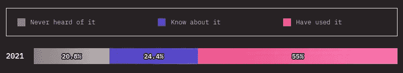

来自 2021.stateofcss.com 的说明

## 格子

令人兴奋的是终于看到`CSS Grid`变得更时尚了。在过去的两年里，它已经得到了巨大的支持。一级实现达到 **96.47%** 支持。对 IE 11 支持的下降对其开发者使用量的增长做出了相当大的贡献。

为什么有些人不愿意使用它？Flexbox 改变了游戏规则，看起来它可以做任何事情。也许开发人员不愿意走出他们的舒适区。然而，一旦他们尝试了 CSS 网格，就没有回头路了。

现在，它已经成为第三个最常用的功能。CSS Grid 在构建复杂布局时大放异彩。它甚至可以在不使用媒体查询的情况下创建响应性布局。

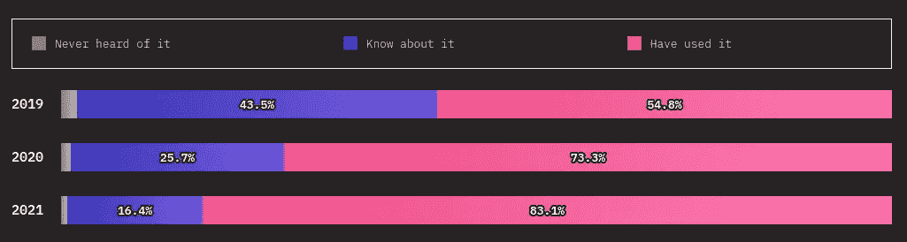

来自 2021.stateofcss.com 的说明

我们在上面看到，使用率已经从 **54.8%** 上升到 **83.1%** 。也就是说，仅在两年内就增长了 45.5%。不知道这一特征的人总是很少。现在只占 **0.7%。**

## 子网格

随着开发人员越来越多地使用 CSS Grid，他们开始注意到它缺少了一些东西。这是他们将发布子网格有多酷和有用的时候。在网格发展之前，很多人不知道它是关于什么的，这是可以理解的。

为什么使用率这么低？由于它的支持度只有 3% (仅在 Firefox 中受支持),所以很多人不使用它是可以理解的。使用它时必须考虑到退路。

有希望的是，当 Chrome 在 2022 年发布子网格支持时，它将与 sky-rocket 一起使用。

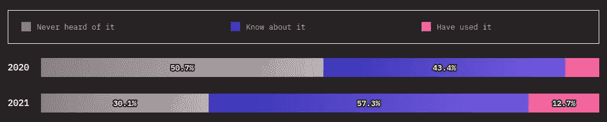

来自 2021.stateofcss.com 的说明

## CSS 多列

即使有一个体面的 75%的支持，CSS 多列布局仍然没有得到太多的关注。这可能是因为尽管它很酷，但它有一些特定的用例，比如新闻文章。

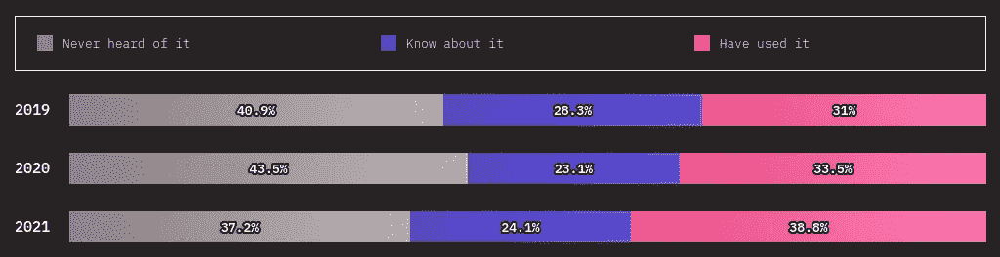

来自 2021.stateofcss.com 的说明

作为最近发布的 Tailwind 3 的一部分，它支持 CSS 多列的使用。由于该框架的流行，今年的`Never heard of it`将大大减少。我没想到`Have used it`会增长这么多。对于这种小众功能，提高它的知名度就足够了。

## 容器查询

容器查询是一个将会大受欢迎的新特性。尽管第一份公开草案刚刚发布 **54.2%** 就已经知道了。这让我们了解到这个新特性是多么令人惊奇和期待。

这将是一个游戏规则的改变者，开发者们对第一个版本非常感兴趣，并且迫不及待地想要得到它。

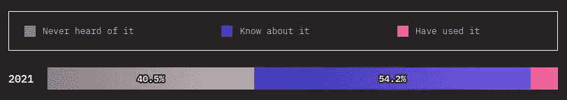

来自 2021.stateofcss.com 的说明

# 无障碍趋势

虽然许多辅助功能，如:`prefers-reduced-motion`、`prefers-color-scheme`、`prefers-reduced-data`和`color-constract`的使用率很低，但看到 Ara HTML 属性如此高的使用率还是很棒的。

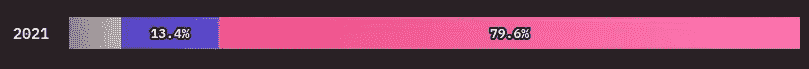

来自 2021.stateofcss.com 的说明

毫无疑问，人们对无障碍有了更多的认识。最新的 JavaScript 测试库也完成了他们的工作。像`react-testing-library`这样的库通过关注 Aria 标签而不是布局 CSS 标记做出了贡献。

# 技术

如果我们看看前/后处理器、CSS 框架和 CSS-in-JS 的满意度和使用情况，我们会看到一些令人震惊的结果:

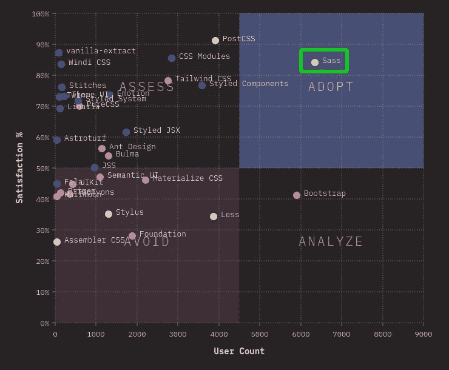

来自 2021.stateofcss.com 的说明

我们在领养区只看到 Sass 技术。希望，一旦我们有了 CSS 嵌套，即使是 Sass 也会变得不那么重要。

至于 CSS 框架，大多满意度较低。不过，Bootstrap 仍然是最常用的一种。它的主题和插件的风格使它与快速建立网站相关。

顺风 CSS 是其中最有价值的。是满意率最高的一个。凭借其新的 JIT 引擎，我看到它明年将走向采用部分。

我们可以看到流星顺风在下面仅仅 3 年的时间里被采用。它会接管 Boostrap 吗？这肯定会在不久的将来发生。

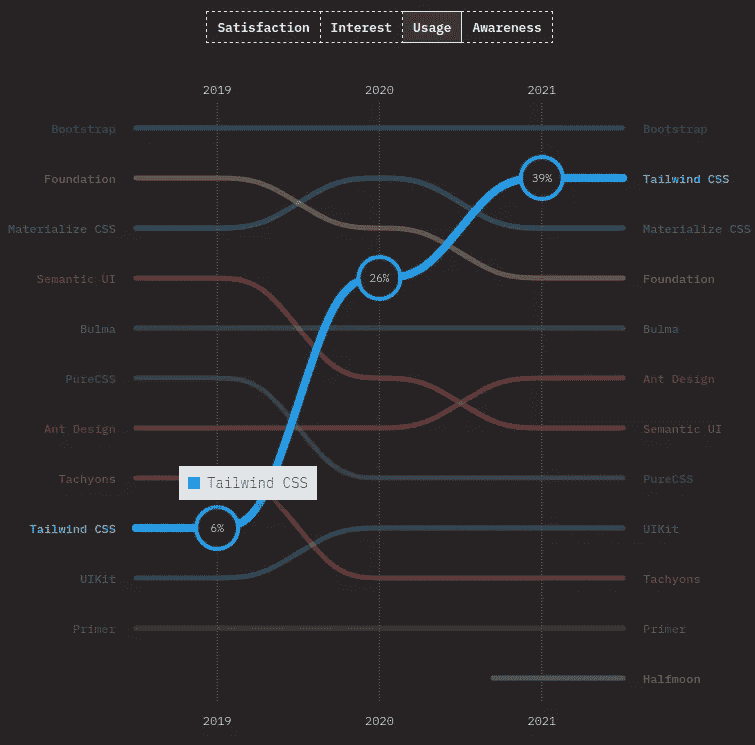

来自 2021.stateofcss.com 的说明

值得注意的是，几乎所有的 CSS-in-JS 框架都有很高的满意度和很低的采用率。只有`Styled Components`的采用率很高。大概是开发者没有走出舒适区？也许他们在等待一个人成为统治者，然后采用它？可能备选方案太多了？

# 浏览器

我们可以检查初始开发的主要浏览器。我们观察到开发人员在开发时使用多种浏览器。这是一个很好的实践。很高兴看到火狐位居第二。它在网格开发人员布局方面的出色工作可能是这个位置的原因。

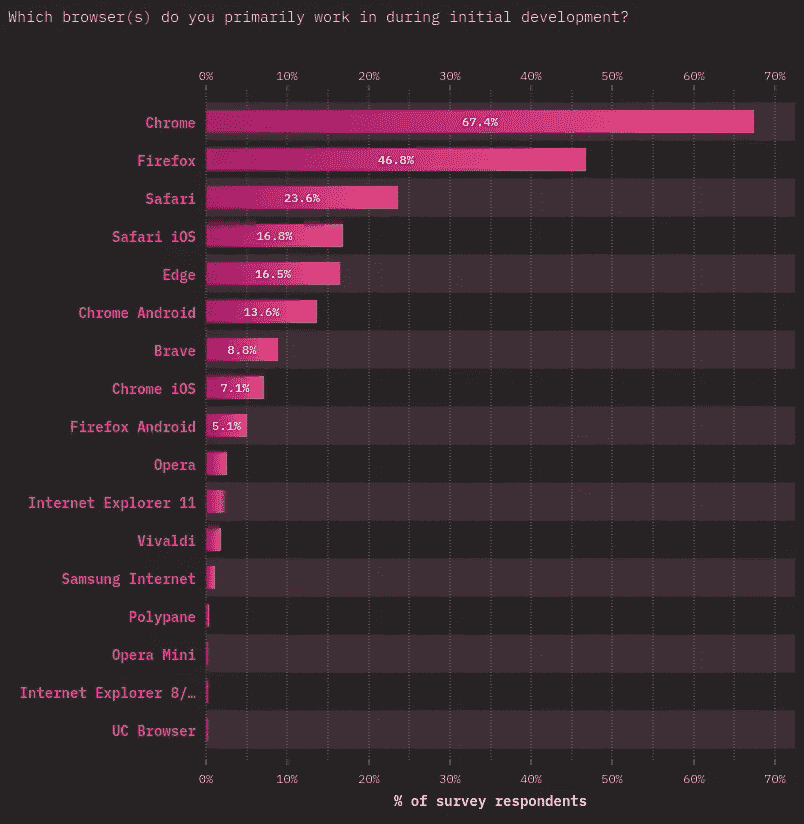

来自 2021.stateofcss.com 的说明

下面，我们可以看到在浏览器测试部分，Firefox 是如何更接近 Chrome 的:

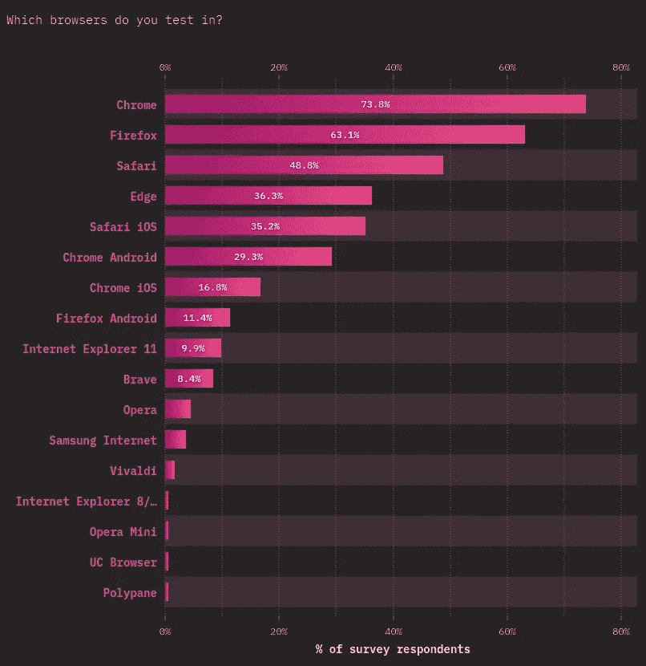

来自 2021.stateofcss.com 的说明

为什么人们在许多浏览器上测试？浏览器兼容性仍然是开发者的一个痛点。通过在多个浏览器上测试，我们可以减少布局问题。

我们可以看到它是如何在一个关于开发人员棘手问题的战斗式对决问题中获得第一名的:

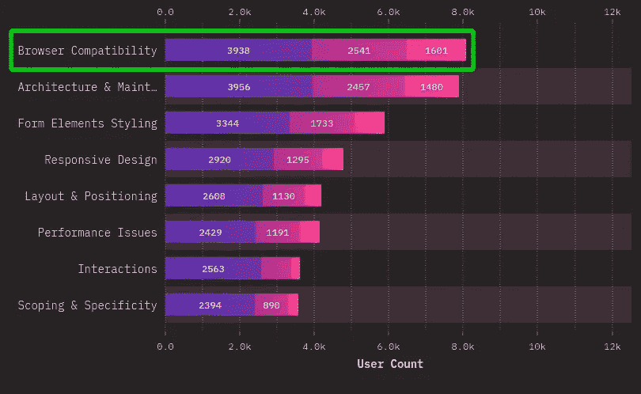

来自 2021.stateofcss.com 的说明

# 资源

可以理解为什么 CSS-tricks 和 Smashing Magazine 会在 blogs & magazines 部分排名第一。

看到中评第四**很酷🙌这个平台上有大量的好文章可以阅读，很高兴看到人们发现这些有用。这给了我继续写作的动力。**

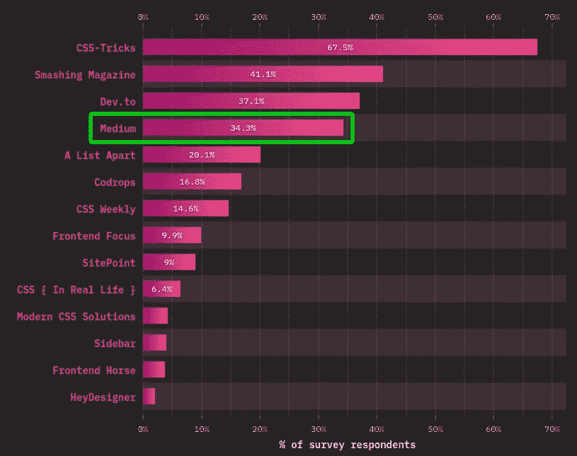

来自 2021.stateofcss.com 的说明

# 结论

每年进行这样的调查真是太酷了。但是我们必须让它成长。每年只需花几分钟，就能得到一些有趣的见解。如果你今年错过了它，你可以在这里订阅它。当调查在 2022 年开始时，您会收到一封电子邮件。

即使它不是那么准确，但在 CSS 空间中有一种每年的进步感也是很棒的。我们可以试着了解哪些事情进展得好，哪些事情不好，哪些事情可以改进。它也是一个了解我们可能已经错过的一些特性的地方。

令人兴奋的是，如果我们看看开发人员的愿望清单:

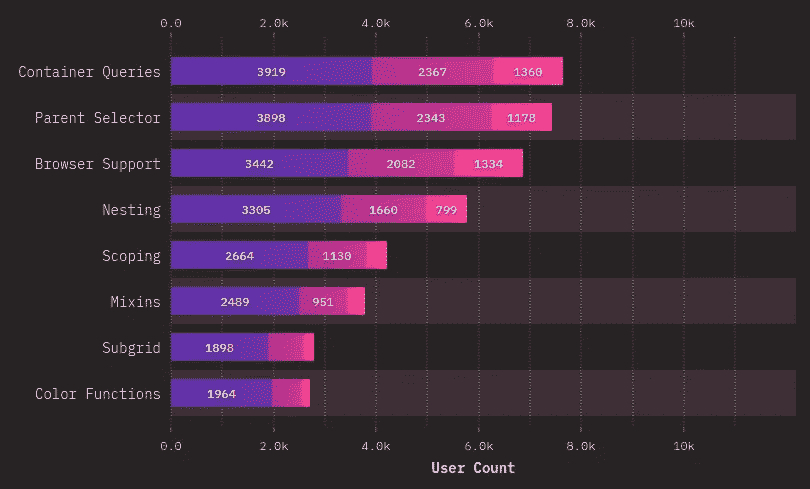

来自 2021.stateofcss.com 的说明

我们希望明年会有很多这样的人:`Container Queries`、`Subgrid`、`Nesting`和`Color Functions`。`Parent Selector`可能需要一段时间。一旦我们获得了这些特性，接下来的事情就是等待合适的支持或者应用渐进的增强技术。

这只是我的总结和印象。如果有兴趣，请点击查看完整调查[。](https://2021.stateofcss.com/en-US/opinions/)

干杯。

[](/whats-new-in-tailwind-css-3-f46c47262da) [## 顺风社 CSS 3 有什么新功能？

### 激动人心的游戏改变者和开发者友好的版本

better 编程. pub](/whats-new-in-tailwind-css-3-f46c47262da)