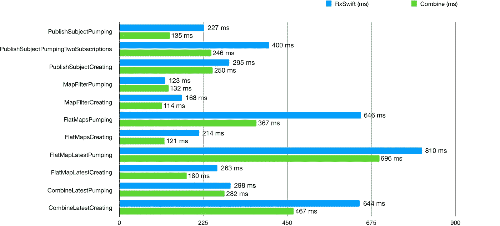

# iOS 中函数式反应式编程的现状:RxSwift 与 Combine

> 原文：<https://betterprogramming.pub/the-state-of-functional-reactive-programming-on-ios-comparaison-between-the-open-source-framework-126b7ec15658>

## 开源框架 RxSwift 与原生框架 Combine 的比较


资料来源:undraw.co

首先要从解释什么是反应式编程开始。这是维基百科上定义的第一段:

> 在[计算](https://en.wikipedia.org/wiki/Computing)中，**反应式编程**是一种[声明式](https://en.wikipedia.org/wiki/Declarative_programming) [编程范式](https://en.wikipedia.org/wiki/Programming_paradigm)与[数据流](https://en.wikipedia.org/wiki/Stream_(computing))和变化的传播有关。有了这个范例，就有可能轻松地表达静态(例如，数组)或动态(例如，事件发射器)数据流，并且还传达相关联的执行模型内存在推断出的依赖性，这有助于自动传播改变的数据流

这个概念很简单:我们有数据发射器和数据接收器，在它们之间，我们应用操作符来修改、转换和处理这些数据。另一种说法是，它随着时间的推移处理值。

这些值可能来自网络响应或用户界面事件。反应式编程的概念是对完成块或委托的直接替换。这将产生一个更干净、更易维护的数据管道。如果使用得当，它可能是一种非常强大的编程方法。

在 Swift 中，进行反应式编程的两种主要方法是称为 Combine 和 RxSwift 的框架。

# 联合收割机演示

苹果在 2019 年 WWDC 期间大量引入了 SwiftUI，但他们几乎没有说的是，有一个完整的框架为它提供动力:Combine。这是一个巨大的新框架，技术性太强，不能成为头条新闻，但它标志着苹果哲学的一个重大变化，从声明式到功能反应式的方法。你可以从 iOS 13 开始使用它，尽管它与 SwiftUI 密切相关，但你仍然可以将其与 UIKit 配对。

一些基金会类型通过发布者公开他们的功能，包括`[Timer](https://developer.apple.com/documentation/foundation/timer)`、`[NotificationCenter](https://developer.apple.com/documentation/foundation/notificationcenter)`和`[URLSession](https://developer.apple.com/documentation/foundation/urlsession)`。Combine 还为任何符合键值观察的属性提供了一个内置的发布器。

请随意查看关于联合收割机的苹果文档。

# RxSwift 演示

RxSwift 是一个开源框架。从 iOS 8 开始就可以用了。这是一个很大的优势，因为您现在可以安全地开始将它集成到您的项目中，而您可能需要等待一两年才能让 Combine 支持更多的 iOS 版本。

这是一个非常受欢迎的框架，有一个很大的社区围绕着它，所以找到帮助和文档一点也不困难。首先查看主 [GitHub 库](https://github.com/ReactiveX/RxSwift)，在那里你会找到他们所有的主要文档。

# 我们来对比一下！

## 关于发射器

**Combine** : `Publisher`是一个协议，它定义了一个类型能够随时间向一个或多个订户传输一系列值的要求。这有点类似于`NotificationCenter`正在做的事情，除了它当然是以一种更好更可读的方式完成的。你可以创建你自己的，但是苹果也在它的 [enum](https://developer.apple.com/documentation/combine/publishers) 中提供了一整套预制的发布器。

```
**let** publisher = NotificationCenter.default
               .publisher(for: NSControl.textDidChangeNotification,
                object: filterField)
```

**RxSwift** :它们被称为`Observable`。这是一个流(实际上不发出)`Event`的类，然后由`Observers`接收。稍后会详细介绍。

```
**let** name: String = "Peter"
**let** observable = Observable<String>.just(name)
```

## 关于接收者

**组合** : `Subscriber`是一个协议，定义了一个类型能够从`Publisher`接收输入的要求。

```
**let** subscriber = NotificationCenter.default
                .publisher(for: NSControl.textDidChangeNotification,
                 object: filterField)
                .sink(receiveCompletion: { print ($0) },
                 receiveValue: { print ($0) })
```

**RxSwift** : `Observer`直接订阅`Observable`。不像`NotificationCenter`，开发者通常只使用它的`.default`单例实例，Rx 中的每个可观察对象都是不同的。此外，知道一个可观察对象在拥有订阅者之前不会流处理事件或执行任何工作是非常重要的。

```
**let** name: String = "Peter"
**let** observable = Observable<String>.just(name)observable.subscribe { event **in**   
    print(event)
}
```

总的来说，您有许多名称或多或少相同的操作符。 [Shai Mishali](https://twitter.com/freak4pc) 制作了这个非常方便的[电子表格](https://github.com/CombineCommunity/rxswift-to-combine-cheatsheet)来帮助你。

## 背压

联合收割机支持反压，但 RxSwift 不是这样的。在 ReactiveX 中，很容易出现这样一种情况:一个`Observable`正在以超过操作员或观察者消费速度的速度传输物品。你仍然可以用冷观测值来控制，当观测者觉得方便的时候，以观测者想要的任何速率流动一个序列，而不会破坏序列的完整性。

## 错误类型

当 RxSwift 使用简单的`Error`类型时，Combine 需要特定的错误类型。在联合收割机方面，这听起来可能是一项更艰巨的任务，但我认为这是一项更好的任务。错误管理是至关重要的，被“强迫”去做你的自定义`Error`类型将会产生更好的错误日志。

## 内存管理

RxSwift 有一个非常方便的系统，叫做 Dispose Bag。observables 的所有订阅都由一个唯一的对象持有，这允许我们更有效地管理这些订阅的生命周期。也就是说，订阅也适用于 ARC。当订阅完成或由于错误而完成时，订阅总是被 dealloc。

```
**let** disposeBag **=** DisposeBag()**let** name: String = "Peter"
**let** observable = Observable<String>.just(name)observable.subscribe { event **in**   
    print(event)
}**.**addDisposableTo(disposeBag)
```

对于联合收割机来说，叫做`Cancellable`。所有订阅都是单独管理的。这需要更多的努力，但是为了获得对我们代码的更多控制和可能的性能改进，因为在`DisposeBag`的罩下有许多操作

```
**private** **var** cancellable: AnyCancellable?**self**.cancellable = subject
                  .sink { value **in**       
                      print(value)
                   }
```

## 演出

苹果在设计时考虑到了性能方面。引用一位苹果工程师的话:*“rx swift 和 Combine 的内存型号差别很大。联合收割机是专为性能而生的。”*它的规格几乎是 RxSwift 的两倍，允许苹果将 Combine 集成到 RealityKit 等高性能要求的框架中。



两个框架之间相似方法执行的比较(图由斯蒂芬·屈夫勒绘制)

# 结论

双方都有很强的理由使用这种或那种框架。总的来说，如果你想使用原生集成到 iOS 的东西，如果你不需要支持 iOS 13 之前的 iOS 版本，请使用 Combine。这也将导致性能的提高。

另一方面，RxSwift 覆盖了更广泛的 iOS 版本，也有更大的社区和更多的指南/示例/内容。

但重要的问题是:要不要转行做反应式编程？它将彻底改变你对数据流和架构的看法，对于你选择的框架，它将是一种更现代、更安全、更不容易出错的方法。