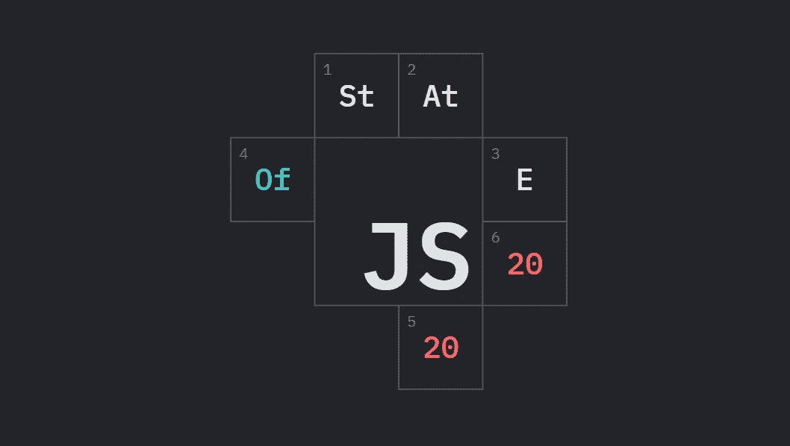
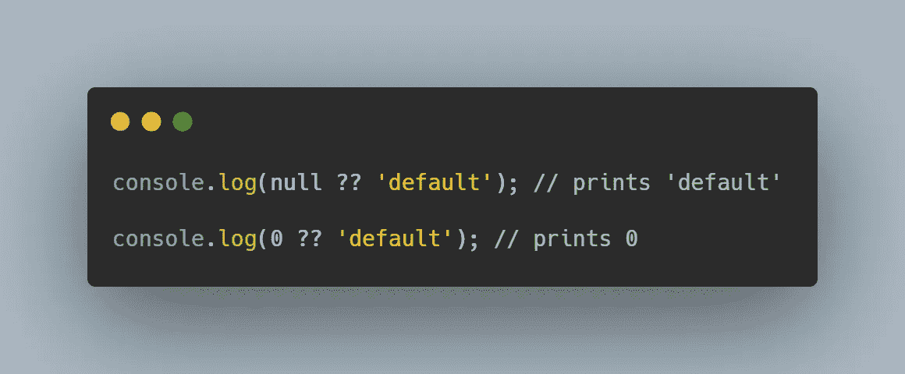
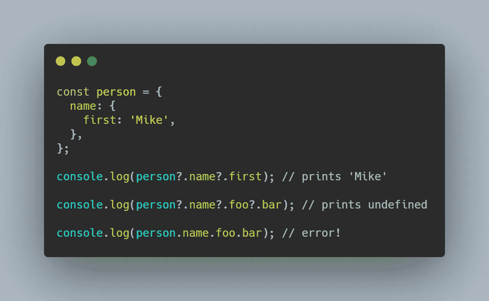
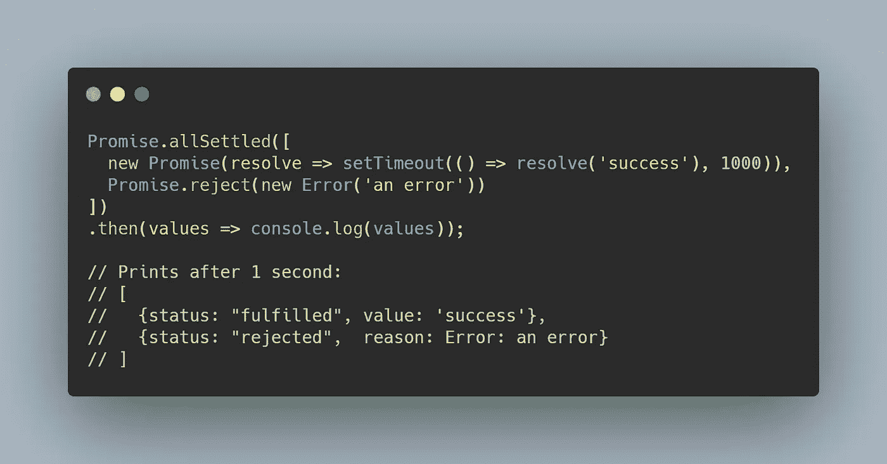

# JavaScript 在 2020 年的状态

> 原文：<https://betterprogramming.pub/the-state-of-javascript-in-2020-97b8bdfdfa20>

## 以及 2021 年要学的东西

2020 年 JavaScript 调查状态标志

2021 年 1 月 14 日，JavaScript 2020 调查的[状态结果发布。这些结果是从 137 个国家的 23，765 名开发人员那里收集的，涵盖了人们对 JavaScript 特性、技术、工具等的使用和看法。下面我强调了我从调查中得到的主要收获。希望它们能让你明白如何在 2021 年最好地装备自己！](https://2020.stateofjs.com/en-US/)

# 2021 年值得期待的 Javascript 工具

使用最多的技术去年基本没有变化。TypeScript 仍然是使用最多的 JavaScript 风格，React 仍然是使用最多的前端库，Express 仍然是使用最多的后端库。如果你是一个新的 web 开发人员，这些绝对是你应该首先学习的技术。

然而，当谈到 2020 年开发者最喜爱的技术时，我们看到了许多新的竞争者。2021 年我肯定要去接他们。

## 苗条的

[苗条](https://svelte.dev/)超过[反应](https://reactjs.org/)成为最受欢迎的前端库。与 React 不同，React 必须在最终应用程序的用户代码之上发布 React 库代码，Svelte 是一个编译器，它将用户代码编译为优化的普通 JavaScript。结果是更小的束尺寸和更快的性能。随着 [Sapper](https://sapper.svelte.dev/) (Svelte 的 Next.js)和 [Svelte Native](https://svelte-native.technology/) (Svelte 的 [React Native](https://reactnative.dev/) )的推出，Svelte 的生态系统正在迅速成熟，使其成为 React-Vue-Angular 统治地位的有力竞争者。

## Next.js

[Next.js](https://nextjs.org/) 超越 [Express](https://expressjs.com/) 成为最受欢迎的后端框架。虽然我不认为它们属于同一个类别，因为它们处理不同的用例，但我对看到 Next.js 在顶部没有任何抱怨。它是一个优秀的服务器端渲染框架和静态站点生成器。Next.js 还由 [Vercel](https://vercel.com/) 补充，这是一个为 Next.js 量身定制的部署平台，允许极其轻松地发布代码。

## esbuild 和 Snowpack

esbuild 和 [Snowpack](https://www.snowpack.dev/) 取代 [webpack](https://webpack.js.org/) 成为最受欢迎的构建工具。esbuild 是用 Golang 编写的捆绑器，因此提供的性能比 webpack 快几个数量级。另一方面，Snowpack 引入了一种新的方法，即每个 es 模块只构建一次。之后，Snowpack 只构建已经更改的 ES 模块。相比之下，像 webpack 这样的传统捆绑器会在您每次进行更改时构建您的整个项目。esbuild 和 Snowpack 都极大地减少了开发和部署时间，尽管使用的方法不同。

# 您应该开始使用的 Javascript 特性

调查还显示，JavaScript 新特性的采用率很低，如 [nullish 合并运算符](https://developer.mozilla.org/en-US/docs/Web/JavaScript/Reference/Operators/Nullish_coalescing_operator) (45.3%)、可选链接运算符(66.7%)和[promise . all settled()](https://developer.mozilla.org/en-US/docs/Web/JavaScript/Reference/Global_Objects/Promise/allSettled)(14.7%)。因为所有主流浏览器和 Node.js 14+都支持它们，所以现在可能是开始将它们集成到您的代码中的好时机。

## 零化合并运算符？？

当左侧为`null`或`undefined`时，它是一个返回右侧值的逻辑运算符。这是一种为变量设置默认值的简洁方法，这些变量可能是`null`或`undefined`。

用[碳](https://carbon.now.sh/)生成的代码片段

## 可选的链接运算符？。

它允许开发人员访问深度嵌套的对象，而不必检查它们是否存在。

用[碳](https://carbon.now.sh/)生成的代码片段

## Promise.allSettled()

当所有给定的承诺都被解决或拒绝时，它返回一个解决的承诺。然后，开发人员可以检查每个承诺是否成功。这是一个比`Promise.all()`更方便的选择，后者只有在所有给定的承诺都解决时才解决，如果任何一个承诺失败，它也将失败。

用[碳](https://carbon.now.sh/)生成的代码片段

虽然上述特性是你可以快速添加到代码中的立竿见影的效果，但你也应该明确地看看其他新的 ES2020 特性，例如 [BigInt](https://developer.mozilla.org/en-US/docs/Web/JavaScript/Reference/Global_Objects/BigInt) 和[动态导入](https://developer.mozilla.org/en-US/docs/Web/JavaScript/Reference/Statements/import#dynamic_imports)，这对你的用例可能是非常宝贵的。FreeCodeCamp 有一篇很好的[文章总结了 ES2020 的主要特性。](https://www.freecodecamp.org/news/javascript-new-features-es2020/)

# 结论

2020 年，JavaScript 库发生了巨大的变化。我们看到 esbuild 等新来者迅速占据了主导地位。我们也看到像 Svelte 这样已经潜伏了一段时间的项目最终获得了关注。

ES2020 还引入了几个期待已久的 JavaScript 特性，如 nullish 合并`??`和可选的链接操作符`?.`，这些特性解决了 JavaScript 开发人员的许多棘手问题。

对于 JavaScript 开发人员来说，2020 年是多么激动人心的一年啊！