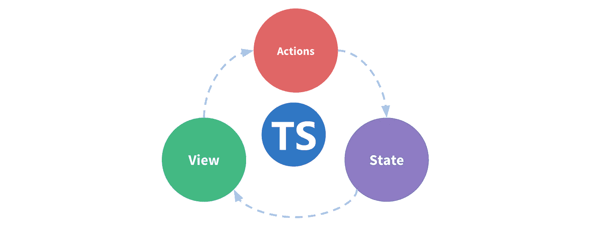

# 类型化 Vuex 的状态:最干净的方法

> 原文：<https://betterprogramming.pub/the-state-of-typed-vuex-the-cleanest-approach-2358ee05d230>

## 你避免使用 Vuex 是因为有太多的样板文件还是因为它不完全提供类型脚本支持？继续读

图片来源:作者

如果你尝试过将 [Vuex](https://vuex.vuejs.org/) 与 [TypeScript](https://www.typescriptlang.org/docs/handbook/basic-types.html) 一起使用，你会意识到这不是一个简单的任务。Vuex 不提供现成的处理 TypeScript 的工具。TypeScript 对我们许多人来说都很重要，因为它允许我们编写静态类型的 JavaScript，主要好处是通过 IDE 类型点击改善了开发体验。

我们想要实现的是类型安全的 Vuex 模块，当我们传递错误的突变/getter/action 类型或错误的参数时，它会通知我们——这可以通过几种不同的方式实现。我们将看看如何在没有外部库的情况下实现这一点，然后我们将评估目前存在的选项。最后，我们将做出一个相当主观的决定，哪个是最干净的。

这些是我们将尝试的选项:

*   [平原](https://dev.to/3vilarthas/vuex-typescript-m4j)
*   [vuex 级](https://github.com/ktsn/vuex-class)
*   [vuex-typex](https://github.com/mrcrowl/vuex-typex)
*   [vuex 智能模块](https://github.com/ktsn/vuex-smart-module)
*   [vuex-class-component](https://github.com/michaelolof/vuex-class-component)
*   [vuex 类模块](https://github.com/gertqin/vuex-class-modules)
*   [vuex 模块装饰器](https://github.com/championswimmer/vuex-module-decorators)

即使 Vue 3 即将到来，与相应的 Vuex 4 一起，使用情况也不会从 Vuex 方面发生变化，因为它的变化主要与 Vue 3 的兼容性有关。为了澄清任何混淆，Vue 3 的[反应 API](https://composition-api.vuejs.org/api.html#reactivity-apis) 并不意味着取代 Vuex。它只是提供了更好的工具来处理那些已经不需要 Vuex 的情况。

也就是说，在 Vue.js 全球在线会议上有一个[演讲](https://www.youtube.com/watch?v=ajGglyQQD0k&feature=youtu.be)概述了 Vuex 5 的路线图。它将没有突变，只有动作，以及定义/注册存储的新方法，包括常规组合 API。有了这些更改，这里列出的选项都不是 TypeScript 集成所必需的。不幸的是，它不太可能在 2021 年的某个时候发布，因为它甚至还没有 RFC。

说够了，让我们写点代码吧。您可以直接进入实例，亲自查看这个[沙盒](https://codesandbox.io/s/vuex-typescript-solutions-comparison-lw4rn)中的不同选项，或者看一看这个[回购](https://github.com/cuzox/vuex-typescript-solutions-comparison)。

# 设置

需要注意的是，Vuex 在模块中分离功能。这些模块彼此独立地定义，并且用于表示信息和相应功能的逻辑组。让我们定义一些常见的类型:

每个模块都有一个`persons`属性，它是这个人的`id` 和他的`Person`之间的映射。我们将有一个用静态数据填充这个属性的动作，以及一个聚集一个人的`name`和`lastName.`的 getter

这是我们的`stores`文件在 Vue 2/Vuex 3 中的样子:

Vue 3/Vuex 4:

我们在这里有两个存储，因为`plainStore`将被完全类型化，传递给 Vue 构造函数，并被直接或通过 Vue 组件实例中的`$store`属性访问。但是`modulesStore`不会注册，它的模块会单独导入。向`Vuex.Store`构造函数/ `createStore`方法传递空对象，因为我们将动态注册模块。

我们的`main.ts`在 Vue 2/Vuex 3 中:

Vue 3/Vuex 4:

我稍后会解释`PlainStore`类型的来源。出于演示的目的，Vue 组件定义将使用 [vue-property-decorator](https://github.com/kaorun343/vue-property-decorator) ，它依赖于 [vue-class-component](https://github.com/vuejs/vue-class-component) ，尽管使用与组合 API 相同。

# 1.平原

您确实可以在没有外部库的情况下完成一个完全类型化的 Vuex 存储。我们需要为普通商店定义这些类型:

`PersonModule`:将是`plain` Vuex 模块
`RootState`的类型:将是根状态的类型(`plainStore`的状态)。我们将普通模块粘贴到根状态的`plain`属性中。

现在我们可以写出突变:

`MutationTypes`:带有突变名称的`enum`。我们这样做是为了避免在应用程序中手动输入变异名称，并在 IDE 中获得自动完成功能。

`Mutations`:突变类型签名的定义。只有这些已定义的突变的类型安全实现需要这一点，以便我们可以在以后构造更复杂的`PlainStore`类型。

`mutations`:突变名称到它们的实现的映射。此时，由于 Vuex 的内置类型`MutationTree`和我们的`Mutations`类型之间的联合，我们将对参数`state`和`persons`进行类型检查。

getters 遵循类似的方法:

现在行动，有一个额外的组成部分:

当您在 Vuex 中定义一个动作函数时，第一个参数是包含一个`commit`函数的`ActionContext`类型。此功能允许您触发当前模块(或任何其他模块，如果指定了`{root: true}`)中定义的突变。这个提交函数的默认类型允许您用任何字符串调用`commit`。我们想对此加以限制，这样`commit`只能用我们模块中定义的突变来调用。

这是通过增加默认的`ActionContext`并相应地修改`commit`函数的类型来实现的。请记住，如果您想要调用全局突变或来自其他模块的突变，在动作内的`commit`函数中指定`{root: true}`，您必须聚集所有的突变，并使用它来增加`ActionContext`，而不是像我们在这里所做的那样，仅仅是来自这个模块的突变。(下面我这样做是为了创建`PlainStore`类型。)

既然我们已经成功定义了 Vuex 模块，我们必须在商店中注册它:

我们需要做的最后一件事是构造`PlainStore`类型，这是您访问`state`、`commit`、`dispatch`和`getters`的实际商店的类型。如果我们试图访问不存在的`state`或`getters`，或者使用错误的`type`或参数调用`commit`或`dispatch`，我们希望对这些属性进行类型检查并得到错误。

为了定义`PlainStore`，我们希望从我们所有的模块中收集所有的突变、getters 和动作，并通过与 TypeScript 的`&`操作符的联合将它们合并。

我们已经完成了对`Plain`人员模块的定义和注册。关于如何在组件中访问它，我们有两个选项。我们可以通过`this.$store`(注入)来访问它，也可以直接在每个组件中导入存储(导入)。

## 注射

要通过`this.$store`访问我们的类型化存储，我们需要覆盖 Vuex 的默认`$store`类型定义，这目前只在 Vuex 4(和 Vue 3 一起)中受支持，所以如果是你，你需要做的就是:

但是如果你使用 Vuex 3(和 Vue 2 一起)，你需要创建另一个属性，因为你不能覆盖`$store`类型。我们可以称之为`$vuex`(或者别的什么):

然后我们需要定义实际的属性，它只是`$store`的一个 getter:

然后你可以像这样访问`$store`或`$vuex`(取决于你在上面做了什么):

## 进口

这种用法要简单得多，因为我们用它的`PlainStore`类型导出了商店，所以我们可以直接导入并使用它:

正如您所料，`$store`(或者您称之为商店属性的任何东西)将在**注入**和**导入**场景中被完全键入。

## 命名空间模块

如果我们想将我们的普通模块命名为,这会是什么样子呢？我们需要为我们的每个突变、获取器和动作定义单独的枚举和类型签名。

主要的问题是，在我们的模块定义中，所有的名称常量都不使用名称空间前缀，因为它们是本地化的。在模块定义之外，它们有前缀。所以在命名空间模块的动作内部，你可以提交`nameOfMutation`，但是如果你想从一个组件提交它，你必须提交`prefix/nameOfMutation`。

最近[合并了](https://github.com/microsoft/TypeScript/pull/40336) (dev branch) TypeScript 特性，理论上允许我们通过模板文字类型动态构造命名空间签名。不幸的是，我无法做到这一点，所以我们不得不一个接一个地重新定义签名。

我将只针对突变实现这一点，因此您会有一个想法:

我们必须为不同的变异定义单独的枚举，包括有和没有名称空间前缀的(内部的不带前缀，用于定义这个模块，外部的带前缀，用于导出和在其他地方使用)。

## **印象**

那是相当痛苦的。如果这是一首歌，那么它将会在 69 个国家被禁止。对于大型模块，这种方法会很快失控。不是愉快的经历。

# 2.vuex 级

我们要看的第一个第三方解决方案是 [vuex-class](https://github.com/ktsn/vuex-class) 。尽管它在技术上是一个类型脚本库，但它并没有真正提供任何工具来实现类型安全。因此，不幸的是，它仍然需要付出巨大的努力才能大规模实现。您不需要类型化的存储定义来使用它，因为 vuex-class 无论如何都不会访问它。该类型将直接位于组件中:

这样做的问题是，您需要手动定义每个资源的类型。如果您在不同的组件中使用相同的资源，您将在每个组件中定义相同的类型。这在规模上并不理想，因为组件之间的类型可能不同，所以更改任何这些资源的实现或类型，而不成功地更新访问它的每个组件，可能会导致不会立即变得明显的错误，而这些错误正是 TypeScript 旨在防止的。

为了有效地实现 vuex-class，我们最好用与上面简单方法相同的方式定义存储资源及其类型签名。如果我们这样做了，我们就可以构造一个类型来聚集相关的资源以便于访问:

然后我们可以在组件中使用它:

但在这一点上，果汁绝对不值得挤。

## **观感**

为了有效地使用 vuex-class，我们仍然需要大量的手工劳动。因此，与仅使用普通方法类型化的导入存储相比，它没有任何优势。我不建议任何球队使用 vuex-class。

# **3。vuex-typex**

我们要看的第一个真正为我们节省击键次数的库是 [vuex-typex](https://github.com/mrcrowl/vuex-typex) 。它有一个可组合的 API，提示我们分别定义所有的东西，然后把它们放在一起进行模块定义。

变异和动作像普通函数一样被定义，但是 getters 是通过模块构建器定义的，要么通过`b.read`要么通过`b.state`。所有的东西都被放入一个常量中，然后我们将它导出。这个 API 相当混乱，因为我们注册的普通 Vuex 模块或者我们关联的商店不是我们刚刚放在一起的模块，而是模块构建器。我们直接使用 Vuex 商店注册模块，然后将模块构建器与商店相关联。

这是我们在组件中使用它的方式:

## 印象

API 有点奇怪，到处都是，看起来不太干净。模块构建器 API 不太直观，似乎我们必须调用一堆函数来正确注册。

# 4.vuex 智能模块

我们现在将探索由 Vuex 的核心贡献者之一制作的库， [vuex 智能模块](https://github.com/ktsn/vuex-smart-module)。它尽可能接近 Vuex API。默认情况下，本库命名空间模块。这就是事情开始变得有趣的地方。

我们可以看到，这与我们通常定义 Vuex 模块的方式非常接近。不是每种类型的资源都有一个对象，而是有一个以资源作为类函数/访问器的类。

一旦我们完成了对它们的定义，我们就将它们传递给提供的`Module`函数，该函数组装资源。我们正在用 vuex-smart-module 自己的`registerModule`函数注册该模块。它将存储、这个模块在根`state`中的路径名、名称空间的路径以及我们正在注册的模块作为参数。

为了导出一个现成的 Vuex 模块，`Module`实例有一个`context`方法，该方法返回与传入的存储相关联的模块。我们可以在组件中直接导入该模块:

## 印象

这是固溶体。它建立在原始 Vuex API 之上，并尊重它，利用类的力量，包含类型签名和实现。它是由 Vuex 的作者制作的，所以我们知道它很健壮。

# 5.vuex 类组件

[vuex-class-component](https://github.com/michaelolof/vuex-class-component) 也使用类语法来定义 vuex 模块，但它更进一步，允许我们在一个类中定义所有内容。然后，这个类被转换成 Vuex 模块对象定义，可以像任何其他类一样使用。默认情况下，本库命名空间模块。

那是一股新鲜空气。如您所见，我们提供了`mutation`和`action`装饰器，用于从函数中创建同名的资源。类属性变成了状态属性，而`get`访问器变成了传统的类获取器。

这一次我们使用 Vuex 自己的`registerModule`来动态地将它注册到 store 实例`modulesStore`。`createProxy`只是返回一个代理给我们关联到`modulesStore`的模块。

它可以导入并直接使用:

模块直接导入，确保类型安全。

## 印象

这就是我们一直想要的:一种清晰的方式来定义我们的 Vuex 模块，以及访问它们时的完全类型安全。这个能顶吗？我们必须继续观察。

# 6.vuex 类模块

[vuex-class-modules](https://github.com/gertqin/vuex-class-modules) 是 [vuex-class-component](https://github.com/michaelolof/vuex-class-component) 的分支。它改进的只是类的定义方式:

当我们将其与 vuex-class-component 的模块定义进行比较时，我们可以看到我们现在有了一个`Module` decorator，并且我们可以使用我们定义的同一个类来创建一个新的实例，它将做两件事:在存储中注册模块并返回一个可用的命名空间模块(默认情况下命名空间)。

组件的使用与 vuex-class-componen `t`完全相同。

## 印象

和 vuex-class-component 差不太多。我们只是得到了更多的工具来节省我们的击键次数。相当可靠。

# 7.vuex-模块-装饰者

[vuex-module-decorators](https://github.com/championswimmer/vuex-module-decorators) 实现了与之前库相同的概念(类语法)。然而，我们得到了一些更有用的装饰器。

vuex-module-decorator 提供了一个`Module`装饰器来包装我们的类并接受一些选项。`store`选项将负责将这个模块关联到我们的`modulesStore`，而`name`将是这个模块在状态中的属性，以及它的名称空间(默认情况下是这个库名称空间)。

vuex-module-decorators 提供了`getModule`函数，该函数将返回一个类型化的可用模块，该模块的使用方式与我们的组件中的 vuex-class-component 完全相同。

这一直是 Vuex 的一个痛点，事实上我们需要为状态中我们想要改变的每个属性创建突变。通过非常有趣的装饰器`MutationAction`，如果我们只想直接分配一个或多个状态属性，我们不需要创建一个突变。

从修饰函数返回的对象中包含的属性将通过在幕后创建的变异直接分配给相应的状态属性。这是一个有影响力的助手装饰器，显著改善了 Vuex 体验。

## 印象

它为定义和使用 Vuex 模块提供了最简洁和紧凑的 API，利用了类，并提供了额外的 decorators 选项，使开发更容易。

# 清洁的

这是毫无疑问的。在我们讨论的所有选项中，vuex-module-decorators 独占鳌头。它的 API 很简单，让我们可以访问一个直到 Vuex 5 发布时才会出现的特性(尽管是模拟的):动作和突变的合并。它允许我们编写最少的代码，同时不影响可读性和可用性。

# 结论

当希望将 TypeScript 集成到您的存储中时，如果您不想使用任何外部库，简单的方法已经满足了您的要求(如果您喜欢这类东西；虽然不知道你为什么要这样对自己)。如果你想要更好的开发体验，我们这里有很多很好的选择。

我个人不推荐普通、vuex-class 或 vuex-typex，因为它们会很快失控。但是 vuex-smart-module、vuex-class-decorator、vuex-class-modules 和 vuex-module-decorator 都是很好的替代品，得到了不错的社区认可，其中最受欢迎的是 vuex-module-decorator(也是我最干净的头衔的获得者)。它们也是非常即插即用的，所以你不必重写所有的存储模块，你可以定义和动态注册新的模块。

同样，你可以看到他们生活在这个[沙盒](https://codesandbox.io/s/vuex-typescript-solutions-comparison-lw4rn)中，或者看一看[代码](https://github.com/cuzox/vuex-typescript-solutions-comparison)。

性能对这些库来说都不是问题，因为最终，它们都构建并注册了一个常规的旧 Vuex 模块。

所以不要害怕 Vuex。使用它可以是愉快而简单的，并且您可以受益于强大的[开发工具](https://chrome.google.com/webstore/detail/vuejs-devtools/nhdogjmejiglipccpnnnanhbledajbpd?hl=en)支持，以及实时检查和时间旅行调试。

现在让我们开始编写一些干净的、类型检查过的 Vuex 模块吧！