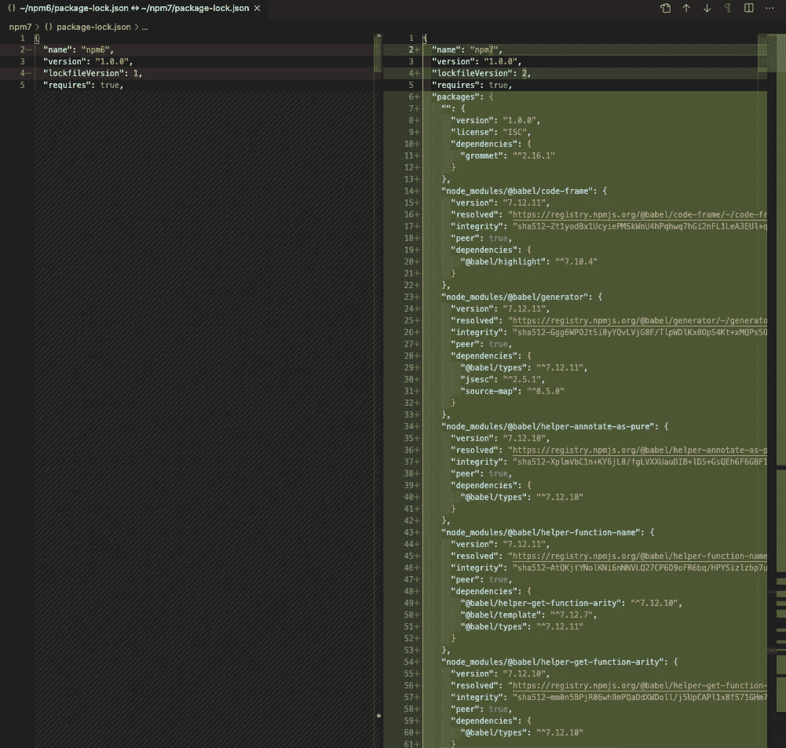
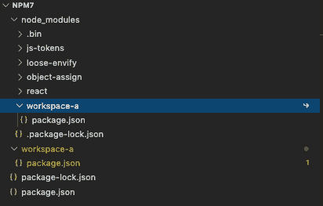
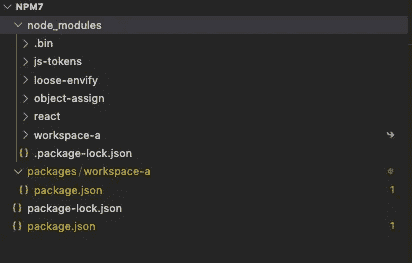
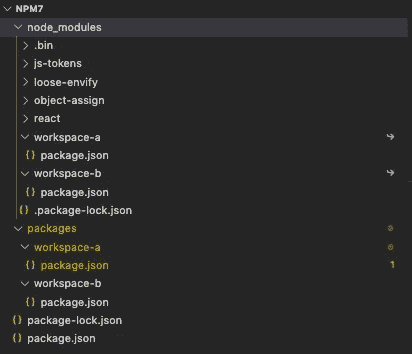

# 理解和采用 npm 7 的分步指南

> 原文：<https://betterprogramming.pub/the-step-by-step-guide-to-understanding-and-adopting-npm-7-914504f7090f>

## npm 7 特性的详细解释，包括对等依赖、包和线程锁文件、工作区等。


图片来源:作者

[npm@7.0.0](https://blog.npmjs.org/post/631877012766785536/release-v700) 于 2020 年 10 月 13 日发布，2020 年 10 月 20 日发货 [Node.js v15.0.0](https://medium.com/better-programming/whats-new-in-node-js-15-fc24e87e2590) 。

[npm 7](https://docs.npmjs.com/cli/v7/configuring-npm/package-json) 是一个主要版本，它包括[许多新特性](https://github.blog/2020-10-13-presenting-v7-0-0-of-the-npm-cli/):

*   [对等依赖](https://medium.com/better-programming/package-jsons-dependencies-in-depth-a1f0637a3129)自动安装
*   包装和纱线锁文件增强
*   工作空间支持
*   `package.exports`的使用
*   `npx`变化
*   npm CLI 命令更改

让我们详细探讨它们是什么以及如何使用它们。

# 使用 NVM 探索 npm

在[上一篇文章](https://medium.com/better-programming/use-nvm-to-manage-node-js-and-npm-versions-2bd0d0875f9f)中，我们提供了如何使用 [NVM(节点版本管理器)](https://github.com/nvm-sh/nvm)管理节点和 npm 版本的说明。在我们的环境中，我们安装了节点 12.16.0 和 npm 6.14.8。通过运行`nvm install node`，我们安装了 Node 15.4.0 和 npm 7.0.15。

我们打开了两个窗口:一个设置为 npm 6，另一个设置为 npm 7。

*   在 npm 6 窗口中，我们看到了以下内容:

```
$ nvm use 12
Now using node v12.16.0 (npm v6.14.8)
```

*   在 npm 7 窗口中，我们看到了以下内容:

```
$ nvm use 15
Now using node v15.4.0 (npm v7.0.15)
```

现在我们准备探索。

# 对等依赖

从版本 4 开始，由于重复数据删除算法的技术挑战，npm 不再支持自动安装对等依赖关系。但是从版本 7 开始，npm 在[树状算法](https://blog.npmjs.org/post/618653678433435649/npm-v7-series-arborist-deep-dive)的帮助下恢复了[自动安装对等依赖关系](https://github.com/npm/rfcs/blob/latest/implemented/0025-install-peer-deps.md)。

npm 7 中有三个对等依赖关系更改:

*   自动安装对等依赖项以及依赖它们的包。
*   确保在`node_modules`树中的对等依赖位置或其上方找到有效匹配的对等依赖。
*   如果安装中忽略了对等依赖关系，请创建一个可以正确添加对等依赖关系的树。

让我们看看 npm 7 是如何工作的。

在每个 npm 窗口中，初始化一个 npm 项目:

*(如果 npm 6 和 npm 7 产生相同的结果，我们只附上 npm 7 的结果。)*

```
$ npm init -y
Wrote to /Users/fuje/npm7/package.json:{
  "name": "npm7",
  "version": "1.0.0",
  "description": "",
  "main": "index.js",
  "scripts": {
    "test": "echo \"Error: no test specified\" && exit 1"
  },
  "keywords": [],
  "author": "",
  "license": "ISC"
}
```

在生成的`package.json`文件中添加一个对等依赖项(第 12 -14 行):

在 npm 6 窗口上，npm 6 不会安装对等依赖项 React:

```
$ npm i
npm notice created a lockfile as package-lock.json. You should commit this file.
npm WARN npm6@1.0.0 requires a peer of react@>= 16.12.0 but none is installed. You must install peer dependencies yourself.
npm WARN npm6@1.0.0 No description
npm WARN npm6@1.0.0 No repository field.up to date in 0.572s
found 0 vulnerabilities
```

这可以通过`npm ls`来验证:

```
$ npm ls
npm6@1.0.0 /Users/fuje/npm6
└── UNMET PEER DEPENDENCY react@>= 16.12.0
npm ERR! peer dep missing: react@>= 16.12.0, required by npm6@1.0.0
```

在 npm 7 窗口上，对等依赖项 React 由 npm 7 安装:

```
$ npm iadded 4 packages, and audited 4 packages in 5sfound 0 vulnerabilities
```

这一点可以通过`npm ls`得到验证:

```
$ npm ls
npm7@1.0.0 /Users/fuje/npm7
└── react@17.0.1
```

总的来说，npm 7 输出更短更清晰。`npm i`简单说明在`node_modules`内部安装了四个包。`npm ls`默认情况下，仅打印第一级依赖关系。它可以通过使用`--depth=<n>`设置特定的深度来打印更多的树，或者使用`--all`来打印所有的树。

以下命令验证在`node_modules`中安装了四个包。

```
$ ls -l node_modules/
total 0
drwxr-xr-x   7 fuje  staff  224 Dec 21 21:38 js-tokens
drwxr-xr-x  10 fuje  staff  320 Dec 21 21:38 loose-envify
drwxr-xr-x   6 fuje  staff  192 Dec 21 21:38 object-assign
drwxr-xr-x  11 fuje  staff  352 Dec 21 21:38 react
```

到目前为止，一切顺利。

然后我们在第 15 - 17 行添加一个依赖项，[索环](https://github.com/grommet/grommet):

grommet 是一个可重用的 UI 组件库，帮助开发人员创建 web 应用程序。它具有对等依赖关系和依赖关系，定义如下:

在 npm 6 窗口上，安装了带有缺少对等依赖关系警告的索环:

```
$ npm i
npm WARN npm6@1.0.0 requires a peer of react@>= 16.12.0 but none is installed. You must install peer dependencies yourself.
npm WARN grommet@2.16.2 requires a peer of react@>= 16.6.1 but none is installed. You must install peer dependencies yourself.
npm WARN grommet@2.16.2 requires a peer of react-dom@>= 16.6.1 but none is installed. You must install peer dependencies yourself.
npm WARN grommet@2.16.2 requires a peer of styled-components@>= 5.1 but none is installed. You must install peer dependencies yourself.
npm WARN grommet-icons@4.5.0 requires a peer of react@>= 16.6.0 but none is installed. You must install peer dependencies yourself.
npm WARN grommet-icons@4.5.0 requires a peer of react-dom@>= 16.6.0 but none is installed. You must install peer dependencies yourself.
npm WARN grommet-icons@4.5.0 requires a peer of styled-components@>= 5.x but none is installed. You must install peer dependencies yourself.
npm WARN markdown-to-jsx@6.11.4 requires a peer of react@>= 0.14.0 but none is installed. You must install peer dependencies yourself.
npm WARN react-desc@4.1.2 requires a peer of react@>= 15.5.4 < 16 || 16.x but none is installed. You must install peer dependencies yourself.
npm WARN grommet-styles@0.2.0 requires a peer of react@>= 16.4.1 but none is installed. You must install peer dependencies yourself.
npm WARN grommet-styles@0.2.0 requires a peer of react-dom@>= 16.4.1 but none is installed. You must install peer dependencies yourself.
npm WARN grommet-styles@0.2.0 requires a peer of styled-components@>= 4.X but none is installed. You must install peer dependencies yourself.
npm WARN npm6@1.0.0 No description
npm WARN npm6@1.0.0 No repository field.added 15 packages from 9 contributors and audited 15 packages in 12.523s
found 0 vulnerabilities
```

使用`npm ls`命令，缺失的对等依赖警告显示为错误:

```
$ npm ls
npm6@1.0.0 /Users/fuje/npm6
├─┬ grommet@2.16.2
│ ├─┬ grommet-icons@4.5.0
│ │ ├── grommet-styles@0.2.0
│ │ ├── UNMET PEER DEPENDENCY react@>= 16.4.1
│ │ ├── UNMET PEER DEPENDENCY react-dom@>= 16.4.1
│ │ └── UNMET PEER DEPENDENCY styled-components@>= 4.X
│ ├─┬ hoist-non-react-statics@3.3.2
│ │ └── react-is@16.13.1
│ ├─┬ markdown-to-jsx@6.11.4
│ │ ├── prop-types@15.7.2 deduped
│ │ └── unquote@1.1.1
│ ├─┬ polished@3.6.7
│ │ └─┬ [@babel/runtime](http://twitter.com/babel/runtime)@7.12.5
│ │   └── regenerator-runtime@0.13.7
│ ├─┬ prop-types@15.7.2
│ │ ├─┬ loose-envify@1.4.0
│ │ │ └── js-tokens@4.0.0
│ │ ├── object-assign@4.1.1
│ │ └── react-is@16.13.1 deduped
│ ├── UNMET PEER DEPENDENCY react@>= 16.6.0
│ ├── react-desc@4.1.2
│ ├── UNMET PEER DEPENDENCY react-dom@>= 16.6.0
│ └── UNMET PEER DEPENDENCY styled-components@>= 5.x
├── UNMET PEER DEPENDENCY react@>= 16.12.0
├── UNMET PEER DEPENDENCY react-dom@>= 16.6.1
└── UNMET PEER DEPENDENCY styled-components@>= 5.1npm ERR! peer dep missing: react@>= 16.12.0, required by npm6@1.0.0
npm ERR! peer dep missing: react@>= 16.6.1, required by grommet@2.16.2
npm ERR! peer dep missing: react-dom@>= 16.6.1, required by grommet@2.16.2
npm ERR! peer dep missing: styled-components@>= 5.1, required by grommet@2.16.2
npm ERR! peer dep missing: react@>= 16.6.0, required by grommet-icons@4.5.0
npm ERR! peer dep missing: react@>= 0.14.0, required by markdown-to-jsx@6.11.4
npm ERR! peer dep missing: react@>= 15.5.4 < 16 || 16.x, required by react-desc@4.1.2
npm ERR! peer dep missing: react-dom@>= 16.6.0, required by grommet-icons@4.5.0
npm ERR! peer dep missing: styled-components@>= 5.x, required by grommet-icons@4.5.0
npm ERR! peer dep missing: react@>= 16.4.1, required by grommet-styles@0.2.0
npm ERR! peer dep missing: react-dom@>= 16.4.1, required by grommet-styles@0.2.0
npm ERR! peer dep missing: styled-components@>= 4.X, required by grommet-styles@0.2.0
```

在 npm 7 窗口中，程序退出安装，并出现对等依赖关系错误:

```
$ npm i
npm ERR! code ERESOLVE
npm ERR! ERESOLVE unable to resolve dependency tree
npm ERR! 
npm ERR! Found: react@16.14.0
npm ERR! node_modules/react
npm ERR!   peer react@">= 16.12.0" from the root project
npm ERR!   peer react@">= 16.6.1" from grommet@2.16.2
npm ERR!   node_modules/grommet
npm ERR!     grommet@"^2.16.1" from the root project
npm ERR!   5 more (react-desc, styled-components, grommet-icons, ...)
npm ERR! 
npm ERR! Could not resolve dependency:
npm ERR! peer react@"17.0.1" from react-dom@17.0.1
npm ERR! node_modules/react-dom
npm ERR!   peer react-dom@">= 16.6.1" from grommet@2.16.2
npm ERR!   node_modules/grommet
npm ERR!     grommet@"^2.16.1" from the root project
npm ERR!   peer react-dom@">= 16.8.0" from styled-components@5.2.1
npm ERR!   node_modules/styled-components
npm ERR!     peer styled-components@">= 5.1" from grommet@2.16.2
npm ERR!     node_modules/grommet
npm ERR!       grommet@"^2.16.1" from the root project
npm ERR!     1 more (grommet-icons)
npm ERR!   1 more (grommet-icons)
npm ERR! 
npm ERR! Fix the upstream dependency conflict, or retry
npm ERR! this command with --force, or --legacy-peer-deps
npm ERR! to accept an incorrect (and potentially broken) dependency resolution.
npm ERR! 
npm ERR! See /Users/fuje/.npm/eresolve-report.txt for a full report.npm ERR! A complete log of this run can be found in:
npm ERR!     /Users/fuje/.npm/_logs/2020-12-21T22_26_52_067Z-debug.log
```

上述错误信息显示了使用`--force`或`--legacy-peer-deps`的替代方案。

*   `-f`或`--force`参数将强制 npm 获取远程资源，即使磁盘上存在本地副本。
*   按照 npm 版本 4 到版本 6 的风格，安装时`--legacy-peer-deps`参数将忽略所有`peerDependencies`。

`--legacy-peer-deps`参数可以绕过缺少对等依赖的问题。它产生的结果与 npm 6 相同，只是输出被简化了。

```
$ npm i --legacy-peer-depsadded 15 packages, and audited 15 packages in 4sfound 0 vulnerabilities
```

下面是`npm ls`的结果:

```
$ npm ls
npm7@1.0.0 /Users/fuje/npm7
├── grommet@2.16.2
└── UNMET DEPENDENCY react@>= 16.12.0npm ERR! code ELSPROBLEMS
npm ERR! missing: react@>= 16.12.0, required by npm7@1.0.0npm ERR! A complete log of this run can be found in:
npm ERR!     /Users/fuje/.npm/_logs/2020-12-21T22_33_04_827Z-debug.log
```

对于缺失的对等依赖错误，`--force`无法解决问题。我们可以添加缺失的对等依赖——这种方法将在工作区示例中采用。

这里我们从`package.json`文件中删除了对等依赖关系`react`。

由于 React 是索环对等依赖的一部分，它将通过`--force`命令与索环一起安装:

```
$ npm i --force
npm WARN using --force Recommended protections disabled.
npm WARN ERESOLVE overriding peer dependency
npm WARN Found: react@17.0.1
npm WARN node_modules/react
npm WARN   peer react@">= 16.6.1" from grommet@2.16.2
npm WARN   node_modules/grommet
npm WARN     grommet@"^2.16.1" from the root project
npm WARN   4 more (react-dom, styled-components, grommet-icons, markdown-to-jsx)
npm WARN 
npm WARN Could not resolve dependency:
npm WARN peer react@">= 15.5.4 < 16 || 16.x" from react-desc@4.1.2
npm WARN node_modules/grommet/node_modules/react-desc
npm WARN   react-desc@"^4.1.2" from grommet@2.16.2
npm WARN   node_modules/grommet
npm WARN ERESOLVE overriding peer dependency
npm WARN Found: react@17.0.1
npm WARN node_modules/react
npm WARN   peer react@">= 16.6.1" from grommet@2.16.2
npm WARN   node_modules/grommet
npm WARN     grommet@"^2.16.1" from the root project
npm WARN   4 more (react-dom, styled-components, grommet-icons, markdown-to-jsx)
npm WARN 
npm WARN Could not resolve dependency:
npm WARN peer react@">= 15.5.4 < 16 || 16.x" from react-desc@4.1.2
npm WARN node_modules/grommet/node_modules/react-desc
npm WARN   react-desc@"^4.1.2" from grommet@2.16.2
npm WARN   node_modules/grommetadded 59 packages, and audited 59 packages in 16s1 package is looking for funding
  run `npm fund` for detailsfound 0 vulnerabilities
```

`react-desc`有错误，因为安装的 React 17.0.1 不在`>= 15.5.4 < 16 || 16.x`要求的范围内。

这个问题在默认`npm ls`下不可见:

```
$ npm ls
npm7@1.0.0 /Users/fuje/npm7
└── grommet@2.16.2
```

然而，`npm ls react`的问题很明显(见`invalid`标志):

```
$ npm ls react
npm7@1.0.0 /Users/fuje/npm7
└─┬ grommet@2.16.2
  ├─┬ grommet-icons@4.5.0
  │ ├─┬ grommet-styles@0.2.0
  │ │ └── react@17.0.1 deduped
  │ └── react@17.0.1 deduped
  ├─┬ markdown-to-jsx@6.11.4
  │ └── react@17.0.1 deduped
  ├─┬ react-desc@4.1.2
  │ └── react@17.0.1 deduped invalid
  ├─┬ react-dom@17.0.1
  │ └── react@17.0.1 deduped
  ├── react@17.0.1
  └─┬ styled-components@5.2.1
    └── react@17.0.1 dedupednpm ERR! code ELSPROBLEMS
npm ERR! invalid: react@17.0.1 /Users/fuje/npm7/node_modules/reactnpm ERR! A complete log of this run can be found in:
npm ERR!     /Users/fuje/.npm/_logs/2020-12-21T22_51_04_652Z-debug.log
```

npm 7 使用 Arborist 算法生成`node_modules`树，这是一个依赖关系的逻辑图。这种方法使得对等依赖成为头等概念。Arborist 算法是自动和正确安装对等依赖的使能器。此安装需要软件包树的有效性。

# 包装和纱线锁文件

在 npm 7 中，`package.json`文件不再包含额外的元数据。相反，额外的元数据存储在锁文件中。

以下是 npm 6 的`package-lock.json` (115 行)和 npm 7 的`package-lock.json`(1087 行)的区别。一眼看去，npm 7 添加了许多额外的信息，其中`package-lock.json`包含了 npm 完全构建包树所需的一切。



`package-lock.json`NPM 7 生成的文件格式较新，使用`"lockfileVersion": 2`(上图截图第 4 行)。这种格式与使用`"lockfileVersion": 1`的 npm 6 格式向后兼容，但是旧的 npm 客户端会打印一个关于版本不匹配的警告。

除了`package-lock.json`文件之外，`yarn.lock`文件也可以用作包元数据和解决方案指南的来源(如果可用)。在 npm 7 之前，`yarn.lock`文件被忽略。

但是，`[yarn.lock](https://blog.npmjs.org/post/621733939456933888/npm-v7-series-why-keep-package-lockjson)` [文件不能替换](https://blog.npmjs.org/post/621733939456933888/npm-v7-series-why-keep-package-lockjson) `[package-lock.json](https://blog.npmjs.org/post/621733939456933888/npm-v7-series-why-keep-package-lockjson)` [文件](https://blog.npmjs.org/post/621733939456933888/npm-v7-series-why-keep-package-lockjson)。由于`yarn.lock`文件不能完全满足 npm 的需求，完全依赖它们将会限制未来产生最佳软件包安装或添加功能的能力。

# 工作区

[工作区支持是 npm 7 中的一个主要特性](https://github.com/npm/rfcs/blob/latest/implemented/0026-workspaces.md)。它提供了一种从单个顶级根包中管理多个包的方法。npm 重新使用了术语`workspace`，Yarn 和 pnpm 已经使用它来描述类似的特性。npm 7 是工作区感知的。它会正确地安装依赖项，而不会复制常见的依赖项。这种工作空间感知功能减少了[微前端方法](https://medium.com/better-programming/10-decision-points-for-micro-frontends-approach-4ebb4b59f40)的重复封装。潜在的，工作区可以从根本上提高多个共享依赖项的大型组合项目的性能和内存使用。

`package.json`中可选的`workspaces`字段是一个文件模式数组，它描述了需要与顶层`node_modules`进行符号链接的每个工作空间的位置。这个概念已经应用到了 [lerna](https://github.com/lerna/lerna) 上，这是一个用多个包管理 JavaScript 项目的工具。`workspaces`位置可以是直接路径或 globs(带有通配符的文件名)。

我们举几个例子来演示工作空间。这些示例在 npm 7 窗口上运行。

在下面的`package.json`文件中，`workspace-a`在第 12 - 14 行定义。

`workspace-a`是在根级别创建的工作区/目录。在`workspace-a`目录中，有一个`package.json`文件:

在根级别，我们执行`install i`。

```
$ npm iadded 5 packages, and audited 6 packages in 2sfound 0 vulnerabilities
```

安装了包括 React 在内的五个软件包:

```
$ npm ls
npm7@1.0.0 /Users/fuje/npm7
└── workspace-a@1.0.0 -> /Users/fuje/npm7/workspace-a$ npm ls react
npm7@1.0.0 /Users/fuje/npm7
└─┬ workspace-a@1.0.0 -> /Users/fuje/npm7/workspace-a
  └── react@17.0.1$ ls -al node_modules
total 8
drwxr-xr-x   9 fuje  staff   288 Dec 21 23:26 .
drwxr-xr-x   6 fuje  staff   192 Dec 21 23:26 ..
drwxr-xr-x   3 fuje  staff    96 Dec 21 23:26 .bin
-rw-r--r--   1 fuje  staff  1675 Dec 21 23:26 .package-lock.json
drwxr-xr-x   7 fuje  staff   224 Dec 21 23:26 js-tokens
drwxr-xr-x  10 fuje  staff   320 Dec 21 23:26 loose-envify
drwxr-xr-x   6 fuje  staff   192 Dec 21 23:26 object-assign
drwxr-xr-x  11 fuje  staff   352 Dec 21 23:26 react
lrwxr-xr-x   1 fuje  staff    14 Dec 21 23:26 workspace-a -> ../workspace-a
```

最后一行显示`node_modules/workspace-a`符号链接到`workspace-a`。

下面是目录结构:



如果我们创建一个目录`packages`，并将`workspace-a`移入其中会怎么样？

这里是根级的`package.json`文件，它将选择`packages`目录中的所有工作空间。

```
{
  "name": "npm7",
  "version": "1.0.0",
  "description": "",
  "main": "index.js",
  "scripts": {
    "test": "echo \"Error: no test specified\" && exit 1"
  },
  "keywords": [],
  "author": "",
  "license": "ISC",
  "workspaces": [
    "packages/*"
  ]
}
```

执行`install i`后运行以下命令:

```
$ npm ls
npm7@1.0.0 /Users/fuje/npm7
└── workspace-a@1.0.0 -> /Users/fuje/npm7/packages/workspace-a$ npm ls react
npm7@1.0.0 /Users/fuje/npm7
└─┬ workspace-a@1.0.0 -> /Users/fuje/npm7/packages/workspace-a
  └── react@17.0.1$ ls -al node_modules
total 8
drwxr-xr-x   9 fuje  staff   288 Dec 21 23:34 .
drwxr-xr-x   6 fuje  staff   192 Dec 21 23:34 ..
drwxr-xr-x   3 fuje  staff    96 Dec 21 23:34 .bin
-rw-r--r--   1 fuje  staff  1693 Dec 21 23:34 .package-lock.json
drwxr-xr-x   7 fuje  staff   224 Dec 21 23:34 js-tokens
drwxr-xr-x  10 fuje  staff   320 Dec 21 23:34 loose-envify
drwxr-xr-x   6 fuje  staff   192 Dec 21 23:34 object-assign
drwxr-xr-x  11 fuje  staff   352 Dec 21 23:34 react
lrwxr-xr-x   1 fuje  staff    23 Dec 21 23:34 workspace-a -> ../packages/workspace-a
```

在上面的输出中，React 的一个副本安装在`node_modules`目录中。

以下是更新后的目录结构:



如果我们在`packages`目录中创建另一个工作空间`workspace-b`会怎么样？

在`workspace-b`目录中，有一个`package.json`文件，它使用与工作区相同版本的 React，`workspace-a`。

执行`install i`后运行以下命令:

```
$ npm ls
npm7@1.0.0 /Users/fuje/npm7
├── workspace-a@1.0.0 -> /Users/fuje/npm7/packages/workspace-a
└── workspace-b@1.0.0 -> /Users/fuje/npm7/packages/workspace-b$ npm ls react
npm7@1.0.0 /Users/fuje/npm7
├─┬ workspace-a@1.0.0 -> /Users/fuje/npm7/packages/workspace-a
│ └── react@17.0.1
└─┬ workspace-b@1.0.0 -> /Users/fuje/npm7/packages/workspace-b
  └── react@17.0.1 deduped$ ls -al node_modules
total 8
drwxr-xr-x  10 fuje  staff   320 Dec 21 23:41 .
drwxr-xr-x   6 fuje  staff   192 Dec 21 23:41 ..
drwxr-xr-x   3 fuje  staff    96 Dec 21 23:41 .bin
-rw-r--r--   1 fuje  staff  1941 Dec 21 23:41 .package-lock.json
drwxr-xr-x   7 fuje  staff   224 Dec 21 23:41 js-tokens
drwxr-xr-x  10 fuje  staff   320 Dec 21 23:41 loose-envify
drwxr-xr-x   6 fuje  staff   192 Dec 21 23:41 object-assign
drwxr-xr-x  11 fuje  staff   352 Dec 21 23:41 react
lrwxr-xr-x   1 fuje  staff    23 Dec 21 23:41 workspace-a -> ../packages/workspace-a
lrwxr-xr-x   1 fuje  staff    23 Dec 21 23:41 workspace-b -> ../packages/workspace-b
```

在上面的输出中，react@17.0.1 进行了重复数据删除。尽管如此，React 的一个副本安装在`node_modules`目录中。

以下是更新后的目录结构:



如果我们在`packages`目录中创建第三个工作空间`workspace-c`会怎么样？

在`workspace-c`目录中，有一个`package.json`文件使用了 grommet 及其对等依赖项，包括 React 的一个不同版本。

执行`install i`后运行以下命令:

```
$ npm ls
npm7@1.0.0 /Users/fuje/npm7
├── scheduler@0.19.1 extraneous
├── workspace-a@1.0.0 -> /Users/fuje/npm7/packages/workspace-a
├── workspace-b@1.0.0 -> /Users/fuje/npm7/packages/workspace-b
└── workspace-c@1.0.0 -> /Users/fuje/npm7/packages/workspace-cnpm ERR! code ELSPROBLEMS
npm ERR! extraneous: scheduler@0.19.1 /Users/fuje/npm7/node_modules/schedulernpm ERR! A complete log of this run can be found in:
npm ERR!     /Users/fuje/.npm/_logs/2020-12-21T23_54_29_774Z-debug.log$ npm ls react
npm7@1.0.0 /Users/fuje/npm7
├─┬ workspace-a@1.0.0 -> /Users/fuje/npm7/packages/workspace-a
│ └── react@17.0.1
├─┬ workspace-b@1.0.0 -> /Users/fuje/npm7/packages/workspace-b
│ └── react@17.0.1
└─┬ workspace-c@1.0.0 -> /Users/fuje/npm7/packages/workspace-c
  ├─┬ grommet@2.16.2
  │ ├─┬ grommet-icons@4.5.0
  │ │ ├─┬ grommet-styles@0.2.0
  │ │ │ └── react@16.14.0 deduped
  │ │ └── react@16.14.0 deduped
  │ ├─┬ markdown-to-jsx@6.11.4
  │ │ └── react@17.0.1
  │ ├─┬ react-desc@4.1.2
  │ │ └── react@16.14.0 deduped
  │ └── react@16.14.0 deduped
  ├─┬ react-dom@16.14.0
  │ └── react@16.14.0 deduped
  ├── react@16.14.0
  └─┬ styled-components@5.2.1
    └── react@16.14.0 deduped$ ls -al node_modules
total 48
drwxr-xr-x   41 fuje  staff   1312 Dec 22 00:04 .
drwxr-xr-x    6 fuje  staff    192 Dec 22 00:04 ..
drwxr-xr-x    5 fuje  staff    160 Dec 22 00:04 .bin
-rw-r--r--    1 fuje  staff  23615 Dec 22 00:04 .package-lock.json
drwxr-xr-x   16 fuje  staff    512 Dec 22 00:04 [@babel](http://twitter.com/babel)
drwxr-xr-x    6 fuje  staff    192 Dec 22 00:04 [@emotion](http://twitter.com/emotion)
drwxr-xr-x    6 fuje  staff    192 Dec 22 00:04 ansi-styles
drwxr-xr-x    6 fuje  staff    192 Dec 22 00:04 babel-plugin-syntax-jsx
drwxr-xr-x    9 fuje  staff    288 Dec 22 00:04 camelize
drwxr-xr-x    9 fuje  staff    288 Dec 22 00:04 chalk
drwxr-xr-x    9 fuje  staff    288 Dec 22 00:04 color-convert
drwxr-xr-x    9 fuje  staff    288 Dec 22 00:04 color-name
drwxr-xr-x    7 fuje  staff    224 Dec 22 00:04 css-color-keywords
drwxr-xr-x    7 fuje  staff    224 Dec 22 00:04 css-to-react-native
drwxr-xr-x    6 fuje  staff    192 Dec 22 00:04 debug
drwxr-xr-x    6 fuje  staff    192 Dec 22 00:04 escape-string-regexp
drwxr-xr-x    7 fuje  staff    224 Dec 22 00:04 globals
drwxr-xr-x    6 fuje  staff    192 Dec 22 00:04 has-flag
drwxr-xr-x    9 fuje  staff    288 Dec 22 00:04 hoist-non-react-statics
drwxr-xr-x    7 fuje  staff    224 Dec 22 00:04 js-tokens
drwxr-xr-x    8 fuje  staff    256 Dec 22 00:04 jsesc
drwxr-xr-x  637 fuje  staff  20384 Dec 22 00:04 lodash
drwxr-xr-x   10 fuje  staff    320 Dec 22 00:04 loose-envify
drwxr-xr-x    7 fuje  staff    224 Dec 22 00:04 markdown-to-jsx
drwxr-xr-x    6 fuje  staff    192 Dec 22 00:04 ms
drwxr-xr-x    6 fuje  staff    192 Dec 22 00:04 object-assign
drwxr-xr-x   12 fuje  staff    384 Dec 22 00:04 polished
drwxr-xr-x    6 fuje  staff    192 Dec 22 00:04 postcss-value-parser
drwxr-xr-x   15 fuje  staff    480 Dec 22 00:04 prop-types
drwxr-xr-x   11 fuje  staff    352 Dec 22 00:04 react
drwxr-xr-x    9 fuje  staff    288 Dec 22 00:04 react-is
drwxr-xr-x    7 fuje  staff    224 Dec 22 00:04 regenerator-runtime
drwxr-xr-x   12 fuje  staff    384 Dec 22 00:04 scheduler
drwxr-xr-x    8 fuje  staff    256 Dec 22 00:04 shallowequal
drwxr-xr-x    9 fuje  staff    288 Dec 22 00:04 source-map
drwxr-xr-x    7 fuje  staff    224 Dec 22 00:04 supports-color
drwxr-xr-x    6 fuje  staff    192 Dec 22 00:04 to-fast-properties
drwxr-xr-x    7 fuje  staff    224 Dec 22 00:04 unquote
lrwxr-xr-x    1 fuje  staff     23 Dec 22 00:04 workspace-a -> ../packages/workspace-a
lrwxr-xr-x    1 fuje  staff     23 Dec 22 00:04 workspace-b -> ../packages/workspace-b
lrwxr-xr-x    1 fuje  staff     23 Dec 22 00:04 workspace-c -> ../packages/workspace-c
```

`npm i`现在根据它们在`node_modules`树中的位置列出无关的依赖关系。

尽管 scheduler@0.19.1 有额外的错误，但其他的都成功安装了。react@17.0.1 安装在根级别，在`workspace-a`、`workspace-b`也是如此。可以通过`workspace-c`中的 markdown-to-jsx@6.11.4 访问。react@16.14.0 安装共享于`workspace-c`。

以下是更新后的目录结构:


您想进一步重复数据删除吗？

是的，npm 重复数据消除提供了这一功能。它搜索本地包树，并试图通过在树中向上移动依赖关系来简化整体结构，在树中，它们可以被多个依赖包更有效地共享。

```
$ npm dedupe
npm WARN registry Using stale data from [https://registry.npmjs.org/](https://registry.npmjs.org/) because the host is inaccessible -- are you offline?
npm WARN registry Using stale data from [https://registry.npmjs.org/](https://registry.npmjs.org/) due to a request error during revalidation.removed 5 packages, and changed 1 package in 19s1 package is looking for funding
  run `npm fund` for details$ npm ls react
npm7@1.0.0 /Users/fuje/npm7
├─┬ workspace-a@1.0.0 -> /Users/fuje/npm7/packages/workspace-a
│ └── react@17.0.1
├─┬ workspace-b@1.0.0 -> /Users/fuje/npm7/packages/workspace-b
│ └── react@17.0.1 deduped
└─┬ workspace-c@1.0.0 -> /Users/fuje/npm7/packages/workspace-c
  ├─┬ grommet@2.16.2
  │ ├─┬ grommet-icons@4.5.0
  │ │ ├─┬ grommet-styles@0.2.0
  │ │ │ └── react@16.14.0 deduped
  │ │ └── react@16.14.0 deduped
  │ ├─┬ markdown-to-jsx@6.11.4
  │ │ └── react@17.0.1 deduped
  │ ├─┬ react-desc@4.1.2
  │ │ └── react@16.14.0 deduped
  │ └── react@16.14.0 deduped
  ├─┬ react-dom@16.14.0
  │ └── react@16.14.0 deduped
  ├── react@16.14.0
  └─┬ styled-components@5.2.1
    └── react@16.14.0 deduped
```

重复数据删除后，将删除五个包。其中，`workspace-a`和`workspace-b`中去掉了 react@17.0.1。在根级别只有一个 react@17.0.1 的副本。

npm 7.0.15 是工作区的初始实现，更多的工作区功能正在开发中。

`npm run-prefix`命令允许在根目录下的特定工作区执行脚本。

下面是运行`workspace-a`、`workspace-b`和`workspace-c`测试脚本的例子。

```
$ npm run --prefix packages/workspace-a test> workspace-a@1.0.0 test
> echo "Error: no test specified" && exit 1Error: no test specified
npm ERR! code 1
npm ERR! path /Users/fuje/npm7/packages/workspace-a
npm ERR! command failed
npm ERR! command sh -c echo "Error: no test specified" && exit 1npm ERR! A complete log of this run can be found in:
npm ERR!     /Users/fuje/.npm/_logs/2020-12-22T00_09_02_798Z-debug.log

$ npm run --prefix packages/workspace-b test> workspace-b@1.0.0 test
> echo "Error: no test specified" && exit 1Error: no test specified
npm ERR! code 1
npm ERR! path /Users/fuje/npm7/packages/workspace-b
npm ERR! command failed
npm ERR! command sh -c echo "Error: no test specified" && exit 1npm ERR! A complete log of this run can be found in:
npm ERR!     /Users/fuje/.npm/_logs/2020-12-22T00_09_09_524Z-debug.log

$ npm run --prefix packages/workspace-c test> workspace-c@1.0.0 test
> echo "Error: no test specified for workspace-c" && exit 1Error: no test specified for workspace-c
npm ERR! code 1
npm ERR! path /Users/fuje/npm7/packages/workspace-c
npm ERR! command failed
npm ERR! command sh -c echo "Error: no test specified for workspace-c" && exit 1npm ERR! A complete log of this run can be found in:
npm ERR!     /Users/fuje/.npm/_logs/2020-12-22T00_09_17_392Z-debug.log
```

# 其他变化

除了对等依赖、包和线程锁文件以及工作区之外，npm 7 还做了以下更改:

*   npm 使用了`package.exports`字段，使得它不再可能`require()` npm 的内部模块。
*   `npx`已被完全重写以使用`npm exec`命令。功能上有各种变化。最明显的一个问题是，如果您试图运行的模块尚未安装，会出现一个提示。
*   `npm audit`的输出在人类可读和`--json`输出风格上都有显著的变化。
*   修改的 npm CLI 命令比较多，比如`npm fund`、`npm pack`、`npm publish`、`npm test`等。

# 结论

npm 已经发布了许多新特性和改进，包括突破性的变化。

尝试一下，并准备升级您的项目。

感谢阅读。我希望这有所帮助。你可以在这里看到我的其他媒体出版物。