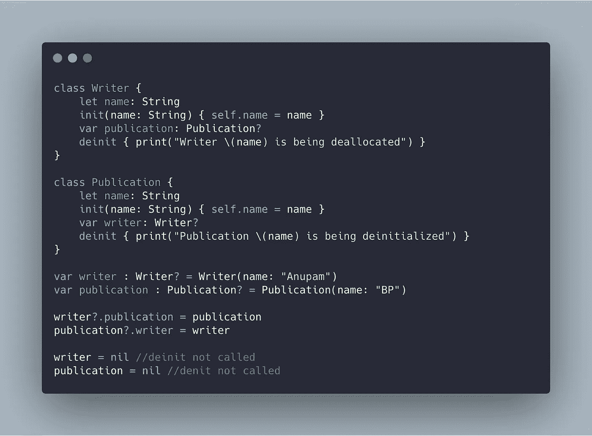

# 斯威夫特笔下的强者、弱者和无主的自我

> 原文：<https://betterprogramming.pub/the-strong-the-weak-and-the-unowned-self-in-swift-1795d8e7b990>

## 了解自我的三个层次，它们如何影响弧线，以及自我和自我之间的区别


照片由[阿洛拉·格里菲斯](https://unsplash.com/@aloragriffiths?utm_source=medium&utm_medium=referral)在 [Unsplash](https://unsplash.com?utm_source=medium&utm_medium=referral) 上拍摄

很久以前，在一个遥远的地方，Swift 团队决定`self`可以有三种形式——`strong`、`weak`或`unowned`。这完全取决于用例以及您有多喜欢或讨厌内存泄漏！在接下来的几节中，我们将介绍这三个部分。但在此之前，让我们后退一步，从一个不同的角度来看`self`。

# 什么是自我？

拿起一面镜子，看着它。你看到了什么？这就是自我…不，不是反映，不完全是！`self`是你所指的实例的等价形式。每个类和结构都有 self 作为指向自身的隐式属性。

它类似于 Java 中的`this`,但显著的区别是 Swift 的`self`几乎可以在任何地方使用——Java 的`this`只在实例方法的范围内使用。

虽然 self 可以在任何地方应用来访问类和结构的属性和方法，但最佳实践是仅在必要时使用它，否则忽略它。

这里有两个需要使用`self.`的场景

# 1.区分初始化器中的属性名和参数名

`self`对于区分方法参数和实例属性名称是至关重要的，以防止歧义。

```
class Author{
  let name: String

  init(name: String) {
    self.name = name

  }
}
```

在上面的例子中省略`self`会给 Swift 编译器造成歧义——它会把两个变量都只当作参数。

# 2.内部封闭

引用闭包内的属性需要显式使用`self`属性来表明您正在捕获封闭类型的实例。作为一种类型安全语言，Swift 有意引入了这种设计，以表明在闭包发生之前不会释放`self`属性。

因此，在之前编写的`Author`类中，我们添加了一个调用闭包的函数，如下所示:

```
class Author{

  func greetName(){DispatchQueue.main.asyncAfter(deadline: .now() + 2) {
          print(self.name)
      }
  }
}
```

如果在没有`self`的情况下访问`name`属性，Swift 编译器会抱怨。

# 强引用

默认情况下，我们到目前为止一直提到的`self`是强的。任何属性都被隐式标记为强。自动引用计数(ARC)负责跟踪和处理应用程序的内存，为不再使用的实例释放空间。

只要实例持有活动引用，ARC 就不会释放它。例如，如果两个类互相持有强引用，就会产生引用循环，导致内存泄漏。

下图显示了实例未被释放的保留周期示例:



当你在上面的类中，或者在协议和委托中处理父子关系时，你可以很容易地结束这样的保持周期。

此外，我们看到闭包从封闭上下文中捕获了自我。当闭包的生存期超过封闭类的生存期时会发生什么？我们将在下一节处理`weak`和`unowned`引用时讨论这个问题。

# 弱引用

为了防止保持周期，我们可以将引用中的任何一个标记为`weak`，这意味着这种关系并不牢固。ARC 了解这一点，不会在其保留计数中考虑该引用，从而允许它在没有任何限制的情况下被解除分配。

除了`self`，任何属性或变量都可以通过设置`weak`关键字来设置为弱引用。在释放期间，属性被 ARC 标记为 nil。这也表明弱引用不能是非可选的。

## 用封闭处理脆弱的自我

闭包被设计成从封闭范围中捕获它所使用的属性，无论是`self`还是任何其他类/结构引用。为了防止闭包超过封闭类的生存期时产生保留周期(从而保持对实例的强引用),我们将使用捕获列表来定义关系绑定的类型。

捕获列表会创建封闭属性的副本。在下面的代码片段中，我们将看到将自我捕获为弱者是如何避免内存泄漏的:

```
class Writer {
    var **myClosure**: (() -> ())?
    let name: String
    init(name: String) {
        self.name = name
        self.myClosure = {
            **[weak self] in**
            print("Writer is \(self**?**.name)") 
        }
    }

    deinit { print("Writer \(name) is being deallocated") }
}var writer : Writer? = Writer(name: "Anupam")
writer = nil //this gets deallocated
```

在上面的代码中，没有将 self 捕获为弱不能允许实例`writer`被释放，并且闭包中的两个 print 语句都不会被打印。理想情况下，为了避免在弱的时候到处使用`self?`，我们可以使用一个 guard 语句，如下所示:

```
self.myClosure = {
            [weak self] in**guard let self = self else { return }**
            print("Writer is \(self.name)") 
}
```

此外，我们可以在方括号中捕获多个参数:

```
[weak self, weak arg2, unowned arg3] 
```

让我们进入最后一个项目`unowned`。

# 无主参考文献

无主引用只是弱引用，不能用弧**标记为零。**因此所有的无主引用都是**非可选的**，只有在你确定实例没有被释放时才应该使用。小心处理无主引用至关重要。当实例为零时访问它们会导致崩溃。

您应该使用 unowned 而不是 weak 的一个常见用例是当您希望避免使用 optional。

# 自我对自我

到目前为止，我们已经讨论了`self`及其不同的形式。除了基本上是一个属性的`self`之外，我们还有另一个关键字`Self`，它表示一致性协议或协议扩展的类型。

下面的代码演示了如何使用`Self`和`self`来展示它们之间的不同:

```
extension String{
    func greetMe() -> **Self** {
        return "Hello \(self)"
    }
}let str = String.greetMe("Anupam")
str() //prints: Hello Anupam
```

# 结论

与 life 不同，在 Swift 中使用强引用可能是有害的，并会导致保留周期。为了解决这个问题，我们可以用关键字`weak`和`unowned`来标记引用。任何引用类型都可以用这些关键字来标记。像结构这种属于值类型的东西不能被标记为`weak`或`unowned`。

这一次到此为止。我希望你构建无内存泄漏的 iOS 和 macOS 应用程序。感谢阅读。