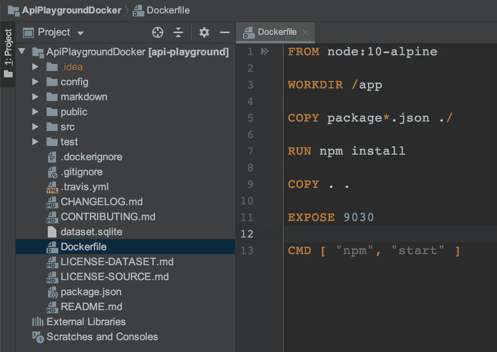
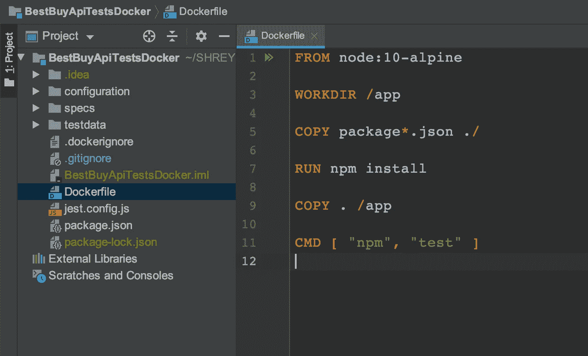
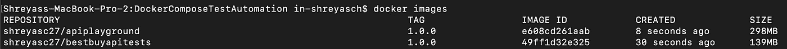
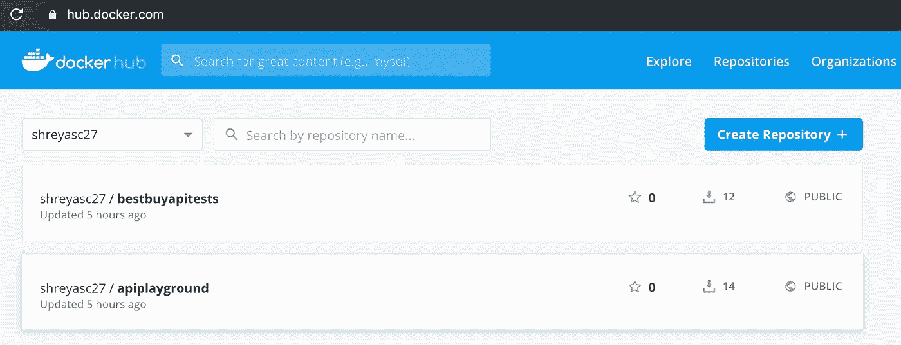
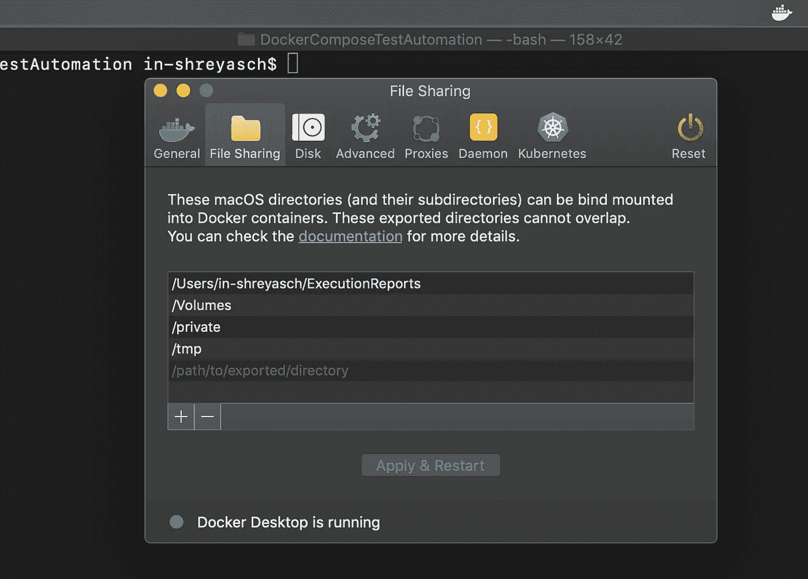
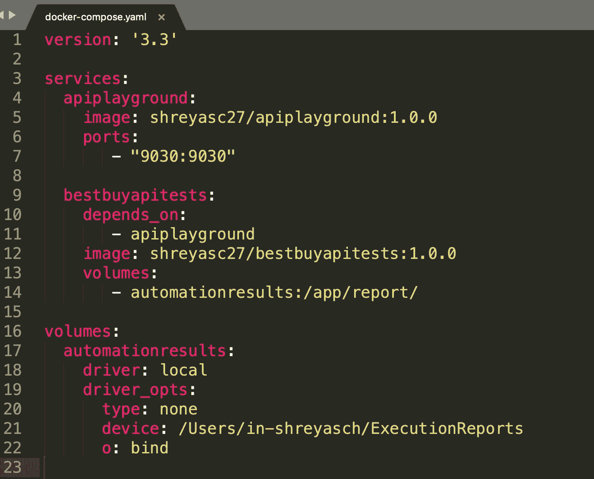
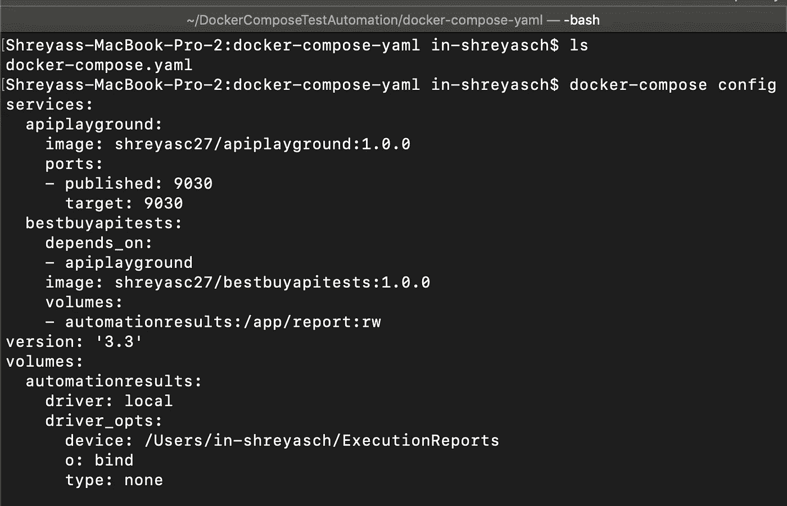
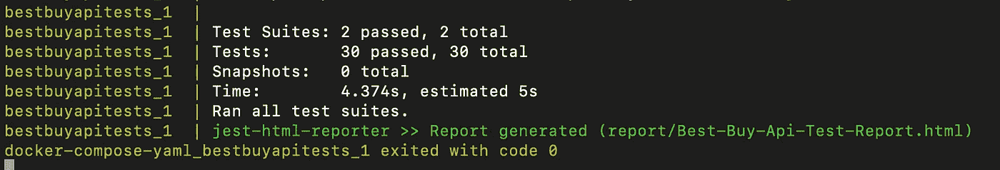
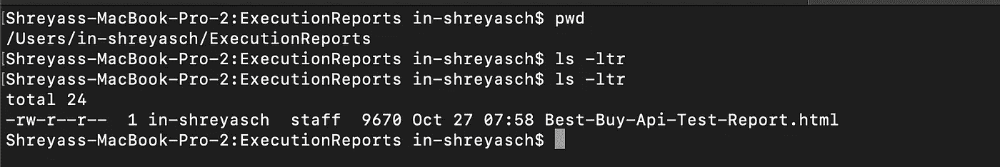
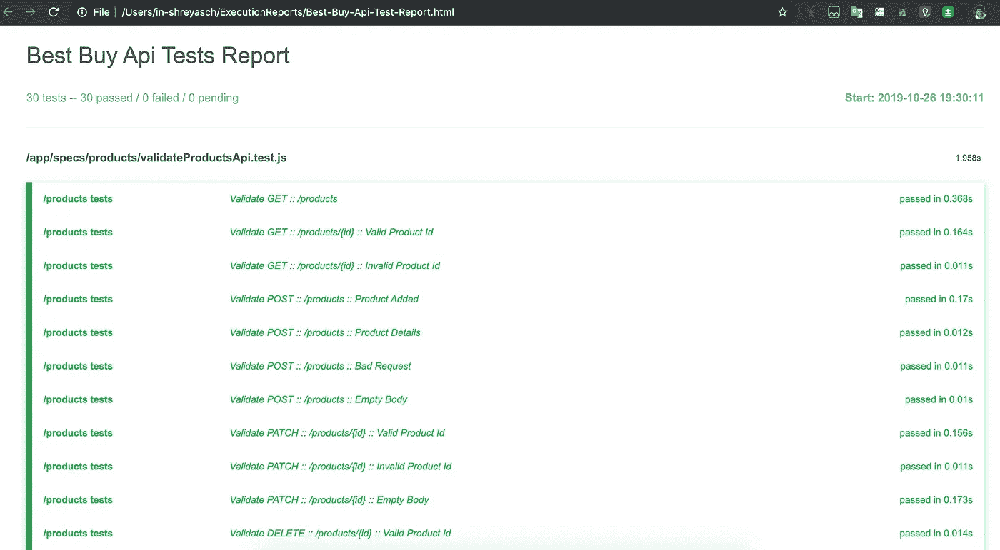

# 使用 Docker Compose 的测试自动化的微妙艺术

> 原文：<https://betterprogramming.pub/the-subtle-art-of-test-automation-using-docker-compose-69a10fc9aac5>

## 利用 docker-compose 来执行测试自动化

摄影师:Self |地点:印度拉达克列城潘公湖

多年来，我们中的许多人已经在类似生产的测试环境中执行了测试自动化。

对于术语“类似生产环境”,我指的是具有类似生产环境的精确设置的测试环境，但是可能具有也可能不具有与生产环境相同的精确配置。

然而，当谈到针对测试环境执行测试自动化时，工程师总是会面临一定程度的挑战(尽管是可以解决的)。

典型的例子是:

1.  QA 工程师在测试环境中执行手动/探索性测试，同时，CI 管道由于新的提交而被触发，从而部署当前的构建快照，触发可能妨碍已经完成的测试数据设置的自动化测试。
2.  可以通过测试套件和测试框架的设计来解决，但是并行执行不可能支持特定的用例。
3.  与专用的成熟的类似生产的测试环境相关的总成本。

这些是可以通过使用 docker-compose 执行测试自动化来解决的一些挑战。我们能够用这种方法解决的一些经典挑战:

1.  针对 Docker 映像运行测试，而不是一个成熟的测试环境，这一点总是有争议的。但是最终，测试自动化的目的是验证这些 Docker 映像中包含的功能，而不是基础设施的设置。当然，可以有测试的子集，也称为冒烟测试套件，可以在真实的类似生产的环境中运行——最好是在系统集成测试或开发环境中。但是基于 docker-compose 的设置可以用来运行耗时的回归套件。
2.  可以创建多个隔离的环境，可能在同一个主机中，因此测试套件可以隔离运行。这里最大的优势是，我们现在能够利用底层基础设施提供的并行化，而不是依赖于自动化框架级别的并行化，也就是说，在这种情况下，我们可以利用 docker-compose 创建的隔离环境。
3.  在测试用例或测试套件级别进行测试数据设置和拆卸，而不要过多考虑当多个测试套件并行运行时会产生什么影响。原因是，当并行化在自动化框架级别完成时，执行仍然指向单个环境。但是，当并行化是通过在隔离环境中执行测试来完成时，责任就转移到了底层基础设施级别，从而带来了一定程度的关注点分离。
4.  如果必须部署一个热修复程序，并且必须针对该热修复程序执行回归，那么与其在测试环境中部署热修复程序快照，还不如使用 docker-compose 构建独立的环境并验证热修复程序，这样会更加方便。
5.  为了运行向后兼容性测试，如果需要部署当前的生产快照，可以使用 docker-compose 构建独立的环境，在当前生产的状态下创建测试数据，然后升级到当前版本的快照，并验证新的更改是否不会破坏构建，这样可以更有效地完成。
6.  复制将用于未来参考的所需数据，即自动执行测试报告，在我们的情况下，使用卷，以便可以利用主机。

# 入门指南

在本文中，我们将看到一个如何使用 docker-compose 针对微服务运行 REST API 测试自动化套件的示例。

1.  创建微服务的 Docker 映像，并将其推送到 Docker Hub。
2.  创建 REST API 自动化的 Docker 映像，并将其推送到 Docker Hub。
3.  创建一个`docker-compose.yaml`,它:

a.从 Docker Hub 提取微服务 Docker 映像，并启动服务。

b.从 Docker Hub 中提取 REST API automation Docker 映像，并启动该映像，以便针对点 3-a 中的微服务执行自动化测试套件。

4.将测试自动化执行的报告复制到 Docker 容器运行的主机上的一个卷中。

现在，让我们来详细看看这些步骤。

## **微服务存储库和 Dockerfile**

## **REST API 测试框架库和 Dockerfile 文件**

第一步。为微服务存储库和 REST API 测试框架存储库构建 Docker 映像。

Docker 命令来构建 docker 图像并列出它们

第二步。运行`docker images`，它列出了上述`docker build`命令创建的图像。

第三步。将创建的 Docker 映像推送到 Docker Hub。

将 Docker 映像推入 Docker Hub 的 Docker 命令

第四步。Docker Hub 中列出的推送图像。

Docker Hub 中发布的图像

第五步。添加本地目录，安装到 Docker 容器中。

将主机目录装入 Docker 容器

码头工人作曲 YAML。

docker-compose.yaml

第六步。检查`docker-compose.yaml`的配置。

第七步。跑`docker-compose up`。

使用 docker-compose.yaml 开始执行

运行 docker-compose.yaml 后生成的结果

第八步。在挂载的 macOS 目录中生成的结果文件。

执行后生成的 Html 报告

第九步。来自安装的 macOS 目录的详细 HTML 报告。

REST API 自动化 HTML 报告

步骤的视频教程:

为了实现上述步骤，需要开发人员、质量保证人员和运营人员之间的密切协调。如果没有老年退休金计划的支持，要达到这个目标会比较困难。

因此，让每个角色都参与进来非常重要——开发人员、质量保证人员和运营人员。