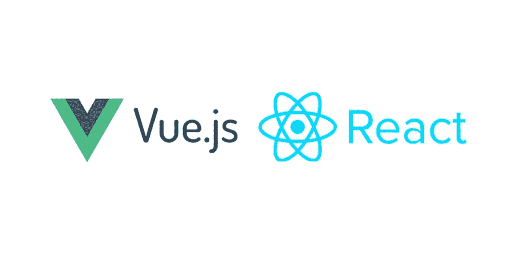
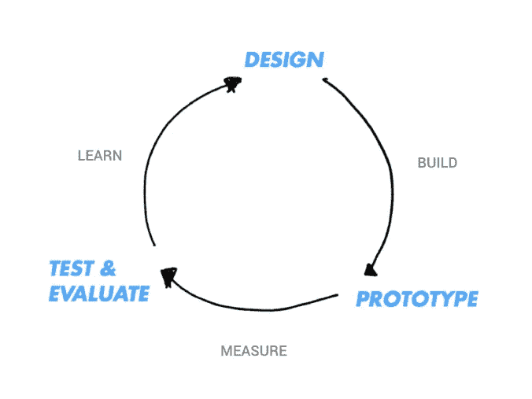

# 边做边学是一种超能力

> 原文：<https://betterprogramming.pub/the-super-power-of-learning-by-doing-5016112b12cc>

## 研发是一种生活方式

Johannes Plenio 在 [Unsplash](https://unsplash.com/s/photos/super-power?utm_source=unsplash&utm_medium=referral&utm_content=creditCopyText) 上拍摄的照片

# 学校！让我们谈谈那个

我很确定你在这里是因为你和我一样——我从来都不是一个安静地坐在课堂上做笔记的人。

我想，在我大学的第一年，除了学习“他们想让我们学的东西”，我几乎什么都做了。他们是一种无聊的，过时的程序。

在内心深处，我觉得这不是我想学的东西，这不会让我成为一名更好的开发人员，我还没有准备好花一年的时间去上我可以在一个月内自学的课程！

嗯，说实话，“理论”很重要，但多年的理论不是我的菜。

照片由[穆罕默德·里兹万](https://unsplash.com/@rizsam?utm_source=medium&utm_medium=referral)在 [Unsplash](https://unsplash.com?utm_source=medium&utm_medium=referral) 上拍摄

## 我同意，但是我需要一个学位

你不需要大学文凭，你需要教育

我没有排除大学。另一种方式我想说:理论和实践知识结合更好，因为大学文凭只是一个认证。

从根本上来说，学位只是一张纸，并不总是报酬丰厚或能保证找到工作。

## 我在哪里投资我的时间？

每周做东西是很可怕的。重要的不是把某件事做得完美，而是做出某件事，而且要经常。最终，你会让它变得更棒。

你需要适销对路的技能，这不是一个懒惰的人的道路。你需要不断的工作和不断的成长，因为生活就像海洋，你不能阻止海浪，但你可以冲浪，你的冲浪板就是你的知识。

# 人们有不同的学习风格

## 我去过那里

当我开始学习编程时，更具体地说，对我来说并不容易。我不知道很多事情，也不知道很多技术和语言。

然后你开始听说框架和库。几个月过去了，我仍然不确定我想走的路。我开始用 Java 和 JavaScript 编码，发现了一些不同。

Java 是一种运行在虚拟机或 web 浏览器中的 OOP 语言，代码是编译的。而 JavaScript 是运行在 web 浏览器上的 OOP 脚本语言，代码在文本和网页中。

然后，我的下一步是找出最好的 JavaScript 框架。我听说了 React 和 Vue，然后其他关键词开始出现，比如组件、生命周期、状态管理……

我甚至测试了不同的语言，如 Python、C、C#…以及不同的框架，如 [Laravel](https://laravel.com/) 和 [Django](https://www.djangoproject.com/) 。

# 相信你自己

我敢肯定，当你在学习的时候，你会收到很多邀请，那个声音会出现，告诉你:“别想了，你会搞砸的。”“你还没准备好。”

是啊，没错。也许你还没有为一个大项目做好准备，但是你什么时候决定你写的东西，你画的东西，或者甚至你刚刚做的东西应该上市呢？

抓住每一个机会，让社区来决定和评估你的作品，并接受所有有助于你改进作品的反馈，这是不是更好？

一天，一个朋友打电话给我说:“嘿，我们正在创业，我们正在组建一个团队，我们需要一个云开发者，”然后他提到:“ [AWS](https://aws.amazon.com/) ”

他还提到了嵌入式系统、IOT、网关、BLE 和智能交通系统。这是我第一次听说那个世界。我说:“好啊，我进去了！”

前三个月真是疯狂。不容易，我不会骗你，很多额外的努力和不眠之夜。

你知道让事情快速运转有多难。尤其是当你第一次尝试让 IOT 核心和 Lambda 和 RDS 完美工作，并照顾数据库、API，以及制作 web 和移动应用程序来消费这些 API 以用于演示案例、路线图，甚至是我们的工具时。

我们团队只有四个人，两个纯粹的嵌入式系统工程师，CEO，把我搞糊涂了。压力就不用提了…

本着“搜索、学习、实施、测试，直到我们得到完美结果”的原则，经过两年的努力，我们建立了 [Adsum Networks](https://www.adsumnetworks.com/) 。

 [## Adsum Networks |智能停车物联网传感器系统

### Adsum Networks | LivePark 传感器系统，面向整个城市的智能停车物联网传感器系统。以行业为特色…

www.adsumnetworks.com](https://www.adsumnetworks.com/) 

很荣幸能参与其中。

到目前为止，这是一个学习和在屏幕前数小时的无限循环。

# 结论

无论你的背景如何，无论你在哪个领域工作，相信你自己，抓住生活给你的所有机会。

最好让你周围的人相信你的工作，而不一定是你，因为最终，你需要评估你的工作并接受反馈。

追踪你的进度。想想连续工作，连续成长。你必须不断学习，并受到他人的启发。

不要让学历决定你是谁，你的习惯会决定。你每天的决心决定。