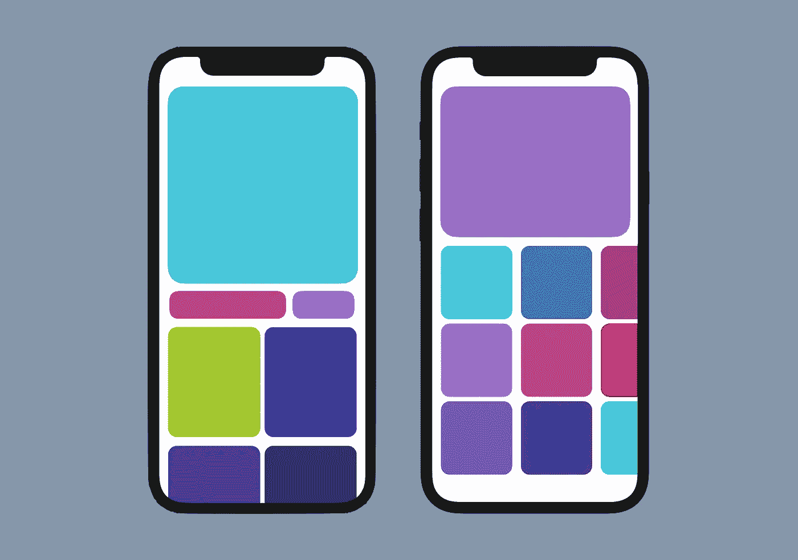
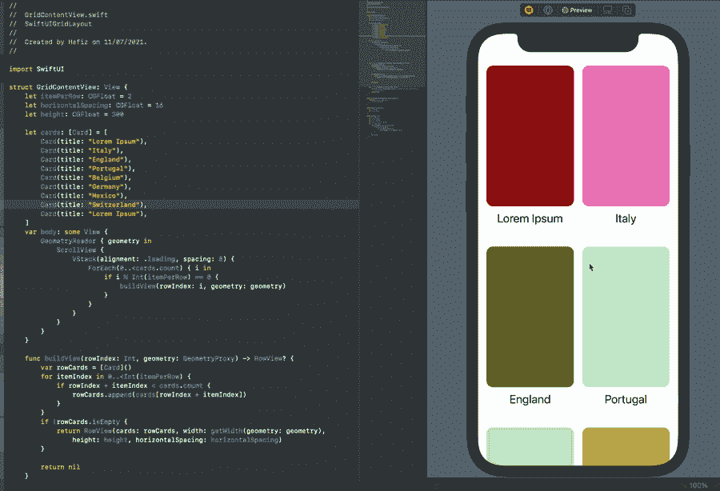
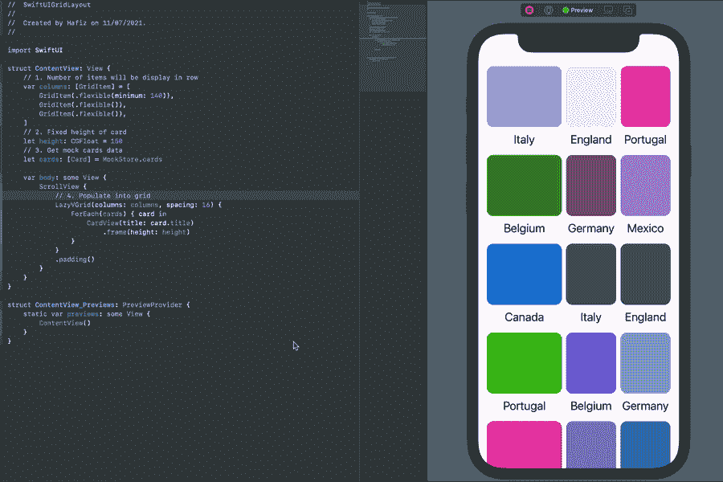
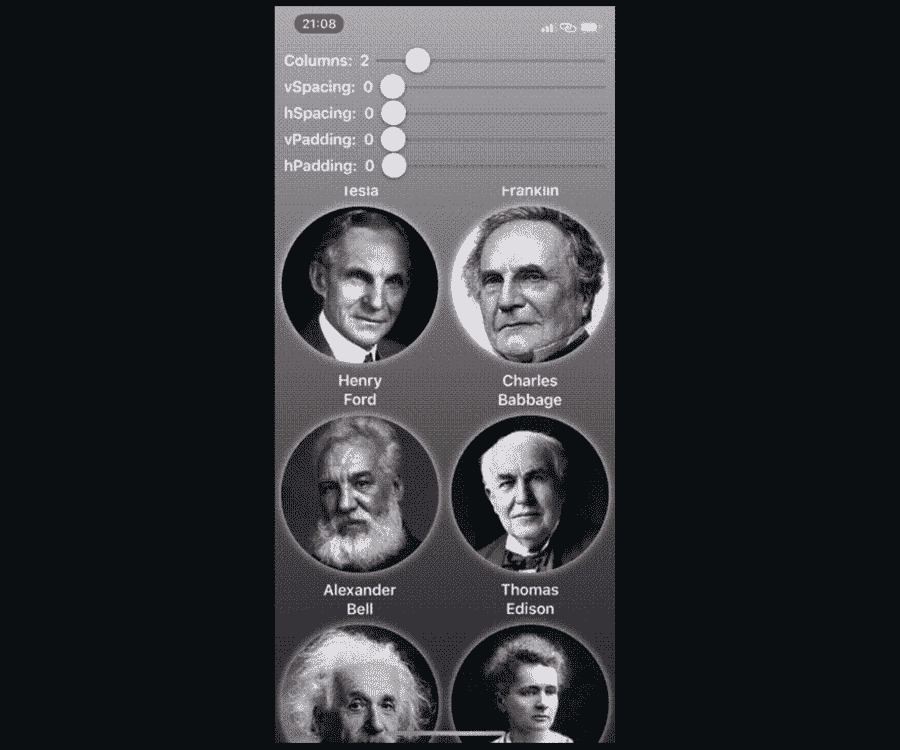

# 与 UICollectionView 等效的 SwiftUI

> 原文：<https://betterprogramming.pub/the-swiftui-equivalents-to-uicollectionview-60415e3c1bbe>

## 了解如何在 iOS13 和 iOS14 中实现网格布局

图片由作者提供。

SwiftUI 首次在 WWDC 2019 上推出，该 API 在过去两年中得到了快速改进。苹果确实对 SwiftUI 进行了重大改进，包括 UI 组件、布局和动画。

在 WWDC21 之前，SwiftUI 还没有包含专用的`CollectionView`或复合布局来取代 UIKit 中的`UICollectionView`。因此，开发人员目前可以实现的变通解决方案是将`UICollectionView`与`UIViewRepresentable`结合使用。

在本文中，我们将讨论在 SwiftUI 中不使用`UIViewRepresentable`模仿`CollectionView`的可用解决方案。

# 解决办法

我们可以使用纯粹的 SwiftUI API 在我们的项目中实现几种方法，但我们应该考虑基于支持的 iOS 版本的那些替代解决方案。

## 1.将 ScrollView 与 VStack 和 HStack 配合使用(iOS13+)

通过实现这一点，我们能够支持目前市场上的大多数应用程序(iOS 13)。

## 2.将 ScrollView 与 lazy grid 或 lazy grid 一起使用(iOS14+)

这是最新的 SwiftUI API，更灵活，有内存优化，但只适用于 iOS14 及更高版本。

# 1.带 VStack 和 HStack 的 scroll view(IOs 13+)

在这一节中，我们将创建一个卡片集合，其中包含带有垂直滚动条的两列中的`RoundedRectangle`和`Text`。

1.在 iOS13 中创建一个具有最低部署支持的新 SwiftUI 项目。

2.创建一个新的 SwiftUI 视图(`CardView`)来创建一个简单的卡片视图。此外，我们添加了一个`Color`扩展来为`RoundedRectangle`获得随机颜色。

3.现在添加`Card`模型和`RowView`作为`CardView`容器。`RowView`将根据给定的数组创建许多卡片，并将它们插入`HStack`。还要求`spacing`、`width`和`height`正确放置`CardView`并调整其大小。

4.添加`MockStore.swift`进给一些样卡数据。

5.最后，完成我们的`ContentView`文件。

我们将使用示例数据来显示两列中的卡片。请注意，这段代码每行只支持两个项目。为了在每一行中有更多的条目，我们需要修改`itemPerRow`常量。

下面是我们将得到的结果。厉害！

# 2.使用 lazy grid 或 lazy grid 滚动查看(iOS14+)

`LazyHGrid`和`LazyVGrid`是在 WWDC20 上推出的。这两个 API[只能在最低部署 iOS14 及以上的](https://developer.apple.com/documentation/swiftui/lazyvgrid)上使用。

使用这两个 API 的优点是，它们只在内容显示在`ScrollView`时填充内容。

> "网格是“懒惰的”，因为网格视图直到需要时才创建项目."— [苹果开发者](https://developer.apple.com/documentation/swiftui/lazyvgrid)

太好了。让我们开始编码。

在这个例子中，我们使用带有`.flexible` `GridItem`的`LazyVGrid`来演示尺寸灵活的`CardView`的垂直滚动。`GridItem`有三种不同的尺寸状态，包括`.flexible`、`.fixed`和`.adaptive`。

1.  首先，创建一个新的 SwiftUI 项目。默认情况下，它应该将最低部署目标设置为 iOS14+。
2.  如下面的代码所示更新`ContentView`。我们将重用上一节中显示的相同的`CardView`。

每行显示的项目由`GridItem`数组中的总项目决定。在下面的例子中，我们只定义了三个项目。

从上面的代码中我们可以看到，它比前面的实现要干净和简单得多。那是因为`LazyVGrid` API 现在处理我们需要的一切。

下面是我们用三列得到的结果。

# 有用的 GitHub 库

除了上面列出的解决方案，还有两个优秀的库可以用来更灵活地完成相同的目标，并且都支持 iOS 13 及更高版本。

## 1.QGrid

这基本上是一个使用`ScrollView`、`GeometryReader`、`HStack`或`VStack`创建网格布局的[包装器库](https://github.com/Q-Mobile/QGrid)(类似于我们的第一种方法)。

图片来自 [QGrid](https://github.com/Q-Mobile/QGrid)

## 2.瀑布网格

[这个库](https://github.com/paololeonardi/WaterfallGrid)通过使用`ScrollView`、`ZStack`等等，在每个网格项目上提供了更高级的动态高度布局。

图片来自[瀑布网格](https://github.com/paololeonardi/WaterfallGrid)

# 结论

`LazyVGrid`和`LazyHGrid`在功能和灵活性方面有很多优势——尤其是延迟加载特性。但是，我们应该记住，大多数 iOS 项目仍然支持 iOS13 用户。因此，在所有用户都迁移到 iOS14 之前，我们应该保留`ScrollView`、`VStack`和`HStack`作为我们当前的首选。你可以参考我的 GitHub [资源库](https://github.com/xmhafiz/GridLayoutSwiftUI)中的完整项目。

希望本文提高了您对使用网格布局的 SwiftUI 的理解。感谢阅读。编码快乐！

# 资源

## 开源代码库

*   [https://github.com/paololeonardi/WaterfallGrid](https://github.com/paololeonardi/WaterfallGrid)
*   [https://github.com/Q-Mobile/QGrid](https://github.com/Q-Mobile/QGrid)
*   [https://github.com/xmhafiz/GridLayoutSwiftUI](https://github.com/xmhafiz/GridLayoutSwiftUI)

## 了解网格布局

*   【https://developer.apple.com/documentation/swiftui/lazyvgrid】
*   [https://swiftwithmajid . com/2020/07/08/mastering-grids-in-swift ui/](https://swiftwithmajid.com/2020/07/08/mastering-grids-in-swiftui/)
*   [https://www . app coda . com/learnswiftui/swift ui-gridlayout . html](https://www.appcoda.com/learnswiftui/swiftui-gridlayout.html)