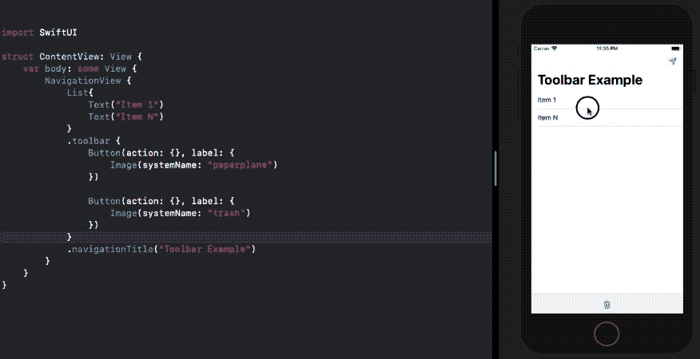
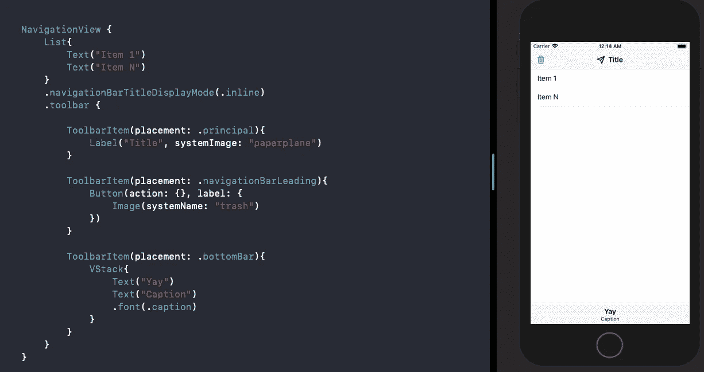
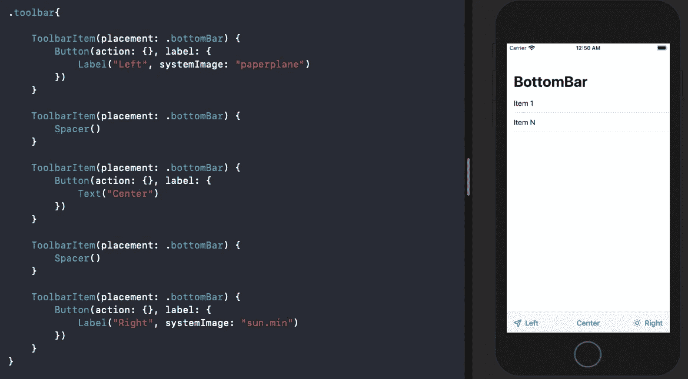

# iOS 14 中的 SwiftUI 工具栏

> 原文：<https://betterprogramming.pub/the-swiftui-toolbar-in-ios-14-b4a0fe6a3034>

## 让我们来看看新的修饰符，在我们的布局中巧妙地放置视图

照片由 [Przemyslaw Marczynski](https://unsplash.com/@pemmax?utm_source=medium&utm_medium=referral) 在 [Unsplash](https://unsplash.com?utm_source=medium&utm_medium=referral) 上拍摄

工具栏是 WWDC 2020 期间 SwiftUI 第二次迭代中有趣的新增内容之一。

从本质上来说，`toolbar`是一个修饰符，它允许您在一组视图控件周围放置一个环绕，并将它们设置在所需的位置。

默认情况下，SwiftUI 可以使用`toolbar`修改器智能地确定和设置所需位置的视图，但是您也可以使用`ToolbarItem`显式地设置它。

在接下来的几节中，我们将了解:

*   对`toolbar`修改器的需求
*   使用工具栏 API 自动设置底部栏和导航栏中的项目
*   使用`ToolbarItem`进行手动放置

# 需要 SwiftUI 工具栏

以前在 SwiftUI 中设置底栏是一件很头疼的事情。你可能已经使用了`UIViewRepresentable`来显示一个`UIToolbar`。

类似地，要定制顶部的导航条，在此之前，您必须依赖底层的`UINavigationBar`。是的，是的，在`init`函数中做事情让它看起来像一个 UIKit 应用程序，而不是纯粹的 SwiftUI。

令人高兴的是，新的`toolbar`修改器让我们包裹视图并设置我们选择的放置位置。因此，在屏幕的底部或顶部添加一个视图控件，以及在 watchOS 的情况下将项目设置为主要操作或确认是相当容易的。

# 使用 SwiftUI 工具栏自动放置

让我们看看如何用 SwiftUI `toolbar`修改器设置几个视图。

[代码要点链接](https://gist.github.com/anupamchugh/38b97106fcd46676fde073e052dd750f)

注意以下几点很重要:

*   要使工具栏工作，您的视图需要包装在 NavigationView 中。
*   默认情况下，在 iOS 和 macOS 中，工具栏中的第一个项目被放置为导航栏的右栏按钮。
*   第二个项目习惯上放在底部栏的中心。
*   如果在工具栏内指定了一个`Label`，由于空间限制，它可能只显示图像。在这种情况下，`Text`将用于辅助目的。

虽然上面指定工具栏布局的方式很好，但有时你希望有更多的控制。

幸运的是，我们已经准备好了。

# 使用 ToolbarItem 手动定位项目

根据[苹果文档](https://developer.apple.com/documentation/swiftui/toolbaritem) , `ToolbarItem`是“一个模型，代表一个可以放在工具栏或导航栏中的项目。”

`ToolBarItem`让我们以如下方式包装视图并定义位置:

[代码要点链接](https://gist.github.com/anupamchugh/80e07ce5ff08b9147928cb4e8ba44a1f)

因此，我们有几种放置模式:

*   `principal` —这将视图放在屏幕最突出的部分。在 iOS 和 macOS 中，是标题视图。
*   `navigationBarLeading`和`navigationBarTrailing`用于在导航栏的左右两端放置项目。
*   `bottomBar`设置屏幕底部工具栏中的项目。
*   `automatic`就是我们上一节看到的。它根据平台和可用空间找到最合适的位置。

需要注意的是，如果`navigationBar`显示模式设置为`automatic`，则`principal`的位置将被忽略。因此，我们在上面指定了`inline`模式。

`ToolBarItem`如果需要，可以轻松创建自定义导航栏。

要用多个项目来设计底部栏的样式，我们需要确保顺序不变。这意味着最左边的项目首先被放置，如下所示:

# 结论

我们探索了新的工具栏修改器，并看到了如何使用`ToolbarItem`来帮助设置视图控件的位置。

这个新的 API 将有助于构建独立于平台的工具栏。

这是一个总结。感谢阅读。