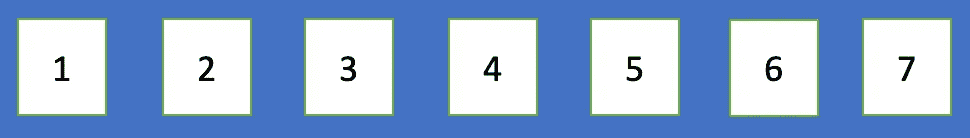
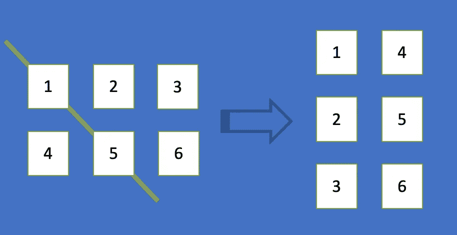
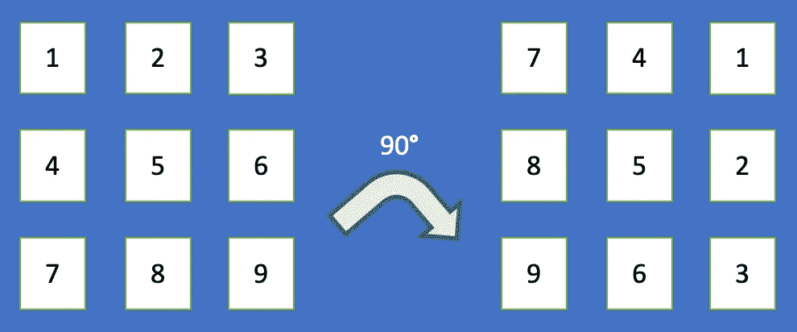
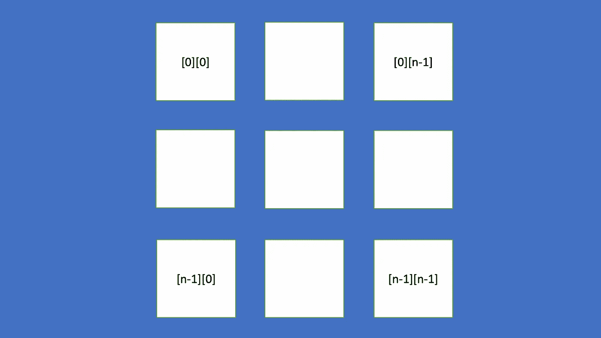
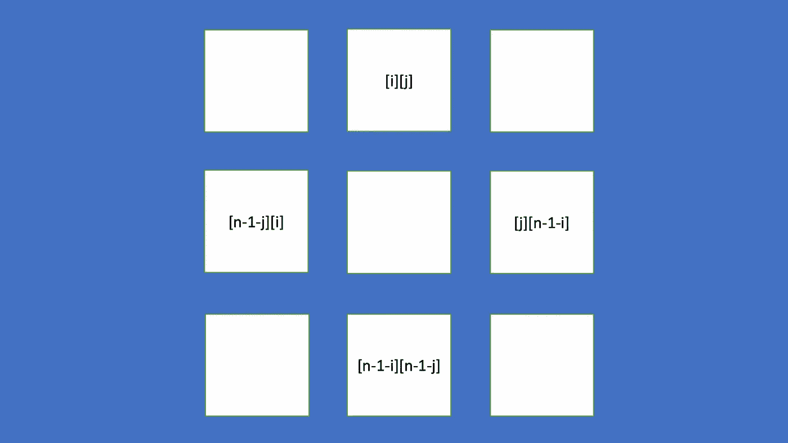
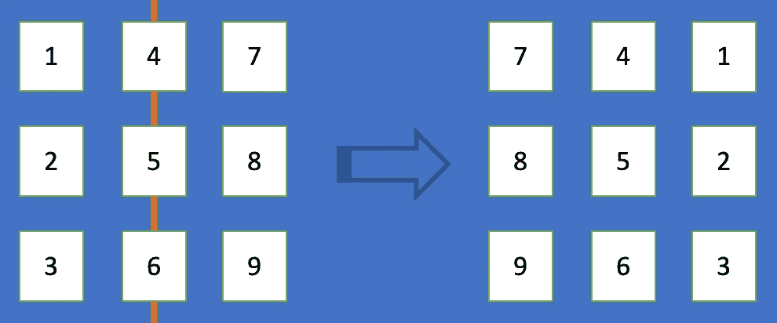
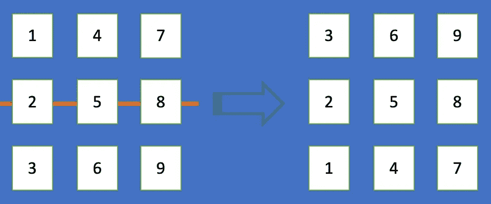
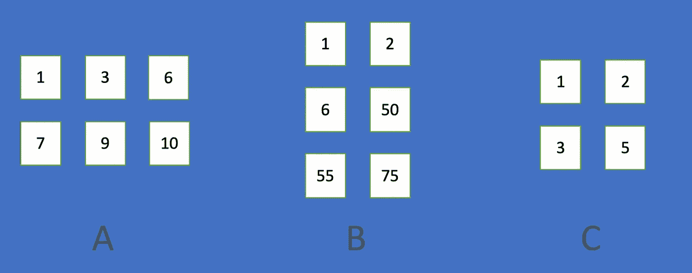
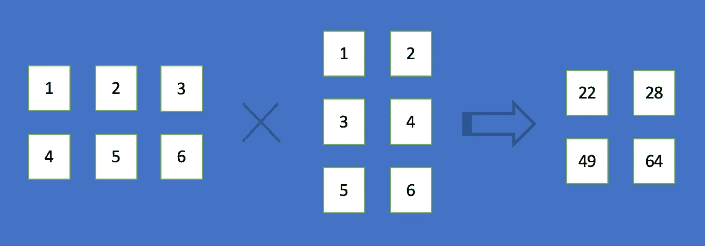
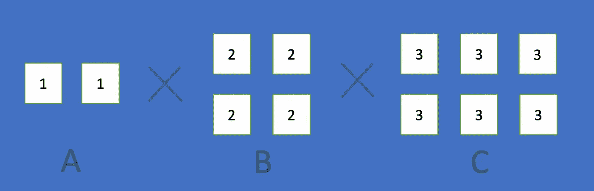

# 数组转换的技术面试指南

> 原文：<https://betterprogramming.pub/the-technical-interview-guide-to-array-transformations-91e23839d19c>

## 用于面试准备和日常编码的数组转换的 JavaScript 指南

图片来源:作者

[数组](https://developer.mozilla.org/en-US/docs/Web/JavaScript/Reference/Global_Objects/Array)是一个类似列表的对象，它有执行遍历和变异操作的方法。我们已经在另一篇文章中回顾了数组 API。今天我们来看看一些常见的数组变换面试问题。

# 旋转一维数组

给定一个数组，我们可以将每个元素旋转 k 步。如果到达数组的末尾，元素将旋转到数组的开头。以`[1, 2, 3, 4, 5 , 6, 7]`为例。将数组旋转一步将导致`[7, 1, 2, 3, 4, 5 , 6]`。将阵列旋转两步将导致`[6, 7, 1, 2, 3, 4, 5 ]`。将数组旋转九步将得到`[6, 7, 1, 2, 3, 4, 5 ]`。这相当于将阵列旋转两步(`9 % 7`)。当 k 为负时，它旋转到前面，即旋转阵列`-4`步将导致`[5 , 6, 7, 1, 2, 3, 4]`。这相当于将阵列旋转 3 ( `7 - 4`)步。

下面是将数组中的每个元素旋转 k 步的算法:

以上算法是基于直觉。它有一些边界需要处理。

还有另一种方法来完成它。下面是一个长度为 7 的数字数组:

反转后的数组如下所示:

假设 k 已经被减少到`[0, nums.length -1]`的范围内，旋转数组 k 步中的元素将最后 k 个元素移动到前面。相当于把反转后的数组从 0 反转到`k — 1`，从 k 反转到`nums.length -1`。

如果 k = 3，反转`[7, 6, 5]`和`[4, 3, 2, 1]`与旋转`[1, 2, 3, 4, 5 , 6, 7]`三步的效果相同:

下面是通过反转三个数组来旋转数组中每个元素的算法:

那不是更整洁吗？

这些是对两种算法的验证测试:

# 转置二维数组

给定一个 2D 数组，我们可以通过沿主对角线翻转元素来转置该数组，即，将点`[i][j]`转置到点`[j][i]`。

下面是转置 2D 数组的算法:

这些是验证测试:

# 旋转二维数组

给定一个 2D 数组，我们可以将它顺时针旋转 90 。

如果给我们一个左下方的数组，顺时针旋转 90 度就成了右下方的数组。

我们执行原地旋转，假设数组是一个 n×n 数组。下图显示了四个角的数组索引:

我们需要旋转[i][j]处的元素及其相关元素:

以下是旋转 2D 数组中每四对元素(上、右、下、左)的算法:

旋转 1D 阵列有一条捷径。旋转 2D 阵列有捷径吗？是的，确实如此。

我们绘制主对角线，并通过沿主对角线翻转元素来转置数组。这将生成右下方的数组。

观察转置的数组。原来的行变成了列。它几乎是目标数组，只是需要反转行(沿中间的 Y 轴翻转)。

以下是通过沿主对角线转置并反转所有行来旋转 2D 数组的算法:

这些是对两种算法的验证测试:

如果面试题要求我们将一个 2D 阵列逆时针旋转 90°**，我们该如何处理这个问题？**

**步骤 1:沿着主对角线转置数组。这将生成右下方的数组。**

****

**步骤 2:反转列(沿着中间的 X 轴翻转)。**

****

# **以螺旋顺序遍历**

**2D 数组的螺旋顺序是从左上角开始，以顺时针方向遍历所有元素，直到到达数组的中间。**

**下面是一个 3x3 阵列的螺旋顺序示例。**

****

**以下是以螺旋顺序遍历 2D 数组的算法:**

**这些是验证测试:**

# **搜索二维数组**

**升序 2D 数组是一个数字数组，其元素值从左到右、从上到下递增。我们被要求编写一个算法来搜索排序数组中的目标值。**

**例如，下图中有三个 2D 升序数组(A、B 和 C)。尝试搜索目标值，6。a 和 B 返回真，C 返回假。**

****

**我们可以将其视为从左上角到右下角的 1D 阵列。那么这个问题就变成了一个二分搜索法问题。**

**以下是在升序 2D 数组中搜索目标值的算法:**

**上面是一个二分搜索法，在一个超级指数和 2D 指数之间有一些指数转换。**

**还可以检查每行的目标是否是该行的一部分(小于或等于该行的最后一个元素)。算法是这样的:**

**这些是对两种算法的验证测试:**

# **优化稀疏矩阵乘法**

**[矩阵乘法](https://en.wikipedia.org/wiki/Matrix_multiplication)是从两个矩阵产生一个矩阵的运算。第一个矩阵中的列数必须等于第二个矩阵中的行数。结果矩阵具有第一矩阵的行数和第二矩阵的列数。下面是一个 2×3 矩阵乘以 3×2 矩阵得到 2×2 矩阵的例子。**

****

**稀疏矩阵是大部分元素为零的矩阵。对于有多少元素需要为零才能被认为是稀疏的，没有严格的定义。通常非零元素的数量大约是行数或列数。**

****

**为了得到结果`C = A x B`，每个元素可以计算如下:**

*   **`C[i][j] = A[i][k] * B[k][j]`对于每 k。**

**如果是稀疏矩阵，如果`A[i][k]`为 0 或者`B[k][j]`为 0，可以节省大量计算。**

**下面是执行稀疏矩阵乘法的算法。**

**可以修改上述算法，以便从生成非零数据数组。这样可以节省检查中的元素是否为零的时间。如果 B 有很多列，这可能会提高性能。**

**下面是通过从一个。**

**这些是验证测试:**

# **优化矩阵链乘法**

**矩阵乘法是结合律。对于三个矩阵 A、B 和 C，`(A x B) x C = A x (B x C)`:**

****

**然而，乘法计数是不同的:**

*   **`(A x B) x C`的乘法计数是 10。**
*   **`A x (B x C)`的乘法计数是 14。**

**当链很长时，优化乘法阶数对于提高性能至关重要。**

**我们写一个算法来找出最小乘法计数。这里给我们一个矩阵索引的数组，`nums`，它代表了一个矩阵链，维数分别为`nums[0] x nums[1]`、`nums[1] x nums[2]`、...，`nums[nums.length — 2] x nums[nums.length — 1]`。这里通常采用[动态规划](https://medium.com/better-programming/the-technical-interview-guide-to-dynamic-programming-3ce755d99849)。`dp[i][j]`代表从`matrix[i]`到`matrix[j]`的最小乘法计数。**

*   **`dp[i][j] = Math.max(dp[i][k] + dp[k + 1][j] + nums[i — 1] x nums[k] x nums[j])`，对于每一个`i ≤ k < j`。**

**以下是找出给定矩阵链索引的最小乘法计数的算法:**

**这些是验证测试:**

# **结论**

**数组变换问题有很多种。熟能生巧。享受编码。**

**感谢阅读。我希望这有所帮助。你可以在这里看到我的其他媒体出版物。**