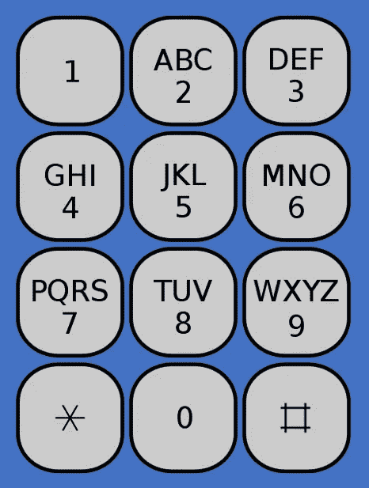
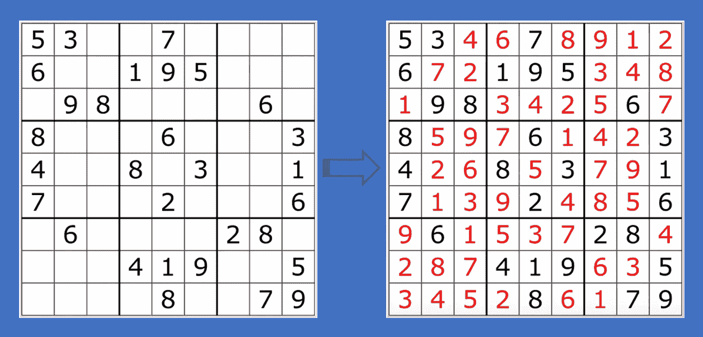

# 回溯技术面试指南

> 原文：<https://betterprogramming.pub/the-technical-interview-guide-to-backtracking-e1a03ca4abad>

## 关于**回溯**的 JavaScript 指南，用于面试准备和日常编码


图片来源:作者

在之前的文章中，我们讨论了动态编程，这是一种通过构建解决较小子问题的解决方案来解决较大问题的方法。它使用最优子结构。

在本文中，我们将关注另一个热门话题:回溯。

[回溯](https://en.wikipedia.org/wiki/Backtracking)是一种通用算法，用于寻找一个计算问题的全部或部分解决方案，该算法在放弃每个部分候选方案的同时，逐步构建候选方案(回溯)。部分候选被放弃，要么是因为它不可能完成有效的解决方案，要么是因为问题需要找到所有有效的解决方案。

动态编程和回溯有什么区别？

*   动态规划强调重叠子问题，而回溯则关注全部或部分解。
*   动态编程依赖于最优性原则，而回溯使用强力方法。
*   动态编程更像广度优先搜索(BFS)，一次建立一层，而回溯更像深度优先搜索(DFS)，首先建立一个解决方案。
*   动态编程通常比回溯占用更多的空间，通过记忆所有的最优子 **-** 解供以后使用。
*   回溯通常需要更多的时间来执行，通过迭代全部或部分解决方案。

有些问题可以用动态规划优化，有些问题更容易回溯。它根据具体情况适用于不同的情况。

在本文中，我们将讨论一些回溯问题。

# 典型的回溯结构

我们尝试标准化回溯解决方案:

*   将回溯函数命名为`backtrack`。
*   将回溯放入函数中，以利用[闭包](https://developer.mozilla.org/en-US/docs/Web/JavaScript/Closures)。
*   以下是典型回溯算法的结构:

# 排列、组合、子集和变化

## 排列

集合的排列是其成员排列成一个序列。选择的顺序很重要。以`[1, 2, 3]`为例，它的排列是`[[1,2,3],[1,3,2],[2,1,3],[2,3,1],[3,1,2],[3,2,1]]`。

下面是回溯算法，用于打印数字选择的排列:

在第 28 行，我们使用原始的`start`值尝试下一个候选，这将使用每个候选。为了防止同一个选项被多次使用，第 23 行确保该号码还没有被使用。

这些是验证测试:

## 排列计数

显然，如果问题只要求排列计数，我们可以使用动态规划来获得最优解。

下面是从数字选择中打印出排列计数的动态编程算法:

这些是验证测试:

毫不奇怪，排列计数是阶乘数。

## 组合

组合是从集合中选择的项目。选择的顺序并不重要。我们可以用类似的程序来计算组合。`[1, 2, 3]`的组合是`[[1, 2, 3]]`。

下面是从数字选择中打印出组合的回溯算法:

在第 26 行，我们使用 *i* + 1 尝试下一个候选，这将从一个未使用的候选开始。

这些是验证测试:

打印出和结果一样的选择，似乎没有意义。然而，该算法是许多组合变化的基础。外卖是下一个候选索引。如果候选人不能被重用，使用索引， *i* + 1。否则，使用索引， *i* 。

## 子集

如果集合 A 的所有元素也是 B 的元素，则集合 A 是集合 B 的子集。A 和 B 有可能相等。`[1, 2, 3]`有子集`[[],[1],[1,2],[1,2,3],[1,3],[2],[2,3],[3]]`。

下面是从数字选择中打印出子集的回溯算法:

这些是验证测试:

## 置换子集

子集是组合。区别对待子集排列怎么样？以`[1, 2]`为例:

*   它的子集是`[[],[1],[1,2],[2]]`。
*   它的排列子集是`[[],[1],[1,2],[2],[2,1]]`。

要生成置换子集，每个回溯调用都需要从第一个选择开始。而且，用过的选择不能重复使用。

置换子集的算法如下:

第 24 - 26 行从未使用的选项回溯。

这些是验证测试:

## 置换子集不唯一

我们假设每个数字选择都是一个唯一的自然数。如果数字选择不是唯一的呢？

比如`[1,2,1]`的排列子集是`[[],[1],[1,1],[1,1,2],[1,2],[1,2,1],[2],[2,1],[2,1,1]]`。

在这种情况下，我们需要对选项进行排序，以确保相同的数字相邻。所以可以避免多次把同一个数字放在同一个位置。

以下是编号不唯一的置换子集的算法:

第 46 行对选项进行排序。

第 32 - 37 行跳过了与前面相同的选项。

这些是验证测试:

## 无重复的组合和

有了一组不同的自然数选项和一个目标值，我们就可以使用组合算法来查找总和达到目标值的唯一组合。每个数字选项最多只能使用一次。比如选项是`[1, 2, 3, 4]`，目标是 5。独特的组合是`[[1, 4], [2, 3]]`。

无重复组合的回溯算法编写如下:

这些是验证测试:

## 重复组合和

我们改变条件以允许每个数字选择尽可能多地被使用。举同样的例子选择`[1, 2, 3, 4]`和目标 5。允许重复的组合是`[[1, 1, 1, 1, 1], [1, 1, 1, 2], [1, 1, 3], [1, 2, 2], [1, 4], [2, 3]]`。

允许重复组合的回溯算法编写如下:

允许重复的组合代码几乎与不重复的组合相同，除了在第 31 行，下一个候选使用相同的索引， *i* 。

通过这个小小的调整，验证测试输出允许重复的组合:

# 将电话号码转换成字符串

以下是典型的电话本。一个数字，除了 1 和 0，可以转换成三个或四个字符。给定一串数字，我们编写一个回溯算法，基于 phone pad 转换器将其转换为一个可能的字符串数组。例如，9 可以转换为`W`、`X`、`Y`或`Z`。输出是`[“W”, “X”, “Y”, “Z”]`。同样的，`915`的输出是`[“WJ”, ”WK”, ”WL”, ”XJ”, ”XK”, ”XL”, ”YJ”, ”YK”, ”YL”, ”ZJ”, ”ZK”, ”ZL”]`。



图片来自维基百科

下面是转换一串数字的回溯算法:

在第 45 行，它立即返回空数字。或者，您可以将逻辑放入回溯本身:在第 17 行之前添加一个检查`if (list.length > 0)`。两种方式都可行；这是个人喜好的问题。

这些是验证测试:

# 格式良好的括号

一个格式良好的括号有相同数量的左括号和右括号。比如`“(())()”`是良构的，而`“(((())”`不是。

此外，从左向右阅读时，右括号数不能超过左括号数。因此，`“(()))(”`不是良构的。

下面是构建目标格式良好的括号对的算法:

这些是验证测试:

# **文字搜索**

单词搜索谜题是一种单词游戏，由一块矩形板上的字母组成。目标是找到藏在棋盘里的一个单词。一个单词可以向左、向右、向上或向下延伸到一个连续的单元格。每个单元格最多只能被访问一次。一个单词也可以是一个句子，例如，它可以包括空格和标点符号。

比如我们可以在下面的板子上找到`“it is good!”`。

```
[['i', 't', ' ', '!'],
 ['a', 'b', 'i', '!'],
 ['g', ' ', 's', '!'],
 ['o', 'o', 'd', '!']]
```

下面是搜索单词的回溯算法:

如果打标后不需要回收板子，如果结果为`true`，39 行可以立即返回。

这些是验证测试:

# **数独**

数独是一种基于逻辑的组合数字布局游戏。目标是用数字填充一个 9×9 的网格，使每一列、每一行以及组成网格的九个 3×3 子网格都包含从 1 到 9 的所有数字。

以下是来自[维基百科](https://en.wikipedia.org/wiki/Sudoku)的一个例子。



图片来自维基百科

下面是填充数独的回溯算法:

这些是验证测试:

# 结论

回溯问题有许多变种。熟能生巧。享受编码。

感谢阅读。我希望这有所帮助。你可以在这里看到我的其他媒体出版物。