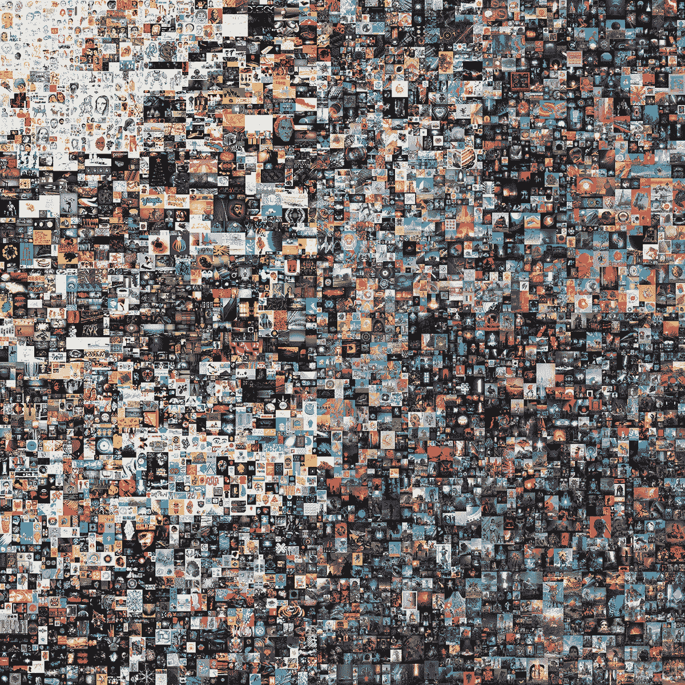

# NFTs 的技术问题

> 原文：<https://betterprogramming.pub/the-technical-problem-with-nfts-2b9a82d7904b>

## 你应该知道的 5 个缺点


由 [Unsplash](https://unsplash.com/@theshubhamdhage?utm_source=unsplash&utm_medium=referral&utm_content=creditCopyText) 上的 [Shubham Dhage](https://unsplash.com/@theshubhamdhage?utm_source=unsplash&utm_medium=referral&utm_content=creditCopyText) 拍摄的照片

一天晚上，NFT 的概念在[被搞大了，缺点一直没有解决。](https://www.theverge.com/2021/4/2/22364240/nft-blockchain-artist-hackathon-kevin-mccoy-anil-dash)

# 技术漏洞 1:资产不在区块链

大多数问题源于这样一个事实，即由于最受欢迎的 NFTs 链——以太坊区块链链——的设计非常糟糕，以至于在区块链上存储实际资产(例如 JPEG)太贵或不可能，这是由于块大小或交易费用的原因。

这是 NFT 最初发明时的一个缺点，至今仍未得到解决。解决方法是通过 HTTP 包含到其他地方的文件的链接，例如在 web 服务器上。

皮普尔价值 6900 万美元的艺术品 NFT*每天:第一个 5000 天*如下。NFT 是一个指向资产的 JSON 指针。如果你打开下面的第一个 URL，你会看到(并能下载一份)价值 6900 万美元的比尔艺术品，它被保存在 IPFS。

```
{“title”: “EVERYDAYS: THE FIRST 5000 DAYS”, “name”: “EVERYDAYS: THE FIRST 5000 DAYS”, “type”: “object”, “imageUrl”: “[https://ipfsgateway.makersplace.com/ipfs/QmZ15eQX8FPjfrtdX3QYbrhZxJpbLpvDpsgb2p3VEH8Bqq](https://ipfsgateway.makersplace.com/ipfs/QmZ15eQX8FPjfrtdX3QYbrhZxJpbLpvDpsgb2p3VEH8Bqq)", “description”: “I made a picture from start to finish every single day from May 1st, 2007 — January 7th, 2021\. This is every motherfucking one of those pictures.”, “attributes”: [{“trait_type”: “Creator”, “value”: “beeple”}], “properties”: {“name”: {“type”: “string”, “description”: “EVERYDAYS: THE FIRST 5000 DAYS”}, “description”: {“type”: “string”, “description”: “I made a picture from start to finish every single day from May 1st, 2007 — January 7th, 2021\. This is every motherfucking one of those pictures.”}, “preview_media_file”: {“type”: “string”, “description”: “[https://ipfsgateway.makersplace.com/ipfs/QmZ15eQX8FPjfrtdX3QYbrhZxJpbLpvDpsgb2p3VEH8Bqq](https://ipfsgateway.makersplace.com/ipfs/QmZ15eQX8FPjfrtdX3QYbrhZxJpbLpvDpsgb2p3VEH8Bqq)"}, “preview_media_file_type”: {“type”: “string”, “description”: “jpg”}, “created_at”: {“type”: “datetime”, “description”: “2021–02–16T00:07:31.674688+00:00”}, “total_supply”: {“type”: “int”, “description”: 1}, “digital_media_signature_type”: {“type”: “string”, “description”: “SHA-256”}, “digital_media_signature”: {“type”: “string”, “description”: “6314b55cc6ff34f67a18e1ccc977234b803f7a5497b94f1f994ac9d1b896a017”}, “raw_media_file”: {“type”: “string”, “description”: “[https://ipfsgateway.makersplace.com/ipfs/QmXkxpwAHCtDXbbZHUwqtFucG1RMS6T87vi1CdvadfL7qA](https://ipfsgateway.makersplace.com/ipfs/QmXkxpwAHCtDXbbZHUwqtFucG1RMS6T87vi1CdvadfL7qA)"}}}
```

IPFS 基本上是一个现代洪流，一个可以通过网络访问的文件系统，存储在数百台计算机上。这是下一个问题。



每一天:前 5000 天

# 技术漏洞 2:引用的网址不会永远存在

即使以太坊区块链永远存在(不太可能)，这些资产仍然存放在 IPFS。在 20 世纪 90 年代和 21 世纪初，有数以千计的像 IPFS 这样的激流现在已经消失了。

你不必在互联网上寻找，就能看到非常流行的平台、浏览器和系统有一天变成了鬼城。

# 技术漏洞 3:NFT 仅在单个区块链中是唯一的

现在，以太坊是 NFT 的“主要”区块链。但在未来，这可能很容易成为 Tezos，Stellar，Hyperledger 锯齿，Hyperledger Fabric，Corda，Algorand，Tron 或 1000 多个区块链中的一个。你只需要回顾一下早期的互联网，就能知道平台的发展和消失有多快，比如网景导航器。

即使在今天，NFT 的“独特性”也只存在于项链之中。就像选择用户名一样，如果你在 Twitter 上称自己为 *web2boomer* ，其他人可以在任何其他网站上使用该用户名。不同区块链上的 NFT 也是如此。因此，如果你投资 NFTs，你就是在对互联网的未来下大赌注。

# 技术漏洞 4:多个 NFT 可以引用同一个 URL

*http* 协议不保护 NFTs 声称提供的不可替代性。即使在以太坊区块链，也没有检查另一个 NFT 是否引用了相同的 URL(由于设计的原因，这样做很可能太昂贵了)。因此，相同资产的 NFT 可以被铸造两次。

# 技术漏洞 5:资产是对 URL 的引用，可以更改

因为 NFT 只是引用一个 HTTP 地址，所以如果该地址改变，NFT 也会改变

事实上，皮普尔已经[明确威胁](https://api.niftygateway.com/beeple/100010001/)如果川普再次当选，他将在他的一个 NFT 上这么做。其他[艺术家已经改变甚至破坏了](https://cointelegraph.com/news/opensea-collector-pulls-the-rug-on-nfts-to-highlight-arbitrary-value)他们拍卖的 NFT 艺术品。

```
{“description”:”PLEASE FUCKING NOTE: If trump wins, this token will change to that video of sexy boi king trump stomping through hell FOREVER. I don’t want you coming back to me bitching that you spent $2M* on this and now it’s a video of orangeman going HAM and it’s keeping u up at night popping mad boners. should have voted bruh.\r\n\r\n*and stfu that this isn’t gonna be worth a fuckton more when I hit 30 years of everydays and have a permanent collection in the MOMA. smh.”,”background_color”:”ffffff”,”external_url”:”[https://niftygateway.com/#/](https://niftygateway.com/#/)","image":"[https://res.cloudinary.com/nifty-gateway/video/upload/v1603975875/Beeple/BIDEN_WIN_iwkosh.png](https://res.cloudinary.com/nifty-gateway/video/upload/v1603975875/Beeple/BIDEN_WIN_iwkosh.png)","name":"CROSSROAD #1/1",”animation_url”:”[https://res.cloudinary.com/nifty-gateway/video/upload/v1603975875/Beeple/BIDEN_WIN_iwkosh.mp4](https://res.cloudinary.com/nifty-gateway/video/upload/v1603975875/Beeple/BIDEN_WIN_iwkosh.mp4)"}
```

关于 NFT 世界猖獗的经济缺陷、泵送和倾倒计划、清洗交易和欺诈，已经有很多报道。但是，如果这种脆弱的技术确实开创了一个新的经济，在它变得安全或有用之前，它需要被重新实现。

*善待他人*